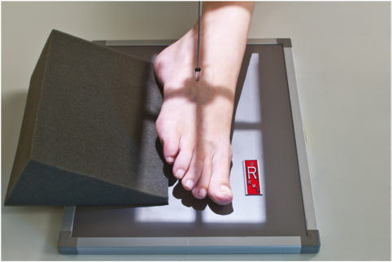
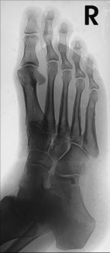
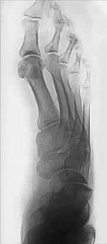
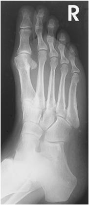

# Rx oblică AP cu rotație internă (medială) a piciorului

  📷 Radiografie Convențională (Rx)
  <strong>Actualizat:</strong> 2026-09-15
  <strong>Autor:</strong> Departamentul de Radiologie / Referință Bontrager

---

-   __1. Rezumat Clinic & Indicații__

    ---

    === "Indicații Clinice"

        - Localizarea și extinderea suspiciunii de fractură și alinierea fragmentelor, anomalii ale spațiilor articulare, revărsate ale părților moi
        - Localizarea corpului străin/corpurilor străine radio-opace

    === "Ghid Național IRIS"

        !!! info "Referință Primară: Ghidul Național IRIS (Ordinul MS 1342/2012)"
            - **Capitol Ghid IRIS:** *Aparat locomotor & Membru inferior*
            - **Grad de Recomandare:** **Grad A**
            - **Nivel de Iradiere Estimată:** `Clasa 1 (Minimă < 0.01 mSv)`

            [:octicons-search-16: Deschide Ghidul IRIS](../../iris.md){ .md-button .md-button--primary } [:material-open-in-new: Aplicația Oficială PWA](https://radiologie-pediatrica.ro/iris/){ .md-button target="_blank" rel="noopener" }

-   __2. Poziționare & Centrare Fascicul__

    ---

    - **Poziție Pacient:** Pacient: Așezați pacientul în decubit dorsal sau în poziție șezândă; flectați genunchiul, cu suprafața plantară a piciorului pe masă; rotiți ușor corpul în partea opusă față de partea examinată. Regiune anatomică: Aliniați și centrați axa longitudinală a piciorului la raza centrală și la axa longitudinală a porțiunii receptorului de imagine expuse. Rotiți piciorul medial pentru a plasa suprafața plantară la 30° până la 40° față de planul receptorului de imagine (vezi NOTA). Planul general al dosului piciorului trebuie să fie paralel cu receptorul de imagine și perpendicular pe raza centrală (Fig. 6.59). Utilizați un suport radiotransparent la 45° pentru a preveni mișcarea. Utilizați săculeți cu nisip, dacă este necesar, pentru a preveni alunecarea receptorului de imagine pe masa de examinare.
    - **Punct de Centrare Fascicul:** perpendicular pe receptorul de imagine, orientat la baza celui de-al treilea metatarsian
    - **Distanță Focar-Film (DFF / SID):** 100 cm
    - **Comandă Respiratorie:** Apnee pe durata expunerii (sau conform cooperării pacientului)

-   __3. Parametri Tehnici Expunere__

    ---

    | Parametru Tehnic | Valoare Configurare Generator / Tub |
    |:-----------------|:-------------------------------------|
    | **Tensiune Tub (kV)** | 60-70 kV |
    | **Sarcină / Produs Curent-Timp (mAs)** | DE CONFIGURAT PE APARAT |
    | **Distanță Focar-Film (DFF / SID)** | 100 cm |
    | **Grilă Antidifuzoare (Bucky)** | Fără grilă (expunere directă) |
    | **Dimensiune Focar** | Focar Mic (0.6 mm) |
    | **Camere de Ionizare AEC** | DE CONFIGURAT PE APARAT |
    | **Colimare Fascicul** | Colimați la marginile externe ale pielii pe cele patru laturi. |
    | **Filtrare Tub** | Totală ≥ 2.5 mm Al echivalent |

-   __4. Criterii de Calitate & Reușită Imagine__

    ---

    - Întregul picior trebuie să fie evidențiat de la falangele distale până la calcaneul posterior și astragalul (talusul) proximal (Fig. 6.61 și 6.62). Poziție:
    - Axa longitudinală a piciorului trebuie să fie aliniată cu axa longitudinală a receptorului de imagine.
    - Oblicitatea corectă este evidențiată atunci când al treilea până la al cincilea metatarsian sunt libere de suprapunere.
    - Primul și al doilea metatarsian trebuie, de asemenea, să fie libere de suprapunere, cu excepția zonei bazelor.
    - Tuberozitatea de la baza celui de-al cincilea metatarsian este vizualizată de profil și este bine evidențiată.
    - Spațiile articulare din jurul cuboidului și sinus tarsi sunt deschise și bine evidențiate atunci când piciorul este poziționat corect oblic.
    - Colimare la aria de interes diagnostic. Expunere:
    - Expunerea și contrastul optime ale receptorului de imagine, fără mișcare, trebuie să vizualizeze clar marginile și desenul trabecular al falangelor, oaselor metatarsiene și oaselor tarsiene.

-   __5. Protecție Radiologică (ALARA)__

    ---

    - Ecranare gonadică și a organelor radiosensibile conform procedurilor locale de radioprotecție ALARA.
    - Colimare strictă la aria de interes pentru limitarea radiației difuze.
    - Verificarea posibilității unei sarcini la pacientele de vârstă fertilă înainte de expunere.

!!! note "Observații Clinice & Tehnice"
    Unele referințe sugerează utilizarea de rutină a unei singure incidențe oblice de 30°. Acest text recomandă o oblicitate mai mare, de 40°, pentru a evidenția cel mai bine oasele tarsiene și oasele metatarsiene proximale, relativ libere de suprapunere, la un picior cu arc transversal mediu. Incidența oblică laterală opțională (Fig. 6.60) se obține prin rotirea laterală a piciorului cu 30° (este necesară o oblicitate mai mică datorită arcului natural al piciorului). Incidența oblică laterală evidențiază cel mai bine spațiul dintre primul și al doilea os metatarsian și dintre primul și al doilea os cuneiform. Osul navicular este, de asemenea, bine vizualizat în incidența oblică laterală. Fig. 6.61 Incidență AP oblică medială de 40°. Os navicular Os cuboid Al 3-lea os cuneiform Oase metatarsiene Falange Sinus tarsi Calcaneu Astragal (talus) Fig. 6.62 Incidență oblică medială de 40°. Picior INCIDENȚĂ AP DE RUTINĂ oblică laterală Fig. 6.59 Incidență AP oblică medială de la 30° la 40°. Fig. 6.60 Incidență AP oblică laterală de 30°.

### 🖼️ Imagini

<figure class="protocol-image-card" markdown>

<figcaption><strong>Fig. 6.61 AP la 40°</strong> — Poziționarea pacientului conform Ghidului Bontrager (Fig. 6.61 AP la 40°)</figcaption>

</figure>

<figure class="protocol-image-card" markdown>

<figcaption><strong>Fig. 6.62 medial la 40°</strong> — Aspect radiografic de referință conform Ghidului Bontrager (Fig. 6.62 medial la 40°)</figcaption>

</figure>

<figure class="protocol-image-card" markdown>

<figcaption><strong>Fig. 6.59 AP oblic medial la 30° până la 40°.</strong> — Aspect radiografic de referință conform Ghidului Bontrager (Fig. 6.59 AP oblic medial la 30° până la 40°.)</figcaption>

</figure>

<figure class="protocol-image-card" markdown>

<figcaption><strong>Fig. 6.60 AP oblic lateral la 30°</strong> — Aspect radiografic de referință conform Ghidului Bontrager (Fig. 6.60 AP oblic lateral la 30°)</figcaption>

</figure>

=== "Ghid Rapid de Execuție"

    1. **Identificarea și verificarea pacientului:** verificare identitate, zonă de examinat, consimțământ conform procedurii și evaluarea posibilității unei sarcini, când este relevantă.
    2. **Pregătire:** îndepărtarea oricăror obiecte radiopace (bijuterii, agrafe, fermoare, proteze, pansamente dense).
    3. **Poziționare precisă:** alinierea receptorului de imagine și a tubului la distanța prescrisă (100 cm).
    4. **Colimare strictă:** adaptarea fasciculului strict la regiunea de diagnostic pentru scăderea iradierii și reducerea radiației difuze.
    5. **Radioprotecție:** verificarea [politicii RX](../radioprotectie.md), cu măsuri distincte pentru pacient, personal și însoțitor.

## Surse de documentare

- [Bontrager's Textbook of Radiographic Positioning (Ed. 9/10), Pagina 247](https://www.elsevier.com/books/textbook-of-radiographic-positioning-and-related-anatomy/lampignano/978-0-323-65367-1)
