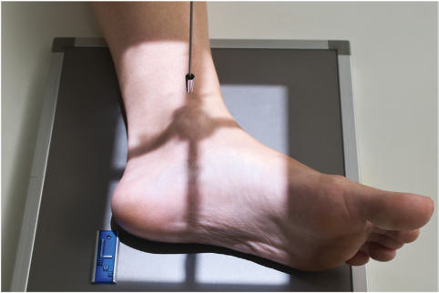
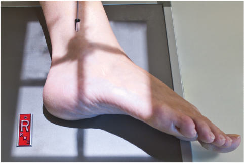
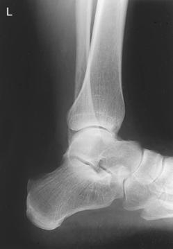
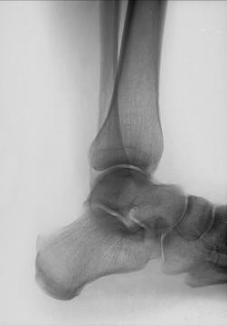

# Rx MEDIOLATERAL (OR LATEROMEDIAL) PROJECTION LATERAL (Gleznă (Articulație Talocrurală))

  📷 Radiografie Convențională (Rx)
  <strong>Actualizat:</strong> 2026-09-15
  <strong>Autor:</strong> Departamentul de Radiologie / Referință Bontrager

---

-   __1. Rezumat Clinic & Indicații__

    ---

    === "Indicații Clinice"

        - Projection is useful in the evaluation of suspiciune de fractură, luxație / subluxație articulară, and joint effusions associated with other joint pathologies

    === "Ghid Național IRIS"

        !!! info "Referință Primară: Ghidul Național IRIS (Ordinul MS 1342/2012)"
            - **Capitol Ghid IRIS:** *Ghidul Național IRIS*
            - **Grad de Recomandare:** **De verificat pe indicație; fără grad atribuit automat**
            - **Nivel de Iradiere Estimată:** `De verificat pentru examinarea și populația selectate`

            [:octicons-search-16: Deschide Ghidul IRIS](../../iris.md){ .md-button .md-button--primary } [:material-open-in-new: Aplicația Oficială PWA](https://radiologie-pediatrica.ro/iris/){ .md-button target="_blank" rel="noopener" }
-   __2. Poziționare & Centrare Fascicul__

    ---

    - **Poziție Pacient:** Pacient: Place patient in the lateral Decubit position, affected side down; provide a pillow for patient’s head; flex Genunchi of affected limb approximately 45°; place opposite leg behind injured limb to prevent overrotation.; Regiune anatomică: (Mediolateral Projection) Center and align Gleznă (Articulație Talocrurală) joint to CR and to long axis of portion of IR being exposed (Fig. 6.90). Place support under Genunchi as needed to place leg and Picior in true Incidență de Profil (Lateral). Dorsiflex Picior so that plantar surface is at a right angle to leg or as far as patient can tolerate; do not force. (This helps maintain a true Incidență de Profil (Lateral).)
    - **Punct de Centrare Fascicul:** perpendicular to IR, directed to medial malleolus
    - **Distanță Focar-Film (DFF / SID):** 100 cm
    - **Comandă Respiratorie:** Apnee pe durata expunerii (sau conform cooperării pacientului)

-   __3. Parametri Tehnici Expunere__

    ---

    | Parametru Tehnic | Valoare Configurare Generator / Tub |
    |:-----------------|:-------------------------------------|
    | **Tensiune Tub (kV)** | 60-75 kV |
    | **Sarcină / Produs Curent-Timp (mAs)** | DE CONFIGURAT PE APARAT |
    | **Distanță Focar-Film (DFF / SID)** | 100 cm |
    | **Grilă Antidifuzoare (Bucky)** | Fără grilă (expunere directă) |
    | **Dimensiune Focar** | Focar Mic (0.6 mm) |
    | **Camere de Ionizare AEC** | DE CONFIGURAT PE APARAT |
    | **Colimare Fascicul** | to area of interest. Exposure: Optimal image receptor exposure and contrast with no motion, as evidenced by sharp bony margins and trabecular patterns. Lateral malleolus should be seen through the distal tibia and talus, and soft tissue must be demonstrated for evaluation of joint effusion. Fig. 6.92 Mediolateral Gleznă (Articulație Talocrurală). Fibula Calcaneu Cuboid Navicular Talus Base of 5th metatarsal Anterior tubercle Tibia Fig. 6.93 Mediolateral Gleznă (Articulație Talocrurală). |
    | **Filtrare Tub** | Totală ≥ 2.5 mm Al echivalent |

-   __4. Criterii de Calitate & Reușită Imagine__

    ---

    - Distal onethird of tibia and fibula with the distal fibula superimposed by the distal tibia, talus, and Calcaneu appear in lateral profile.
    - Tuberosity of fifth metatarsal, navicular, and cuboid also are visualized (Figs. 6.92 and 6.93). Position:
    - Absența rotației anatomice: clavicule echidistante față de linia apofizelor spinoase is evidenced by distal fibula being superimposed over the posterior half of tibia.
    - Tibiotalar joint is open with uniform joint space.
    - Collimation field should include distal onethird of Gambă, Calcaneu, tuberosity of fifth metatarsal, and surrounding soft tissue structures.

-   __5. Protecție Radiologică (ALARA)__

    ---

    - Ecranare gonadică și a organelor radiosensibile conform procedurilor locale de radioprotecție ALARA.
    - Colimare strictă la aria de interes pentru limitarea radiației difuze.
    - Verificarea posibilității unei sarcini la pacientele de vârstă fertilă înainte de expunere.

### 🖼️ Imagini

<figure class="protocol-image-card" markdown>

<figcaption><strong>Fig. 6.90 Mediolateral Gleznă (Articulație Talocrurală).</strong> — Poziționare pacient conform Ghidului Bontrager (Fig. 6.90 Mediolateral ankle.)</figcaption>

</figure>

<figure class="protocol-image-card" markdown>

<figcaption><strong>Fig. 6.91 Alternative lateromedial Gleznă (Articulație Talocrurală).</strong> — Aspect radiografic de referință conform Ghidului Bontrager (Fig. 6.91 Alternative lateromedial ankle.)</figcaption>

</figure>

<figure class="protocol-image-card" markdown>

<figcaption><strong>Fig. 6.92 Mediolateral Gleznă (Articulație Talocrurală).</strong> — Aspect radiografic de referință conform Ghidului Bontrager (Fig. 6.92 Mediolateral ankle.)</figcaption>

</figure>

<figure class="protocol-image-card" markdown>

<figcaption><strong>Fig. 6.93 Mediolateral Gleznă (Articulație Talocrurală).</strong> — Aspect radiografic de referință conform Ghidului Bontrager (Fig. 6.93 Mediolateral ankle.)</figcaption>

</figure>

=== "Ghid Rapid de Execuție"

    1. **Identificarea și verificarea pacientului:** verificare identitate, zonă de examinat, consimțământ conform procedurii și evaluarea posibilității unei sarcini, când este relevantă.
    2. **Pregătire:** îndepărtarea oricăror obiecte radiopace (bijuterii, agrafe, fermoare, proteze, pansamente dense).
    3. **Poziționare precisă:** alinierea receptorului de imagine și a tubului la distanța prescrisă (100 cm).
    4. **Colimare strictă:** adaptarea fasciculului strict la regiunea de diagnostic pentru scăderea iradierii și reducerea radiației difuze.
    5. **Radioprotecție:** verificarea [politicii RX](../radioprotectie.md), cu măsuri distincte pentru pacient, personal și însoțitor.

## Surse de documentare

- [Bontrager's Textbook of Radiographic Positioning (Ed. 9/10), Pagina 257](https://www.elsevier.com/books/textbook-of-radiographic-positioning-and-related-anatomy/lampignano/978-0-323-65367-1)
