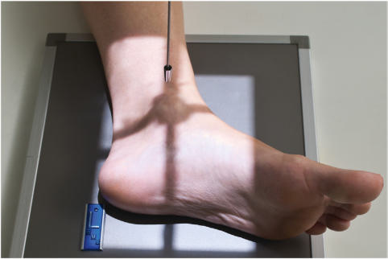
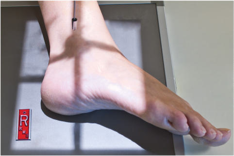
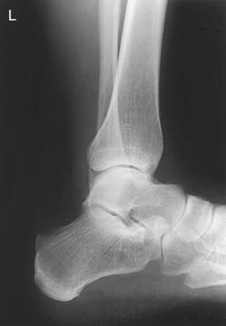
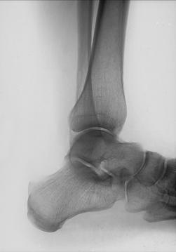

# Rx mediolaterală (SAU lateromedială), incidență de profil, a gleznei (articulației talocrurale)

  📷 Radiografie Convențională (Rx)
  <strong>Actualizat:</strong> 2026-09-15
  <strong>Autor:</strong> Departamentul de Radiologie / Referință Bontrager

---

-   __1. Rezumat Clinic & Indicații__

    ---

    === "Indicații Clinice"

        - Incidența este utilă în evaluarea suspiciunii de fractură, a luxației/subluxației articulare și a revărsatelor articulare asociate cu alte patologii articulare

    === "Ghid Național IRIS"

        !!! info "Referință Primară: Ghidul Național IRIS (Ordinul MS 1342/2012)"
            - **Capitol Ghid IRIS:** *Aparat locomotor & Membru inferior*
            - **Grad de Recomandare:** **Grad A**
            - **Nivel de Iradiere Estimată:** `Clasa 1 (Minimă < 0.01 mSv)`

            [:octicons-search-16: Deschide Ghidul IRIS](../../iris.md){ .md-button .md-button--primary } [:material-open-in-new: Aplicația Oficială PWA](https://radiologie-pediatrica.ro/iris/){ .md-button target="_blank" rel="noopener" }

-   __2. Poziționare & Centrare Fascicul__

    ---

    - **Poziție Pacient:** Pacient: Așezați pacientul în decubit lateral, cu partea afectată în jos; asigurați o pernă pentru capul pacientului; flectați genunchiul membrului afectat la aproximativ 45°; plasați membrul inferior opus în spatele membrului lezat pentru a preveni suprarotirea. Regiune anatomică: (Incidență mediolaterală) Centrați și aliniați articulația gleznei (talocrurale) la raza centrală și la axa longitudinală a porțiunii receptorului de imagine expuse (Fig. 6.90). Plasați un suport sub genunchi, după cum este necesar, pentru a poziționa membrul inferior și piciorul în incidență de profil adevărată. Dorsiflectați piciorul astfel încât suprafața plantară să fie în unghi drept față de membrul inferior sau cât poate tolera pacientul; nu forțați. (Aceasta ajută la menținerea incidenței de profil adevărate.)
    - **Punct de Centrare Fascicul:** perpendicular pe receptorul de imagine, orientat spre maleola medială (tibială)
    - **Distanță Focar-Film (DFF / SID):** 100 cm
    - **Comandă Respiratorie:** Apnee pe durata expunerii (sau conform cooperării pacientului)

-   __3. Parametri Tehnici Expunere__

    ---

    | Parametru Tehnic | Valoare Configurare Generator / Tub |
    |:-----------------|:-------------------------------------|
    | **Tensiune Tub (kV)** | 60-75 kV |
    | **Sarcină / Produs Curent-Timp (mAs)** | DE CONFIGURAT PE APARAT |
    | **Distanță Focar-Film (DFF / SID)** | 100 cm |
    | **Grilă Antidifuzoare (Bucky)** | Fără grilă (expunere directă) |
    | **Dimensiune Focar** | Focar Mic (0.6 mm) |
    | **Camere de Ionizare AEC** | DE CONFIGURAT PE APARAT |
    | **Colimare Fascicul** | la aria de interes diagnostic. Expunere: Expunerea și contrastul optime ale receptorului de imagine, fără mișcare, evidențiate prin margini osoase și modele trabeculare clare. Maleola laterală (fibulară) trebuie să fie vizualizată prin tibia distală și astragal (talus), iar părțile moi trebuie evidențiate pentru evaluarea revărsatului articular. Fig. 6.92 Gleznă (articulație talocrurală) mediolaterală. Fibulă Calcaneu Cuboid Navicular Astragal (talus) Baza celui de-al 5-lea metatarsian Tubercul anterior Tibie Fig. 6.93 Gleznă (articulație talocrurală) mediolaterală. |
    | **Filtrare Tub** | Totală ≥ 2.5 mm Al echivalent |

-   __4. Criterii de Calitate & Reușită Imagine__

    ---

    - Treimea distală a tibiei și fibulei, cu fibula distală suprapusă peste tibia distală, astragalul (talusul) și calcaneul apar de profil.
    - Tuberozitatea celui de-al cincilea metatarsian, navicularul și cuboidul sunt, de asemenea, vizualizate (Fig. 6.92 și 6.93). Poziție:
    - Absența rotației anatomice: claviculele echidistante față de linia apofizelor spinoase este evidențiată prin suprapunerea fibulei distale peste jumătatea posterioară a tibiei.
    - Articulația tibiotalară este deschisă, cu spații articulare uniforme.
    - Câmpul de colimare trebuie să includă treimea distală a gambei, calcaneul, tuberozitatea celui de-al cincilea metatarsian și structurile părților moi înconjurătoare.

-   __5. Protecție Radiologică (ALARA)__

    ---

    - Ecranare gonadică și a organelor radiosensibile conform procedurilor locale de radioprotecție ALARA.
    - Colimare strictă la aria de interes pentru limitarea radiației difuze.
    - Verificarea posibilității unei sarcini la pacientele de vârstă fertilă înainte de expunere.

### 🖼️ Imagini

<figure class="protocol-image-card" markdown>

<figcaption><strong>Fig. 6.90 Gleznă (articulație talocrurală) mediolaterală.</strong> — Poziționarea pacientului conform Ghidului Bontrager (Fig. 6.90 Gleznă mediolaterală.)</figcaption>

</figure>

<figure class="protocol-image-card" markdown>

<figcaption><strong>Fig. 6.91 Gleznă (articulație talocrurală) lateromedială alternativă.</strong> — Aspect radiografic de referință conform Ghidului Bontrager (Fig. 6.91 Gleznă lateromedială alternativă.)</figcaption>

</figure>

<figure class="protocol-image-card" markdown>

<figcaption><strong>Fig. 6.92 Gleznă (articulație talocrurală) mediolaterală.</strong> — Aspect radiografic de referință conform Ghidului Bontrager (Fig. 6.92 Gleznă mediolaterală.)</figcaption>

</figure>

<figure class="protocol-image-card" markdown>

<figcaption><strong>Fig. 6.93 Gleznă (articulație talocrurală) mediolaterală.</strong> — Aspect radiografic de referință conform Ghidului Bontrager (Fig. 6.93 Gleznă mediolaterală.)</figcaption>

</figure>

=== "Ghid Rapid de Execuție"

    1. **Identificarea și verificarea pacientului:** verificare identitate, zonă de examinat, consimțământ conform procedurii și evaluarea posibilității unei sarcini, când este relevantă.
    2. **Pregătire:** îndepărtarea oricăror obiecte radiopace (bijuterii, agrafe, fermoare, proteze, pansamente dense).
    3. **Poziționare precisă:** alinierea receptorului de imagine și a tubului la distanța prescrisă (100 cm).
    4. **Colimare strictă:** adaptarea fasciculului strict la regiunea de diagnostic pentru scăderea iradierii și reducerea radiației difuze.
    5. **Radioprotecție:** verificarea [politicii RX](../radioprotectie.md), cu măsuri distincte pentru pacient, personal și însoțitor.

## Surse de documentare

- [Bontrager's Textbook of Radiographic Positioning (Ed. 9/10), Pagina 257](https://www.elsevier.com/books/textbook-of-radiographic-positioning-and-related-anatomy/lampignano/978-0-323-65367-1)
