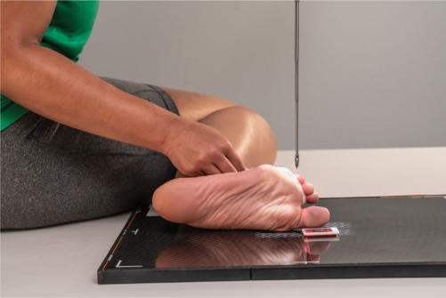
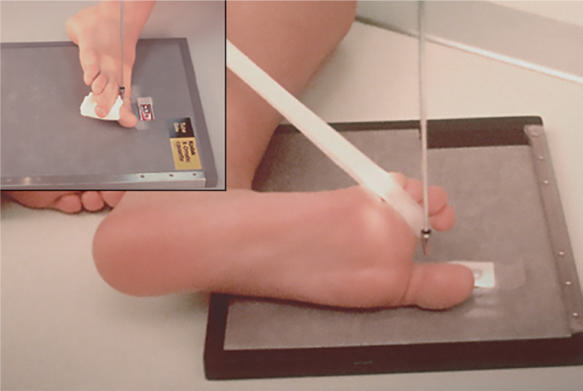
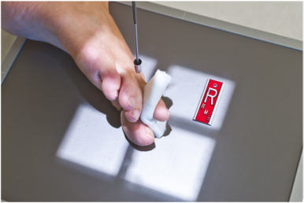
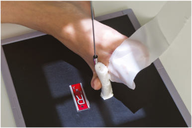
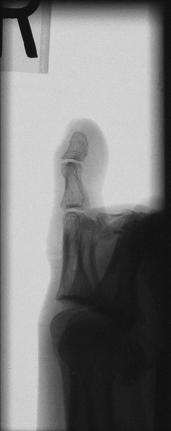
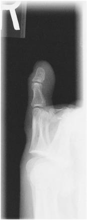

# Rx MEDIOLATERAL OR LATEROMEDIAL PROJECTIONS LATERAL (Degete Picior)

  📷 Radiografie Convențională (Rx)
  <strong>Actualizat:</strong> 2026-09-15
  <strong>Autor:</strong> Departamentul de Radiologie / Referință Bontrager

---

-   __1. Rezumat Clinic & Indicații__

    ---

    === "Indicații Clinice"

        - suspiciune de fractură or luxație / subluxație articulară of the phalanges of the digits in question
        - Pathologies such as artroză / modificări degenerative articulare and gouty arthritis (gout), especially in the first digit

    === "Ghid Național IRIS"

        !!! info "Referință Primară: Ghidul Național IRIS (Ordinul MS 1342/2012)"
            - **Capitol Ghid IRIS:** *Ghidul Național IRIS*
            - **Grad de Recomandare:** **De verificat pe indicație; fără grad atribuit automat**
            - **Nivel de Iradiere Estimată:** `De verificat pentru examinarea și populația selectate`

            [:octicons-search-16: Deschide Ghidul IRIS](../../iris.md){ .md-button .md-button--primary } [:material-open-in-new: Aplicația Oficială PWA](https://radiologie-pediatrica.ro/iris/){ .md-button target="_blank" rel="noopener" }
-   __2. Poziționare & Centrare Fascicul__

    ---

    - **Poziție Pacient:** Conform incidenței standard descrise
    - **Punct de Centrare Fascicul:** directed to interphalangeal joint for first digit and to proximal interphalangeal joint for second to fifth digits
    - **Distanță Focar-Film (DFF / SID):** 100 cm
    - **Comandă Respiratorie:** Apnee pe durata expunerii (sau conform cooperării pacientului)

-   __3. Parametri Tehnici Expunere__

    ---

    | Parametru Tehnic | Valoare Configurare Generator / Tub |
    |:-----------------|:-------------------------------------|
    | **Tensiune Tub (kV)** | 50-60 kV |
    | **Sarcină / Produs Curent-Timp (mAs)** | DE CONFIGURAT PE APARAT |
    | **Distanță Focar-Film (DFF / SID)** | 100 cm |
    | **Grilă Antidifuzoare (Bucky)** | Fără grilă (expunere directă) |
    | **Dimensiune Focar** | Focar Mic (0.6 mm) |
    | **Camere de Ionizare AEC** | DE CONFIGURAT PE APARAT |
    | **Colimare Fascicul** | Collimate closely on four sides to affected digit. Degete Picior ROUTINE AP Oblique Lateral Fig. 6.47 Lateromedial—first digit. Fig. 6.48 Lateromedial—second digit. Fig. 6.49 Mediolateral—fourth digit. |
    | **Filtrare Tub** | Totală ≥ 2.5 mm Al echivalent |

-   __4. Criterii de Calitate & Reușită Imagine__

    ---

    - Phalanges of digit in question should be seen in Incidență de Profil (Lateral) free of superimposition by other digits, if possible (Figs. 6.50 and 6.51).
    - (When total separation of Degete Picior is impossible, especially third to fifth digits, the distal phalanx at least should be separated, and the proximal phalanx should be visualized through superimposed structures.) Position
    - Long axis of digit is aligned to long axis of portion of IR being used.
    - True lateral of digit demonstrates increased concavity on anterior surface of the distal phalanx and posterior surface of the proximal phalanx.
    - Opposing surface of each phalanx appears straighter.4
    - Collimation to area of interest. Exposure:
    - No motion as evidenced by sharply defined cortical margins of bone and detailed bony trabeculae.
    - Optimal image receptor exposure and contrast to allow visualization of bony cortical margins and trabeculae and soft tissue structures. Fig. 6.50 Lateromedialsecond digit. Distal phalanx Middle phalanx Proximal interphalangeal (PIP) joint (CR) Proximal phalanx Distal 2nd metatarsal Distal interphalangeal (DIP) joint Fig. 6.51 Lateromedial—second digit.

-   __5. Protecție Radiologică (ALARA)__

    ---

    - Ecranare gonadică și a organelor radiosensibile conform procedurilor locale de radioprotecție ALARA.
    - Colimare strictă la aria de interes pentru limitarea radiației difuze.
    - Verificarea posibilității unei sarcini la pacientele de vârstă fertilă înainte de expunere.

### 🖼️ Imagini

<figure class="protocol-image-card" markdown>

<figcaption><strong>Fig. 6.47 Lateromedial—first digit.</strong> — Poziționare pacient conform Ghidului Bontrager (Fig. 6.47 Lateromedial—first digit.)</figcaption>

</figure>

<figure class="protocol-image-card" markdown>

<figcaption><strong>Fig. 6.48 Lateromedial—second digit.</strong> — Aspect radiografic de referință conform Ghidului Bontrager (Fig. 6.48 Lateromedial—second digit.)</figcaption>

</figure>

<figure class="protocol-image-card" markdown>

<figcaption><strong>Fig. 6.49 Mediolateral—fourth digit.</strong> — Aspect radiografic de referință conform Ghidului Bontrager (Fig. 6.49 Mediolateral—fourth digit.)</figcaption>

</figure>

<figure class="protocol-image-card" markdown>

<figcaption><strong>Fig. 6.50 Lateromedial—</strong> — Aspect radiografic de referință conform Ghidului Bontrager (Fig. 6.50 Lateromedial—)</figcaption>

</figure>

<figure class="protocol-image-card" markdown>

<figcaption><strong>Fig. 6.51 Lateromedial—second digit.</strong> — Aspect radiografic de referință conform Ghidului Bontrager (Fig. 6.51 Lateromedial—second digit.)</figcaption>

</figure>

<figure class="protocol-image-card" markdown>

<figcaption><strong>Figura 6</strong> — Aspect radiografic de referință conform Ghidului Bontrager (Figura 6)</figcaption>

</figure>

=== "Ghid Rapid de Execuție"

    1. **Identificarea și verificarea pacientului:** verificare identitate, zonă de examinat, consimțământ conform procedurii și evaluarea posibilității unei sarcini, când este relevantă.
    2. **Pregătire:** îndepărtarea oricăror obiecte radiopace (bijuterii, agrafe, fermoare, proteze, pansamente dense).
    3. **Poziționare precisă:** alinierea receptorului de imagine și a tubului la distanța prescrisă (100 cm).
    4. **Colimare strictă:** adaptarea fasciculului strict la regiunea de diagnostic pentru scăderea iradierii și reducerea radiației difuze.
    5. **Radioprotecție:** verificarea [politicii RX](../radioprotectie.md), cu măsuri distincte pentru pacient, personal și însoțitor.

## Surse de documentare

- [Bontrager's Textbook of Radiographic Positioning (Ed. 9/10), Pagina 244](https://www.elsevier.com/books/textbook-of-radiographic-positioning-and-related-anatomy/lampignano/978-0-323-65367-1)
