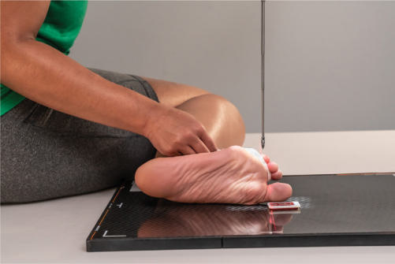
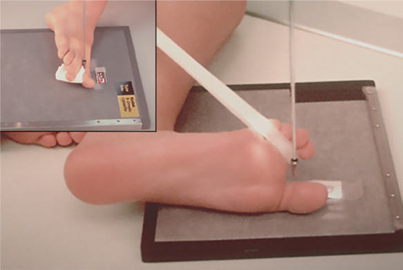
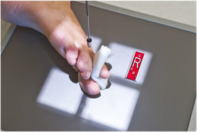
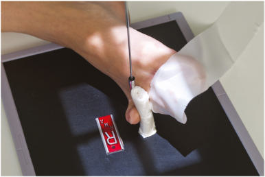
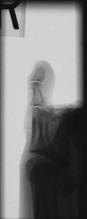
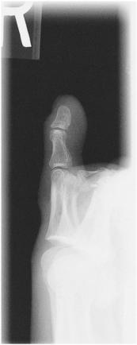

# Rx mediolaterală SAU incidență lateromedială, de profil, a degetelor de la picior

  📷 Radiografie Convențională (Rx)
  <strong>Actualizat:</strong> 2026-09-15
  <strong>Autor:</strong> Departamentul de Radiologie / Referință Bontrager

---

-   __1. Rezumat Clinic & Indicații__

    ---

    === "Indicații Clinice"

        - suspiciune de fractură sau luxație / subluxație articulară a falangei în cauză
        - Patologii precum artroza / modificările degenerative articulare și artrita gutoasă (gută), în special la nivelul primei falange

    === "Ghid Național IRIS"

        !!! info "Referință Primară: Ghidul Național IRIS (Ordinul MS 1342/2012)"
            - **Capitol Ghid IRIS:** *Aparat locomotor & Membru inferior*
            - **Grad de Recomandare:** **Grad A**
            - **Nivel de Iradiere Estimată:** `Clasa 1 (Minimă < 0.01 mSv)`

            [:octicons-search-16: Deschide Ghidul IRIS](../../iris.md){ .md-button .md-button--primary } [:material-open-in-new: Aplicația Oficială PWA](https://radiologie-pediatrica.ro/iris/){ .md-button target="_blank" rel="noopener" }

-   __2. Poziționare & Centrare Fascicul__

    ---

    - **Poziție Pacient:** Conform incidenței standard descrise
    - **Punct de Centrare Fascicul:** orientat spre articulațiile interfalangiene (IF) pentru prima falangă și spre articulațiile interfalangiene proximale (IF) pentru a doua până la a cincea falangă
    - **Distanță Focar-Film (DFF / SID):** 100 cm
    - **Comandă Respiratorie:** Apnee pe durata expunerii (sau conform cooperării pacientului)

-   __3. Parametri Tehnici Expunere__

    ---

    | Parametru Tehnic | Valoare Configurare Generator / Tub |
    |:-----------------|:-------------------------------------|
    | **Tensiune Tub (kV)** | 50-60 kV |
    | **Sarcină / Produs Curent-Timp (mAs)** | DE CONFIGURAT PE APARAT |
    | **Distanță Focar-Film (DFF / SID)** | 100 cm |
    | **Grilă Antidifuzoare (Bucky)** | Fără grilă (expunere directă) |
    | **Dimensiune Focar** | Focar Mic (0.6 mm) |
    | **Camere de Ionizare AEC** | DE CONFIGURAT PE APARAT |
    | **Colimare Fascicul** | Colimați strâns pe cele patru laturi la nivelul falangei afectate. Degete de la picior AP DE RUTINĂ oblic lateral Fig. 6.47 Falangă lateromedială—degetul întâi. Fig. 6.48 Falangă lateromedială—degetul al doilea. Fig. 6.49 Falangă mediolaterală—degetul al patrulea. |
    | **Filtrare Tub** | Totală ≥ 2.5 mm Al echivalent |

-   __4. Criterii de Calitate & Reușită Imagine__

    ---

    - Falanga de interes trebuie să fie vizualizată în incidență de profil, liberă de suprapunerea celorlalte falange, dacă este posibil (Fig. 6.50 și 6.51).
    - (Când separarea completă a degetelor de la picior este imposibilă, în special pentru a treia până la a cincea falangă, cel puțin falanga distală trebuie să fie separată, iar falanga proximală trebuie vizualizată prin structurile suprapuse.) Poziție
    - Axa longitudinală a falangei este aliniată cu axa longitudinală a porțiunii receptorului de imagine utilizate.
    - Incidența de profil adevărată a falangei evidențiază concavitatea crescută a suprafeței anterioare a falangei distale și a suprafeței posterioare a falangei proximale.
    - Suprafața opusă a fiecărei falange apare mai dreaptă.4
    - Colimare la aria de interes diagnostic. Expunere:
    - fără mișcare, evidențiată prin marginile corticale bine definite ale osului și trabeculele osoase detaliate.
    - [fragment deteriorat în sursă] receptorul de imagine, expunerea și contrastul pentru a permite vizualizarea marginilor corticale osoase și a trabeculelor și a structurilor părților moi. Fig. 6.50 Latero-medială — a doua falangă. Falangă distală Falangă mijlocie Articulație interfalangiană proximală (PIP) Falangă proximală Articulație interfalangiană distală (DIP) a celui de-al 2-lea deget (raza centrală) Falangă distală Fig. 6.51 Latero-medială — a doua falangă.

-   __5. Protecție Radiologică (ALARA)__

    ---

    - Ecranare gonadică și a organelor radiosensibile conform procedurilor locale de radioprotecție ALARA.
    - Colimare strictă la aria de interes pentru limitarea radiației difuze.
    - Verificarea posibilității unei sarcini la pacientele de vârstă fertilă înainte de expunere.

### 🖼️ Imagini

<figure class="protocol-image-card" markdown>

<figcaption><strong>Fig. 6.47 Falangă lateromedială—degetul întâi.</strong> — Poziționarea pacientului conform Ghidului Bontrager (Fig. 6.47 Falangă lateromedială—degetul întâi.)</figcaption>

</figure>

<figure class="protocol-image-card" markdown>

<figcaption><strong>Fig. 6.48 Falangă lateromedială—degetul al doilea.</strong> — Aspect radiografic de referință conform Ghidului Bontrager (Fig. 6.48 Falangă lateromedială—degetul al doilea.)</figcaption>

</figure>

<figure class="protocol-image-card" markdown>

<figcaption><strong>Fig. 6.49 Falangă mediolaterală—degetul al patrulea.</strong> — Aspect radiografic de referință conform Ghidului Bontrager (Fig. 6.49 Falangă mediolaterală—degetul al patrulea.)</figcaption>

</figure>

<figure class="protocol-image-card" markdown>

<figcaption><strong>Fig. 6.50 Falangă lateromedială—</strong> — Aspect radiografic de referință conform Ghidului Bontrager (Fig. 6.50 Falangă lateromedială—)</figcaption>

</figure>

<figure class="protocol-image-card" markdown>

<figcaption><strong>Fig. 6.51 Falangă lateromedială—degetul al doilea.</strong> — Aspect radiografic de referință conform Ghidului Bontrager (Fig. 6.51 Falangă lateromedială—degetul al doilea.)</figcaption>

</figure>

<figure class="protocol-image-card" markdown>

<figcaption><strong>Figura 6</strong> — Aspect radiografic de referință conform Ghidului Bontrager (Figura 6)</figcaption>

</figure>

=== "Ghid Rapid de Execuție"

    1. **Identificarea și verificarea pacientului:** verificare identitate, zonă de examinat, consimțământ conform procedurii și evaluarea posibilității unei sarcini, când este relevantă.
    2. **Pregătire:** îndepărtarea oricăror obiecte radiopace (bijuterii, agrafe, fermoare, proteze, pansamente dense).
    3. **Poziționare precisă:** alinierea receptorului de imagine și a tubului la distanța prescrisă (100 cm).
    4. **Colimare strictă:** adaptarea fasciculului strict la regiunea de diagnostic pentru scăderea iradierii și reducerea radiației difuze.
    5. **Radioprotecție:** verificarea [politicii RX](../radioprotectie.md), cu măsuri distincte pentru pacient, personal și însoțitor.

## Surse de documentare

- [Bontrager's Textbook of Radiographic Positioning (Ed. 9/10), Pagina 244](https://www.elsevier.com/books/textbook-of-radiographic-positioning-and-related-anatomy/lampignano/978-0-323-65367-1)
