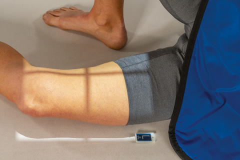
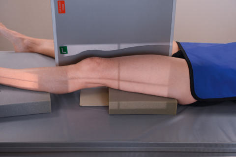
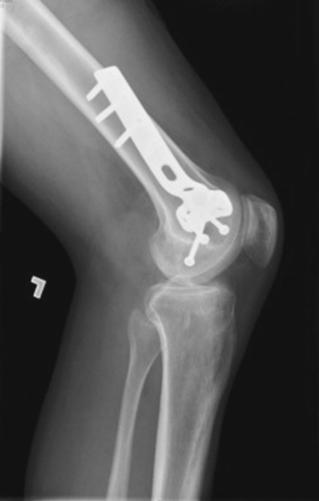

# Rx MEDIOLATERAL OR LATEROMEDIAL PROJECTIONS LATERAL (- Femur - MID AND DISTAL)

  📷 Radiografie Convențională (Rx)
  <strong>Actualizat:</strong> 2026-09-15
  <strong>Autor:</strong> Departamentul de Radiologie / Referință Bontrager

---

-   __1. Rezumat Clinic & Indicații__

    ---

    === "Indicații Clinice"

        - Mid and distal Femur, including Genunchi joint, for detection and evaluation of suspiciune de fractură and/or bone lesions

    === "Ghid Național IRIS"

        !!! info "Referință Primară: Ghidul Național IRIS (Ordinul MS 1342/2012)"
            - **Capitol Ghid IRIS:** *Ghidul Național IRIS*
            - **Grad de Recomandare:** **De verificat pe indicație; fără grad atribuit automat**
            - **Nivel de Iradiere Estimată:** `De verificat pentru examinarea și populația selectate`

            [:octicons-search-16: Deschide Ghidul IRIS](../../iris.md){ .md-button .md-button--primary } [:material-open-in-new: Aplicația Oficială PWA](https://radiologie-pediatrica.ro/iris/){ .md-button target="_blank" rel="noopener" }
-   __2. Poziționare & Centrare Fascicul__

    ---

    - **Poziție Pacient:** Pacient: Place patient in the lateral Decubit position, or Decubit Dorsal for traumatism acuttism / Regim Urgență patient.; Regiune anatomică: Lateral Decubit (Fig. 7.38) WARninG: Do not attempt this position if patient has severe traumatism acuttism / Regim Urgență. Flex Genunchi approximately 45 degrees with patient on affected side, and align Femur to midline of table or IR. Place unaffected leg behind affected leg to prevent overrotation. Adjust IR to include Genunchi joint (lower IR margin should be approximately 2 inches [5 cm] below Genunchi joint). A second IR to include the proximal Femur and Șold generally will be required on an adult (see pp. 282 and 294). traumatism acuttism / Regim Urgență Lateromedial Projection (Fig. 7.39) Place support under affected leg and Genunchi and support Picior and Gleznă (Articulație Talocrurală) in true AP position. Place IR on edge against medial aspect of thigh to include Genunchi, with horizontal xray beam directed from lateral side.
    - **Punct de Centrare Fascicul:** perpendicular to Femur and directed to midpoint of iR
    - **Distanță Focar-Film (DFF / SID):** 100 cm
    - **Comandă Respiratorie:** Apnee pe durata expunerii (sau conform cooperării pacientului)

-   __3. Parametri Tehnici Expunere__

    ---

    | Parametru Tehnic | Valoare Configurare Generator / Tub |
    |:-----------------|:-------------------------------------|
    | **Tensiune Tub (kV)** | 75-85 kV |
    | **Sarcină / Produs Curent-Timp (mAs)** | DE CONFIGURAT PE APARAT |
    | **Distanță Focar-Film (DFF / SID)** | 100 cm |
    | **Grilă Antidifuzoare (Bucky)** | Cu grilă antidifuzoare Bucky |
    | **Dimensiune Focar** | Focar Mic (0.6 mm) |
    | **Camere de Ionizare AEC** | Camerele laterale (sau camera centrală funcție de regiune) |
    | **Colimare Fascicul** | Collimate closely on both sides to Femur with end collimation field size to IR borders. Femur—Mid and Distal ROUTINE AP Lateral Fig. 7.38 Mediolateral mid and distal Femur. Fig. 7.39 traumatism acuttism / Regim Urgență lateromedial (horizontal beam) projection. |
    | **Filtrare Tub** | Totală ≥ 2.5 mm Al echivalent |

-   __4. Criterii de Calitate & Reușită Imagine__

    ---

    - Distal twothirds of distal Femur, including the Genunchi joint, is shown.
    - Genunchi joint will not appear open, and distal margins of the femoral condyles will not be superimposed because of divergent xray beam (Fig. 7.40). Position, True Lateral:
    - Anterior and posterior margins of medial and lateral femoral condyles should be superimposed and aligned with open patellofemoral joint space.
    - Femur should be centered to collimation field size with Genunchi joint space a minimum of 1 inch (2.5 cm) from distal IR margin.
    - Collimation field size to area of interest. Exposure:
    - Optimal exposure with correct use of anode heel effect or use of compensating filter will result in near uniformity.
    - Optimal image receptor exposure and contrast of the entire Femur.
    - no motion is present; fine trabecular markings should be clear and sharp throughout length of Femur. 35 43 L Fig. 7.40 Lateral—mid and distal Femur. (From Fagan R, Furey AJ: Use of large osteochondral allografts in reconstruction of traumatism acuttic uncontained distal femoral defects. J Orthopaed 11(1): 43–47, 2014.)

-   __5. Protecție Radiologică (ALARA)__

    ---

    - Ecranare gonadică și a organelor radiosensibile conform procedurilor locale de radioprotecție ALARA.
    - Colimare strictă la aria de interes pentru limitarea radiației difuze.
    - Verificarea posibilității unei sarcini la pacientele de vârstă fertilă înainte de expunere.

!!! note "Observații Clinice & Tehnice"
    When a physical grid is used, care must be taken to prevent grid cutoff.

### 🖼️ Imagini

<figure class="protocol-image-card" markdown>

<figcaption><strong>Fig. 7.38 Mediolateral mid and distal Femur.</strong> — Poziționare pacient conform Ghidului Bontrager (Fig. 7.38 Mediolateral mid and distal femur.)</figcaption>

</figure>

<figure class="protocol-image-card" markdown>

<figcaption><strong>Fig. 7.39 traumatism acuttism / Regim Urgență lateromedial (horizontal beam) projection.</strong> — Aspect radiografic de referință conform Ghidului Bontrager (Fig. 7.39 Trauma lateromedial (horizontal beam) projection.)</figcaption>

</figure>

<figure class="protocol-image-card" markdown>

<figcaption><strong>Fig. 7.40 Lateral—mid and distal Femur. (From Fagan R, Furey AJ:</strong> — Aspect radiografic de referință conform Ghidului Bontrager (Fig. 7.40 Lateral—mid and distal femur. (From Fagan R, Furey AJ:)</figcaption>

</figure>

=== "Ghid Rapid de Execuție"

    1. **Identificarea și verificarea pacientului:** verificare identitate, zonă de examinat, consimțământ conform procedurii și evaluarea posibilității unei sarcini, când este relevantă.
    2. **Pregătire:** îndepărtarea oricăror obiecte radiopace (bijuterii, agrafe, fermoare, proteze, pansamente dense).
    3. **Poziționare precisă:** alinierea receptorului de imagine și a tubului la distanța prescrisă (100 cm).
    4. **Colimare strictă:** adaptarea fasciculului strict la regiunea de diagnostic pentru scăderea iradierii și reducerea radiației difuze.
    5. **Radioprotecție:** verificarea [politicii RX](../radioprotectie.md), cu măsuri distincte pentru pacient, personal și însoțitor.

## Surse de documentare

- [Bontrager's Textbook of Radiographic Positioning (Ed. 9/10), Pagina 295](https://www.elsevier.com/books/textbook-of-radiographic-positioning-and-related-anatomy/lampignano/978-0-323-65367-1)
