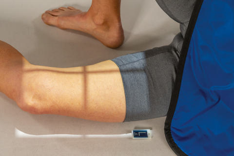
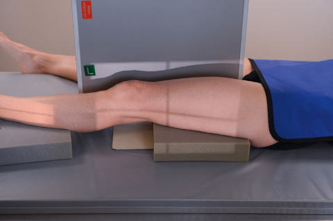
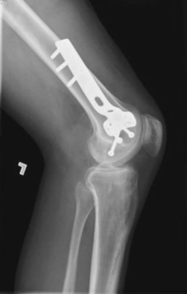

# Rx mediolateral SAU incidență lateromedială — PROFIL (femur — mijlociu și distal)

  📷 Radiografie Convențională (Rx)
  <strong>Actualizat:</strong> 2026-09-15
  <strong>Autor:</strong> Departamentul de Radiologie / Referință Bontrager

---

-   __1. Rezumat Clinic & Indicații__

    ---

    === "Indicații Clinice"

        - Treimea mijlocie și distală a femurului, inclusiv articulația genunchiului, pentru detectarea și evaluarea suspiciunii de fractură și/sau a leziunilor osoase

    === "Ghid Național IRIS"

        !!! info "Referință Primară: Ghidul Național IRIS (Ordinul MS 1342/2012)"
            - **Capitol Ghid IRIS:** *Aparat locomotor & Membru inferior*
            - **Grad de Recomandare:** **Grad A**
            - **Nivel de Iradiere Estimată:** `Clasa 1 (Minimă < 0.05 mSv)`

            [:octicons-search-16: Deschide Ghidul IRIS](../../iris.md){ .md-button .md-button--primary } [:material-open-in-new: Aplicația Oficială PWA](https://radiologie-pediatrica.ro/iris/){ .md-button target="_blank" rel="noopener" }

-   __2. Poziționare & Centrare Fascicul__

    ---

    - **Poziție Pacient:** Pacient: Așezați pacientul în decubit lateral sau în decubit dorsal pentru pacient cu traumatism acut / în regim de urgență.; Regiune anatomică: decubit lateral (Fig. 7.38) AVERTISMENT: Nu încercați această poziție dacă pacientul prezintă un traumatism acut sever / este în regim de urgență. Flectați genunchiul la aproximativ 45 de grade, cu pacientul pe partea afectată, și aliniați femurul cu linia mediană a mesei sau a receptorului de imagine. Așezați membrul inferior neafectat în spatele membrului inferior afectat pentru a preveni suprarotația. Ajustați receptorul de imagine pentru a include articulația genunchiului (marginea inferioară a receptorului de imagine trebuie să fie la aproximativ 2 țoli [5 cm] sub articulația genunchiului). Pentru adult, va fi necesar, în general, un al doilea receptor de imagine pentru a include femurul proximal și șoldul (vezi pp. 282 și 294). Incidență lateromedială pentru traumatism acut / în regim de urgență (Fig. 7.39) Așezați un suport sub membrul inferior și genunchiul afectat și susțineți piciorul și glezna (articulația talocrurală) în poziție AP adevărată. Așezați receptorul de imagine pe muchie, lipit de aspectul medial al coapsei, pentru a include genunchiul, cu fasciculul de raze X orizontal orientat dinspre partea laterală.
    - **Punct de Centrare Fascicul:** perpendicular pe femur și orientat la mijlocul receptorului de imagine
    - **Distanță Focar-Film (DFF / SID):** 100 cm
    - **Comandă Respiratorie:** Apnee pe durata expunerii (sau conform cooperării pacientului)

-   __3. Parametri Tehnici Expunere__

    ---

    | Parametru Tehnic | Valoare Configurare Generator / Tub |
    |:-----------------|:-------------------------------------|
    | **Tensiune Tub (kV)** | 75-85 kV |
    | **Sarcină / Produs Curent-Timp (mAs)** | DE CONFIGURAT PE APARAT |
    | **Distanță Focar-Film (DFF / SID)** | 100 cm |
    | **Grilă Antidifuzoare (Bucky)** | Cu grilă antidifuzoare Bucky |
    | **Dimensiune Focar** | Focar Mic (0.6 mm) |
    | **Camere de Ionizare AEC** | Camerele laterale (sau camera centrală, în funcție de regiune) |
    | **Colimare Fascicul** | Colimați strâns pe ambele părți ale femurului, până la marginile receptorului de imagine ale câmpului de colimare. Femur — mijlociu și distal, DE RUTINĂ, AP, profil. Fig. 7.38 Femurul mijlociu și distal în incidență mediolaterală. Fig. 7.39 Incidență lateromedială pentru traumatism acut / în regim de urgență (fascicul orizontal). |
    | **Filtrare Tub** | Totală ≥ 2.5 mm Al echivalent |

-   __4. Criterii de Calitate & Reușită Imagine__

    ---

    - Sunt vizualizate cele două treimi distale ale femurului distal, inclusiv articulația genunchiului.
    - Articulația genunchiului nu va apărea deschisă, iar marginile distale ale condililor femurali nu vor fi suprapuse din cauza fasciculului de raze X divergent (Fig. 7.40). Poziție, profil adevărat:
    - Marginile anterioare și posterioare ale condililor femurali medial și lateral trebuie să fie suprapuse și aliniate, cu spațiile articulare patelofemurale deschise.
    - Femurul trebuie centrat în câmpul de colimare, cu spațiile articulare ale genunchiului la minimum 1 țol (2.5 cm) de marginea distală a receptorului de imagine.
    - Dimensiunea câmpului de colimare până la aria de interes diagnostic. Expunere:
    - Expunerea optimă, cu utilizarea corectă a efectului anodo-călcâi sau a unui filtru compensator, va avea ca rezultat o uniformitate aproape completă.
    - optimă a expunerii receptorului de imagine și a contrastului întregului femur.
    - Nu este prezentă nicio mișcare; marcajele trabeculare fine trebuie să fie clare și nete pe toată lungimea femurului. 35 43 L Fig. 7.40 femurul mijlociu și distal în profil. (de la Fagan R, Furey AJ: Utilizarea grefelor osteocondrale alogene de mari dimensiuni în reconstrucția defectelor femurale distale traumatice, necontenute. J Orthopaed 11(1): 43–47, 2014.)

-   __5. Protecție Radiologică (ALARA)__

    ---

    - Ecranare gonadică și a organelor radiosensibile conform procedurilor locale de radioprotecție ALARA.
    - Colimare strictă la aria de interes pentru limitarea radiației difuze.
    - Verificarea posibilității unei sarcini la pacientele de vârstă fertilă înainte de expunere.

!!! note "Observații Clinice & Tehnice"
    Când se utilizează o grilă fizică, aceasta trebuie poziționată pentru a preveni tăierea grilei.

### 🖼️ Imagini

<figure class="protocol-image-card" markdown>

<figcaption><strong>Fig. 7.38 Femurul mijlociu și distal în incidență mediolaterală.</strong> — Poziționarea pacientului conform Ghidului Bontrager (Fig. 7.38 Femurul mijlociu și distal în incidență mediolaterală.)</figcaption>

</figure>

<figure class="protocol-image-card" markdown>

<figcaption><strong>Fig. 7.39 Incidență lateromedială pentru traumatism acut / în regim de urgență (fascicul orizontal).</strong> — Aspect radiografic de referință conform Ghidului Bontrager (Fig. 7.39 Incidență lateromedială pentru traumatism acut (fascicul orizontal).)</figcaption>

</figure>

<figure class="protocol-image-card" markdown>

<figcaption><strong>Fig. 7.40 Femurul mijlociu și distal în profil. (de la Fagan R, Furey AJ:</strong> — Aspect radiografic de referință conform Ghidului Bontrager (Fig. 7.40 Femurul mijlociu și distal în profil. (de la Fagan R, Furey AJ:)</figcaption>

</figure>

=== "Ghid Rapid de Execuție"

    1. **Identificarea și verificarea pacientului:** verificare identitate, zonă de examinat, consimțământ conform procedurii și evaluarea posibilității unei sarcini, când este relevantă.
    2. **Pregătire:** îndepărtarea oricăror obiecte radiopace (bijuterii, agrafe, fermoare, proteze, pansamente dense).
    3. **Poziționare precisă:** alinierea receptorului de imagine și a tubului la distanța prescrisă (100 cm).
    4. **Colimare strictă:** adaptarea fasciculului strict la regiunea de diagnostic pentru scăderea iradierii și reducerea radiației difuze.
    5. **Radioprotecție:** verificarea [politicii RX](../radioprotectie.md), cu măsuri distincte pentru pacient, personal și însoțitor.

## Surse de documentare

- [Bontrager's Textbook of Radiographic Positioning (Ed. 9/10), Pagina 295](https://www.elsevier.com/books/textbook-of-radiographic-positioning-and-related-anatomy/lampignano/978-0-323-65367-1)
