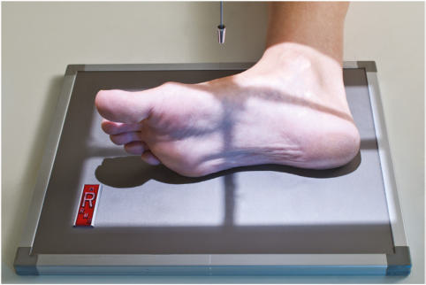
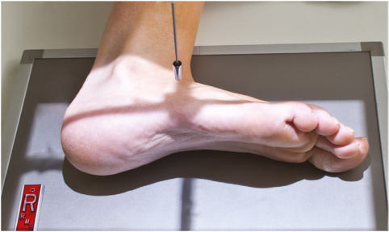
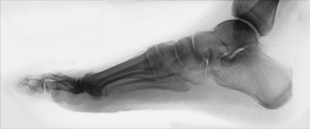
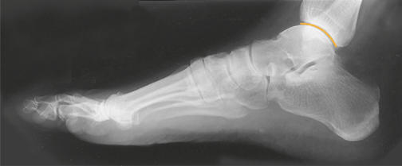

# Rx Medio-Lateral OR Incidență Latero-MedialăS LATERAL (Picior)

  📷 Radiografie Convențională (Rx)
  <strong>Actualizat:</strong> 2026-09-15
  <strong>Autor:</strong> Departamentul de Radiologie / Referință Bontrager

---

-   __1. Rezumat Clinic & Indicații__

    ---

    === "Indicații Clinice"

        - Location și grade de anterior sau posterior displacement de suspiciune de fractură fragments, articulație abnormalities, și părți moi effusions
        - Location de opaque Corp străin / corpuri străine radio-opace

    === "Ghid Național IRIS"

        !!! info "Referință Primară: Ghidul Național IRIS (Ordinul MS 1342/2012)"
            - **Capitol Ghid IRIS:** *Ghidul Național IRIS*
            - **Grad de Recomandare:** **De verificat pe indicație; fără grad atribuit automat**
            - **Nivel de Iradiere Estimată:** `De verificat pentru examinarea și populația selectate`

            [:octicons-search-16: Deschide Ghidul IRIS](../../iris.md){ .md-button .md-button--primary } [:material-open-in-new: Aplicația Oficială PWA](https://radiologie-pediatrica.ro/iris/){ .md-button target="_blank" rel="noopener" }
-   __2. Poziționare & Centrare Fascicul__

    ---

    - **Poziție Pacient:** Pacient: Place pacient în lateral Decubit poziție; provide pillow pentru pacient’s cap.; Regiune anatomică: (Mediolateral incidență) Flex Genunchi de affected limb about 45°; place opposite membru inferior behind injured limb la prevent overrotation de affected membru inferior. Carefully dorsiflex Picior if possible la assist în positioning pentru true lateral Picior și Gleznă (Articulație Talocrurală) (Fig. 6.63). Place support under membru inferior și Genunchi ca needed so that plantar surface este perpendicular pe receptorul de imagine. Do nu overrotate Picior. Align axa longitudinală de Picior la axa longitudinală de receptorul de imagine (unless diagonal placement este needed la include entire Picior). Center mid area de base de oase metatarsiene la raza centrală.
    - **Punct de Centrare Fascicul:** perpendicular pe receptorul de imagine, orientat la medial cuneiform (la level de base de third metatarsal)
    - **Distanță Focar-Film (DFF / SID):** 100 cm
    - **Comandă Respiratorie:** Apnee pe durata expunerii (sau conform cooperării pacientului)

-   __3. Parametri Tehnici Expunere__

    ---

    | Parametru Tehnic | Valoare Configurare Generator / Tub |
    |:-----------------|:-------------------------------------|
    | **Tensiune Tub (kV)** | 60-70 kV |
    | **Sarcină / Produs Curent-Timp (mAs)** | DE CONFIGURAT PE APARAT |
    | **Distanță Focar-Film (DFF / SID)** | 100 cm |
    | **Grilă Antidifuzoare (Bucky)** | Fără grilă (expunere directă) |
    | **Dimensiune Focar** | Focar Mic (0.6 mm) |
    | **Camere de Ionizare AEC** | DE CONFIGURAT PE APARAT |
    | **Colimare Fascicul** | la aria de interes diagnostic. expunere: optim receptorul de imagine expunere și contrast la visualize margini de superimposed oase tarsiene și oase metatarsiene. fără mișcare; cortical margins și trabecular markings de Calcaneu și nonsuperimposed portions de other oase tarsiene trebuie să appear sharply defined. Fig. 6.64 Alternative lateromedial. Fig. 6.65 Mediolateral Picior. Gleznă (Articulație Talocrurală) articulație Cuboid Navicular Subtalar articulație Base de 5th metatarsal Calcaneu astragal (talus) 1st cuneiform Fig. 6.66 Mediolateral Picior. |
    | **Filtrare Tub** | Totală ≥ 2.5 mm Al echivalent |

-   __4. Criterii de Calitate & Reușită Imagine__

    ---

    - Entire Picior trebuie să fie evidențiat, cu minimum de 1 inch (2.5 cm) de distal tibiafibula.
    - Heads de oase metatarsiene sunt superimposed cu tuberosity de fifth metatarsal seen în profile (Figs. 6.65 și 6.66). poziție:
    - axa longitudinală de Picior trebuie să fie aliniat la axa longitudinală de receptorul de imagine.
    - True Incidență de Profil (lateral) este achieved when tibiotalar articulație este open, distal fibula este superimposed prin posterior tibia, și distal oase metatarsiene sunt superimposed.

-   __5. Protecție Radiologică (ALARA)__

    ---

    - Ecranare gonadică și a organelor radiosensibile conform procedurilor locale de radioprotecție ALARA.
    - Colimare strictă la aria de interes pentru limitarea radiației difuze.
    - Verificarea posibilității unei sarcini la pacientele de vârstă fertilă înainte de expunere.

### 🖼️ Imagini

<figure class="protocol-image-card" markdown>

<figcaption><strong>Fig. 6.63 Mediolateral incidență.</strong> — Poziționare pacient conform Ghidului Bontrager (Fig. 6.63 Mediolateral incidență.)</figcaption>

</figure>

<figure class="protocol-image-card" markdown>

<figcaption><strong>Fig. 6.64 Alternative lateromedial.</strong> — Aspect radiografic de referință conform Ghidului Bontrager (Fig. 6.64 Alternative lateromedial.)</figcaption>

</figure>

<figure class="protocol-image-card" markdown>

<figcaption><strong>Fig. 6.65 Mediolateral Picior.</strong> — Aspect radiografic de referință conform Ghidului Bontrager (Fig. 6.65 Mediolateral picior.)</figcaption>

</figure>

<figure class="protocol-image-card" markdown>

<figcaption><strong>Fig. 6.66 Mediolateral Picior.</strong> — Aspect radiografic de referință conform Ghidului Bontrager (Fig. 6.66 Mediolateral picior.)</figcaption>

</figure>

=== "Ghid Rapid de Execuție"

    1. **Identificarea și verificarea pacientului:** verificare identitate, zonă de examinat, consimțământ conform procedurii și evaluarea posibilității unei sarcini, când este relevantă.
    2. **Pregătire:** îndepărtarea oricăror obiecte radiopace (bijuterii, agrafe, fermoare, proteze, pansamente dense).
    3. **Poziționare precisă:** alinierea receptorului de imagine și a tubului la distanța prescrisă (100 cm).
    4. **Colimare strictă:** adaptarea fasciculului strict la regiunea de diagnostic pentru scăderea iradierii și reducerea radiației difuze.
    5. **Radioprotecție:** verificarea [politicii RX](../radioprotectie.md), cu măsuri distincte pentru pacient, personal și însoțitor.

## Surse de documentare

- [Bontrager's Textbook of Radiographic Positioning (Ed. 9/10), Pagina 248](https://www.elsevier.com/books/textbook-of-radiographic-positioning-and-related-anatomy/lampignano/978-0-323-65367-1)
