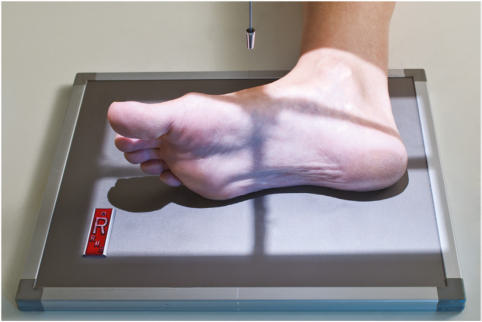
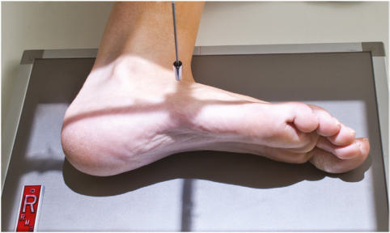
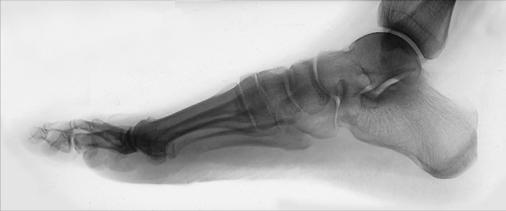
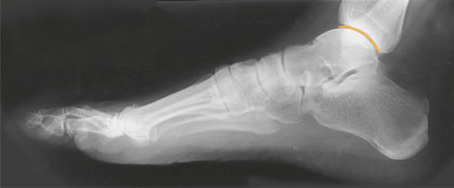

# Rx mediolateral — incidență lateromedială PROFIL (picior)

  📷 Radiografie Convențională (Rx)
  <strong>Actualizat:</strong> 2026-09-15
  <strong>Autor:</strong> Departamentul de Radiologie / Referință Bontrager

---

-   __1. Rezumat Clinic & Indicații__

    ---

    === "Indicații Clinice"

        - Localizarea și gradul deplasării anterioare sau posterioare a fragmentelor fracturii suspectate, anomaliile articulare și revărsatele părților moi
        - Localizarea corpului străin/corpurilor străine radio-opace

    === "Ghid Național IRIS"

        !!! info "Referință Primară: Ghidul Național IRIS (Ordinul MS 1342/2012)"
            - **Capitol Ghid IRIS:** *Aparat locomotor & Membru inferior*
            - **Grad de Recomandare:** **Grad A**
            - **Nivel de Iradiere Estimată:** `Clasa 1 (Minimă < 0.01 mSv)`

            [:octicons-search-16: Deschide Ghidul IRIS](../../iris.md){ .md-button .md-button--primary } [:material-open-in-new: Aplicația Oficială PWA](https://radiologie-pediatrica.ro/iris/){ .md-button target="_blank" rel="noopener" }

-   __2. Poziționare & Centrare Fascicul__

    ---

    - **Poziție Pacient:** Pacient: Așezați pacientul în decubit lateral; asigurați o pernă pentru capul pacientului.; Regiune anatomică: (incidență mediolaterală) Flectați genunchiul membrului afectat la aproximativ 45°; așezați membrul inferior opus în spatele membrului lezat pentru a preveni suprarotația membrului inferior afectat. Dorsiflectați cu grijă piciorul, dacă este posibil, pentru a ajuta la poziționarea în profil adevărat a piciorului și gleznei (articulației talocrurale) (Fig. 6.63). Așezați un suport sub membrul inferior și genunchi, după cum este necesar, astfel încât suprafața plantară să fie perpendiculară pe receptorul de imagine. Nu suprarotați piciorul. Aliniați axa longitudinală a piciorului cu axa longitudinală a receptorului de imagine (cu excepția cazului în care este necesară poziționarea diagonală pentru a include întregul picior). Centrați regiunea mijlocie a bazei oaselor metatarsiene la raza centrală.
    - **Punct de Centrare Fascicul:** perpendicular pe receptorul de imagine, orientat spre cuneiformul medial (la nivelul bazei celui de-al treilea metatarsian)
    - **Distanță Focar-Film (DFF / SID):** 100 cm
    - **Comandă Respiratorie:** Apnee pe durata expunerii (sau conform cooperării pacientului)

-   __3. Parametri Tehnici Expunere__

    ---

    | Parametru Tehnic | Valoare Configurare Generator / Tub |
    |:-----------------|:-------------------------------------|
    | **Tensiune Tub (kV)** | 60-70 kV |
    | **Sarcină / Produs Curent-Timp (mAs)** | DE CONFIGURAT PE APARAT |
    | **Distanță Focar-Film (DFF / SID)** | 100 cm |
    | **Grilă Antidifuzoare (Bucky)** | Fără grilă (expunere directă) |
    | **Dimensiune Focar** | Focar Mic (0.6 mm) |
    | **Camere de Ionizare AEC** | DE CONFIGURAT PE APARAT |
    | **Colimare Fascicul** | la aria de interes diagnostic. Expunere: expunerea receptorului de imagine și contrastul trebuie să fie optime pentru a vizualiza marginile oaselor tarsiene și ale oaselor metatarsiene suprapuse. Fără mișcare; marginile corticale și desenul trabecular al calcaneului și porțiunile nesuprapuse ale celorlalte oase tarsiene trebuie să apară clar definite. Fig. 6.64 Incidență latero-medială alternativă. Fig. 6.65 Picior, incidență medio-laterală. Gleznă (articulație talocrurală) Articulație Os cuboid Os navicular Articulație subtalară Baza celui de-al 5-lea os metatarsian Calcaneu Astragal (talus) Osul cuneiform 1 Fig. 6.66 Picior, incidență medio-laterală. |
    | **Filtrare Tub** | Totală ≥ 2.5 mm Al echivalent |

-   __4. Criterii de Calitate & Reușită Imagine__

    ---

    - Întregul picior trebuie să fie evidențiat, cu minimum 1 țol (2.5 cm) din tibia și fibula distale.
    - Capetele oaselor metatarsiene sunt suprapuse, cu tuberozitatea celui de-al cincilea metatarsian vizibilă în profil (Fig. 6.65 și 6.66). Poziție:
    - Axa longitudinală a piciorului trebuie să fie aliniată cu axa longitudinală a receptorului de imagine.
    - Incidența de profil adevărat este obținută când articulația tibiotalară este deschisă, fibula distală este suprapusă peste partea posterioară a tibiei, iar oasele metatarsiene distale sunt suprapuse.

-   __5. Protecție Radiologică (ALARA)__

    ---

    - Ecranare gonadică și a organelor radiosensibile conform procedurilor locale de radioprotecție ALARA.
    - Colimare strictă la aria de interes pentru limitarea radiației difuze.
    - Verificarea posibilității unei sarcini la pacientele de vârstă fertilă înainte de expunere.

### 🖼️ Imagini

<figure class="protocol-image-card" markdown>

<figcaption><strong>Fig. 6.63 Incidență mediolaterală.</strong> — Poziționarea pacientului conform Ghidului Bontrager (Fig. 6.63 Incidență mediolaterală.)</figcaption>

</figure>

<figure class="protocol-image-card" markdown>

<figcaption><strong>Fig. 6.64 Incidență lateromedială alternativă.</strong> — Aspect radiografic de referință conform Ghidului Bontrager (Fig. 6.64 Incidență lateromedială alternativă.)</figcaption>

</figure>

<figure class="protocol-image-card" markdown>

<figcaption><strong>Fig. 6.65 Picior în incidență mediolaterală.</strong> — Aspect radiografic de referință conform Ghidului Bontrager (Fig. 6.65 Picior în incidență mediolaterală.)</figcaption>

</figure>

<figure class="protocol-image-card" markdown>

<figcaption><strong>Fig. 6.66 Picior în incidență mediolaterală.</strong> — Aspect radiografic de referință conform Ghidului Bontrager (Fig. 6.66 Picior în incidență mediolaterală.)</figcaption>

</figure>

=== "Ghid Rapid de Execuție"

    1. **Identificarea și verificarea pacientului:** verificare identitate, zonă de examinat, consimțământ conform procedurii și evaluarea posibilității unei sarcini, când este relevantă.
    2. **Pregătire:** îndepărtarea oricăror obiecte radiopace (bijuterii, agrafe, fermoare, proteze, pansamente dense).
    3. **Poziționare precisă:** alinierea receptorului de imagine și a tubului la distanța prescrisă (100 cm).
    4. **Colimare strictă:** adaptarea fasciculului strict la regiunea de diagnostic pentru scăderea iradierii și reducerea radiației difuze.
    5. **Radioprotecție:** verificarea [politicii RX](../radioprotectie.md), cu măsuri distincte pentru pacient, personal și însoțitor.

## Surse de documentare

- [Bontrager's Textbook of Radiographic Positioning (Ed. 9/10), Pagina 248](https://www.elsevier.com/books/textbook-of-radiographic-positioning-and-related-anatomy/lampignano/978-0-323-65367-1)
