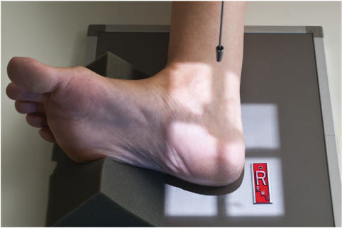
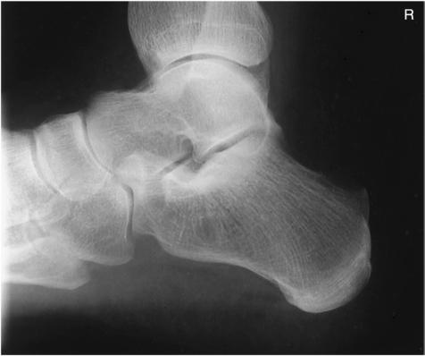
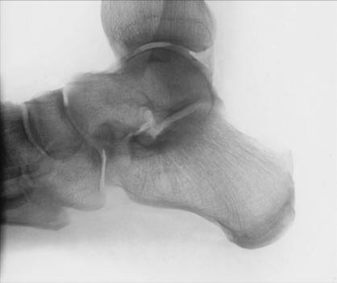

# Rx Medio-Lateral Incidență LATERAL (Calcaneu)

  📷 Radiografie Convențională (Rx)
  <strong>Actualizat:</strong> 2026-09-15
  <strong>Autor:</strong> Departamentul de Radiologie / Referință Bontrager

---

-   __1. Rezumat Clinic & Indicații__

    ---

    === "Indicații Clinice"

        - Bony lesions involving Calcaneu, astragal (talus), și talocalcaneal articulație
        - evidențiază extent și alignment de suspiciune de fractură

    === "Ghid Național IRIS"

        !!! info "Referință Primară: Ghidul Național IRIS (Ordinul MS 1342/2012)"
            - **Capitol Ghid IRIS:** *Ghidul Național IRIS*
            - **Grad de Recomandare:** **De verificat pe indicație; fără grad atribuit automat**
            - **Nivel de Iradiere Estimată:** `De verificat pentru examinarea și populația selectate`

            [:octicons-search-16: Deschide Ghidul IRIS](../../iris.md){ .md-button .md-button--primary } [:material-open-in-new: Aplicația Oficială PWA](https://radiologie-pediatrica.ro/iris/){ .md-button target="_blank" rel="noopener" }
-   __2. Poziționare & Centrare Fascicul__

    ---

    - **Poziție Pacient:** Pacient: Place pacient în lateral Decubit poziție, affected side down. Provide pillow pentru pacient’s cap. Flex Genunchi de affected limb about 45°; place opposite membru inferior behind injured limb.; Regiune anatomică: Center Calcaneu la raza centrală și la unmasked portion de receptorul de imagine, cu axa longitudinală de Picior paralel la plane de receptorul de imagine (Fig. 6.75). Place support under Genunchi și membru inferior ca needed la place plantar surface perpendicular pe receptorul de imagine. poziție Gleznă (Articulație Talocrurală) și Picior pentru true lateral, which places maleolă laterală (fibulară) approximately {⅜} inch (1 cm) posterior la maleolă medială (tibială). Dorsiflex Picior so that plantar surface este la drept angle la membru inferior.
    - **Punct de Centrare Fascicul:** perpendicular pe receptorul de imagine, orientat la point 1 inch (2.5 cm) inferior la maleolă medială (tibială)
    - **Distanță Focar-Film (DFF / SID):** 100 cm
    - **Comandă Respiratorie:** Apnee pe durata expunerii (sau conform cooperării pacientului)

-   __3. Parametri Tehnici Expunere__

    ---

    | Parametru Tehnic | Valoare Configurare Generator / Tub |
    |:-----------------|:-------------------------------------|
    | **Tensiune Tub (kV)** | 60-75 kV |
    | **Sarcină / Produs Curent-Timp (mAs)** | DE CONFIGURAT PE APARAT |
    | **Distanță Focar-Film (DFF / SID)** | 100 cm |
    | **Grilă Antidifuzoare (Bucky)** | Fără grilă (expunere directă) |
    | **Dimensiune Focar** | Focar Mic (0.6 mm) |
    | **Camere de Ionizare AEC** | DE CONFIGURAT PE APARAT |
    | **Colimare Fascicul** | Collimate la outer skin margins la include Gleznă (Articulație Talocrurală) articulație proximally și entire Calcaneu. Calcaneu ROUTINE plantar dorsal lateral Fig. 6.75 Mediolateral Calcaneu. |
    | **Filtrare Tub** | Totală ≥ 2.5 mm Al echivalent |

-   __4. Criterii de Calitate & Reușită Imagine__

    ---

    - Calcaneu este evidențiat în profile cu astragal (talus) și distal tibiafibula evidențiat superiorly și navicular și open spații articulare de Calcaneu și cuboid evidențiat distally (Figs. 6.76 și 6.77). poziție:
    - Absența rotației anatomice: clavicule echidistante față de linia apofizelor spinoase ca evidenced prin superimposed superior portions de astragal (talus), open talocalcaneal articulație, și maleolă laterală (fibulară) superimposed over posterior half de tibia și astragal (talus).
    - Tarsal sinus și calcaneocuboid spații articulare trebuie să appear open.
    - Foursided collimation trebuie să include Gleznă (Articulație Talocrurală) articulație proximally și talonavicular articulație și base de fifth metatarsal anteriorly. expunere:
    - optim receptorul de imagine expunere și contrast la visualize părți moi și more dense portions de Calcaneu și astragal (talus).
    - Outline de distal fibula trebuie să fie faintly vizibil through astragal (talus).
    - Trabecular markings appear clear și net, indicating fără mișcare. Fig. 6.76 Mediolateral Calcaneu. Tarsal sinus (sinus tarsi) Talocalcaneal (subtalar) articulație Base de 5th metatarsal Cuboid Calcaneocuboid articulație Calcaneu Tuberosity astragal (talus) Talonavicular articulație Tibiotalar articulație maleolă laterală (fibulară) R Navicular Fig. 6.77 Mediolateral Calcaneu.

-   __5. Protecție Radiologică (ALARA)__

    ---

    - Ecranare gonadică și a organelor radiosensibile conform procedurilor locale de radioprotecție ALARA.
    - Colimare strictă la aria de interes pentru limitarea radiației difuze.
    - Verificarea posibilității unei sarcini la pacientele de vârstă fertilă înainte de expunere.

### 🖼️ Imagini

<figure class="protocol-image-card" markdown>

<figcaption><strong>Fig. 6.75 Mediolateral Calcaneu.</strong> — Poziționare pacient conform Ghidului Bontrager (Fig. 6.75 Mediolateral calcaneu.)</figcaption>

</figure>

<figure class="protocol-image-card" markdown>

<figcaption><strong>Fig. 6.76 Mediolateral Calcaneu.</strong> — Aspect radiografic de referință conform Ghidului Bontrager (Fig. 6.76 Mediolateral calcaneu.)</figcaption>

</figure>

<figure class="protocol-image-card" markdown>

<figcaption><strong>Fig. 6.77 Mediolateral Calcaneu.</strong> — Aspect radiografic de referință conform Ghidului Bontrager (Fig. 6.77 Mediolateral calcaneu.)</figcaption>

</figure>

=== "Ghid Rapid de Execuție"

    1. **Identificarea și verificarea pacientului:** verificare identitate, zonă de examinat, consimțământ conform procedurii și evaluarea posibilității unei sarcini, când este relevantă.
    2. **Pregătire:** îndepărtarea oricăror obiecte radiopace (bijuterii, agrafe, fermoare, proteze, pansamente dense).
    3. **Poziționare precisă:** alinierea receptorului de imagine și a tubului la distanța prescrisă (100 cm).
    4. **Colimare strictă:** adaptarea fasciculului strict la regiunea de diagnostic pentru scăderea iradierii și reducerea radiației difuze.
    5. **Radioprotecție:** verificarea [politicii RX](../radioprotectie.md), cu măsuri distincte pentru pacient, personal și însoțitor.

## Surse de documentare

- [Bontrager's Textbook of Radiographic Positioning (Ed. 9/10), Pagina 252](https://www.elsevier.com/books/textbook-of-radiographic-positioning-and-related-anatomy/lampignano/978-0-323-65367-1)
