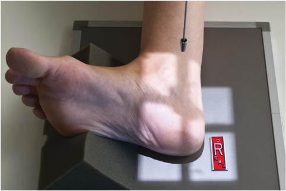
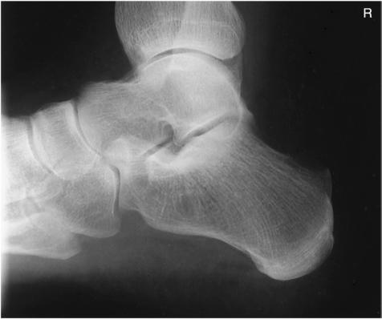
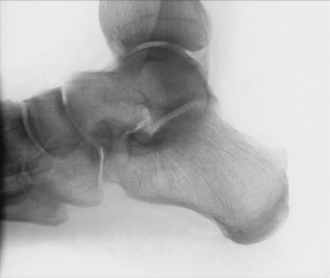

# Rx mediolateral — incidență PROFIL (calcaneu)

  📷 Radiografie Convențională (Rx)
  <strong>Actualizat:</strong> 2026-09-15
  <strong>Autor:</strong> Departamentul de Radiologie / Referință Bontrager

---

-   __1. Rezumat Clinic & Indicații__

    ---

    === "Indicații Clinice"

        - Leziuni osoase care implică calcaneul, talusul și articulația talocalcaneală
        - evidențiază extinderea și alinierea fracturii suspectate

    === "Ghid Național IRIS"

        !!! info "Referință Primară: Ghidul Național IRIS (Ordinul MS 1342/2012)"
            - **Capitol Ghid IRIS:** *Aparat locomotor & Membru inferior*
            - **Grad de Recomandare:** **Grad A**
            - **Nivel de Iradiere Estimată:** `Clasa 1 (Minimă < 0.01 mSv)`

            [:octicons-search-16: Deschide Ghidul IRIS](../../iris.md){ .md-button .md-button--primary } [:material-open-in-new: Aplicația Oficială PWA](https://radiologie-pediatrica.ro/iris/){ .md-button target="_blank" rel="noopener" }

-   __2. Poziționare & Centrare Fascicul__

    ---

    - **Poziție Pacient:** Pacient: Așezați pacientul în decubit lateral, cu partea afectată în jos. Asigurați o pernă pentru capul pacientului. Flectați genunchiul membrului afectat la aproximativ 45°; așezați membrul inferior opus în spatele membrului lezat.; Regiune anatomică: Centrați calcaneul la raza centrală și la porțiunea neacoperită a receptorului de imagine, cu axa longitudinală a piciorului paralelă cu planul receptorului de imagine (Fig. 6.75). Așezați un suport sub genunchi și membrul inferior, după cum este necesar, pentru a poziționa suprafața plantară perpendicular pe receptorul de imagine. Poziționați glezna (articulația talocrurală) și piciorul pentru profil adevărat, ceea ce plasează maleola laterală (fibulară) la aproximativ {⅜} inch (1 cm) posterior de maleola medială (tibială). Dorsiflectați piciorul astfel încât suprafața plantară să fie în unghi drept față de membrul inferior.
    - **Punct de Centrare Fascicul:** perpendicular pe receptorul de imagine, orientat spre un punct situat la 1 țol (2.5 cm) inferior de maleola medială (tibială)
    - **Distanță Focar-Film (DFF / SID):** 100 cm
    - **Comandă Respiratorie:** Apnee pe durata expunerii (sau conform cooperării pacientului)

-   __3. Parametri Tehnici Expunere__

    ---

    | Parametru Tehnic | Valoare Configurare Generator / Tub |
    |:-----------------|:-------------------------------------|
    | **Tensiune Tub (kV)** | 60-75 kV |
    | **Sarcină / Produs Curent-Timp (mAs)** | DE CONFIGURAT PE APARAT |
    | **Distanță Focar-Film (DFF / SID)** | 100 cm |
    | **Grilă Antidifuzoare (Bucky)** | Fără grilă (expunere directă) |
    | **Dimensiune Focar** | Focar Mic (0.6 mm) |
    | **Camere de Ionizare AEC** | DE CONFIGURAT PE APARAT |
    | **Colimare Fascicul** | Colimați la marginile cutanate externe pentru a include proximal articulația gleznei (articulația talocrurală) și întregul calcaneu. Calcaneu — DE RUTINĂ, plantar-dorsal, profil. Fig. 6.75 Calcaneu în incidență mediolaterală. |
    | **Filtrare Tub** | Totală ≥ 2.5 mm Al echivalent |

-   __4. Criterii de Calitate & Reușită Imagine__

    ---

    - Calcaneul este evidențiat în profil, cu talusul și tibia-fibula distală evidențiate superior, iar navicularul și spațiile articulare deschise dintre calcaneu și cuboid evidențiate distal (Fig. 6.76 și 6.77). Poziție:
    - Absența rotației anatomice: claviculele sunt echidistante față de linia apofizelor spinoase, evidențiată prin suprapunerea porțiunilor superioare ale talusului, articulația talocalcaneală deschisă și maleola laterală (fibulară) suprapusă peste jumătatea posterioară a tibiei și talusului.
    - Sinusul tarsian și spațiile articulare calcaneocuboidiene trebuie să apară deschise.
    - Colimarea pe patru laturi trebuie să includă proximal articulația gleznei (articulația talocrurală), iar anterior articulația talonaviculară și baza celui de-al cincilea metatarsian. Expunere:
    - Expunerea și contrastul optime ale receptorului de imagine pentru vizualizarea părților moi și a porțiunilor mai dense ale calcaneului și talusului.
    - Conturul fibulei distale trebuie să fie vizibil discret prin talus.
    - Marcajele trabeculare apar clare și nete, indicând absența mișcării. Fig. 6.76 Calcaneu în incidență mediolaterală. Sinus tarsian (sinus tarsi), articulație talocalcaneală (subtalară), baza celui de-al 5-lea metatarsian, cuboid, articulație calcaneocuboidiană, calcaneu, tuberozitate, talus, articulație talonaviculară, articulație tibiotalară, maleolă laterală (fibulară), R, navicular. Fig. 6.77 Calcaneu în incidență mediolaterală.

-   __5. Protecție Radiologică (ALARA)__

    ---

    - Ecranare gonadică și a organelor radiosensibile conform procedurilor locale de radioprotecție ALARA.
    - Colimare strictă la aria de interes pentru limitarea radiației difuze.
    - Verificarea posibilității unei sarcini la pacientele de vârstă fertilă înainte de expunere.

### 🖼️ Imagini

<figure class="protocol-image-card" markdown>

<figcaption><strong>Fig. 6.75 Calcaneu în incidență mediolaterală.</strong> — Poziționarea pacientului conform Ghidului Bontrager (Fig. 6.75 Calcaneu în incidență mediolaterală.)</figcaption>

</figure>

<figure class="protocol-image-card" markdown>

<figcaption><strong>Fig. 6.76 Calcaneu în incidență mediolaterală.</strong> — Aspect radiografic de referință conform Ghidului Bontrager (Fig. 6.76 Calcaneu în incidență mediolaterală.)</figcaption>

</figure>

<figure class="protocol-image-card" markdown>

<figcaption><strong>Fig. 6.77 Calcaneu în incidență mediolaterală.</strong> — Aspect radiografic de referință conform Ghidului Bontrager (Fig. 6.77 Calcaneu în incidență mediolaterală.)</figcaption>

</figure>

=== "Ghid Rapid de Execuție"

    1. **Identificarea și verificarea pacientului:** verificare identitate, zonă de examinat, consimțământ conform procedurii și evaluarea posibilității unei sarcini, când este relevantă.
    2. **Pregătire:** îndepărtarea oricăror obiecte radiopace (bijuterii, agrafe, fermoare, proteze, pansamente dense).
    3. **Poziționare precisă:** alinierea receptorului de imagine și a tubului la distanța prescrisă (100 cm).
    4. **Colimare strictă:** adaptarea fasciculului strict la regiunea de diagnostic pentru scăderea iradierii și reducerea radiației difuze.
    5. **Radioprotecție:** verificarea [politicii RX](../radioprotectie.md), cu măsuri distincte pentru pacient, personal și însoțitor.

## Surse de documentare

- [Bontrager's Textbook of Radiographic Positioning (Ed. 9/10), Pagina 252](https://www.elsevier.com/books/textbook-of-radiographic-positioning-and-related-anatomy/lampignano/978-0-323-65367-1)
