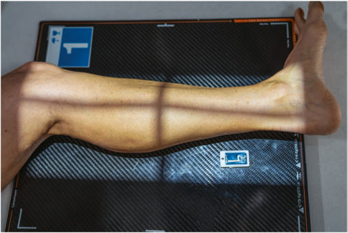
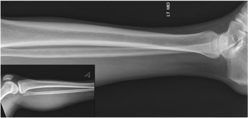

# Rx Medio-Lateral Incidență LATERAL (Gambă (TIBIA AND FIBULA))

  📷 Radiografie Convențională (Rx)
  <strong>Actualizat:</strong> 2026-09-15
  <strong>Autor:</strong> Departamentul de Radiologie / Referință Bontrager

---

-   __1. Rezumat Clinic & Indicații__

    ---

    === "Indicații Clinice"

        - Localization de lesions și Corp străin / corpuri străine radio-opace și determination de extent
        - Alignment de suspiciune de fractură evidențiat

    === "Ghid Național IRIS"

        !!! info "Referință Primară: Ghidul Național IRIS (Ordinul MS 1342/2012)"
            - **Capitol Ghid IRIS:** *Ghidul Național IRIS*
            - **Grad de Recomandare:** **De verificat pe indicație; fără grad atribuit automat**
            - **Nivel de Iradiere Estimată:** `De verificat pentru examinarea și populația selectate`

            [:octicons-search-16: Deschide Ghidul IRIS](../../iris.md){ .md-button .md-button--primary } [:material-open-in-new: Aplicația Oficială PWA](https://radiologie-pediatrica.ro/iris/){ .md-button target="_blank" rel="noopener" }
-   __2. Poziționare & Centrare Fascicul__

    ---

    - **Poziție Pacient:** Pacient: Place pacient în lateral Decubit poziție, injured side down; opposite membru inferior poate fie plasat behind membrul inferior afectat și sprijinit cu pillow sau săculeți cu nisip.; Regiune anatomică: Ensure that membru inferior este în true Incidență de Profil (lateral) (plane de Rotulă (Patelă) trebuie să fie perpendicular pe receptorul de imagine) (Fig. 6.101). Ensure that ambele Gleznă (Articulație Talocrurală) și Genunchi articulații sunt 1 la 2 inches (2.5 la 5 cm) de la ends de receptorul de imagine so that divergent rays do nu project either articulație off receptorul de imagine. If limb este too long, place Gambă diagonally (corner la corner) pe one 14 × 17- inch (35 × 43- cm) receptorul de imagine la ensure that ambele articulații sunt included (Fig. 6.102, inset). (Also, if needed, second, smaller receptorul de imagine poate fie taken de articulație cel mai depărtat de injury site.)
    - **Punct de Centrare Fascicul:** perpendicular pe receptorul de imagine, orientat la midpoint de Gambă
    - **Distanță Focar-Film (DFF / SID):** 100 cm
    - **Comandă Respiratorie:** Apnee pe durata expunerii (sau conform cooperării pacientului)

-   __3. Parametri Tehnici Expunere__

    ---

    | Parametru Tehnic | Valoare Configurare Generator / Tub |
    |:-----------------|:-------------------------------------|
    | **Tensiune Tub (kV)** | 65-80 kV |
    | **Sarcină / Produs Curent-Timp (mAs)** | DE CONFIGURAT PE APARAT |
    | **Distanță Focar-Film (DFF / SID)** | 100 cm |
    | **Grilă Antidifuzoare (Bucky)** | Fără grilă (expunere directă) |
    | **Dimensiune Focar** | Focar Mic (0.6 mm) |
    | **Camere de Ionizare AEC** | DE CONFIGURAT PE APARAT |
    | **Colimare Fascicul** | Collimate pe ambele părți (bilateral) la skin margins, cu full collimation la ends la include maximum Genunchi și Gleznă (Articulație Talocrurală) articulații. Alternative FollowUp Examination Routine routine pentru followup examinations de long bones în some departments este la include only one articulație nearest site de injury și la place this articulație minimum de 2 inches (5 cm) de la end de receptorul de imagine pentru better demonstration de articulație. However, pentru initial examinations, it este especially important when injury site este în distal Gambă pentru include proximal tibiofibular articulație area because it este common la have second suspiciune de fractură la this site. orizontal fascicul (CrossTable) lateral If pacient cannot fie turned, this imagine poate fie taken crosstable cu receptorul de imagine plasat pe edge între lower membre inferioare. Place support under injured membru inferior la se centrează Gambă la receptorul de imagine, și direct orizontal fascicul de la lateral side de pacient. Diagonal placement Gambă AP lateral Fig. 6.101 Mediolateral Gambă—include ambele articulații. Fig. 6.102 Mediolateral Gambă incidență. Inset shows proximal Gambă la show ambele articulații sunt included. |
    | **Filtrare Tub** | Totală ≥ 2.5 mm Al echivalent |

-   __4. Criterii de Calitate & Reușită Imagine__

    ---

    - Entire tibia și fibula trebuie să include Gleznă (Articulație Talocrurală) și Genunchi articulații pe this incidență (sau two if needed).
    - Exception este alternative routine pe followup examinations (Fig. 6.102). poziție:
    - True lateral de tibia și fibula fără rotație evidențiază tuberozitate tibială anterioară (TTA) în profile, portion de proximal cap de fibula superimposed prin tibia, și outlines de distal fibula seen through posterior half de tibia.
    - posterior margini de femoral condyles trebuie să appear superimposed.
    - Collimation la aria de interes diagnostic. expunere:
    - fără mișcare este present, ca evidenced prin net cortical margins și trabecular patterns.
    - Correct use de anode heel effect results în nearequal visualization de anatomy la ambele ends de imagine.
    - optim receptorul de imagine expunere și contrast trebuie să fie optimum la visualize părți moi și bony trabecular markings.

-   __5. Protecție Radiologică (ALARA)__

    ---

    - Ecranare gonadică și a organelor radiosensibile conform procedurilor locale de radioprotecție ALARA.
    - Colimare strictă la aria de interes pentru limitarea radiației difuze.
    - Verificarea posibilității unei sarcini la pacientele de vârstă fertilă înainte de expunere.

### 🖼️ Imagini

<figure class="protocol-image-card" markdown>

<figcaption><strong>Fig. 6.101 Mediolateral Gambă—include ambele articulații.</strong> — Poziționare pacient conform Ghidului Bontrager (Fig. 6.101 Mediolateral lower membru inferior—include ambele articulații.)</figcaption>

</figure>

<figure class="protocol-image-card" markdown>

<figcaption><strong>Fig. 6.102 Mediolateral Gambă incidență. Inset shows proximal</strong> — Aspect radiografic de referință conform Ghidului Bontrager (Fig. 6.102 Mediolateral lower membru inferior incidență. Inset shows proximal)</figcaption>

</figure>

=== "Ghid Rapid de Execuție"

    1. **Identificarea și verificarea pacientului:** verificare identitate, zonă de examinat, consimțământ conform procedurii și evaluarea posibilității unei sarcini, când este relevantă.
    2. **Pregătire:** îndepărtarea oricăror obiecte radiopace (bijuterii, agrafe, fermoare, proteze, pansamente dense).
    3. **Poziționare precisă:** alinierea receptorului de imagine și a tubului la distanța prescrisă (100 cm).
    4. **Colimare strictă:** adaptarea fasciculului strict la regiunea de diagnostic pentru scăderea iradierii și reducerea radiației difuze.
    5. **Radioprotecție:** verificarea [politicii RX](../radioprotectie.md), cu măsuri distincte pentru pacient, personal și însoțitor.

## Surse de documentare

- [Bontrager's Textbook of Radiographic Positioning (Ed. 9/10), Pagina 260](https://www.elsevier.com/books/textbook-of-radiographic-positioning-and-related-anatomy/lampignano/978-0-323-65367-1)
