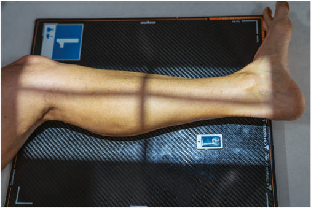
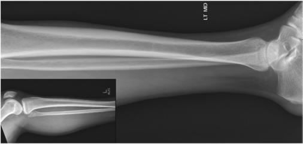

# Rx corp mandibular — incidență mediolaterală, profil (gambă [tibie și peroneu])

  📷 Radiografie Convențională (Rx)
  <strong>Actualizat:</strong> 2026-09-15
  <strong>Autor:</strong> Departamentul de Radiologie / Referință Bontrager

---

-   __1. Rezumat Clinic & Indicații__

    ---

    === "Indicații Clinice"

        - Localizarea leziunilor și a corpului străin / corpurilor străine radioopace și determinarea extinderii
        - Alinierea fracturii suspectate evidențiată

    === "Ghid Național IRIS"

        !!! info "Referință Primară: Ghidul Național IRIS (Ordinul MS 1342/2012)"
            - **Capitol Ghid IRIS:** *Aparat locomotor & Membru inferior*
            - **Grad de Recomandare:** **Grad A**
            - **Nivel de Iradiere Estimată:** `Clasa 1 (Minimă < 0.01 mSv)`

            [:octicons-search-16: Deschide Ghidul IRIS](../../iris.md){ .md-button .md-button--primary } [:material-open-in-new: Aplicația Oficială PWA](https://radiologie-pediatrica.ro/iris/){ .md-button target="_blank" rel="noopener" }

-   __2. Poziționare & Centrare Fascicul__

    ---

    - **Poziție Pacient:** Pacient: Așezați pacientul în decubit lateral, cu partea lezată în jos; membrul inferior opus poate fi așezat în spatele membrului inferior afectat și susținut cu o pernă sau cu săculeți cu nisip.; Regiune anatomică: Asigurați-vă că membrul inferior se află în profil adevărat (planul rotulei (patela) trebuie să fie perpendicular pe receptorul de imagine) (Fig. 6.101). Asigurați-vă că ambele articulații ale gleznei (articulația talocrurală) și genunchiului se află la 1–2 țoli (2.5–5 cm) de capetele receptorului de imagine, astfel încât razele divergente să nu proiecteze niciuna dintre articulații în afara receptorului de imagine. Dacă membrul este prea lung, așezați gamba diagonal (colț la colț) pe un receptor de imagine de 14 × 17 țol (35 × 43 cm), pentru a vă asigura că sunt incluse ambele articulații (Fig. 6.102, imagine inserată). (De asemenea, dacă este necesar, poate fi utilizat un al doilea receptor de imagine, mai mic, pentru articulația cea mai îndepărtată de locul leziunii.)
    - **Punct de Centrare Fascicul:** perpendicular pe receptorul de imagine, orientat la mijlocul gambei
    - **Distanță Focar-Film (DFF / SID):** 100 cm
    - **Comandă Respiratorie:** Apnee pe durata expunerii (sau conform cooperării pacientului)

-   __3. Parametri Tehnici Expunere__

    ---

    | Parametru Tehnic | Valoare Configurare Generator / Tub |
    |:-----------------|:-------------------------------------|
    | **Tensiune Tub (kV)** | 65-80 kV |
    | **Sarcină / Produs Curent-Timp (mAs)** | DE CONFIGURAT PE APARAT |
    | **Distanță Focar-Film (DFF / SID)** | 100 cm |
    | **Grilă Antidifuzoare (Bucky)** | Fără grilă (expunere directă) |
    | **Dimensiune Focar** | Focar Mic (0.6 mm) |
    | **Camere de Ionizare AEC** | DE CONFIGURAT PE APARAT |
    | **Colimare Fascicul** | Colimați bilateral până la marginile cutanate, cu colimare completă la capete pentru a include maximum de articulații: genunchiul și glezna (articulația talocrurală). Alternativă: examinarea de control de rutină. Pentru examinările de control ale oaselor lungi, în unele departamente se include numai articulația cea mai apropiată de locul leziunii și se plasează această articulație la minimum 2 țoli (5 cm) de capătul receptorului de imagine, pentru o mai bună evidențiere a articulației. Totuși, pentru examinările inițiale, este deosebit de important ca, atunci când locul leziunii se află la nivelul gambei distale, să fie inclusă regiunea articulației tibiofibulare proximale, deoarece este frecventă existența unei a doua fracturi suspectate la acest nivel. Incidență de profil cu fascicul orizontal (CrossTable). Dacă pacientul nu poate fi întors, această imagine poate fi efectuată cu fascicul orizontal, cu receptorul de imagine plasat pe muchie între membrele inferioare. Plasați un suport sub membrul inferior lezat pentru a centra gamba la receptorul de imagine și orientați fasciculul orizontal dinspre partea laterală a pacientului. Plasare diagonală. Gambă AP lateral. Fig. 6.101 Gambă mediolaterală — includerea ambelor articulații. Fig. 6.102 Incidență mediolaterală a gambei. Imaginea inserată prezintă gamba proximală pentru a arăta că ambele articulații sunt incluse. |
    | **Filtrare Tub** | Totală ≥ 2.5 mm Al echivalent |

-   __4. Criterii de Calitate & Reușită Imagine__

    ---

    - Întreaga tibie și fibulă trebuie să includă articulația gleznei (articulația talocrurală) și articulațiile genunchiului în această incidență (sau două, dacă este necesar).
    - Excepția este incidența de rutină alternativă la examinările de control (Fig. 6.102). Poziție:
    - Profilul adevărat al tibiei și fibulei, fără rotație, evidențiază tuberozitatea tibială anterioară (TTA) în profil, porțiunea capului proximal al fibulei suprapusă prin tibie și contururile fibulei distale vizibile prin jumătatea posterioară a tibiei.
    - Marginile posterioare ale condililor femurali trebuie să apară suprapuse.
    - Colimare la aria de interes diagnostic. Expunere:
    - Nu este prezentă mișcare, fapt evidențiat de marginile corticale nete și de structurile trabeculare.
    - Utilizarea corectă a efectului anodo-călcâi are ca rezultat vizualizarea aproape egală a anatomiei la ambele capete ale imaginii.
    - Expunerea și contrastul receptorului de imagine trebuie să fie optime pentru vizualizarea părților moi și a desenului trabecular osos.

-   __5. Protecție Radiologică (ALARA)__

    ---

    - Ecranare gonadică și a organelor radiosensibile conform procedurilor locale de radioprotecție ALARA.
    - Colimare strictă la aria de interes pentru limitarea radiației difuze.
    - Verificarea posibilității unei sarcini la pacientele de vârstă fertilă înainte de expunere.

### 🖼️ Imagini

<figure class="protocol-image-card" markdown>

<figcaption><strong>Fig. 6.101 Gambă mediolaterală — includerea ambelor articulații.</strong> — Poziționarea pacientului conform Ghidului Bontrager (Fig. 6.101 Gambă mediolaterală — includerea ambelor articulații.)</figcaption>

</figure>

<figure class="protocol-image-card" markdown>

<figcaption><strong>Fig. 6.102 Incidență mediolaterală a gambei. Imaginea inserată prezintă gamba proximală.</strong> — Aspect radiografic de referință conform Ghidului Bontrager (Fig. 6.102 Incidență mediolaterală a gambei. Imaginea inserată prezintă gamba proximală.)</figcaption>

</figure>

=== "Ghid Rapid de Execuție"

    1. **Identificarea și verificarea pacientului:** verificare identitate, zonă de examinat, consimțământ conform procedurii și evaluarea posibilității unei sarcini, când este relevantă.
    2. **Pregătire:** îndepărtarea oricăror obiecte radiopace (bijuterii, agrafe, fermoare, proteze, pansamente dense).
    3. **Poziționare precisă:** alinierea receptorului de imagine și a tubului la distanța prescrisă (100 cm).
    4. **Colimare strictă:** adaptarea fasciculului strict la regiunea de diagnostic pentru scăderea iradierii și reducerea radiației difuze.
    5. **Radioprotecție:** verificarea [politicii RX](../radioprotectie.md), cu măsuri distincte pentru pacient, personal și însoțitor.

## Surse de documentare

- [Bontrager's Textbook of Radiographic Positioning (Ed. 9/10), Pagina 260](https://www.elsevier.com/books/textbook-of-radiographic-positioning-and-related-anatomy/lampignano/978-0-323-65367-1)
