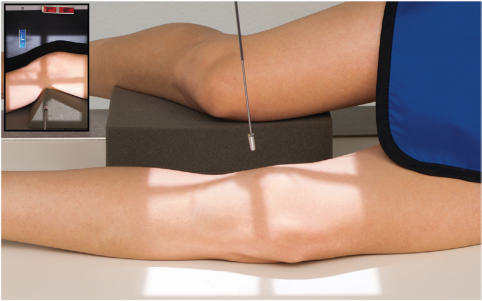
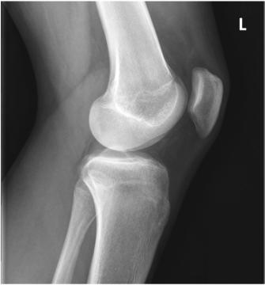
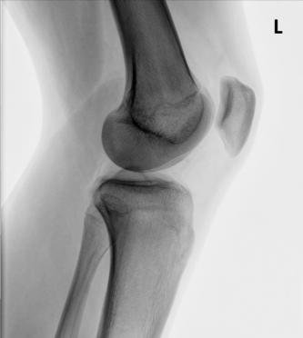

# Rx Medio-Lateral Incidență LATERAL (Genunchi)

  📷 Radiografie Convențională (Rx)
  <strong>Actualizat:</strong> 2026-09-15
  <strong>Autor:</strong> Departamentul de Radiologie / Referință Bontrager

---

-   __1. Rezumat Clinic & Indicații__

    ---

    === "Indicații Clinice"

        - suspiciune de fractură, lesions, și spații articulare abnormalities

    === "Ghid Național IRIS"

        !!! info "Referință Primară: Ghidul Național IRIS (Ordinul MS 1342/2012)"
            - **Capitol Ghid IRIS:** *Ghidul Național IRIS*
            - **Grad de Recomandare:** **De verificat pe indicație; fără grad atribuit automat**
            - **Nivel de Iradiere Estimată:** `De verificat pentru examinarea și populația selectate`

            [:octicons-search-16: Deschide Ghidul IRIS](../../iris.md){ .md-button .md-button--primary } [:material-open-in-new: Aplicația Oficială PWA](https://radiologie-pediatrica.ro/iris/){ .md-button target="_blank" rel="noopener" }
-   __2. Poziționare & Centrare Fascicul__

    ---

    - **Poziție Pacient:** Pacient: This poziție poate fie taken în lateral Decubit poziție sau ca orizontal fascicul lateral. lateral Decubit poziție This incidență este designed pentru pacienți who sunt able la se flectează Genunchi 20° la 30°. Take radiografie cu pacient în lateral Decubit poziție, affected side down; provide pillow pentru pacient’s cap; provide support pentru Genunchi de opposite limb plasat behind Genunchi being examined la prevent overrotation (Fig. 6.112). orizontal fascicul incidență This lateromedial fascicul incidență este ideal pentru pacient who este unable la se flectează Genunchi because de pain sau traumatism acuttism / Regim Urgență. cu pacientul în Decubit ventral poziție, use orizontal fascicul cu receptorul de imagine plasat beside Genunchi. Place support under Genunchi la avoid obscuring posterior părți moi structures (see Fig. 6.112, inset).; Regiune anatomică: Adjust rotație de corp și membru inferior until Genunchi este în true Incidență de Profil (lateral) (femoral epicondyles directly superimposed și plane de Rotulă (Patelă) perpendicular la plane de receptorul de imagine). Flex Genunchi 20° la 30° pentru lateral Decubit incidență (see NOTE 1). Align și center membru inferior și Genunchi la raza centrală și la linia mediană mesei sau receptorul de imagine.
    - **Punct de Centrare Fascicul:** Raza centrală se înclină 5°–7° cranial (spre cap) pentru lateral Decubit incidență (see NOTES 2 și 3). Raza centrală se orientează spre point 1 inch (2.5 cm) distal la epicondil medial (epitrohlee).
    - **Distanță Focar-Film (DFF / SID):** 100 cm
    - **Comandă Respiratorie:** Apnee pe durata expunerii (sau conform cooperării pacientului)

-   __3. Parametri Tehnici Expunere__

    ---

    | Parametru Tehnic | Valoare Configurare Generator / Tub |
    |:-----------------|:-------------------------------------|
    | **Tensiune Tub (kV)** | 65-80 kV |
    | **Sarcină / Produs Curent-Timp (mAs)** | DE CONFIGURAT PE APARAT |
    | **Distanță Focar-Film (DFF / SID)** | 100 cm |
    | **Grilă Antidifuzoare (Bucky)** | Fără grilă (expunere directă) |
    | **Dimensiune Focar** | Focar Mic (0.6 mm) |
    | **Camere de Ionizare AEC** | DE CONFIGURAT PE APARAT |
    | **Colimare Fascicul** | Collimate pe ambele părți (bilateral) la skin margins, cu full collimation la ends la receptorul de imagine margini la include maximum Femur, tibia, și fibula. |
    | **Filtrare Tub** | Totală ≥ 2.5 mm Al echivalent |

-   __4. Criterii de Calitate & Reușită Imagine__

    ---

    - distal Femur, proximal tibia și fibula, și Rotulă (Patelă) sunt vizualizat în lateral profile.
    - Patellofemoral și Genunchi articulații trebuie să fie open (Figs. 6.113 și 6.114). poziție:
    - Overrotation sau underrotation poate fie determined prin identifying adductor tubercle pe medial condyle, if vizibil (see Fig. 6.33), și prin amount de superimposition de cap peronier (fibular) prin tibia (overrotation, less superimposition de cap peronier (fibular); underrotation, more superimposition).
    - True Incidență de Profil (lateral) de Genunchi fără rotație evidențiază posterior margini de femoral condyles directly superimposed.
    - Rotulă (Patelă) trebuie să fie seen în profile cu patellofemoral spații articulare open.
    - 5° la 10° cranial angle de raza centrală trebuie să result în direct superimposition de distal margini de condyles.
    - Genunchi articulație este în center de câmp colimat. expunere:
    - optim receptorul de imagine expunere și contrast cu fără mișcare visualizes important părți moi detail, including fat pad region anterior la Genunchi articulație și net trabecular markings. Fig. 6.113 Mediolateral Genunchi. (Courtesy Joss Wertz, DO.) Superimposed medial și lateral condyles cap peronier (fibular) Fibula Femur Tibia Intercondylar eminence Patellofemoral articulație Fig. 6.114 Mediolateral Genunchi. (Courtesy Joss Wertz, DO.)

-   __5. Protecție Radiologică (ALARA)__

    ---

    - Ecranare gonadică și a organelor radiosensibile conform procedurilor locale de radioprotecție ALARA.
    - Colimare strictă la aria de interes pentru limitarea radiației difuze.
    - Verificarea posibilității unei sarcini la pacientele de vârstă fertilă înainte de expunere.

!!! note "Observații Clinice & Tehnice"
    If Gleznă (Articulație Talocrurală) și Gambă poate fie ridicat la same plane ca axa longitudinală de Femur, perpendicular raza centrală poate fie used. (30) 18 (24) Genunchi ROUTINE AP oblic lateral Fig. 6.112 Mediolateral Genunchi. Inset, Lateromedial—orizontal fascicul.

### 🖼️ Imagini

<figure class="protocol-image-card" markdown>

<figcaption><strong>Fig. 6.112 Mediolateral Genunchi. Inset, Lateromedial—orizontal fascicul.</strong> — Poziționare pacient conform Ghidului Bontrager (Fig. 6.112 Mediolateral genunchi. Inset, Lateromedial—orizontal fascicul.)</figcaption>

</figure>

<figure class="protocol-image-card" markdown>

<figcaption><strong>Fig. 6.113 Mediolateral Genunchi. (Courtesy Joss Wertz, DO.)</strong> — Aspect radiografic de referință conform Ghidului Bontrager (Fig. 6.113 Mediolateral genunchi. (Courtesy Joss Wertz, DO.))</figcaption>

</figure>

<figure class="protocol-image-card" markdown>

<figcaption><strong>Fig. 6.114 Mediolateral Genunchi. (Courtesy Joss Wertz, DO.)</strong> — Aspect radiografic de referință conform Ghidului Bontrager (Fig. 6.114 Mediolateral genunchi. (Courtesy Joss Wertz, DO.))</figcaption>

</figure>

=== "Ghid Rapid de Execuție"

    1. **Identificarea și verificarea pacientului:** verificare identitate, zonă de examinat, consimțământ conform procedurii și evaluarea posibilității unei sarcini, când este relevantă.
    2. **Pregătire:** îndepărtarea oricăror obiecte radiopace (bijuterii, agrafe, fermoare, proteze, pansamente dense).
    3. **Poziționare precisă:** alinierea receptorului de imagine și a tubului la distanța prescrisă (100 cm).
    4. **Colimare strictă:** adaptarea fasciculului strict la regiunea de diagnostic pentru scăderea iradierii și reducerea radiației difuze.
    5. **Radioprotecție:** verificarea [politicii RX](../radioprotectie.md), cu măsuri distincte pentru pacient, personal și însoțitor.

## Surse de documentare

- [Bontrager's Textbook of Radiographic Positioning (Ed. 9/10), Pagina 264](https://www.elsevier.com/books/textbook-of-radiographic-positioning-and-related-anatomy/lampignano/978-0-323-65367-1)
