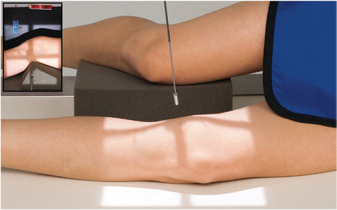
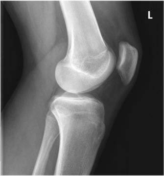
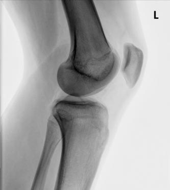

# Rx genunchi — incidență mediolaterală, profil

  📷 Radiografie Convențională (Rx)
  <strong>Actualizat:</strong> 2026-09-15
  <strong>Autor:</strong> Departamentul de Radiologie / Referință Bontrager

---

-   __1. Rezumat Clinic & Indicații__

    ---

    === "Indicații Clinice"

        - Fractură suspectată, leziuni și anomalii ale spațiilor articulare.

    === "Ghid Național IRIS"

        !!! info "Referință Primară: Ghidul Național IRIS (Ordinul MS 1342/2012)"
            - **Capitol Ghid IRIS:** *Aparat locomotor & Membru inferior*
            - **Grad de Recomandare:** **Grad A**
            - **Nivel de Iradiere Estimată:** `Clasa 1 (Minimă < 0.05 mSv)`

            [:octicons-search-16: Deschide Ghidul IRIS](../../iris.md){ .md-button .md-button--primary } [:material-open-in-new: Aplicația Oficială PWA](https://radiologie-pediatrica.ro/iris/){ .md-button target="_blank" rel="noopener" }

-   __2. Poziționare & Centrare Fascicul__

    ---

    - **Poziție Pacient:** Pacient: Această poziție poate fi efectuată în decubit lateral sau ca incidență cu fascicul orizontal. Decubit lateral: această incidență este destinată pacienților care pot flecta genunchiul la 20° până la 30°. Efectuați radiografia cu pacientul în decubit lateral, cu partea afectată în jos; asigurați o pernă pentru capul pacientului; asigurați un suport pentru genunchiul membrului opus, plasat în spatele genunchiului examinat, pentru a preveni rotația excesivă (Fig. 6.112). Incidență cu fascicul orizontal: această incidență lateromedială cu fascicul orizontal este ideală pentru pacientul care nu poate flecta genunchiul din cauza durerii sau a unui traumatism acut / regim de urgență. Cu pacientul în decubit ventral, utilizați un fascicul orizontal, cu receptorul de imagine plasat lângă genunchi. Așezați un suport sub genunchi pentru a evita obscurarea structurilor posterioare ale părților moi (vezi Fig. 6.112, imagine inserată).; Regiune anatomică: Ajustați rotația corpului și a membrului inferior până când genunchiul este în adevărată incidență de profil (laterală) (epicondilii femurali direct suprapuși, iar planul rotulei (patela) perpendicular pe planul receptorului de imagine). Flectați genunchiul la 20° până la 30° pentru incidența în decubit lateral (vezi NOTA 1). Aliniați și centrați membrul inferior și genunchiul față de raza centrală și linia mediană a mesei sau a receptorului de imagine.
    - **Punct de Centrare Fascicul:** Raza centrală se înclină cu 5°–7° cranial (spre cap) pentru incidența de profil în decubit (vezi NOTELE 2 și 3). Raza centrală se orientează spre un punct situat la 1 țol (2.5 cm) distal față de epicondilul medial (epitrohlee).
    - **Distanță Focar-Film (DFF / SID):** 100 cm
    - **Comandă Respiratorie:** Apnee pe durata expunerii (sau conform cooperării pacientului)

-   __3. Parametri Tehnici Expunere__

    ---

    | Parametru Tehnic | Valoare Configurare Generator / Tub |
    |:-----------------|:-------------------------------------|
    | **Tensiune Tub (kV)** | 65-80 kV |
    | **Sarcină / Produs Curent-Timp (mAs)** | DE CONFIGURAT PE APARAT |
    | **Distanță Focar-Film (DFF / SID)** | 100 cm |
    | **Grilă Antidifuzoare (Bucky)** | Fără grilă (expunere directă) |
    | **Dimensiune Focar** | Focar Mic (0.6 mm) |
    | **Camere de Ionizare AEC** | DE CONFIGURAT PE APARAT |
    | **Colimare Fascicul** | Colimați bilateral până la marginile cutanate, cu colimare completă la capetele marginilor receptorului de imagine, pentru a include maximum din femur, tibie și peroneu. |
    | **Filtrare Tub** | Totală ≥ 2.5 mm Al echivalent |

-   __4. Criterii de Calitate & Reușită Imagine__

    ---

    - Femurul distal, tibia și peroneul proximale, precum și rotula (patela) sunt vizualizate în profil lateral.
    - Articulațiile patelofemurală și a genunchiului trebuie să fie deschise (Fig. 6.113 și 6.114). Poziție:
    - Rotația excesivă sau insuficientă poate fi determinată prin identificarea tuberculului adductor de pe condilul medial, dacă este vizibil (vezi Fig. 6.33), și prin gradul de suprapunere a capului peronier prin tibie (rotație excesivă: mai puțină suprapunere a capului peronier; rotație insuficientă: mai multă suprapunere).
    - Adevărata incidență de profil lateral a genunchiului, fără rotație, evidențiază marginile posterioare ale condililor femurali suprapuse direct.
    - Rotula (patela) trebuie să fie vizualizată în profil, cu spațiile articulare patelofemurale deschise.
    - Un unghi cranial de 5° până la 10° al razei centrale trebuie să determine suprapunerea directă a marginilor distale ale condililor.
    - Articulația genunchiului este în centrul câmpului colimat. Expunere:
    - Expunerea și contrastul receptorului de imagine trebuie să fie optime; absența mișcării evidențiază detaliile importante ale părților moi, inclusiv regiunea corpului adipos anterior articulației genunchiului, precum și desenul trabecular fin. Fig. 6.113 Genunchi mediolateral. (Cu amabilitatea lui Joss Wertz, DO.) Condili medial și lateral suprapuși direct. Cap peronier (fibular). Peroneu. Femur. Tibie. Eminență intercondiliană. Articulație patelofemurală. Fig. 6.114 Genunchi mediolateral. (Cu amabilitatea lui Joss Wertz, DO.)

-   __5. Protecție Radiologică (ALARA)__

    ---

    - Ecranare gonadică și a organelor radiosensibile conform procedurilor locale de radioprotecție ALARA.
    - Colimare strictă la aria de interes pentru limitarea radiației difuze.
    - Verificarea posibilității unei sarcini la pacientele de vârstă fertilă înainte de expunere.

!!! note "Observații Clinice & Tehnice"
    Dacă glezna (articulația talocrurală) și gamba pot fi ridicate în același plan cu axa longitudinală a femurului, se poate utiliza o rază centrală perpendiculară. (30) 18 (24) GENUNCHI AP DE RUTINĂ oblic lateral. Fig. 6.112 Genunchi mediolateral. Imagine inserată, lateromedială — fascicul orizontal.

### 🖼️ Imagini

<figure class="protocol-image-card" markdown>

<figcaption><strong>Fig. 6.112 Genunchi mediolateral. Imagine inserată, lateromedială — fascicul orizontal.</strong> — Poziționarea pacientului conform Ghidului Bontrager (Fig. 6.112 Genunchi mediolateral. Imagine inserată, lateromedială — fascicul orizontal.)</figcaption>

</figure>

<figure class="protocol-image-card" markdown>

<figcaption><strong>Fig. 6.113 Genunchi mediolateral. (Cu amabilitatea lui Joss Wertz, DO.)</strong> — Aspect radiografic de referință conform Ghidului Bontrager (Fig. 6.113 Genunchi mediolateral. (Cu amabilitatea lui Joss Wertz, DO.))</figcaption>

</figure>

<figure class="protocol-image-card" markdown>

<figcaption><strong>Fig. 6.114 Genunchi mediolateral. (Cu amabilitatea lui Joss Wertz, DO.)</strong> — Aspect radiografic de referință conform Ghidului Bontrager (Fig. 6.114 Genunchi mediolateral. (Cu amabilitatea lui Joss Wertz, DO.))</figcaption>

</figure>

=== "Ghid Rapid de Execuție"

    1. **Identificarea și verificarea pacientului:** verificare identitate, zonă de examinat, consimțământ conform procedurii și evaluarea posibilității unei sarcini, când este relevantă.
    2. **Pregătire:** îndepărtarea oricăror obiecte radiopace (bijuterii, agrafe, fermoare, proteze, pansamente dense).
    3. **Poziționare precisă:** alinierea receptorului de imagine și a tubului la distanța prescrisă (100 cm).
    4. **Colimare strictă:** adaptarea fasciculului strict la regiunea de diagnostic pentru scăderea iradierii și reducerea radiației difuze.
    5. **Radioprotecție:** verificarea [politicii RX](../radioprotectie.md), cu măsuri distincte pentru pacient, personal și însoțitor.

## Surse de documentare

- [Bontrager's Textbook of Radiographic Positioning (Ed. 9/10), Pagina 264](https://www.elsevier.com/books/textbook-of-radiographic-positioning-and-related-anatomy/lampignano/978-0-323-65367-1)
