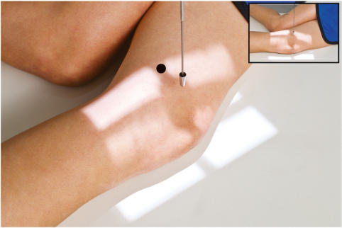
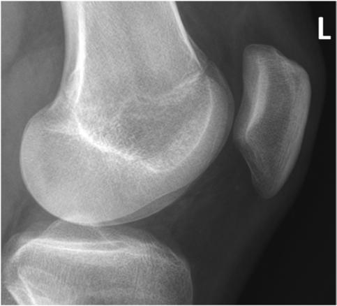

# Rx MEDIOLATERAL PROJECTION LATERAL (Rotulă (Patelă))

  📷 Radiografie Convențională (Rx)
  <strong>Actualizat:</strong> 2026-09-15
  <strong>Autor:</strong> Departamentul de Radiologie / Referință Bontrager

---

-   __1. Rezumat Clinic & Indicații__

    ---

    === "Indicații Clinice"

        - Evaluation of patellar suspiciune de fractură in conjunction with the PA
        - Abnormalities of patellofemoral and femorotibial joints

    === "Ghid Național IRIS"

        !!! info "Referință Primară: Ghidul Național IRIS (Ordinul MS 1342/2012)"
            - **Capitol Ghid IRIS:** *Ghidul Național IRIS*
            - **Grad de Recomandare:** **De verificat pe indicație; fără grad atribuit automat**
            - **Nivel de Iradiere Estimată:** `De verificat pentru examinarea și populația selectate`

            [:octicons-search-16: Deschide Ghidul IRIS](../../iris.md){ .md-button .md-button--primary } [:material-open-in-new: Aplicația Oficială PWA](https://radiologie-pediatrica.ro/iris/){ .md-button target="_blank" rel="noopener" }
-   __2. Poziționare & Centrare Fascicul__

    ---

    - **Poziție Pacient:** Pacient: Place patient in lateral Decubit position, affected side down; provide a pillow for patient’s head; provide support for Genunchi of opposite limb placed behind affected Genunchi.; Regiune anatomică: Adjust rotation of body and leg until Genunchi is in true Incidență de Profil (Lateral) (femoral epicondyles directly superimposed and plane of Rotulă (Patelă) perpendicular to plane of IR). Flex Genunchi only 5° or 10°. (Additional flexion may separate suspiciune de fractură fragments if present.) Align and center long axis of Rotulă (Patelă) to CR and to centerline of table or IR (Fig. 6.132).
    - **Punct de Centrare Fascicul:** is perpendicular to IR. Direct CR to midpatellofemoral joint.
    - **Distanță Focar-Film (DFF / SID):** 100 cm
    - **Comandă Respiratorie:** Apnee pe durata expunerii (sau conform cooperării pacientului)

-   __3. Parametri Tehnici Expunere__

    ---

    | Parametru Tehnic | Valoare Configurare Generator / Tub |
    |:-----------------|:-------------------------------------|
    | **Tensiune Tub (kV)** | 70-80 kV |
    | **Sarcină / Produs Curent-Timp (mAs)** | DE CONFIGURAT PE APARAT |
    | **Distanță Focar-Film (DFF / SID)** | 100 cm |
    | **Grilă Antidifuzoare (Bucky)** | Fără grilă (expunere directă) |
    | **Dimensiune Focar** | Focar Mic (0.6 mm) |
    | **Camere de Ionizare AEC** | DE CONFIGURAT PE APARAT |
    | **Colimare Fascicul** | Collimate closely on four sides to include just the area of the Rotulă (Patelă) and Genunchi joint. |
    | **Filtrare Tub** | Totală ≥ 2.5 mm Al echivalent |

-   __4. Criterii de Calitate & Reușită Imagine__

    ---

    - Profile images of Rotulă (Patelă), patellofemoral joint, and femorotibial joint are demonstrated (Fig. 6.133). Position:
    - True lateral: Anterior and posterior borders of medial and lateral femoral condyles should be directly superimposed, and patellofemoral joint space should appear open.
    - Centering and angulation are correct if Rotulă (Patelă) is in center of the film and collimated field with joint spaces open. Exposure:
    - Optimal image receptor exposure and contrast to visualize soft tissue detail and Rotulă (Patelă) well without overexposure.
    - Trabecular markings of Rotulă (Patelă) and other bones should appear clear and sharp.

-   __5. Protecție Radiologică (ALARA)__

    ---

    - Ecranare gonadică și a organelor radiosensibile conform procedurilor locale de radioprotecție ALARA.
    - Colimare strictă la aria de interes pentru limitarea radiației difuze.
    - Verificarea posibilității unei sarcini la pacientele de vârstă fertilă înainte de expunere.

!!! note "Observații Clinice & Tehnice"
    This also can be taken as a horizontal beam lateral with no Genunchi flexion on a patient with severe traumatism acuttism / Regim Urgență, as described in Chapter 15. Rotulă (Patelă) PA Lateral Tangential Fig. 6.132 Lateral Rotulă (Patelă). Fig. 6.133 Lateral Rotulă (Patelă). (Courtesy Joss Wertz, DO.)

### 🖼️ Imagini

<figure class="protocol-image-card" markdown>

<figcaption><strong>Fig. 6.132 Lateral Rotulă (Patelă).</strong> — Poziționare pacient conform Ghidului Bontrager (Fig. 6.132 Lateral patella.)</figcaption>

</figure>

<figure class="protocol-image-card" markdown>

<figcaption><strong>Fig. 6.133 Lateral Rotulă (Patelă). (Courtesy Joss Wertz, DO.)</strong> — Aspect radiografic de referință conform Ghidului Bontrager (Fig. 6.133 Lateral patella. (Courtesy Joss Wertz, DO.))</figcaption>

</figure>

=== "Ghid Rapid de Execuție"

    1. **Identificarea și verificarea pacientului:** verificare identitate, zonă de examinat, consimțământ conform procedurii și evaluarea posibilității unei sarcini, când este relevantă.
    2. **Pregătire:** îndepărtarea oricăror obiecte radiopace (bijuterii, agrafe, fermoare, proteze, pansamente dense).
    3. **Poziționare precisă:** alinierea receptorului de imagine și a tubului la distanța prescrisă (100 cm).
    4. **Colimare strictă:** adaptarea fasciculului strict la regiunea de diagnostic pentru scăderea iradierii și reducerea radiației difuze.
    5. **Radioprotecție:** verificarea [politicii RX](../radioprotectie.md), cu măsuri distincte pentru pacient, personal și însoțitor.

## Surse de documentare

- [Bontrager's Textbook of Radiographic Positioning (Ed. 9/10), Pagina 272](https://www.elsevier.com/books/textbook-of-radiographic-positioning-and-related-anatomy/lampignano/978-0-323-65367-1)
