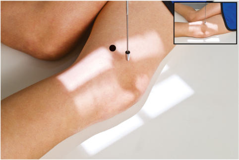
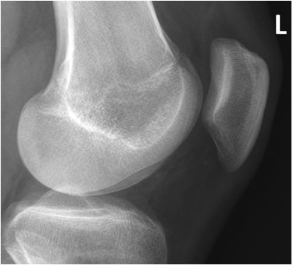

# Rx rotulă (patelă) — incidență mediolaterală, profil

  📷 Radiografie Convențională (Rx)
  <strong>Actualizat:</strong> 2026-09-15
  <strong>Autor:</strong> Departamentul de Radiologie / Referință Bontrager

---

-   __1. Rezumat Clinic & Indicații__

    ---

    === "Indicații Clinice"

        - Evaluarea unei fracturi patelare suspectate împreună cu PA.
        - Anomalii ale articulațiilor patelofemurală și femorotibială.

    === "Ghid Național IRIS"

        !!! info "Referință Primară: Ghidul Național IRIS (Ordinul MS 1342/2012)"
            - **Capitol Ghid IRIS:** *Aparat locomotor & Membru inferior*
            - **Grad de Recomandare:** **Grad A**
            - **Nivel de Iradiere Estimată:** `Clasa 1 (Minimă < 0.05 mSv)`

            [:octicons-search-16: Deschide Ghidul IRIS](../../iris.md){ .md-button .md-button--primary } [:material-open-in-new: Aplicația Oficială PWA](https://radiologie-pediatrica.ro/iris/){ .md-button target="_blank" rel="noopener" }

-   __2. Poziționare & Centrare Fascicul__

    ---

    - **Poziție Pacient:** Pacient: Plasați pacientul în decubit lateral, cu partea afectată în jos; asigurați o pernă pentru capul pacientului; plasați în spatele genunchiului afectat un suport pentru genunchiul membrului opus. Regiune anatomică: Ajustați rotația corpului și a membrului inferior până când genunchiul se află în adevărata incidență de profil (epicondilii femurali suprapuși direct, iar planul rotulei perpendicular pe planul receptorului de imagine). Flectați genunchiul numai la 5° sau 10°. (Flexia suplimentară poate separa fragmentele unei fracturi suspectate, dacă sunt prezente.) Aliniați și centrați axa longitudinală a rotulei la raza centrală și la linia mediană a mesei sau a receptorului de imagine (Fig. 6.132).
    - **Punct de Centrare Fascicul:** Este perpendicular pe receptorul de imagine. Raza centrală se orientează spre articulația patelofemurală mijlocie.
    - **Distanță Focar-Film (DFF / SID):** 100 cm
    - **Comandă Respiratorie:** Apnee pe durata expunerii (sau conform cooperării pacientului)

-   __3. Parametri Tehnici Expunere__

    ---

    | Parametru Tehnic | Valoare Configurare Generator / Tub |
    |:-----------------|:-------------------------------------|
    | **Tensiune Tub (kV)** | 70-80 kV |
    | **Sarcină / Produs Curent-Timp (mAs)** | DE CONFIGURAT PE APARAT |
    | **Distanță Focar-Film (DFF / SID)** | 100 cm |
    | **Grilă Antidifuzoare (Bucky)** | Fără grilă (expunere directă) |
    | **Dimensiune Focar** | Focar Mic (0.6 mm) |
    | **Camere de Ionizare AEC** | DE CONFIGURAT PE APARAT |
    | **Colimare Fascicul** | Colimați strâns pe toate cele patru laturi pentru a include numai regiunea rotulei și a articulației genunchiului. |
    | **Filtrare Tub** | Totală ≥ 2.5 mm Al echivalent |

-   __4. Criterii de Calitate & Reușită Imagine__

    ---

    - Imaginile de profil ale rotulei, articulației patelofemurale și articulației femorotibiale sunt evidențiate (Fig. 6.133). Poziție:
    - Profil adevărat: marginile anterioare și posterioare ale condililor femurali medial și lateral trebuie să fie suprapuse direct, iar spațiile articulare patelofemurale trebuie să apară deschise.
    - Centrarea și angulația sunt corecte dacă rotula se află în centrul filmului radiologic și al câmpului colimat, cu spațiile articulare deschise. Expunere:
    - Expunerea și contrastul receptorului de imagine trebuie să fie optime pentru vizualizarea detaliilor părților moi și a rotulei, fără supraexpunere.
    - Desenul trabecular al rotulei și al celorlalte oase trebuie să apară clar și fin.

-   __5. Protecție Radiologică (ALARA)__

    ---

    - Ecranare gonadică și a organelor radiosensibile conform procedurilor locale de radioprotecție ALARA.
    - Colimare strictă la aria de interes pentru limitarea radiației difuze.
    - Verificarea posibilității unei sarcini la pacientele de vârstă fertilă înainte de expunere.

!!! note "Observații Clinice & Tehnice"
    Aceasta poate fi efectuată și ca incidență de profil cu fascicul orizontal, fără flexia genunchiului, la pacientul cu traumatism acut sever, așa cum este descris în Capitolul 15. Rotulă (patelă) PA, profil, tangențială. Fig. 6.132 Rotulă (patelă), profil. Fig. 6.133 Rotulă (patelă), profil. (Cu amabilitatea lui Joss Wertz, DO.)

### 🖼️ Imagini

<figure class="protocol-image-card" markdown>

<figcaption><strong>Fig. 6.132 Rotulă (patelă), profil.</strong> — Poziționarea pacientului conform Ghidului Bontrager (Fig. 6.132 Rotulă [patelă], profil.)</figcaption>

</figure>

<figure class="protocol-image-card" markdown>

<figcaption><strong>Fig. 6.133 Rotulă (patelă), profil. (Cu amabilitatea lui Joss Wertz, DO.)</strong> — Aspect radiografic de referință conform Ghidului Bontrager (Fig. 6.133 Rotulă [patelă], profil. (Cu amabilitatea lui Joss Wertz, DO.))</figcaption>

</figure>

=== "Ghid Rapid de Execuție"

    1. **Identificarea și verificarea pacientului:** verificare identitate, zonă de examinat, consimțământ conform procedurii și evaluarea posibilității unei sarcini, când este relevantă.
    2. **Pregătire:** îndepărtarea oricăror obiecte radiopace (bijuterii, agrafe, fermoare, proteze, pansamente dense).
    3. **Poziționare precisă:** alinierea receptorului de imagine și a tubului la distanța prescrisă (100 cm).
    4. **Colimare strictă:** adaptarea fasciculului strict la regiunea de diagnostic pentru scăderea iradierii și reducerea radiației difuze.
    5. **Radioprotecție:** verificarea [politicii RX](../radioprotectie.md), cu măsuri distincte pentru pacient, personal și însoțitor.

## Surse de documentare

- [Bontrager's Textbook of Radiographic Positioning (Ed. 9/10), Pagina 272](https://www.elsevier.com/books/textbook-of-radiographic-positioning-and-related-anatomy/lampignano/978-0-323-65367-1)
