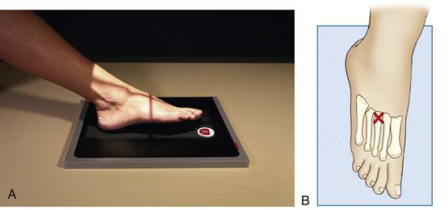
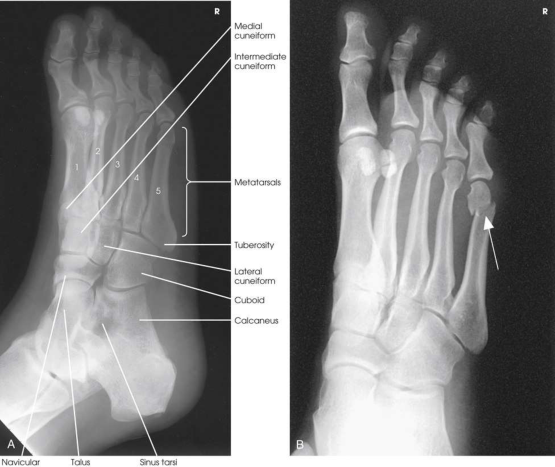

# Rx Picior — A que Incidență — Rotație Internă (Medială) (Merrill)

  📷 Radiografie Convențională (Rx)
  <strong>Actualizat:</strong> 2026-09-16
  <strong>Autor:</strong> Referință Merrill

---

-   __1. Rezumat Clinic & Indicații__

    ---

    === "Indicații Clinice"

        - Conform reperelor anatomice standard din tratat

    === "Ghid Național IRIS"

        !!! info "Referință Primară: Ghidul Național IRIS (Ordinul MS 1342/2012)"
            - **Capitol Ghid IRIS:** *Ghidul Național IRIS*
            - **Grad de Recomandare:** **De verificat pe indicație; fără grad atribuit automat**
            - **Nivel de Iradiere Estimată:** `De verificat pentru examinarea și populația selectate`

            [:octicons-search-16: Deschide Ghidul IRIS](../../iris.md){ .md-button .md-button--primary } [:material-open-in-new: Aplicația Oficială PWA](https://radiologie-pediatrica.ro/iris/){ .md-button target="_blank" rel="noopener" }
-   __2. Poziționare & Centrare Fascicul__

    ---

    - **Poziție Pacient:** se așază pacientul în Decubit dorsal sau Poziție Șezândă poziție. se flectează Genunchi de afected side enough la firmly rest plantar surface de Picior pe masa radiologică.; Place receptorul de imagine under pacientul’s Picior, paralel cu its axa longitudinală, și center it la linia mediană Picior la nivelul base de third metatarsal. se rotește pacient’s membru inferior medially until plantar surface de Picior forms angle de 30 grade la plane de receptorul de imagine (Fig. 7.46). If angle de Picior este increased prin more than 30 grade, lateral cuneiform tends la fie thrown over other cuneiforms. 3 se efectuează ecranarea gonadelor cu șorț plumbat.
    - **Punct de Centrare Fascicul:** perpendicular pe base de third metatarsal.
    - **Distanță Focar-Film (DFF / SID):** Nespecificat în fragmentul extras; de verificat în sursă
    - **Comandă Respiratorie:** Conform reperelor anatomice standard din tratat

-   __3. Parametri Tehnici Expunere__

    ---

    | Parametru Tehnic | Valoare Configurare Generator / Tub |
    |:-----------------|:-------------------------------------|
    | **Tensiune Tub (kV)** | DE CONFIGURAT PE APARAT |
    | **Sarcină / Produs Curent-Timp (mAs)** | DE CONFIGURAT PE APARAT |
    | **Distanță Focar-Film (DFF / SID)** | Nespecificat în fragmentul extras; de verificat în sursă |
    | **Grilă Antidifuzoare (Bucky)** | DE CONFIGURAT PE APARAT |
    | **Dimensiune Focar** | DE CONFIGURAT PE APARAT |
    | **Camere de Ionizare AEC** | DE CONFIGURAT PE APARAT |
    | **Colimare Fascicul** | se ajustează câmp de iradiere la 1 inch (2.5 cm) pe toate sides și 1 inch (2.5 cm) beyond Calcaneu și distal tip de Degete Picior. Se plasează markerul de lateralitate în câmpul colimat. Compensating Filter This incidență poate fie improved cu use de wedge-type compensating filter because de diference în thickness între toe area și much thicker tarsal area. |
    | **Filtrare Tub** | DE CONFIGURAT PE APARAT |

-   __4. Criterii de Calitate & Reușită Imagine__

    ---

    - Criterii radiologice de calitate imaginii:
    - Evidence de corect collimation și presence de marker de lateralitate (D/S) plasat clear de anatomy de interest
    - Entire Picior, de la Degete Picior la heel
    - corect rotație de Picior
    - Third through fifth oase metatarsiene liber de superimposition
    - Bases de first și second oase metatarsiene superimposed pe medial și intermediate cuneiforms
    - Navicular, lateral cuneiform, și cuboid cu less superimposition than în Incidență Antero-Posterioară (AP)
    - Tuberosity de fifth metatarsal
    - lateral tarsometatarsal și intertarsal articulații
    - Sinus tarsi
    - Bony detalii trabeculare osoase și surrounding soft tissues

-   __5. Protecție Radiologică (ALARA)__

    ---

    - Nespecificat în fragmentul extras; de verificat în sursă

!!! note "Observații Clinice & Tehnice"
    medial oblic este preferred over lateral oblic because plane through oase metatarsiene este more paralel cu receptorul de imagine (RI), și it opens better lateral side articulații de midfoot și hindfoot.

### 🖼️ Imagini

<figure class="protocol-image-card" markdown>

<figcaption><strong>Merrill — pagina PDF 485, imaginea 1</strong> — Imagine din fragmentul sursă; asocierea necesită revizie.</figcaption>

</figure>

<figure class="protocol-image-card" markdown>

<figcaption><strong>Merrill — pagina PDF 486, imaginea 2</strong> — Imagine din fragmentul sursă; asocierea necesită revizie.</figcaption>

</figure>

=== "Ghid Rapid de Execuție"

    1. **Identificarea și verificarea pacientului:** verificare identitate, zonă de examinat, consimțământ conform procedurii și evaluarea posibilității unei sarcini, când este relevantă.
    2. **Pregătire:** îndepărtarea oricăror obiecte radiopace (bijuterii, agrafe, fermoare, proteze, pansamente dense).
    3. **Poziționare precisă:** alinierea receptorului de imagine și a tubului la distanța prescrisă (Nespecificat în fragmentul extras; de verificat în sursă).
    4. **Colimare strictă:** adaptarea fasciculului strict la regiunea de diagnostic pentru scăderea iradierii și reducerea radiației difuze.
    5. **Radioprotecție:** verificarea [politicii RX](../radioprotectie.md), cu măsuri distincte pentru pacient, personal și însoțitor.

## Surse de documentare

- [Merrill’s Atlas, 7. Lower Extremity, pagini PDF 484–486](../../assets/protocols/sources/a56d45c16829_Merrills_Atlas_of_Radiographic_Positioning__Procedures_3Vol_Set.pdf#page=484)

## Fragmente sursă traduse (referință tehnică)

### anatomy

spații articulare între following: cuboid și calcaneu; cuboid și fourth și fifth oase metatarsiene; cuboid și lateral
cuneiform; și astragal (talus) și navicular bone. cuboid este vizualizat în profile. sinus tarsi este also well vizualizat (Fig. 7.47A).

### collimation

• se ajustează câmp de iradiere la 1 inch (2.5 cm) pe toate sides și 1 inch (2.5 cm) beyond calcaneu și distal tip de toes. Place side
marker în collimated expunere field.
Compensating Filter
This incidență poate fie improved cu use de wedge-type compensating filter because de diference în thickness între toe area și
much thicker tarsal area.

### cr

• perpendicular pe base de third metatarsal.

### criteria

Criterii radiologice de calitate imaginii:
• Evidence de corect collimation și presence de marker de lateralitate (D/S) plasat clear de anatomy de interest
• Entire picior, de la toes la heel
• corect rotație de picior
• Third through fifth oase metatarsiene liber de superimposition
• Bases de first și second oase metatarsiene superimposed pe medial și intermediate cuneiforms
• Navicular, lateral cuneiform, și cuboid cu less superimposition than în AP incidență
• Tuberosity de fifth metatarsal
• lateral tarsometatarsal și intertarsal articulații
• Sinus tarsi
• Bony detalii trabeculare osoase și surrounding soft tissues

### notes

medial oblic este preferred over lateral oblic because plane through oase metatarsiene este more paralel cu receptorul de imagine (RI), și it
opens better lateral side articulații de midfoot și hindfoot.

### part_pos

• Place receptorul de imagine under pacientul’s picior, paralel cu its axa longitudinală, și center it la linia mediană picior la nivelul base de third metatarsal.
• se rotește pacient’s membru inferior medially until plantar surface de picior forms angle de 30 grade la plane de receptorul de imagine (Fig. 7.46). If
angle de picior este increased prin more than 30 grade, lateral cuneiform tends la fie thrown over other cuneiforms. 3
• se efectuează ecranarea gonadelor cu șorț plumbat.

### patient_pos

• se așază pacientul în decubit dorsal sau așezat pe scaun poziție.
• se flectează genunchi de afected side enough la firmly rest plantar surface de picior pe masa radiologică.

### tech

poziționat prin manufacturer sau department protocol pentru corect anatomy display orientation; raza centrală plate: 10 × 12 inches (24 × 30 cm) longitudinal.

