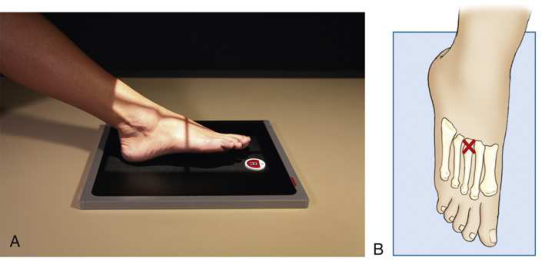
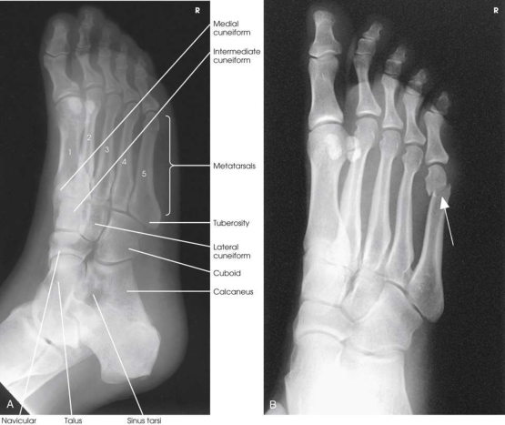

# Rx picior — o incidență — rotație internă (medială) (Merrill)

  📷 Radiografie Convențională (Rx)
  <strong>Actualizat:</strong> 2026-09-16
  <strong>Autor:</strong> Referință Merrill

---

-   __1. Rezumat Clinic & Indicații__

    ---

    === "Indicații Clinice"

        - Conform reperelor anatomice standard din tratat

    === "Ghid Național IRIS"

        !!! info "Referință Primară: Ghidul Național IRIS (Ordinul MS 1342/2012)"
            - **Capitol Ghid IRIS:** *Aparat locomotor & Membru inferior*
            - **Grad de Recomandare:** **Grad A**
            - **Nivel de Iradiere Estimată:** `Clasa 1 (Minimă < 0.01 mSv)`

            [:octicons-search-16: Deschide Ghidul IRIS](../../iris.md){ .md-button .md-button--primary } [:material-open-in-new: Aplicația Oficială PWA](https://radiologie-pediatrica.ro/iris/){ .md-button target="_blank" rel="noopener" }

-   __2. Poziționare & Centrare Fascicul__

    ---

    - **Poziție Pacient:** Așezați pacientul în decubit dorsal sau în poziție șezândă. Flectați genunchiul de pe partea afectată suficient pentru ca suprafața plantară a piciorului să se sprijine ferm pe masa radiologică. Plasați receptorul de imagine sub piciorul pacientului, paralel cu axa sa longitudinală, și centrați-l pe linia mediană a piciorului la nivelul bazei celui de-al treilea metatarsian. Rotiți medial membrul inferior al pacientului până când suprafața plantară a piciorului formează un unghi de 30 grade cu planul receptorului de imagine (Fig. 7.46). Dacă unghiul piciorului este mărit cu mai mult de 30 grade, cuneiformul lateral tinde să se suprapună peste celelalte cuneiforme. 3 Se efectuează ecranarea gonadelor cu șorț plumbat.
    - **Punct de Centrare Fascicul:** Perpendicular pe baza celui de-al treilea metatarsian.
    - **Distanță Focar-Film (DFF / SID):** Nespecificat în fragmentul extras; de verificat în sursă
    - **Comandă Respiratorie:** Conform reperelor anatomice standard din tratat

-   __3. Parametri Tehnici Expunere__

    ---

    | Parametru Tehnic | Valoare Configurare Generator / Tub |
    |:-----------------|:-------------------------------------|
    | **Tensiune Tub (kV)** | DE CONFIGURAT PE APARAT |
    | **Sarcină / Produs Curent-Timp (mAs)** | DE CONFIGURAT PE APARAT |
    | **Distanță Focar-Film (DFF / SID)** | Nespecificat în fragmentul extras; de verificat în sursă |
    | **Grilă Antidifuzoare (Bucky)** | DE CONFIGURAT PE APARAT |
    | **Dimensiune Focar** | DE CONFIGURAT PE APARAT |
    | **Camere de Ionizare AEC** | DE CONFIGURAT PE APARAT |
    | **Colimare Fascicul** | Se ajustează câmpul de iradiere la 1 țol (2.5 cm) pe toate laturile și la 1 țol (2.5 cm) dincolo de calcaneu și de vârful distal al degetelor piciorului. Se plasează markerul de lateralitate în câmpul colimat. Filtru compensator: această incidență poate fi îmbunătățită prin utilizarea unui filtru compensator de tip pană, din cauza diferenței de grosime dintre regiunea degetelor și regiunea tarsiană mult mai groasă. |
    | **Filtrare Tub** | DE CONFIGURAT PE APARAT |

-   __4. Criterii de Calitate & Reușită Imagine__

    ---

    - Criterii radiologice de calitate a imaginii:
    - Evidențierea colimării corecte și prezența markerului de lateralitate (D/S), plasat fără a se suprapune peste anatomia de interes
    - Întregul picior, de la degete până la călcâi
    - Rotația corectă a piciorului
    - Oasele metatarsiene al treilea până la al cincilea, fără suprapunere
    - Bazele primelor două oase metatarsiene suprapuse peste cuneiformele medial și intermediar
    - Navicularul, cuneiformul lateral și cuboidul cu mai puțină suprapunere decât în incidența anteroposterioară (AP)
    - Tuberozitatea celui de-al cincilea metatarsian
    - Articulațiile tarsometatarsiene și intertarsiene laterale
    - Sinus tarsi
    - Detalii trabeculare osoase și țesuturile moi înconjurătoare

-   __5. Protecție Radiologică (ALARA)__

    ---

    - Nespecificat în fragmentul extras; de verificat în sursă

!!! note "Observații Clinice & Tehnice"
    Incidența oblică medială este preferată celei oblice laterale, deoarece planul prin oasele metatarsiene este mai paralel cu receptorul de imagine (RI) și deschide mai bine articulațiile de pe partea laterală a mediopiciorului și retropiciorului.

### 🖼️ Imagini

<figure class="protocol-image-card" markdown>

<figcaption><strong>Merrill — pagina 485, imaginea 1</strong> — Imagine din fragmentul sursă; asocierea necesită revizie.</figcaption>

</figure>

<figure class="protocol-image-card" markdown>

<figcaption><strong>Merrill — pagina 486, imaginea 2</strong> — Imagine din fragmentul sursă; asocierea necesită revizie.</figcaption>

</figure>

=== "Ghid Rapid de Execuție"

    1. **Identificarea și verificarea pacientului:** verificare identitate, zonă de examinat, consimțământ conform procedurii și evaluarea posibilității unei sarcini, când este relevantă.
    2. **Pregătire:** îndepărtarea oricăror obiecte radiopace (bijuterii, agrafe, fermoare, proteze, pansamente dense).
    3. **Poziționare precisă:** alinierea receptorului de imagine și a tubului la distanța prescrisă (Nespecificat în fragmentul extras; de verificat în sursă).
    4. **Colimare strictă:** adaptarea fasciculului strict la regiunea de diagnostic pentru scăderea iradierii și reducerea radiației difuze.
    5. **Radioprotecție:** verificarea [politicii RX](../radioprotectie.md), cu măsuri distincte pentru pacient, personal și însoțitor.

## Surse de documentare

- [Merrill’s Atlas, 7. Lower Extremity, pagini 484–486](https://books.google.com/books/about/Merrill_s_Atlas_of_Radiographic_Position.html?id=BM0lEQAAQBAJ)
