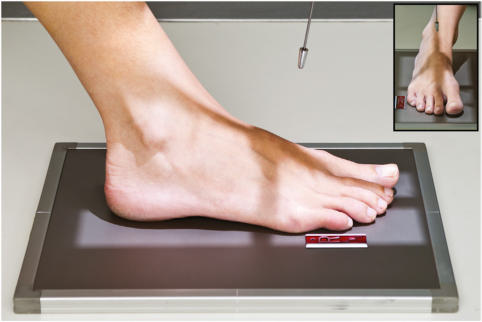
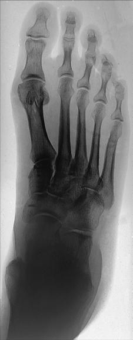
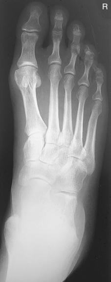

# Rx Picior AP (Antero-Posterior) (DORSOPLANTAR PROJECTION)

  📷 Radiografie Convențională (Rx)
  <strong>Actualizat:</strong> 2026-09-15
  <strong>Autor:</strong> Departamentul de Radiologie / Referință Bontrager

---

-   __1. Rezumat Clinic & Indicații__

    ---

    === "Indicații Clinice"

        - Location and extent of suspiciune de fractură and fragment alignments, joint space abnormalities, soft tissue effusions
        - Location of opaque foreign bodies

    === "Ghid Național IRIS"

        !!! info "Referință Primară: Ghidul Național IRIS (Ordinul MS 1342/2012)"
            - **Capitol Ghid IRIS:** *Ghidul Național IRIS*
            - **Grad de Recomandare:** **De verificat pe indicație; fără grad atribuit automat**
            - **Nivel de Iradiere Estimată:** `De verificat pentru examinarea și populația selectate`

            [:octicons-search-16: Deschide Ghidul IRIS](../../iris.md){ .md-button .md-button--primary } [:material-open-in-new: Aplicația Oficială PWA](https://radiologie-pediatrica.ro/iris/){ .md-button target="_blank" rel="noopener" }
-   __2. Poziționare & Centrare Fascicul__

    ---

    - **Poziție Pacient:** Pacient: Place patient Decubit Dorsal; provide a pillow for patient’s head; flex Genunchi and place plantar surface (sole) of affected Picior flat on IR.; Regiune anatomică: Extend (plantar flex) Picior but maintain plantar surface resting flat and firmly on IR (Fig. 6.56). Align and center long axis of Picior to CR and to long axis of portion of IR being exposed. (Use sandbags if necessary to prevent IR from slipping on tabletop.) If immobilization is needed, flex opposite Genunchi also and rest against affected Genunchi for support.
    - **Punct de Centrare Fascicul:** Angle CR 10° posteriorly (toward heel) with Raza centrală perpendiculară to metatarsals (see NoTe). Direct CR to base of third metatarsal.
    - **Distanță Focar-Film (DFF / SID):** 100 cm
    - **Comandă Respiratorie:** Apnee pe durata expunerii (sau conform cooperării pacientului)

-   __3. Parametri Tehnici Expunere__

    ---

    | Parametru Tehnic | Valoare Configurare Generator / Tub |
    |:-----------------|:-------------------------------------|
    | **Tensiune Tub (kV)** | 55-65 kV |
    | **Sarcină / Produs Curent-Timp (mAs)** | DE CONFIGURAT PE APARAT |
    | **Distanță Focar-Film (DFF / SID)** | 100 cm |
    | **Grilă Antidifuzoare (Bucky)** | Fără grilă (expunere directă) |
    | **Dimensiune Focar** | Focar Mic (0.6 mm) |
    | **Camere de Ionizare AEC** | DE CONFIGURAT PE APARAT |
    | **Colimare Fascicul** | Collimate to outer margins of Picior on four sides. |
    | **Filtrare Tub** | Totală ≥ 2.5 mm Al echivalent |

-   __4. Criterii de Calitate & Reușită Imagine__

    ---

    - Entire Picior should be demonstrated, including all phalanges and metatarsals and navicular, cuneiforms, and cuboids (Figs. 6.57 and 6.58). Position:
    - Long axis of Picior should be aligned to long axis of portion of IR being exposed.
    - Absența rotației anatomice: clavicule echidistante față de linia apofizelor spinoase as evidenced by nearly equal distance between second through fifth metatarsals.
    - Bases of first and second metatarsals generally are separated, but bases of second to fifth metatarsals appear to overlap.
    - Intertarsal joint space between first and second cuneiforms should be demonstrated.
    - Collimation to area of interest. Exposure:
    - Optimal image receptor exposure and contrast with no motion should visualize sharp borders and trabecular markings of distal phalanges and tarsals distal to talus.
    - Higher kVp technique used for more uniform densities between phalanges and tarsals.
    - Sesamoid bones (if present) should be seen through head of first metatarsal. Fig. 6.57 AP Picior. Navicular Cuboid Cuneiforms Base of 3rd metatarsal (CR) Metatarsals MTP joint Sesamoid bones Phalanges IP joints Sesamoid bones IP joints R Fig. 6.58 AP Picior.

-   __5. Protecție Radiologică (ALARA)__

    ---

    - Ecranare gonadică și a organelor radiosensibile conform procedurilor locale de radioprotecție ALARA.
    - Colimare strictă la aria de interes pentru limitarea radiației difuze.
    - Verificarea posibilității unei sarcini la pacientele de vârstă fertilă înainte de expunere.

!!! note "Observații Clinice & Tehnice"
    A high arch requires a greater angle (15°) and a low arch nearer 5° to be perpendicular to the metatarsals. For a prezență corp străin radiopac, CR should be perpendicular to IR with no CR angle. Picior ROUTINE AP Oblique Lateral Fig. 6.56 AP Picior—CR 10°.

### 🖼️ Imagini

<figure class="protocol-image-card" markdown>

<figcaption><strong>Fig. 6.56 AP Picior—CR 10°.</strong> — Poziționare pacient conform Ghidului Bontrager (Fig. 6.56 AP foot—CR 10°.)</figcaption>

</figure>

<figure class="protocol-image-card" markdown>

<figcaption><strong>Fig. 6.57 AP Picior.</strong> — Aspect radiografic de referință conform Ghidului Bontrager (Fig. 6.57 AP foot.)</figcaption>

</figure>

<figure class="protocol-image-card" markdown>

<figcaption><strong>Fig. 6.58 AP Picior.</strong> — Aspect radiografic de referință conform Ghidului Bontrager (Fig. 6.58 AP foot.)</figcaption>

</figure>

=== "Ghid Rapid de Execuție"

    1. **Identificarea și verificarea pacientului:** verificare identitate, zonă de examinat, consimțământ conform procedurii și evaluarea posibilității unei sarcini, când este relevantă.
    2. **Pregătire:** îndepărtarea oricăror obiecte radiopace (bijuterii, agrafe, fermoare, proteze, pansamente dense).
    3. **Poziționare precisă:** alinierea receptorului de imagine și a tubului la distanța prescrisă (100 cm).
    4. **Colimare strictă:** adaptarea fasciculului strict la regiunea de diagnostic pentru scăderea iradierii și reducerea radiației difuze.
    5. **Radioprotecție:** verificarea [politicii RX](../radioprotectie.md), cu măsuri distincte pentru pacient, personal și însoțitor.

## Surse de documentare

- [Bontrager's Textbook of Radiographic Positioning (Ed. 9/10), Pagina 246](https://www.elsevier.com/books/textbook-of-radiographic-positioning-and-related-anatomy/lampignano/978-0-323-65367-1)
