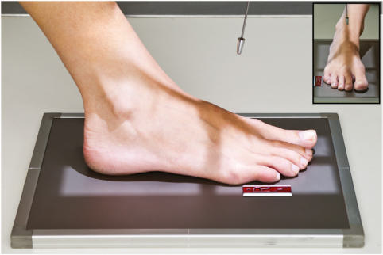
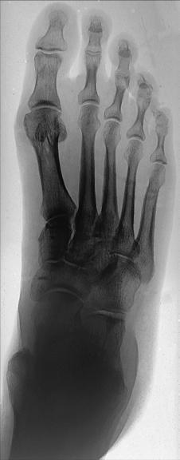
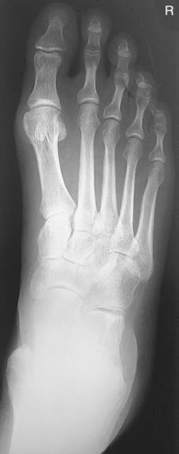

# Rx picior AP (anteroposterior) (incidență dorsoplantară)

  📷 Radiografie Convențională (Rx)
  <strong>Actualizat:</strong> 2026-09-15
  <strong>Autor:</strong> Departamentul de Radiologie / Referință Bontrager

---

-   __1. Rezumat Clinic & Indicații__

    ---

    === "Indicații Clinice"

        - Localizarea și extinderea suspiciunii de fractură și alinierea fragmentelor, anomalii ale spațiilor articulare, revărsate ale părților moi
        - Localizarea corpului străin/corpurilor străine radio-opace

    === "Ghid Național IRIS"

        !!! info "Referință Primară: Ghidul Național IRIS (Ordinul MS 1342/2012)"
            - **Capitol Ghid IRIS:** *Aparat locomotor & Membru inferior*
            - **Grad de Recomandare:** **Grad A**
            - **Nivel de Iradiere Estimată:** `Clasa 1 (Minimă < 0.01 mSv)`

            [:octicons-search-16: Deschide Ghidul IRIS](../../iris.md){ .md-button .md-button--primary } [:material-open-in-new: Aplicația Oficială PWA](https://radiologie-pediatrica.ro/iris/){ .md-button target="_blank" rel="noopener" }

-   __2. Poziționare & Centrare Fascicul__

    ---

    - **Poziție Pacient:** Pacient: Se așază pacientul în decubit dorsal; se pune o pernă sub capul pacientului; se flectează genunchiul și se așază suprafața plantară (talpa) a piciorului afectat, plat, pe receptorul de imagine. Regiune anatomică: Se extinde (flexie plantară) piciorul, menținând însă suprafața plantară sprijinită plat și ferm pe receptorul de imagine (Fig. 6.56). Se aliniază și se centrează axa longitudinală a piciorului față de raza centrală și față de axa longitudinală a porțiunii receptorului de imagine expuse. (Se utilizează săculeți cu nisip, dacă este necesar, pentru a preveni alunecarea receptorului de imagine pe masa radiologică.) Dacă este necesară imobilizarea, se flectează și genunchiul opus și se sprijină de genunchiul afectat pentru susținere.
    - **Punct de Centrare Fascicul:** Unghiul razei centrale: 10° posterior (spre călcâi), cu raza centrală perpendiculară pe oasele metatarsiene (vezi nota). Raza centrală se orientează spre baza celui de-al treilea metatarsian.
    - **Distanță Focar-Film (DFF / SID):** 100 cm
    - **Comandă Respiratorie:** Apnee pe durata expunerii (sau conform cooperării pacientului)

-   __3. Parametri Tehnici Expunere__

    ---

    | Parametru Tehnic | Valoare Configurare Generator / Tub |
    |:-----------------|:-------------------------------------|
    | **Tensiune Tub (kV)** | 55-65 kV |
    | **Sarcină / Produs Curent-Timp (mAs)** | DE CONFIGURAT PE APARAT |
    | **Distanță Focar-Film (DFF / SID)** | 100 cm |
    | **Grilă Antidifuzoare (Bucky)** | Fără grilă (expunere directă) |
    | **Dimensiune Focar** | Focar Mic (0.6 mm) |
    | **Camere de Ionizare AEC** | DE CONFIGURAT PE APARAT |
    | **Colimare Fascicul** | Se colimează la marginile externe ale piciorului pe cele patru laturi. |
    | **Filtrare Tub** | Totală ≥ 2.5 mm Al echivalent |

-   __4. Criterii de Calitate & Reușită Imagine__

    ---

    - Trebuie evidențiat întregul picior, inclusiv toate falangele și oasele metatarsiene, navicularul, cuneiformele și cuboidele (Figs. 6.57 și 6.58). Poziție:
    - Axa longitudinală a piciorului trebuie aliniată cu axa longitudinală a porțiunii receptorului de imagine expuse.
    - Absența rotației anatomice: claviculele echidistante față de linia apofizelor spinoase, evidențiată prin distanțe aproape egale între al doilea și al cincilea oase metatarsiene.
    - Bazele primului și celui de-al doilea oase metatarsiene sunt, în general, separate, dar bazele celui de-al doilea până la al cincilea os metatarsian par suprapuse.
    - Spațiile articulare intertarsiene dintre primul și al doilea cuneiform trebuie evidențiate.
    - Colimare la aria de interes diagnostic. Expunere:
    - Expunerea optimă a receptorului de imagine și contrastul, fără mișcare, trebuie să evidențieze clar marginile și desenul trabecular al falangelor distale și al oaselor tarsiene distal față de astragal (talus).
    - Se utilizează o tehnică cu kVp mai mare pentru densități mai uniforme între falange și oasele tarsiene.
    - Oasele sesamoide (dacă sunt prezente) trebuie vizualizate prin capul primului metatarsian. Fig. 6.57 AP picior. Navicular. Cuboid. Cuneiforme. Baza celui de-al 3-lea metatarsian (raza centrală). Oase metatarsiene. Articulații metatarsofalangiene (MTF). Oase sesamoide. Falange. Articulații interfalangiene (IF). Oase sesamoide. Articulații interfalangiene (IF). R. Fig. 6.58 AP picior.

-   __5. Protecție Radiologică (ALARA)__

    ---

    - Ecranare gonadică și a organelor radiosensibile conform procedurilor locale de radioprotecție ALARA.
    - Colimare strictă la aria de interes pentru limitarea radiației difuze.
    - Verificarea posibilității unei sarcini la pacientele de vârstă fertilă înainte de expunere.

!!! note "Observații Clinice & Tehnice"
    Bolta înaltă necesită un unghi mai mare (15°), iar bolta joasă unul mai apropiat de 5°, pentru a fi perpendicular pe oasele metatarsiene. Pentru evidențierea unui corp străin radiopac, raza centrală trebuie să fie perpendiculară pe receptorul de imagine, fără angulația razei centrale. Picior, AP de rutină, oblică laterală. Fig. 6.56 AP picior — raza centrală 10°.

### 🖼️ Imagini

<figure class="protocol-image-card" markdown>

<figcaption><strong>Fig. 6.56 AP picior — raza centrală 10°.</strong> — Poziționarea pacientului conform Ghidului Bontrager (Fig. 6.56 AP picior — raza centrală 10°.)</figcaption>

</figure>

<figure class="protocol-image-card" markdown>

<figcaption><strong>Fig. 6.57 AP picior.</strong> — Aspect radiografic de referință conform Ghidului Bontrager (Fig. 6.57 AP picior.)</figcaption>

</figure>

<figure class="protocol-image-card" markdown>

<figcaption><strong>Fig. 6.58 AP picior.</strong> — Aspect radiografic de referință conform Ghidului Bontrager (Fig. 6.58 AP picior.)</figcaption>

</figure>

=== "Ghid Rapid de Execuție"

    1. **Identificarea și verificarea pacientului:** verificare identitate, zonă de examinat, consimțământ conform procedurii și evaluarea posibilității unei sarcini, când este relevantă.
    2. **Pregătire:** îndepărtarea oricăror obiecte radiopace (bijuterii, agrafe, fermoare, proteze, pansamente dense).
    3. **Poziționare precisă:** alinierea receptorului de imagine și a tubului la distanța prescrisă (100 cm).
    4. **Colimare strictă:** adaptarea fasciculului strict la regiunea de diagnostic pentru scăderea iradierii și reducerea radiației difuze.
    5. **Radioprotecție:** verificarea [politicii RX](../radioprotectie.md), cu măsuri distincte pentru pacient, personal și însoțitor.

## Surse de documentare

- [Bontrager's Textbook of Radiographic Positioning (Ed. 9/10), Pagina 246](https://www.elsevier.com/books/textbook-of-radiographic-positioning-and-related-anatomy/lampignano/978-0-323-65367-1)
