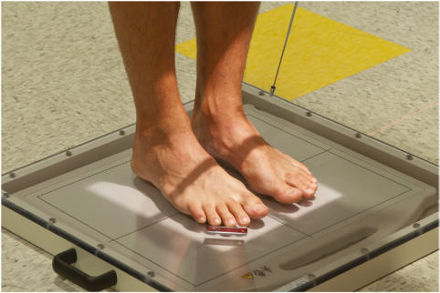
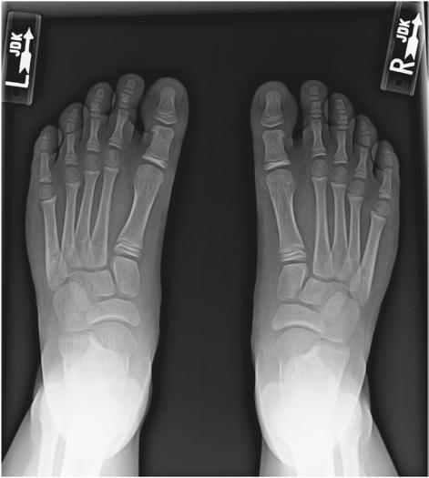

# Rx Picior AP În Încărcare (Ortostatism) PROJECTIONS

  📷 Radiografie Convențională (Rx)
  <strong>Actualizat:</strong> 2026-09-15
  <strong>Autor:</strong> Departamentul de Radiologie / Referință Bontrager

---

-   __1. Rezumat Clinic & Indicații__

    ---

    === "Indicații Clinice"

        - Demonstrate the bones of the feet to show the condition of the longitudinal arches under the full weight of the body
        - May demonstrate injury to structural ligaments of the Picior such as a Lisfranc joint injury

    === "Ghid Național IRIS"

        !!! info "Referință Primară: Ghidul Național IRIS (Ordinul MS 1342/2012)"
            - **Capitol Ghid IRIS:** *Ghidul Național IRIS*
            - **Grad de Recomandare:** **De verificat pe indicație; fără grad atribuit automat**
            - **Nivel de Iradiere Estimată:** `De verificat pentru examinarea și populația selectate`

            [:octicons-search-16: Deschide Ghidul IRIS](../../iris.md){ .md-button .md-button--primary } [:material-open-in-new: Aplicația Oficială PWA](https://radiologie-pediatrica.ro/iris/){ .md-button target="_blank" rel="noopener" }
-   __2. Poziționare & Centrare Fascicul__

    ---

    - **Poziție Pacient:** Pacient: AP Place patient Ortostatism, with full weight evenly distributed on both feet. Feet should be directed straight ahead, parallel to each other (Fig. 6.67).
    - **Punct de Centrare Fascicul:** Angle CR 15° posteriorly to midpoint between feet at level of base of metatarsals.
    - **Distanță Focar-Film (DFF / SID):** 100 cm
    - **Comandă Respiratorie:** Apnee pe durata expunerii (sau conform cooperării pacientului)

-   __3. Parametri Tehnici Expunere__

    ---

    | Parametru Tehnic | Valoare Configurare Generator / Tub |
    |:-----------------|:-------------------------------------|
    | **Tensiune Tub (kV)** | 60-70 kV |
    | **Sarcină / Produs Curent-Timp (mAs)** | DE CONFIGURAT PE APARAT |
    | **Distanță Focar-Film (DFF / SID)** | 100 cm |
    | **Grilă Antidifuzoare (Bucky)** | Fără grilă (expunere directă) |
    | **Dimensiune Focar** | Focar Mic (0.6 mm) |
    | **Camere de Ionizare AEC** | DE CONFIGURAT PE APARAT |
    | **Colimare Fascicul** | Collimate to outer skin margins of the feet. AP both feet Picior SPECIAL AP and lateral (weightbearing) Fig. 6.67 AP—bilateral feet (projection taken on digital IR). |
    | **Filtrare Tub** | Totală ≥ 2.5 mm Al echivalent |

-   __4. Criterii de Calitate & Reușită Imagine__

    ---

    - For AP, projection shows bilateral feet from soft tissue surrounding phalanges to distal portion of talus (Fig. 6.68). Position:
    - For AP, proper angulation is demonstrated by open tarsometatarsal joint spaces and visualization of joint between first and second cuneiforms.
    - Metatarsal bases should be at center of the collimated field (CR) with foursided collimation, including the soft tissue surrounding the feet. Exposure:
    - Optimal image receptor exposure and contrast to visualize soft tissue and bony borders of superimposed tarsals and metatarsals.
    - Adequate penetration of midfoot region.
    - Bony trabecular markings should be sharp. Fig. 6.68 AP weightbearing—bilateral feet. (Courtesy Joss Wertz, DO.)

-   __5. Protecție Radiologică (ALARA)__

    ---

    - Ecranare gonadică și a organelor radiosensibile conform procedurilor locale de radioprotecție ALARA.
    - Colimare strictă la aria de interes pentru limitarea radiației difuze.
    - Verificarea posibilității unei sarcini la pacientele de vârstă fertilă înainte de expunere.

!!! note "Observații Clinice & Tehnice"
    Bilateral projections of both feet often are taken for comparison. Some AP routines include separate projections of each Picior taken with CR centered to individual Picior.

### 🖼️ Imagini

<figure class="protocol-image-card" markdown>

<figcaption><strong>Fig. 6.67 AP—bilateral feet (projection taken on digital IR).</strong> — Poziționare pacient conform Ghidului Bontrager (Fig. 6.67 AP—bilateral feet (projection taken on digital IR).)</figcaption>

</figure>

<figure class="protocol-image-card" markdown>

<figcaption><strong>Fig. 6.68 AP weight-</strong> — Aspect radiografic de referință conform Ghidului Bontrager (Fig. 6.68 AP weight-)</figcaption>

</figure>

=== "Ghid Rapid de Execuție"

    1. **Identificarea și verificarea pacientului:** verificare identitate, zonă de examinat, consimțământ conform procedurii și evaluarea posibilității unei sarcini, când este relevantă.
    2. **Pregătire:** îndepărtarea oricăror obiecte radiopace (bijuterii, agrafe, fermoare, proteze, pansamente dense).
    3. **Poziționare precisă:** alinierea receptorului de imagine și a tubului la distanța prescrisă (100 cm).
    4. **Colimare strictă:** adaptarea fasciculului strict la regiunea de diagnostic pentru scăderea iradierii și reducerea radiației difuze.
    5. **Radioprotecție:** verificarea [politicii RX](../radioprotectie.md), cu măsuri distincte pentru pacient, personal și însoțitor.

## Surse de documentare

- [Bontrager's Textbook of Radiographic Positioning (Ed. 9/10), Pagina 249](https://www.elsevier.com/books/textbook-of-radiographic-positioning-and-related-anatomy/lampignano/978-0-323-65367-1)
