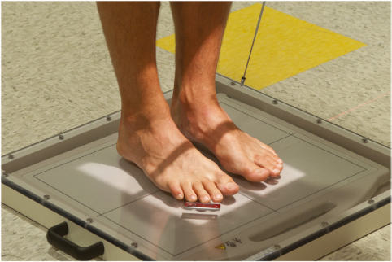
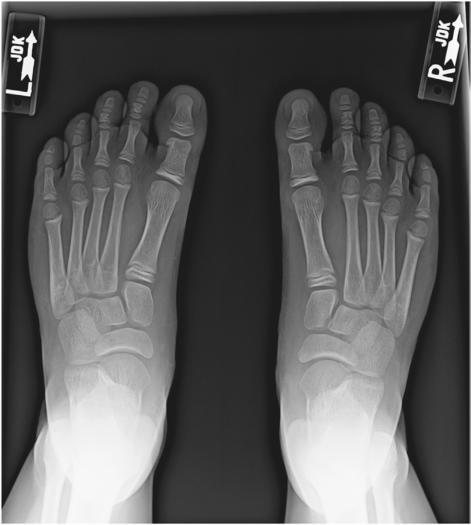

# Rx picior AP în încărcare (ortostatism)

  📷 Radiografie Convențională (Rx)
  <strong>Actualizat:</strong> 2026-09-15
  <strong>Autor:</strong> Departamentul de Radiologie / Referință Bontrager

---

-   __1. Rezumat Clinic & Indicații__

    ---

    === "Indicații Clinice"

        - Evidențiază oasele picioarelor pentru a arăta starea bolților longitudinale sub greutatea corporală completă.
        - Poate evidenția leziuni ale ligamentelor structurale ale piciorului, precum leziunea articulației Lisfranc.

    === "Ghid Național IRIS"

        !!! info "Referință Primară: Ghidul Național IRIS (Ordinul MS 1342/2012)"
            - **Capitol Ghid IRIS:** *Aparat locomotor & Membru inferior*
            - **Grad de Recomandare:** **Grad A**
            - **Nivel de Iradiere Estimată:** `Clasa 1 (Minimă < 0.01 mSv)`

            [:octicons-search-16: Deschide Ghidul IRIS](../../iris.md){ .md-button .md-button--primary } [:material-open-in-new: Aplicația Oficială PWA](https://radiologie-pediatrica.ro/iris/){ .md-button target="_blank" rel="noopener" }

-   __2. Poziționare & Centrare Fascicul__

    ---

    - **Poziție Pacient:** Pacient: AP. Se așază pacientul în ortostatism, cu greutatea corporală completă distribuită uniform pe ambele picioare. Picioarele trebuie orientate drept înainte, paralel unul cu celălalt (Fig. 6.67).
    - **Punct de Centrare Fascicul:** Se angulează raza centrală la 15° posterior, spre punctul median dintre picioare, la nivelul bazelor oaselor metatarsiene.
    - **Distanță Focar-Film (DFF / SID):** 100 cm
    - **Comandă Respiratorie:** Apnee pe durata expunerii (sau conform cooperării pacientului)

-   __3. Parametri Tehnici Expunere__

    ---

    | Parametru Tehnic | Valoare Configurare Generator / Tub |
    |:-----------------|:-------------------------------------|
    | **Tensiune Tub (kV)** | 60-70 kV |
    | **Sarcină / Produs Curent-Timp (mAs)** | DE CONFIGURAT PE APARAT |
    | **Distanță Focar-Film (DFF / SID)** | 100 cm |
    | **Grilă Antidifuzoare (Bucky)** | Fără grilă (expunere directă) |
    | **Dimensiune Focar** | Focar Mic (0.6 mm) |
    | **Camere de Ionizare AEC** | DE CONFIGURAT PE APARAT |
    | **Colimare Fascicul** | Se colimează la marginile cutanate externe ale picioarelor. AP ambele picioare. Picior SPECIAL AP și lateral (în încărcare). Fig. 6.67 AP — picioare bilateral (incidență efectuată pe receptor de imagine digital). |
    | **Filtrare Tub** | Totală ≥ 2.5 mm Al echivalent |

-   __4. Criterii de Calitate & Reușită Imagine__

    ---

    - Pentru AP, incidența evidențiază picioarele bilateral, de la părțile moi din jurul falangelor până la porțiunea distală a astragalului (talusului) (Fig. 6.68). Poziție:
    - Pentru AP, angulația corectă este evidențiată prin deschiderea spațiilor articulare tarsometatarsiene și vizualizarea articulației dintre primul și al doilea cuneiform.
    - Bazele metatarsienelor trebuie să fie centrate în câmpul colimat (raza centrală), cu colimare pe patru laturi, incluzând părțile moi din jurul picioarelor. Expunere:
    - Expunerea optimă a receptorului de imagine și contrastul trebuie să evidențieze părțile moi și marginile osoase ale oaselor tarsiene și metatarsiene suprapuse.
    - Penetrare adecvată a regiunii mediopiciorului.
    - Desenul trabecular osos trebuie să fie clar. Fig. 6.68 AP în încărcare — picioare bilateral. (Cu amabilitatea lui Joss Wertz, DO.)

-   __5. Protecție Radiologică (ALARA)__

    ---

    - Ecranare gonadică și a organelor radiosensibile conform procedurilor locale de radioprotecție ALARA.
    - Colimare strictă la aria de interes pentru limitarea radiației difuze.
    - Verificarea posibilității unei sarcini la pacientele de vârstă fertilă înainte de expunere.

!!! note "Observații Clinice & Tehnice"
    Incidențele bilaterale ale ambelor picioare sunt adesea efectuate pentru comparație. Unele protocoale AP includ incidențe separate pentru fiecare picior, efectuate cu raza centrală centrată pe piciorul respectiv.

### 🖼️ Imagini

<figure class="protocol-image-card" markdown>

<figcaption><strong>Fig. 6.67 AP — picioare bilateral (incidență efectuată pe receptor de imagine digital).</strong> — Poziționarea pacientului conform Ghidului Bontrager (Fig. 6.67 AP — picioare bilateral (incidență efectuată pe receptor de imagine digital).)</figcaption>

</figure>

<figure class="protocol-image-card" markdown>

<figcaption><strong>Fig. 6.68 AP în încărcare —</strong> — Aspect radiografic de referință conform Ghidului Bontrager (Fig. 6.68 AP în încărcare —)</figcaption>

</figure>

=== "Ghid Rapid de Execuție"

    1. **Identificarea și verificarea pacientului:** verificare identitate, zonă de examinat, consimțământ conform procedurii și evaluarea posibilității unei sarcini, când este relevantă.
    2. **Pregătire:** îndepărtarea oricăror obiecte radiopace (bijuterii, agrafe, fermoare, proteze, pansamente dense).
    3. **Poziționare precisă:** alinierea receptorului de imagine și a tubului la distanța prescrisă (100 cm).
    4. **Colimare strictă:** adaptarea fasciculului strict la regiunea de diagnostic pentru scăderea iradierii și reducerea radiației difuze.
    5. **Radioprotecție:** verificarea [politicii RX](../radioprotectie.md), cu măsuri distincte pentru pacient, personal și însoțitor.

## Surse de documentare

- [Bontrager's Textbook of Radiographic Positioning (Ed. 9/10), Pagina 249](https://www.elsevier.com/books/textbook-of-radiographic-positioning-and-related-anatomy/lampignano/978-0-323-65367-1)
