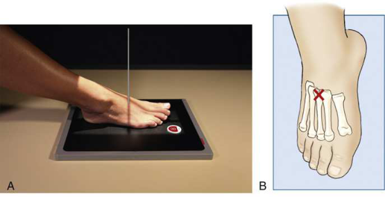
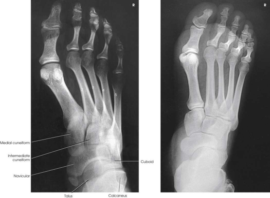

# Rx Picior — Oblică Antero-Posterioară (AP) — Rotație Externă (Laterală) (Merrill)

  📷 Radiografie Convențională (Rx)
  <strong>Actualizat:</strong> 2026-09-16
  <strong>Autor:</strong> Referință Merrill

---

-   __1. Rezumat Clinic & Indicații__

    ---

    === "Indicații Clinice"

        - Conform reperelor anatomice standard din tratat

    === "Ghid Național IRIS"

        !!! info "Referință Primară: Ghidul Național IRIS (Ordinul MS 1342/2012)"
            - **Capitol Ghid IRIS:** *Ghidul Național IRIS*
            - **Grad de Recomandare:** **De verificat pe indicație; fără grad atribuit automat**
            - **Nivel de Iradiere Estimată:** `De verificat pentru examinarea și populația selectate`

            [:octicons-search-16: Deschide Ghidul IRIS](../../iris.md){ .md-button .md-button--primary } [:material-open-in-new: Aplicația Oficială PWA](https://radiologie-pediatrica.ro/iris/){ .md-button target="_blank" rel="noopener" }
-   __2. Poziționare & Centrare Fascicul__

    ---

    - **Poziție Pacient:** se așază pacientul în Decubit dorsal poziție. se flectează Genunchi de afected side enough pentru plantar surface de Picior la rest firmly pe masa radiologică.; Place receptorul de imagine under pacientul’s Picior, paralel cu its axa longitudinală, și center it la linia mediană Picior la nivelul base de third metatarsal. se rotește membru inferior laterally until plantar surface de Picior forms angle de 30 grade la receptorul de imagine. Support ridicat side de Picior pe a 30-grade foam wedge la ensure consistent results (Fig. 7.48). se efectuează ecranarea gonadelor cu șorț plumbat.
    - **Punct de Centrare Fascicul:** perpendicular pe base de third metatarsal.
    - **Distanță Focar-Film (DFF / SID):** Nespecificat în fragmentul extras; de verificat în sursă
    - **Comandă Respiratorie:** Conform reperelor anatomice standard din tratat

-   __3. Parametri Tehnici Expunere__

    ---

    | Parametru Tehnic | Valoare Configurare Generator / Tub |
    |:-----------------|:-------------------------------------|
    | **Tensiune Tub (kV)** | DE CONFIGURAT PE APARAT |
    | **Sarcină / Produs Curent-Timp (mAs)** | DE CONFIGURAT PE APARAT |
    | **Distanță Focar-Film (DFF / SID)** | Nespecificat în fragmentul extras; de verificat în sursă |
    | **Grilă Antidifuzoare (Bucky)** | DE CONFIGURAT PE APARAT |
    | **Dimensiune Focar** | DE CONFIGURAT PE APARAT |
    | **Camere de Ionizare AEC** | DE CONFIGURAT PE APARAT |
    | **Colimare Fascicul** | se ajustează câmp de iradiere la 1 inch (2.5 cm) pe toate sides și 1 inch (2.5 cm) beyond Calcaneu și distal tip de Degete Picior. Place marker de lateralitate (D/S) în collimated expunere field. |
    | **Filtrare Tub** | DE CONFIGURAT PE APARAT |

-   __4. Criterii de Calitate & Reușită Imagine__

    ---

    - Criterii radiologice de calitate imaginii:
    - Evidence de corect collimation și presence de marker de lateralitate (D/S) plasat clear de anatomy de interest
    - Anatomy de la Degete Picior la oase tarsiene; poate include portions de astragal (talus) și Calcaneu
    - corect rotație de Picior
    - First și second metatarsal bases liber de superimposition
    - Minimal superimposition între medial și intermediate cuneiforms
    - Navicular seen cu less foreshortening than în rotație internă (medială) AP Incidență Oblică
    - Bony detalii trabeculare osoase și surrounding soft tissues

-   __5. Protecție Radiologică (ALARA)__

    ---

    - Nespecificat în fragmentul extras; de verificat în sursă

!!! note "Observații Clinice & Tehnice"
    Conform reperelor anatomice standard din tratat

### 🖼️ Imagini

<figure class="protocol-image-card" markdown>

<figcaption><strong>Merrill — pagina PDF 487, imaginea 1</strong> — Imagine din fragmentul sursă; asocierea necesită revizie.</figcaption>

</figure>

<figure class="protocol-image-card" markdown>

<figcaption><strong>Merrill — pagina PDF 488, imaginea 2</strong> — Imagine din fragmentul sursă; asocierea necesită revizie.</figcaption>

</figure>

=== "Ghid Rapid de Execuție"

    1. **Identificarea și verificarea pacientului:** verificare identitate, zonă de examinat, consimțământ conform procedurii și evaluarea posibilității unei sarcini, când este relevantă.
    2. **Pregătire:** îndepărtarea oricăror obiecte radiopace (bijuterii, agrafe, fermoare, proteze, pansamente dense).
    3. **Poziționare precisă:** alinierea receptorului de imagine și a tubului la distanța prescrisă (Nespecificat în fragmentul extras; de verificat în sursă).
    4. **Colimare strictă:** adaptarea fasciculului strict la regiunea de diagnostic pentru scăderea iradierii și reducerea radiației difuze.
    5. **Radioprotecție:** verificarea [politicii RX](../radioprotectie.md), cu măsuri distincte pentru pacient, personal și însoțitor.

## Surse de documentare

- [Merrill’s Atlas, 7. Lower Extremity, pagini PDF 486–488](../../assets/protocols/sources/a56d45c16829_Merrills_Atlas_of_Radiographic_Positioning__Procedures_3Vol_Set.pdf#page=486)

## Fragmente sursă traduse (referință tehnică)

### anatomy

spații articulare între first și second oase metatarsiene și între medial și intermediate cuneiforms (Fig. 7.49).

### collimation

• se ajustează câmp de iradiere la 1 inch (2.5 cm) pe toate sides și 1 inch (2.5 cm) beyond calcaneu și distal tip de toes. Place side
marker în collimated expunere field.

### cr

• perpendicular pe base de third metatarsal.

### criteria

Criterii radiologice de calitate imaginii:
• Evidence de corect collimation și presence de marker de lateralitate (D/S) plasat clear de anatomy de interest
• Anatomy de la toes la oase tarsiene; poate include portions de astragal (talus) și calcaneu
• corect rotație de picior
• First și second metatarsal bases liber de superimposition
• Minimal superimposition între medial și intermediate cuneiforms
• Navicular seen cu less foreshortening than în rotație internă (medială) AP oblic incidență
• Bony detalii trabeculare osoase și surrounding soft tissues

### part_pos

• Place receptorul de imagine under pacientul’s picior, paralel cu its axa longitudinală, și center it la linia mediană picior la nivelul base de third metatarsal.
• se rotește membru inferior laterally until plantar surface de picior forms angle de 30 grade la receptorul de imagine.
• Support ridicat side de picior pe a 30-grade foam wedge la ensure consistent results (Fig. 7.48).
• se efectuează ecranarea gonadelor cu șorț plumbat.

### patient_pos

• se așază pacientul în decubit dorsal.
• se flectează genunchi de afected side enough pentru plantar surface de picior la rest firmly pe masa radiologică.

### tech

poziționat prin manufacturer sau department protocol pentru corect anatomy display orientation; raza centrală plate: 10 × 12 inch (24 × 30 cm) longitudinal.

