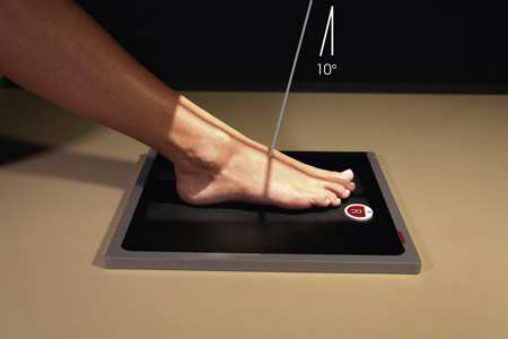
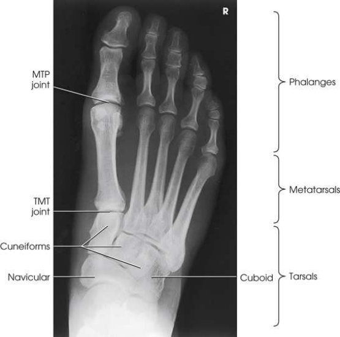
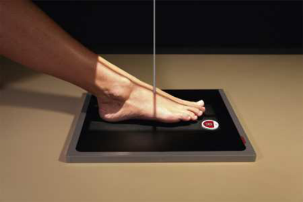
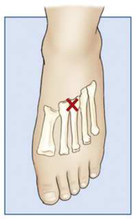
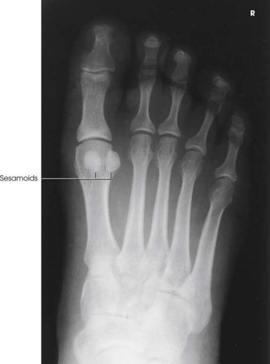
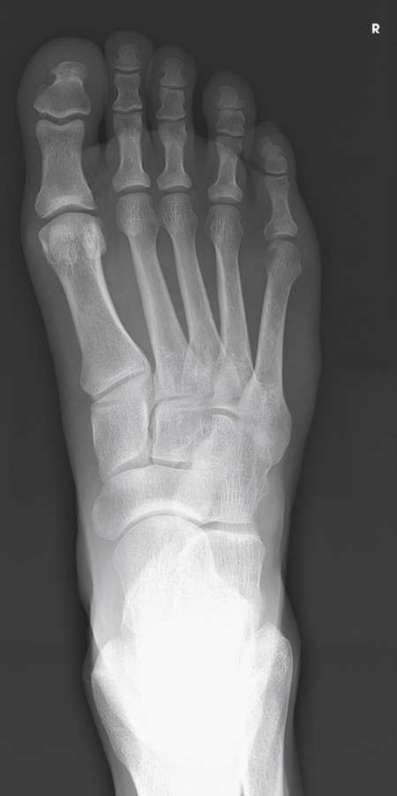
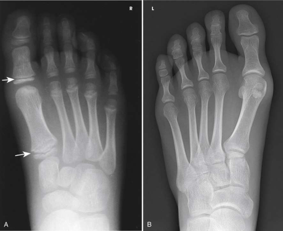

# Rx Picior — AP or Incidență AP Axială — TMT joint spaces of the midfoot are also better shown (Figs. 7.39 and 7.40). (Merrill)

  📷 Radiografie Convențională (Rx)
  <strong>Actualizat:</strong> 2026-09-16
  <strong>Autor:</strong> Referință Merrill

---

-   __1. Rezumat Clinic & Indicații__

    ---

    === "Indicații Clinice"

        - Conform reperelor anatomice standard din tratat

    === "Ghid Național IRIS"

        !!! info "Referință Primară: Ghidul Național IRIS (Ordinul MS 1342/2012)"
            - **Capitol Ghid IRIS:** *Ghidul Național IRIS*
            - **Grad de Recomandare:** **De verificat pe indicație; fără grad atribuit automat**
            - **Nivel de Iradiere Estimată:** `De verificat pentru examinarea și populația selectate`

            [:octicons-search-16: Deschide Ghidul IRIS](../../iris.md){ .md-button .md-button--primary } [:material-open-in-new: Aplicația Oficială PWA](https://radiologie-pediatrica.ro/iris/){ .md-button target="_blank" rel="noopener" }
-   __2. Poziționare & Centrare Fascicul__

    ---

    - **Poziție Pacient:** se așază pacientul în Decubit dorsal sau Poziție Șezândă poziție. se flectează Genunchi de afected side enough la rest sole de Picior firmly pe masa radiologică.; poziție receptorul de imagine under pacientul’s Picior, center it la base de third metatarsal, și se aliniază receptorul de imagine axa longitudinală paralel cu axa longitudinală de Picior. Hold membru inferior în vertical poziție prin having pacientul se flectează opposite Genunchi și lean it pe / sprijinit de Genunchi de afected side. în this Picior poziție, entire plantar surface rests pe receptorul de imagine; it poate fie necessary la take precautions pe / sprijinit de receptorul de imagine slipping prin placing săculeți cu nisip pe masa de examinare pe / sprijinit de receptorul de imagine adjacent la Degete Picior. Ensure that Absența rotației anatomice (simetrie bilaterală perfectă) de Picior occurs. se efectuează ecranarea gonadelor cu șorț plumbat.
    - **Punct de Centrare Fascicul:** orientat one de two ways: (1) 10 grade spre heel entering base de third metatarsal (see Fig. 7.39), sau (2) perpendicular pe receptorul de imagine (RI) și entering base de third metatarsal (Fig. 7.41). Palpating prominent base de fifth metatarsal assists în finding third metatarsal. third metatarsal base este în linia mediană, approximately 1 inch anterior (spre Degete Picior) (Fig. 7.42).
    - **Distanță Focar-Film (DFF / SID):** Nespecificat în fragmentul extras; de verificat în sursă
    - **Comandă Respiratorie:** Conform reperelor anatomice standard din tratat

-   __3. Parametri Tehnici Expunere__

    ---

    | Parametru Tehnic | Valoare Configurare Generator / Tub |
    |:-----------------|:-------------------------------------|
    | **Tensiune Tub (kV)** | DE CONFIGURAT PE APARAT |
    | **Sarcină / Produs Curent-Timp (mAs)** | DE CONFIGURAT PE APARAT |
    | **Distanță Focar-Film (DFF / SID)** | Nespecificat în fragmentul extras; de verificat în sursă |
    | **Grilă Antidifuzoare (Bucky)** | DE CONFIGURAT PE APARAT |
    | **Dimensiune Focar** | DE CONFIGURAT PE APARAT |
    | **Camere de Ionizare AEC** | DE CONFIGURAT PE APARAT |
    | **Colimare Fascicul** | se ajustează câmp de iradiere la 1 inch (2.5 cm) pe sides și 1 inch (2.5 cm) beyond Calcaneu și distal tip de Degete Picior. Se plasează markerul de lateralitate în câmpul colimat. |
    | **Filtrare Tub** | DE CONFIGURAT PE APARAT |

-   __4. Criterii de Calitate & Reușită Imagine__

    ---

    - Criterii radiologice de calitate imaginii:
    - Evidence de corect collimation și presence de marker de lateralitate (D/S) plasat clear de anatomy de interest
    - Anatomy de la Degete Picior la oase tarsiene; poate include portions de astragal (talus) și Calcaneu
    - Absența rotației anatomice (simetrie bilaterală perfectă) de Picior, ca evidențiat prin equal amounts de space între second through fourth oase metatarsiene
    - Overlap de second through fifth metatarsal bases
    - axial incidență resulting în improved demonstration de interphalangeal, metatarsophalangeal, și tarsometatarsal spații articulare
    - Open spații articulare între medial și intermediate cuneiforms
    - Bony detalii trabeculare osoase și surrounding soft tissues

-   __5. Protecție Radiologică (ALARA)__

    ---

    - Nespecificat în fragmentul extras; de verificat în sursă

!!! note "Observații Clinice & Tehnice"
    Conform reperelor anatomice standard din tratat

### 🖼️ Imagini

<figure class="protocol-image-card" markdown>

<figcaption><strong>Merrill — pagina PDF 479, imaginea 1</strong> — Imagine din fragmentul sursă; asocierea necesită revizie.</figcaption>

</figure>

<figure class="protocol-image-card" markdown>

<figcaption><strong>Merrill — pagina PDF 479, imaginea 2</strong> — Imagine din fragmentul sursă; asocierea necesită revizie.</figcaption>

</figure>

<figure class="protocol-image-card" markdown>

<figcaption><strong>Merrill — pagina PDF 480, imaginea 3</strong> — Imagine din fragmentul sursă; asocierea necesită revizie.</figcaption>

</figure>

<figure class="protocol-image-card" markdown>

<figcaption><strong>Merrill — pagina PDF 481, imaginea 4</strong> — Imagine din fragmentul sursă; asocierea necesită revizie.</figcaption>

</figure>

<figure class="protocol-image-card" markdown>

<figcaption><strong>Merrill — pagina PDF 482, imaginea 5</strong> — Imagine din fragmentul sursă; asocierea necesită revizie.</figcaption>

</figure>

<figure class="protocol-image-card" markdown>

<figcaption><strong>Merrill — pagina PDF 483, imaginea 6</strong> — Imagine din fragmentul sursă; asocierea necesită revizie.</figcaption>

</figure>

<figure class="protocol-image-card" markdown>

<figcaption><strong>Merrill — pagina PDF 484, imaginea 7</strong> — Imagine din fragmentul sursă; asocierea necesită revizie.</figcaption>

</figure>

=== "Ghid Rapid de Execuție"

    1. **Identificarea și verificarea pacientului:** verificare identitate, zonă de examinat, consimțământ conform procedurii și evaluarea posibilității unei sarcini, când este relevantă.
    2. **Pregătire:** îndepărtarea oricăror obiecte radiopace (bijuterii, agrafe, fermoare, proteze, pansamente dense).
    3. **Poziționare precisă:** alinierea receptorului de imagine și a tubului la distanța prescrisă (Nespecificat în fragmentul extras; de verificat în sursă).
    4. **Colimare strictă:** adaptarea fasciculului strict la regiunea de diagnostic pentru scăderea iradierii și reducerea radiației difuze.
    5. **Radioprotecție:** verificarea [politicii RX](../radioprotectie.md), cu măsuri distincte pentru pacient, personal și însoțitor.

## Surse de documentare

- [Merrill’s Atlas, 7. Lower Extremity, pagini PDF 478–484](../../assets/protocols/sources/a56d45c16829_Merrills_Atlas_of_Radiographic_Positioning__Procedures_3Vol_Set.pdf#page=478)

## Fragmente sursă traduse (referință tehnică)

### anatomy

AP (dorsoplantar) incidență de oase tarsiene anterior la astragal (talus), oase metatarsiene, și falange (Figs. 7.43 through 7.45). This incidență este used pentru
localizing Corp străin / corpuri străine radio-opace, determining locations de fragments în suspiciune de fractură de oase metatarsiene și anterior oase tarsiene, și performing general
surveys de bones de picior.

### collimation

• se ajustează câmp de iradiere la 1 inch (2.5 cm) pe sides și 1 inch (2.5 cm) beyond calcaneu și distal tip de toes. Place side
marker în collimated expunere field.

### cr

• orientat one de two ways: (1) 10 grade spre heel entering base de third metatarsal (see Fig. 7.39), sau (2) perpendicular la
receptorul de imagine și entering base de third metatarsal (Fig. 7.41). Palpating prominent base de fifth metatarsal assists în finding
third metatarsal. third metatarsal base este în linia mediană, approximately 1 inch anterior (spre toes) (Fig. 7.42).

### criteria

Criterii radiologice de calitate imaginii:
• Evidence de corect collimation și presence de marker de lateralitate (D/S) plasat clear de anatomy de interest
• Anatomy de la toes la oase tarsiene; poate include portions de astragal (talus) și calcaneu
• Absența rotației anatomice (simetrie bilaterală perfectă) de picior, ca evidențiat prin equal amounts de space între second through fourth oase metatarsiene
• Overlap de second through fifth metatarsal bases
• axial incidență resulting în improved demonstration de interphalangeal, metatarsophalangeal, și tarsometatarsal spații articulare
• Open spații articulare între medial și intermediate cuneiforms
• Bony detalii trabeculare osoase și surrounding soft tissues

### part_pos

• poziție receptorul de imagine under pacientul’s picior, center it la base de third metatarsal, și se aliniază receptorul de imagine axa longitudinală paralel cu long
axis de picior.
• Hold membru inferior în vertical poziție prin having pacientul se flectează opposite genunchi și lean it pe / sprijinit de genunchi de afected side.
• în this picior poziție, entire plantar surface rests pe receptorul de imagine; it poate fie necessary la take precautions pe / sprijinit de receptorul de imagine slipping prin
placing săculeți cu nisip pe masa de examinare pe / sprijinit de receptorul de imagine adjacent la toes.
• Ensure that Absența rotației anatomice (simetrie bilaterală perfectă) de picior occurs.
• se efectuează ecranarea gonadelor cu șorț plumbat.

### patient_pos

• se așază pacientul în decubit dorsal sau așezat pe scaun poziție.
• se flectează genunchi de afected side enough la rest sole de picior firmly pe masa radiologică.

### tech

poziționat prin manufacturer sau department protocol pentru corect anatomy display orientation; raza centrală plate: 10 × 12 inches (24 × 30 cm) longitudinal.

