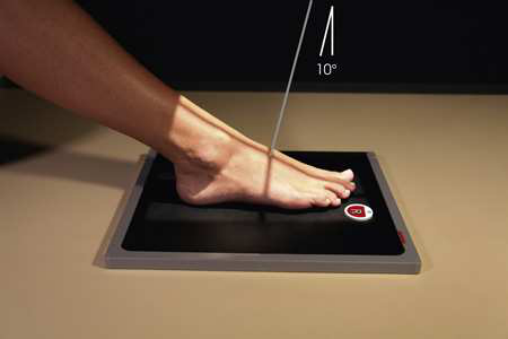
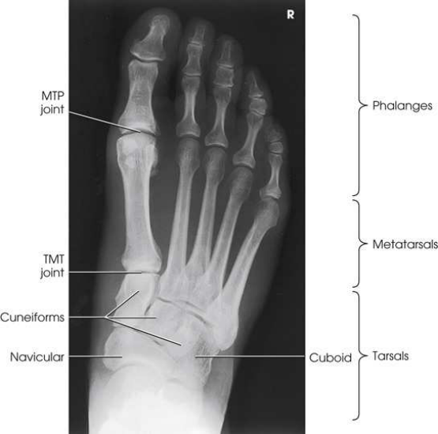
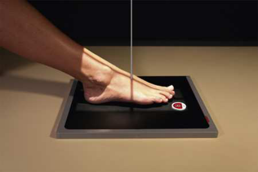
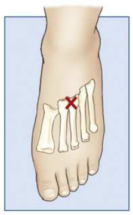
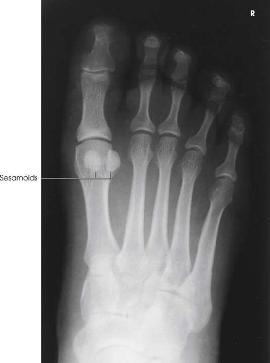
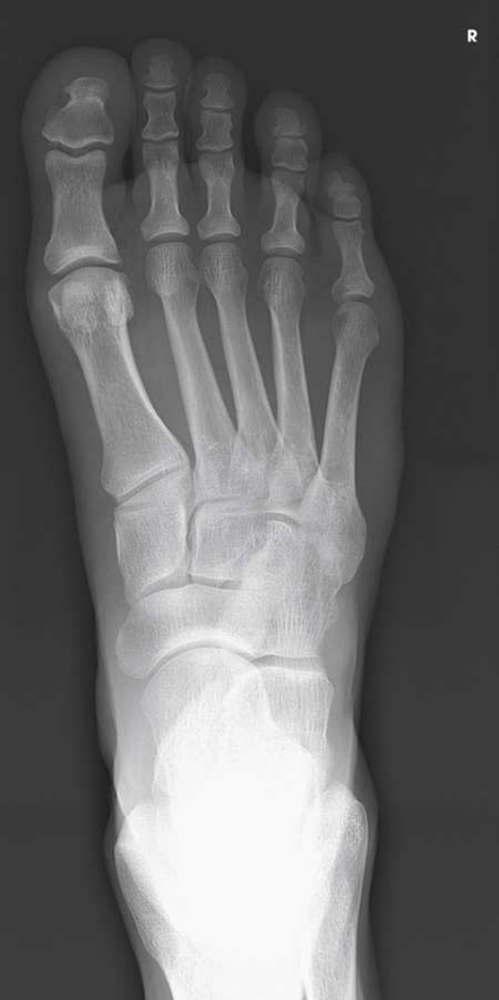
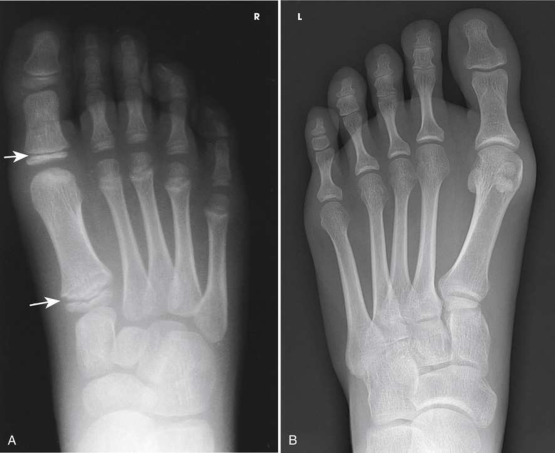

# Rx picior — incidență AP sau incidență AP axială — spațiile articulare tarsometatarsiene ale mediopiciorului sunt, de asemenea, mai bine evidențiate (Fig. 7.39 și 7.40). (Merrill)

  📷 Radiografie Convențională (Rx)
  <strong>Actualizat:</strong> 2026-09-16
  <strong>Autor:</strong> Referință Merrill

---

-   __1. Rezumat Clinic & Indicații__

    ---

    === "Indicații Clinice"

        - Conform reperelor anatomice standard din tratat

    === "Ghid Național IRIS"

        !!! info "Referință Primară: Ghidul Național IRIS (Ordinul MS 1342/2012)"
            - **Capitol Ghid IRIS:** *Aparat locomotor & Membru inferior*
            - **Grad de Recomandare:** **Grad A**
            - **Nivel de Iradiere Estimată:** `Clasa 1 (Minimă < 0.01 mSv)`

            [:octicons-search-16: Deschide Ghidul IRIS](../../iris.md){ .md-button .md-button--primary } [:material-open-in-new: Aplicația Oficială PWA](https://radiologie-pediatrica.ro/iris/){ .md-button target="_blank" rel="noopener" }

-   __2. Poziționare & Centrare Fascicul__

    ---

    - **Poziție Pacient:** Se așază pacientul în decubit dorsal sau în poziție șezândă. Se flectează genunchiul de partea afectată suficient pentru ca talpa piciorului să se sprijine ferm pe masa radiologică. Se plasează receptorul de imagine sub piciorul pacientului, se centrează la baza celui de-al treilea metatarsian și se aliniază axa longitudinală a receptorului de imagine paralel cu axa longitudinală a piciorului. Se menține membrul inferior în poziție verticală, pacientul flectând genunchiul opus și sprijinindu-l pe genunchiul de partea afectată. În această poziție a piciorului, întreaga suprafață plantară se sprijină pe receptorul de imagine; poate fi necesar să se ia măsuri pentru a preveni alunecarea receptorului de imagine, prin plasarea unor săculeți cu nisip pe masa de examinare, adiacent receptorului de imagine, lângă degetele piciorului. Se asigură absența rotației anatomice (simetrie bilaterală perfectă) a piciorului. Se efectuează ecranarea gonadelor cu șorț plumbat.
    - **Punct de Centrare Fascicul:** Orientată într-unul dintre cele două moduri: (1) 10 grade spre călcâi, intrând la baza celui de-al treilea metatarsian (vezi Fig. 7.39), sau (2) perpendicular pe receptorul de imagine (RI), intrând la baza celui de-al treilea metatarsian (Fig. 7.41). Palparea bazei proeminente a celui de-al cincilea metatarsian ajută la identificarea celui de-al treilea metatarsian. Baza celui de-al treilea metatarsian se află pe linia mediană, la aproximativ 1 țol anterior (spre degetele piciorului) (Fig. 7.42).
    - **Distanță Focar-Film (DFF / SID):** Nespecificat în fragmentul extras; de verificat în sursă
    - **Comandă Respiratorie:** Conform reperelor anatomice standard din tratat

-   __3. Parametri Tehnici Expunere__

    ---

    | Parametru Tehnic | Valoare Configurare Generator / Tub |
    |:-----------------|:-------------------------------------|
    | **Tensiune Tub (kV)** | DE CONFIGURAT PE APARAT |
    | **Sarcină / Produs Curent-Timp (mAs)** | DE CONFIGURAT PE APARAT |
    | **Distanță Focar-Film (DFF / SID)** | Nespecificat în fragmentul extras; de verificat în sursă |
    | **Grilă Antidifuzoare (Bucky)** | DE CONFIGURAT PE APARAT |
    | **Dimensiune Focar** | DE CONFIGURAT PE APARAT |
    | **Camere de Ionizare AEC** | DE CONFIGURAT PE APARAT |
    | **Colimare Fascicul** | se ajustează câmpul de iradiere la 1 țol (2.5 cm) pe laturi și la 1 țol (2.5 cm) dincolo de calcaneu și de vârful distal al degetelor piciorului. Se plasează markerul de lateralitate în câmpul colimat. |
    | **Filtrare Tub** | DE CONFIGURAT PE APARAT |

-   __4. Criterii de Calitate & Reușită Imagine__

    ---

    - Criterii radiologice de calitate a imaginii:
    - Evidențierea colimării corecte și prezența markerului de lateralitate (D/S), plasat fără a se suprapune peste anatomia de interes
    - Anatomia de la degetele piciorului până la oasele tarsiene; poate include porțiuni ale astragalului (talusului) și calcaneului
    - Absența rotației anatomice (simetrie bilaterală perfectă) a piciorului, evidențiată prin distanțe egale între al doilea și al patrulea oase metatarsiene.
    - Suprapunerea bazelor celui de-al doilea până la al cincilea metatarsian.
    - Incidență axială, cu demonstrarea îmbunătățită a spațiilor articulare interfalangiene, metatarsofalangiene și tarsometatarsiene.
    - Spații articulare deschise între cuneiformele medial și intermediar.
    - Detalii trabeculare osoase și țesuturile moi înconjurătoare

-   __5. Protecție Radiologică (ALARA)__

    ---

    - Nespecificat în fragmentul extras; de verificat în sursă

!!! note "Observații Clinice & Tehnice"
    Conform reperelor anatomice standard din tratat

### 🖼️ Imagini

<figure class="protocol-image-card" markdown>

<figcaption><strong>Merrill — pagina 479, imaginea 1</strong> — Imagine din fragmentul sursă; asocierea necesită revizie.</figcaption>

</figure>

<figure class="protocol-image-card" markdown>

<figcaption><strong>Merrill — pagina 479, imaginea 2</strong> — Imagine din fragmentul sursă; asocierea necesită revizie.</figcaption>

</figure>

<figure class="protocol-image-card" markdown>

<figcaption><strong>Merrill — pagina 480, imaginea 3</strong> — Imagine din fragmentul sursă; asocierea necesită revizie.</figcaption>

</figure>

<figure class="protocol-image-card" markdown>

<figcaption><strong>Merrill — pagina 481, imaginea 4</strong> — Imagine din fragmentul sursă; asocierea necesită revizie.</figcaption>

</figure>

<figure class="protocol-image-card" markdown>

<figcaption><strong>Merrill — pagina 482, imaginea 5</strong> — Imagine din fragmentul sursă; asocierea necesită revizie.</figcaption>

</figure>

<figure class="protocol-image-card" markdown>

<figcaption><strong>Merrill — pagina 483, imaginea 6</strong> — Imagine din fragmentul sursă; asocierea necesită revizie.</figcaption>

</figure>

<figure class="protocol-image-card" markdown>

<figcaption><strong>Merrill — pagina 484, imaginea 7</strong> — Imagine din fragmentul sursă; asocierea necesită revizie.</figcaption>

</figure>

=== "Ghid Rapid de Execuție"

    1. **Identificarea și verificarea pacientului:** verificare identitate, zonă de examinat, consimțământ conform procedurii și evaluarea posibilității unei sarcini, când este relevantă.
    2. **Pregătire:** îndepărtarea oricăror obiecte radiopace (bijuterii, agrafe, fermoare, proteze, pansamente dense).
    3. **Poziționare precisă:** alinierea receptorului de imagine și a tubului la distanța prescrisă (Nespecificat în fragmentul extras; de verificat în sursă).
    4. **Colimare strictă:** adaptarea fasciculului strict la regiunea de diagnostic pentru scăderea iradierii și reducerea radiației difuze.
    5. **Radioprotecție:** verificarea [politicii RX](../radioprotectie.md), cu măsuri distincte pentru pacient, personal și însoțitor.

## Surse de documentare

- [Merrill’s Atlas, 7. Lower Extremity, pagini 478–484](https://books.google.com/books/about/Merrill_s_Atlas_of_Radiographic_Position.html?id=BM0lEQAAQBAJ)
