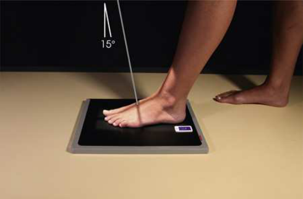
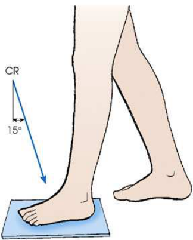
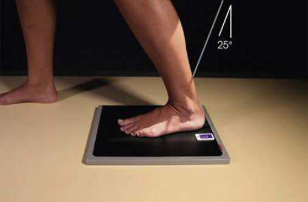
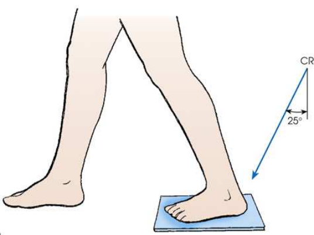
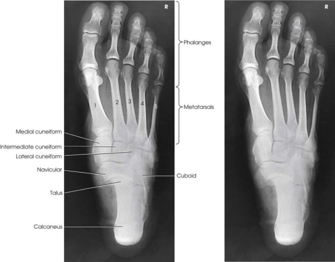

# Rx Picior — Incidență AP Axială — În Încărcare (Ortostatism) Composite Method Standing (Merrill)

  📷 Radiografie Convențională (Rx)
  <strong>Actualizat:</strong> 2026-09-16
  <strong>Autor:</strong> Referință Merrill

---

-   __1. Rezumat Clinic & Indicații__

    ---

    === "Indicații Clinice"

        - Conform reperelor anatomice standard din tratat

    === "Ghid Național IRIS"

        !!! info "Referință Primară: Ghidul Național IRIS (Ordinul MS 1342/2012)"
            - **Capitol Ghid IRIS:** *Ghidul Național IRIS*
            - **Grad de Recomandare:** **De verificat pe indicație; fără grad atribuit automat**
            - **Nivel de Iradiere Estimată:** `De verificat pentru examinarea și populația selectate`

            [:octicons-search-16: Deschide Ghidul IRIS](../../iris.md){ .md-button .md-button--primary } [:material-open-in-new: Aplicația Oficială PWA](https://radiologie-pediatrica.ro/iris/){ .md-button target="_blank" rel="noopener" }
-   __2. Poziționare & Centrare Fascicul__

    ---

    - **Poziție Pacient:** se așază pacientul în ortostatism-ortostatism. pacientul trebuie să stand la comfortable height pe low stool sau pe floor.; cu pacientul în ortostatism în ortostatism, se ajustează receptorul de imagine under Picior și center its midline la axa longitudinală de Picior. la prevent superimposition de membru inferior shadow pe that de Gleznă (Articulație Talocrurală) articulație, Se instruiește pacientul să place opposite Picior one step backward pentru expunere de forefoot și one step forward pentru expunere de hindfoot sau Calcaneu. se efectuează ecranarea gonadelor cu șorț plumbat.
    - **Punct de Centrare Fascicul:** la use masking efect de membru inferior, se orientează raza centrală centrală along plane de alignment de Picior în ambele expuneri. cu tubul în front de pacientul și ajustat pentru posterior angulation de 15 grade, se centrează raza centrală la base de third metatarsal pentru first expunere (Figs. 7.59 și 7.60). Caution pacientul la carefully maintain poziție de afected Picior și la place opposite Picior one step forward în preparation pentru second expunere. Move tubul behind pacientul, adjust it pentru anterior angulation de 25 grade, și se orientează raza centrală centrală la posterior surface de Gleznă (Articulație Talocrurală). raza centrală emerges pe plantar surface la nivelul maleolă laterală (fibulară) (Figs. 7.61 și 7.62). increase în technical factors este recommended pentru this expunere.
    - **Distanță Focar-Film (DFF / SID):** Nespecificat în fragmentul extras; de verificat în sursă
    - **Comandă Respiratorie:** Conform reperelor anatomice standard din tratat

-   __3. Parametri Tehnici Expunere__

    ---

    | Parametru Tehnic | Valoare Configurare Generator / Tub |
    |:-----------------|:-------------------------------------|
    | **Tensiune Tub (kV)** | DE CONFIGURAT PE APARAT |
    | **Sarcină / Produs Curent-Timp (mAs)** | DE CONFIGURAT PE APARAT |
    | **Distanță Focar-Film (DFF / SID)** | Nespecificat în fragmentul extras; de verificat în sursă |
    | **Grilă Antidifuzoare (Bucky)** | DE CONFIGURAT PE APARAT |
    | **Dimensiune Focar** | DE CONFIGURAT PE APARAT |
    | **Camere de Ionizare AEC** | DE CONFIGURAT PE APARAT |
    | **Colimare Fascicul** | se ajustează câmp de iradiere la 1 inch (2.5 cm) pe toate sides și 1 inch (2.5 cm) beyond Calcaneu și distal tip de Degete Picior. Place marker de lateralitate (D/S) în collimated expunere field. |
    | **Filtrare Tub** | DE CONFIGURAT PE APARAT |

-   __4. Criterii de Calitate & Reușită Imagine__

    ---

    - Criterii radiologice de calitate imaginii:
    - Evidence de corect collimation și presence de marker de lateralitate (D/S) plasat clear de anatomy de interest
    - Entire Picior, de la Degete Picior la heel
    - Shadow de membru inferior nu overlapping oase tarsiene
    - Picior nu rotit
    - Bony detalii trabeculare osoase și surrounding soft tissues

-   __5. Protecție Radiologică (ALARA)__

    ---

    - Nespecificat în fragmentul extras; de verificat în sursă

!!! note "Observații Clinice & Tehnice"
    Conform reperelor anatomice standard din tratat

### 🖼️ Imagini

<figure class="protocol-image-card" markdown>

<figcaption><strong>Merrill — pagina PDF 495, imaginea 1</strong> — Imagine din fragmentul sursă; asocierea necesită revizie.</figcaption>

</figure>

<figure class="protocol-image-card" markdown>

<figcaption><strong>Merrill — pagina PDF 495, imaginea 2</strong> — Imagine din fragmentul sursă; asocierea necesită revizie.</figcaption>

</figure>

<figure class="protocol-image-card" markdown>

<figcaption><strong>Merrill — pagina PDF 496, imaginea 3</strong> — Imagine din fragmentul sursă; asocierea necesită revizie.</figcaption>

</figure>

<figure class="protocol-image-card" markdown>

<figcaption><strong>Merrill — pagina PDF 496, imaginea 4</strong> — Imagine din fragmentul sursă; asocierea necesită revizie.</figcaption>

</figure>

<figure class="protocol-image-card" markdown>

<figcaption><strong>Merrill — pagina PDF 497, imaginea 5</strong> — Imagine din fragmentul sursă; asocierea necesită revizie.</figcaption>

</figure>

=== "Ghid Rapid de Execuție"

    1. **Identificarea și verificarea pacientului:** verificare identitate, zonă de examinat, consimțământ conform procedurii și evaluarea posibilității unei sarcini, când este relevantă.
    2. **Pregătire:** îndepărtarea oricăror obiecte radiopace (bijuterii, agrafe, fermoare, proteze, pansamente dense).
    3. **Poziționare precisă:** alinierea receptorului de imagine și a tubului la distanța prescrisă (Nespecificat în fragmentul extras; de verificat în sursă).
    4. **Colimare strictă:** adaptarea fasciculului strict la regiunea de diagnostic pentru scăderea iradierii și reducerea radiației difuze.
    5. **Radioprotecție:** verificarea [politicii RX](../radioprotectie.md), cu măsuri distincte pentru pacient, personal și însoțitor.

## Surse de documentare

- [Merrill’s Atlas, 7. Lower Extremity, pagini PDF 494–497](../../assets/protocols/sources/a56d45c16829_Merrills_Atlas_of_Radiographic_Positioning__Procedures_3Vol_Set.pdf#page=494)

## Fragmente sursă traduse (referință tehnică)

### anatomy

weight-bearing AP axial incidență de toate bones de picior. full outline de picior este projected liber de membru inferior (Fig. 7.63).

### collimation

• se ajustează câmp de iradiere la 1 inch (2.5 cm) pe toate sides și 1 inch (2.5 cm) beyond calcaneu și distal tip de toes. Place side
marker în collimated expunere field.

### cr

• la use masking efect de membru inferior, se orientează raza centrală centrală along plane de alignment de picior în ambele expuneri.
• cu tubul în front de pacientul și ajustat pentru posterior angulation de 15 grade, se centrează raza centrală la base de third
metatarsal pentru first expunere (Figs. 7.59 și 7.60).
• Caution pacientul la carefully maintain poziție de afected picior și la place opposite picior one step forward în
preparation pentru second expunere.
• Move tubul behind pacientul, adjust it pentru anterior angulation de 25 grade, și se orientează raza centrală centrală la posterior surface
de ankle. raza centrală emerges pe plantar surface la nivelul maleolă laterală (fibulară) (Figs. 7.61 și 7.62). increase în
technical factors este recommended pentru this expunere.

### criteria

Criterii radiologice de calitate imaginii:
• Evidence de corect collimation și presence de marker de lateralitate (D/S) plasat clear de anatomy de interest
• Entire picior, de la toes la heel
• Shadow de membru inferior nu overlapping oase tarsiene
• picior nu rotit
• Bony detalii trabeculare osoase și surrounding soft tissues

### part_pos

• cu pacientul în ortostatism în ortostatism, se ajustează receptorul de imagine under picior și center its midline la axa longitudinală de picior.
• la prevent superimposition de membru inferior shadow pe that de ankle articulație, Se instruiește pacientul să place opposite picior one step backward pentru
expunere de forefoot și one step forward pentru expunere de hindfoot sau calcaneu.
• se efectuează ecranarea gonadelor cu șorț plumbat.

### patient_pos

• se așază pacientul în ortostatism-ortostatism. pacientul trebuie să stand la comfortable height pe low stool sau pe floor.

### tech

poziționat prin manufacturer sau department protocol pentru corect anatomy display orientation; raza centrală plate: 10 × 12 inches (24 × 30 cm) longitudinal.

