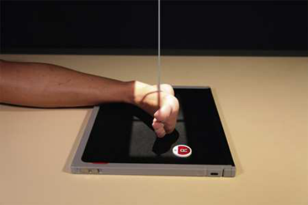
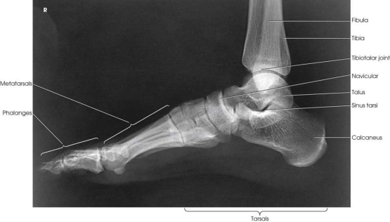
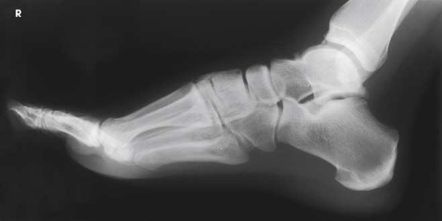

# Rx Picior — Incidență de Profil (Lateral) — Medio-Lateral to assume. (Merrill)

  📷 Radiografie Convențională (Rx)
  <strong>Actualizat:</strong> 2026-09-16
  <strong>Autor:</strong> Referință Merrill

---

-   __1. Rezumat Clinic & Indicații__

    ---

    === "Indicații Clinice"

        - Conform reperelor anatomice standard din tratat

    === "Ghid Național IRIS"

        !!! info "Referință Primară: Ghidul Național IRIS (Ordinul MS 1342/2012)"
            - **Capitol Ghid IRIS:** *Ghidul Național IRIS*
            - **Grad de Recomandare:** **De verificat pe indicație; fără grad atribuit automat**
            - **Nivel de Iradiere Estimată:** `De verificat pentru examinarea și populația selectate`

            [:octicons-search-16: Deschide Ghidul IRIS](../../iris.md){ .md-button .md-button--primary } [:material-open-in-new: Aplicația Oficială PWA](https://radiologie-pediatrica.ro/iris/){ .md-button target="_blank" rel="noopener" }
-   __2. Poziționare & Centrare Fascicul__

    ---

    - **Poziție Pacient:** Se instruiește pacientul să lie pe masa radiologică și turn spre afected side until membru inferior și Picior sunt lateral. Place opposite membru inferior behind afected membru inferior.; Elevate pacientul’s Genunchi enough la place Rotulă (Patelă) perpendicular pe plan orizontal și adjust săculeți cu nisip support under Genunchi. heel trebuie să nu touch receptorul de imagine, și medial surface de Picior trebuie să fie paralel cu plane de receptorul de imagine. se ajustează Picior la place plantar surface de forefoot perpendicular pe receptorul de imagine (RI) (Fig. 7.50). se centrează receptorul de imagine la midfoot și se aliniază receptorul de imagine axa longitudinală paralel cu axa longitudinală de Picior. Dorsiflex Picior la form a 90-grade angle cu Gambă. se efectuează ecranarea gonadelor cu șorț plumbat.
    - **Punct de Centrare Fascicul:** perpendicular pe base de third metatarsal.
    - **Distanță Focar-Film (DFF / SID):** Nespecificat în fragmentul extras; de verificat în sursă
    - **Comandă Respiratorie:** Conform reperelor anatomice standard din tratat

-   __3. Parametri Tehnici Expunere__

    ---

    | Parametru Tehnic | Valoare Configurare Generator / Tub |
    |:-----------------|:-------------------------------------|
    | **Tensiune Tub (kV)** | DE CONFIGURAT PE APARAT |
    | **Sarcină / Produs Curent-Timp (mAs)** | DE CONFIGURAT PE APARAT |
    | **Distanță Focar-Film (DFF / SID)** | Nespecificat în fragmentul extras; de verificat în sursă |
    | **Grilă Antidifuzoare (Bucky)** | DE CONFIGURAT PE APARAT |
    | **Dimensiune Focar** | DE CONFIGURAT PE APARAT |
    | **Camere de Ionizare AEC** | DE CONFIGURAT PE APARAT |
    | **Colimare Fascicul** | se ajustează câmp de iradiere la 1 inch (2.5 cm) pe toate sides de shadow de Picior și including maleolă medială (tibială). Place marker de lateralitate (D/S) în collimated expunere field. |
    | **Filtrare Tub** | DE CONFIGURAT PE APARAT |

-   __4. Criterii de Calitate & Reușită Imagine__

    ---

    - Criterii radiologice de calitate imaginii:
    - Evidence de corect collimation și presence de marker de lateralitate (D/S) plasat clear de anatomy de interest
    - Entire Picior și distal membru inferior
    - Superimposed plantar surfaces de metatarsal heads
    - Fibula overlapping posterior portion de tibia
    - Tibiotalar articulație
    - Bony detalii trabeculare osoase și surrounding soft tissues

-   __5. Protecție Radiologică (ALARA)__

    ---

    - Nespecificat în fragmentul extras; de verificat în sursă

!!! note "Observații Clinice & Tehnice"
    Conform reperelor anatomice standard din tratat

### 🖼️ Imagini

<figure class="protocol-image-card" markdown>

<figcaption><strong>Merrill — pagina PDF 489, imaginea 1</strong> — Imagine din fragmentul sursă; asocierea necesită revizie.</figcaption>

</figure>

<figure class="protocol-image-card" markdown>

<figcaption><strong>Merrill — pagina PDF 489, imaginea 2</strong> — Imagine din fragmentul sursă; asocierea necesită revizie.</figcaption>

</figure>

<figure class="protocol-image-card" markdown>

<figcaption><strong>Merrill — pagina PDF 490, imaginea 3</strong> — Imagine din fragmentul sursă; asocierea necesită revizie.</figcaption>

</figure>

=== "Ghid Rapid de Execuție"

    1. **Identificarea și verificarea pacientului:** verificare identitate, zonă de examinat, consimțământ conform procedurii și evaluarea posibilității unei sarcini, când este relevantă.
    2. **Pregătire:** îndepărtarea oricăror obiecte radiopace (bijuterii, agrafe, fermoare, proteze, pansamente dense).
    3. **Poziționare precisă:** alinierea receptorului de imagine și a tubului la distanța prescrisă (Nespecificat în fragmentul extras; de verificat în sursă).
    4. **Colimare strictă:** adaptarea fasciculului strict la regiunea de diagnostic pentru scăderea iradierii și reducerea radiației difuze.
    5. **Radioprotecție:** verificarea [politicii RX](../radioprotectie.md), cu măsuri distincte pentru pacient, personal și însoțitor.

## Surse de documentare

- [Merrill’s Atlas, 7. Lower Extremity, pagini PDF 488–490](../../assets/protocols/sources/a56d45c16829_Merrills_Atlas_of_Radiographic_Positioning__Procedures_3Vol_Set.pdf#page=488)

## Fragmente sursă traduse (referință tehnică)

### anatomy

entire picior în profile, ankle articulație, și distal ends de tibia și fibula (Figs. 7.51 și 7.52).

### collimation

• se ajustează câmp de iradiere la 1 inch (2.5 cm) pe toate sides de shadow de picior și including maleolă medială (tibială). Place side
marker în collimated expunere field.

### cr

• perpendicular pe base de third metatarsal.

### criteria

Criterii radiologice de calitate imaginii:
• Evidence de corect collimation și presence de marker de lateralitate (D/S) plasat clear de anatomy de interest
• Entire picior și distal membru inferior
• Superimposed plantar surfaces de metatarsal heads
• Fibula overlapping posterior portion de tibia
• Tibiotalar articulație
• Bony detalii trabeculare osoase și surrounding soft tissues

### part_pos

• Elevate pacientul’s genunchi enough la place rotulă (patelă) perpendicular pe plan orizontal și adjust săculeți cu nisip support under genunchi. heel trebuie să nu touch receptorul de imagine, și medial surface de picior trebuie să fie paralel cu plane de receptorul de imagine.
• se ajustează picior la place plantar surface de forefoot perpendicular pe receptorul de imagine (RI) (Fig. 7.50).
• se centrează receptorul de imagine la midfoot și se aliniază receptorul de imagine axa longitudinală paralel cu axa longitudinală de picior.
• Dorsiflex picior la form a 90-grade angle cu lower membru inferior.
• se efectuează ecranarea gonadelor cu șorț plumbat.

### patient_pos

• Se instruiește pacientul să lie pe masa radiologică și turn spre afected side until membru inferior și picior sunt lateral.
• Place opposite membru inferior behind afected membru inferior.

### tech

poziționat prin manufacturer sau department protocol pentru corect anatomy display orientation; raza centrală plate: 10 × 12 inches (24 × 30 cm) longitudinal.

