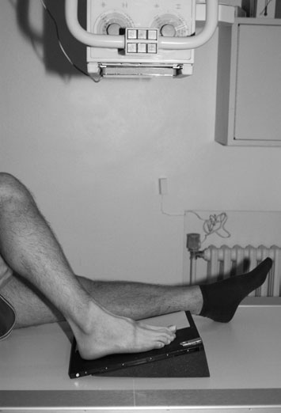
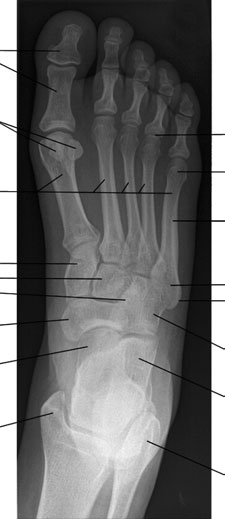
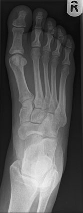
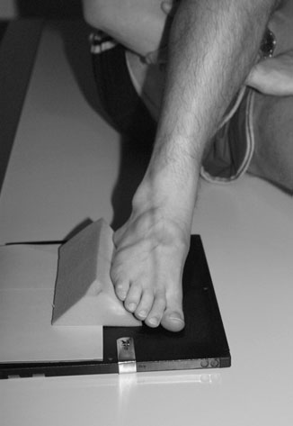
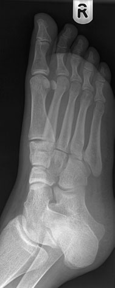
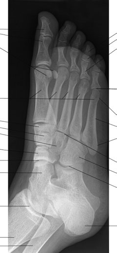
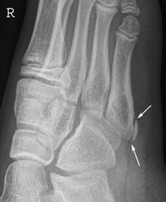
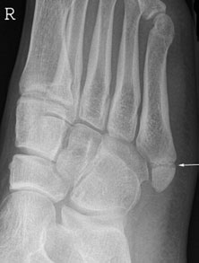

# Rx Picior Incidențe Standard de Bază

  📷 Radiografie Convențională (Rx)
  <strong>Actualizat:</strong> 2026-09-16
  <strong>Autor:</strong> Departamentul de Radiologie / Referință Clark (Ed. 12)

---

-   __1. Rezumat Clinic & Indicații__

    ---

    === "Indicații Clinice"

        - There sunt numerous possible accessory ossicles în Picior și around Gleznă (Articulație Talocrurală), ca la Pumn (Articulație Radiocarpiană). These poate give rise la confusion cu small avulsion injuries.
        - base de fifth metatarsal ossifies de la accessory ossification centre, which este oriented paralel cu axa longitudinală de bone. This trebuie să nu fie confused cu suspiciune de fractură, which usually runs transversely.
        - If accessory ossification centre este nu paralel cu metatarsal, then this poate fie due la avulsion injury.
        - Lisfranc suspiciune de fractură luxație articulară la bases de oase metatarsiene sunt difficult la see, except pe Oblică incidențe, și will fie masked prin underexposure. distal phalanx Sesamoid bones oase metatarsiene 1 la 5 Cuneiform bones medial Intermediate Profil (lateral) Navicular Talonavicular articulație cap de astragal (talus) Gleznă (Articulație Talocrurală) articulație Tibia Fibula Calcaneu Calcaneocuboid articulație Cuboid 3rd tarsometarsal articulație Base Shaft cap 5th metatarsal 5th articulații metatarsofalangiene (MTF) proximal Middle distal falange de 4th toe Great toe (hallux) proximal phalanx Normal Dorso-Plantară Oblică radiografie de Picior radiografii evidențiind normal fifth metatarsal ossification centre pe stâng, și suspiciune de fractură base fifth metatarsal pe drept (arrow)

    === "Ghid Național IRIS"

        !!! info "Referință Primară: Ghidul Național IRIS (Ordinul MS 1342/2012)"
            - **Capitol Ghid IRIS:** *Ghidul Național IRIS*
            - **Grad de Recomandare:** **De verificat pe indicație; fără grad atribuit automat**
            - **Nivel de Iradiere Estimată:** `De verificat pentru examinarea și populația selectate`

            [:octicons-search-16: Deschide Ghidul IRIS](../../iris.md){ .md-button .md-button--primary } [:material-open-in-new: Aplicația Oficială PWA](https://radiologie-pediatrica.ro/iris/){ .md-button target="_blank" rel="noopener" }
-   __2. Poziționare & Centrare Fascicul__

    ---

    - **Poziție Pacient:** • pacientul este așezat pe scaun pe masa radiologică, sprijinit if necessary, cu affected Șold și Genunchi flectat.
• plantar aspect de affected Picior este plasat pe casetă și lower membru inferior este sprijinit în vertical poziție prin other Genunchi.
• Alternatively, caseta poate fie raised pe a 15-grade foam pad pentru ease de positioning.

• de la basic Dorso-Plantară poziție, affected limb este allowed la lean medially la bring plantar surface de Picior approximately 30–45 grade la caseta.
• non-opaque înclinat pad este plasat under Picior la maintain poziție, cu opposite limb acting ca support.
    - **Punct de Centrare Fascicul:** • raza centrală este orientat over cuboid-navicular articulație, midway între palpable navicular tuberosity și tuberosity de fifth metatarsal.
• X-ray tube este înclinat 15 grade cranially when caseta este flat pe masa de examinare.
• X-ray tube este vertical when caseta este raised pe a 15-grade pad.

• raza centrală verticală centrală este orientat over cuboid-navicular articulație.
    - **Distanță Focar-Film (DFF / SID):** 100 cm
    - **Comandă Respiratorie:** Apnee pe durata expunerii (apnee în inspir pentru torace; expir pentru Abdomen/bazin).

-   __3. Parametri Tehnici Expunere__

    ---

    | Parametru Tehnic | Valoare Configurare Generator / Tub |
    |:-----------------|:-------------------------------------|
    | **Tensiune Tub (kV)** | DE CONFIGURAT PE APARAT |
    | **Sarcină / Produs Curent-Timp (mAs)** | Conform AEC / grosime anatomică |
    | **Distanță Focar-Film (DFF / SID)** | 100 cm |
    | **Grilă Antidifuzoare (Bucky)** | Conform grosimii anatomice (> 10-12 cm cu grilă) |
    | **Dimensiune Focar** | Focar Mic (0.6 mm) |
    | **Camere de Ionizare AEC** | DE CONFIGURAT PE APARAT |
    | **Colimare Fascicul** | Colimare strictă adaptată pe receptor 24 x 30 cm |
    | **Filtrare Tub** | Totală ≥ 2.5 mm Al echivalent (conform Clark: 3.0 mm Al eq.) |

-   __4. Criterii de Calitate & Reușită Imagine__

    ---

    - tarsal și tarso-metatarsal articulații trebuie să fie evidențiat when whole Picior este examined.
    - kVp selected trebuie să reduce difference în subject contrast între thickness de Degete Picior și tarsus la give uniform radiographic contrast over range de Picior densities.
    - kVp selected trebuie să reduce difference în subject contrast între thickness de Degete Picior și tarsus la give uniform radiographic contrast over range de Picior densities.
    - wedge filter poate also fie used la give uniform range de densities.
    - Dorso-Plantară Oblică trebuie să evidențiază inter-tarsal și tarso-metatarsal articulații.

-   __5. Protecție Radiologică (ALARA)__

    ---

    - Ecranare gonadică cu șorț plumbat dacă gonadele sunt în apropierea fasciculului util (regula ALARA).
    - Colimare precisă la dimensiunea anatomică strict necesară pentru reducerea dozei și a radiației difuze.
    - Verificarea posibilității unei sarcini la pacientele de vârstă fertilă înainte de expunere.

!!! note "Observații Clinice & Tehnice"
    wedge filter poate fie used la compensate pentru difference în tissue thickness.
108 Normal Dorso-Plantară radiografie de Picior Great toe (hallux) distal phalanx proximal phalanx Sesamoid bones oase metatarsiene 1 la 5 Cuneiform bones medial Intermediate Profil (lateral) Navicular cap de astragal (talus) maleolă medială (tibială) de tibia Profil (lateral) malleolus de fibula Calcaneu Cuboid Tubercle Base Shaft cap de 5th metatarsal 4th articulații metatarsofalangiene (MTF)

pentru non-ambulant/wheelchair-bound pacienți, caseta poate fie plasat pe pad sau stool directly în contact cu plantar aspect de Picior.

### 🖼️ Imagini

<figure class="protocol-image-card" markdown>

<figcaption><strong>uniform radiographic contrast over range de Picior densities.</strong> — Poziționare pacient și centrare fascicul conform Clark (Ed. 12)</figcaption>

</figure>

<figure class="protocol-image-card" markdown>

<figcaption><strong>Normal Dorso-Plantară radiografie de Picior</strong> — Aspect radiografic / ghid de poziționare conform tratatului Clark (Ed. 12)</figcaption>

</figure>

<figure class="protocol-image-card" markdown>

<figcaption><strong>Figura 3: Aspect radiografic / Poziționare (Clark Ed. 12)</strong> — Aspect radiografic / ghid de poziționare conform tratatului Clark (Ed. 12)</figcaption>

</figure>

<figure class="protocol-image-card" markdown>

<figcaption><strong>uniform radiographic contrast over range de Picior densities.</strong> — Aspect radiografic / ghid de poziționare conform tratatului Clark (Ed. 12)</figcaption>

</figure>

<figure class="protocol-image-card" markdown>

<figcaption><strong>de bone. This trebuie să nu fie confused cu suspiciune de fractură,</strong> — Aspect radiografic / ghid de poziționare conform tratatului Clark (Ed. 12)</figcaption>

</figure>

<figure class="protocol-image-card" markdown>

<figcaption><strong>• Lisfranc suspiciune de fractură luxație articulară la bases de oase metatarsiene</strong> — Aspect radiografic / ghid de poziționare conform tratatului Clark (Ed. 12)</figcaption>

</figure>

<figure class="protocol-image-card" markdown>

<figcaption><strong>Normal Dorso-Plantară</strong> — Aspect radiografic / ghid de poziționare conform tratatului Clark (Ed. 12)</figcaption>

</figure>

<figure class="protocol-image-card" markdown>

<figcaption><strong>Oblică radiografie de Picior</strong> — Aspect radiografic / ghid de poziționare conform tratatului Clark (Ed. 12)</figcaption>

</figure>

=== "Ghid Rapid de Execuție"

    1. **Identificarea și verificarea pacientului:** verificare identitate, zonă de examinat, consimțământ conform procedurii și evaluarea posibilității unei sarcini, când este relevantă.
    2. **Pregătire:** îndepărtarea oricăror obiecte radiopace (bijuterii, agrafe, fermoare, proteze, pansamente dense).
    3. **Poziționare precisă:** alinierea receptorului de imagine și a tubului la distanța prescrisă (100 cm).
    4. **Colimare strictă:** adaptarea fasciculului strict la regiunea de diagnostic pentru scăderea iradierii și reducerea radiației difuze.
    5. **Radioprotecție:** verificarea [politicii RX](../radioprotectie.md), cu măsuri distincte pentru pacient, personal și însoțitor.

## Surse de documentare

- [Clark's Positioning in Radiography (Ed. 12), Pagina 123](../../assets/protocols/sources/Clark___Positioning_in_Radiography__12th_edition.pdf#page=123)
