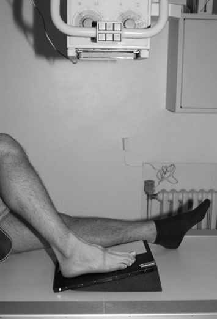
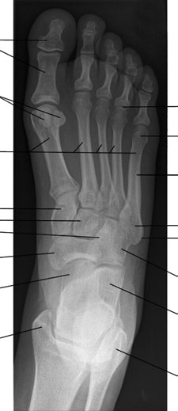
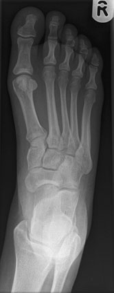
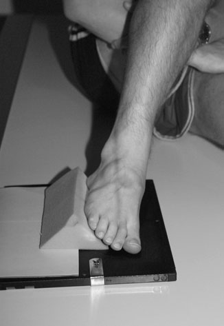
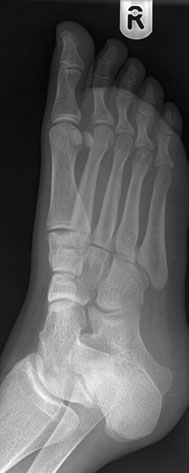
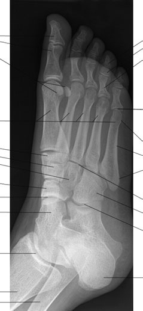
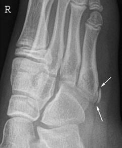
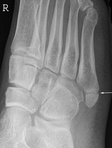

# Incidențe standard de bază ale piciorului

  📷 Radiografie Convențională (Rx)
  <strong>Actualizat:</strong> 2026-09-16
  <strong>Autor:</strong> Departamentul de Radiologie / Referință Clark (Ed. 12)

---

-   __1. Rezumat Clinic & Indicații__

    ---

    === "Indicații Clinice"

        - Există numeroase osicule accesorii posibile la nivelul piciorului și în jurul gleznei (articulației talocrurale), ca la pumn (articulația radiocarpiană). Acestea pot duce la confuzie cu mici leziuni de avulsie.
        - Baza metatarsianului V se osifică dintr-un centru de osificare accesoriu, care este orientat paralel cu axa longitudinală a osului. Aceasta nu trebuie confundată cu o suspiciune de fractură, care de obicei are traiect transversal.
        - Dacă centrul de osificare accesoriu nu este paralel cu metatarsianul, aceasta poate fi determinată de o leziune de avulsie.
        - Suspiciunea de fractură-luxație articulară Lisfranc la bazele oaselor metatarsiene este dificil de observat, cu excepția incidențelor oblice, și va fi mascată prin subexpunere. Falanga distală; oase sesamoide; oase metatarsiene 1 până la 5; oase cuneiforme; medial; intermediar; profil (lateral); navicular; articulația talonaviculară; capul astragalului (talusului); glezna (articulația talocrurală); articulația tibială; fibula; calcaneu; articulația calcaneocuboidiană; cuboid; articulația tarsometatarsiană a 3-a; bază; diafiză; cap; metatarsianul 5; articulațiile metatarsofalangiene (MTF) 5; falanga proximală; falanga medie; falanga distală a degetului 4; degetul mare (haluce); falanga proximală. Radiografie dorso-plantară oblică normală a piciorului, evidențiind centrul normal de osificare al celui de-al cincilea metatarsian pe stânga și suspiciune de fractură la baza celui de-al cincilea metatarsian pe dreapta (săgeată).

    === "Ghid Național IRIS"

        !!! info "Referință Primară: Ghidul Național IRIS (Ordinul MS 1342/2012)"
            - **Capitol Ghid IRIS:** *Aparat locomotor & Membru inferior*
            - **Grad de Recomandare:** **Grad A**
            - **Nivel de Iradiere Estimată:** `Clasa 1 (Minimă < 0.01 mSv)`

            [:octicons-search-16: Deschide Ghidul IRIS](../../iris.md){ .md-button .md-button--primary } [:material-open-in-new: Aplicația Oficială PWA](https://radiologie-pediatrica.ro/iris/){ .md-button target="_blank" rel="noopener" }

-   __2. Poziționare & Centrare Fascicul__

    ---

    - **Poziție Pacient:**
        - Pacientul este așezat pe scaun pe masa radiologică, sprijinit dacă este necesar, cu șoldul și genunchiul afectate flectate.
        - Aspectul plantar al piciorului afectat este plasat pe casetă, iar membrul inferior este sprijinit în poziție verticală prin celălalt genunchi.
        - Alternativ, caseta poate fi ridicată pe un suport din spumă de 15 grade pentru ușurarea poziționării.
        - Din poziția dorso-plantară de bază, membrul afectat este lăsat să se încline medial pentru a aduce suprafața plantară a piciorului la aproximativ 30–45 grade față de casetă.
        - Sub picior se plasează un suport înclinat, radiotransparent, pentru menținerea poziției, membrul opus acționând ca suport.
    - **Punct de Centrare Fascicul:**
        - Raza centrală este orientată asupra articulației cuboid-navicular, la jumătatea distanței dintre tuberozitatea navicularului palpabilă și tuberozitatea metatarsianului V.
        - Tubul radiogen este înclinat cu 15 grade cranial când caseta este plată pe masa de examinare.
        - Tubul radiogen este vertical când caseta este ridicată pe un suport de 15 grade.
        - Raza centrală verticală este orientată asupra articulației cuboid-navicular.
    - **Distanță Focar-Film (DFF / SID):** 100 cm
    - **Comandă Respiratorie:** Apnee pe durata expunerii (apnee în inspir pentru torace; expir pentru Abdomen/bazin).

-   __3. Parametri Tehnici Expunere__

    ---

    | Parametru Tehnic | Valoare Configurare Generator / Tub |
    |:-----------------|:-------------------------------------|
    | **Tensiune Tub (kV)** | DE CONFIGURAT PE APARAT |
    | **Sarcină / Produs Curent-Timp (mAs)** | Conform AEC / grosimii anatomice |
    | **Distanță Focar-Film (DFF / SID)** | 100 cm |
    | **Grilă Antidifuzoare (Bucky)** | Conform grosimii anatomice (> 10-12 cm cu grilă) |
    | **Dimensiune Focar** | Focar Mic (0.6 mm) |
    | **Camere de Ionizare AEC** | DE CONFIGURAT PE APARAT |
    | **Colimare Fascicul** | Colimare strictă adaptată pe receptor 24 x 30 cm |
    | **Filtrare Tub** | Totală ≥ 2.5 mm Al echivalent (conform Clark: 3.0 mm Al echivalent) |

-   __4. Criterii de Calitate & Reușită Imagine__

    ---

    - Articulațiile tarsiene și tarsometatarsiene trebuie evidențiate atunci când se examinează piciorul în întregime.
    - kVp selectat trebuie să reducă diferența de contrast al subiectului dintre grosimea degetelor piciorului și tars, pentru a oferi un contrast radiografic uniform pe întreaga gamă de densități ale piciorului.
    - kVp selectat trebuie să reducă diferența de contrast al subiectului dintre grosimea degetelor piciorului și tars, pentru a oferi un contrast radiografic uniform pe întreaga gamă de densități ale piciorului.
    - Filtrul în pană poate fi, de asemenea, utilizat pentru a oferi o gamă uniformă de densități.
    - Incidența dorso-plantară oblică trebuie să evidențieze articulațiile intertarsiene și tarsometatarsiene.

-   __5. Protecție Radiologică (ALARA)__

    ---

    - Ecranare gonadică cu șorț plumbat dacă gonadele sunt în apropierea fasciculului util (regula ALARA).
    - Colimare precisă la dimensiunea anatomică strict necesară pentru reducerea dozei și a radiației difuze.
    - Verificarea posibilității unei sarcini la pacientele de vârstă fertilă înainte de expunere.

!!! note "Observații Clinice & Tehnice"
    Filtrul în pană poate fi utilizat pentru a compensa diferența de grosime a țesuturilor. 108 Radiografie dorso-plantară normală a piciorului; degetul mare (haluce); falanga distală; falanga proximală; oase sesamoide; oase metatarsiene 1 până la 5; oase cuneiforme; medial; intermediar; profil (lateral); navicular; capul astragalului (talusului); maleola medială (tibială) a tibiei; profil (lateral); maleola fibulară; calcaneu; cuboid; tubercul; bază; diafiză; capul celui de-al 5-lea metatarsian; articulațiile metatarsofalangiene (MTF) 4.

    Pentru pacienții neambulanți/imobilizați în scaun rulant, caseta poate fi așezată pe un suport sau taburet, direct în contact cu aspectul plantar al piciorului.

### 🖼️ Imagini

<figure class="protocol-image-card" markdown>

<figcaption><strong>Contrast radiografic uniform pe întreaga gamă de densități ale piciorului.</strong> — Poziționarea pacientului și centrarea fasciculului conform Clark (Ed. 12)</figcaption>

</figure>

<figure class="protocol-image-card" markdown>

<figcaption><strong>Radiografie dorso-plantară normală a piciorului</strong> — Aspect radiografic / ghid de poziționare conform tratatului Clark (Ed. 12)</figcaption>

</figure>

<figure class="protocol-image-card" markdown>

<figcaption><strong>Figura 3: Aspect radiografic / Poziționare (Clark Ed. 12)</strong> — Aspect radiografic / ghid de poziționare conform tratatului Clark (Ed. 12)</figcaption>

</figure>

<figure class="protocol-image-card" markdown>

<figcaption><strong>Contrast radiografic uniform pe întreaga gamă de densități ale piciorului.</strong> — Aspect radiografic / ghid de poziționare conform tratatului Clark (Ed. 12)</figcaption>

</figure>

<figure class="protocol-image-card" markdown>

<figcaption><strong>a osului. Aceasta nu trebuie confundată cu suspiciunea de fractură,</strong> — Aspect radiografic / ghid de poziționare conform tratatului Clark (Ed. 12)</figcaption>

</figure>

<figure class="protocol-image-card" markdown>

<figcaption><strong>• Suspiciunea de fractură-luxație articulară Lisfranc la bazele oaselor metatarsiene</strong> — Aspect radiografic / ghid de poziționare conform tratatului Clark (Ed. 12)</figcaption>

</figure>

<figure class="protocol-image-card" markdown>

<figcaption><strong>Dorso-plantară normală</strong> — Aspect radiografic / ghid de poziționare conform tratatului Clark (Ed. 12)</figcaption>

</figure>

<figure class="protocol-image-card" markdown>

<figcaption><strong>Radiografie oblică a piciorului</strong> — Aspect radiografic / ghid de poziționare conform tratatului Clark (Ed. 12)</figcaption>

</figure>

=== "Ghid Rapid de Execuție"

    1. **Identificarea și verificarea pacientului:** verificare identitate, zonă de examinat, consimțământ conform procedurii și evaluarea posibilității unei sarcini, când este relevantă.
    2. **Pregătire:** îndepărtarea oricăror obiecte radiopace (bijuterii, agrafe, fermoare, proteze, pansamente dense).
    3. **Poziționare precisă:** alinierea receptorului de imagine și a tubului la distanța prescrisă (100 cm).
    4. **Colimare strictă:** adaptarea fasciculului strict la regiunea de diagnostic pentru scăderea iradierii și reducerea radiației difuze.
    5. **Radioprotecție:** verificarea [politicii RX](../radioprotectie.md), cu măsuri distincte pentru pacient, personal și însoțitor.

## Surse de documentare

- [Clark's Positioning in Radiography (Ed. 12), Pagina 123](https://books.google.com/books/about/Clark_s_Positioning_in_Radiography.html?id=Xxu6MwEACAAJ)
