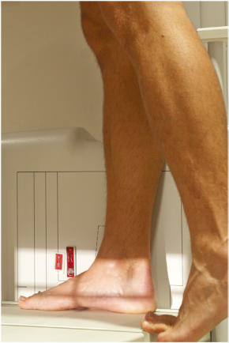
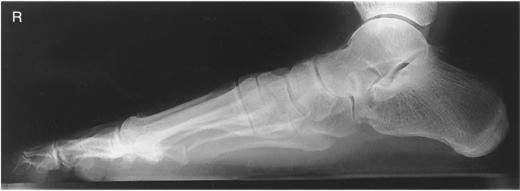
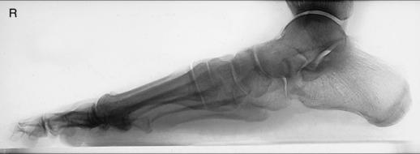

# Rx Picior LATERAL În Încărcare (Ortostatism) Incidență

  📷 Radiografie Convențională (Rx)
  <strong>Actualizat:</strong> 2026-09-15
  <strong>Autor:</strong> Departamentul de Radiologie / Referință Bontrager

---

-   __1. Rezumat Clinic & Indicații__

    ---

    === "Indicații Clinice"

        - evidențiază bones de picioarele la show condition de longitudinal arches under full weight de corp
        - poate evidențiază injury la structural ligaments de Picior such ca Lisfranc articulație injury

    === "Ghid Național IRIS"

        !!! info "Referință Primară: Ghidul Național IRIS (Ordinul MS 1342/2012)"
            - **Capitol Ghid IRIS:** *Ghidul Național IRIS*
            - **Grad de Recomandare:** **De verificat pe indicație; fără grad atribuit automat**
            - **Nivel de Iradiere Estimată:** `De verificat pentru examinarea și populația selectate`

            [:octicons-search-16: Deschide Ghidul IRIS](../../iris.md){ .md-button .md-button--primary } [:material-open-in-new: Aplicația Oficială PWA](https://radiologie-pediatrica.ro/iris/){ .md-button target="_blank" rel="noopener" }
-   __2. Poziționare & Centrare Fascicul__

    ---

    - **Poziție Pacient:** Pacient: Have pacient stand Ortostatism, cu weight plasat pe affected Picior (Fig. 6.69). Have pacient stand pe wood blocks plasat pe step stool sau Picior rest attached la masa de examinare. You also poate use special wooden box cu slot pentru receptorul de imagine. (It has la fie high enough de la floor la get xray tube down into orizontal fascicul poziție.) Provide some support pentru pacient la hold onto pentru security.; Regiune anatomică: Align axa longitudinală de Picior la axa longitudinală de receptorul de imagine. Change receptorul de imagine și turn pacient pentru lateral de other Picior pentru comparison after first lateral has been taken.
    - **Punct de Centrare Fascicul:** Direct raza centrală horizontally la level de base de third metatarsal.
    - **Distanță Focar-Film (DFF / SID):** 100 cm
    - **Comandă Respiratorie:** Apnee pe durata expunerii (sau conform cooperării pacientului)

-   __3. Parametri Tehnici Expunere__

    ---

    | Parametru Tehnic | Valoare Configurare Generator / Tub |
    |:-----------------|:-------------------------------------|
    | **Tensiune Tub (kV)** | 60-70 kV |
    | **Sarcină / Produs Curent-Timp (mAs)** | DE CONFIGURAT PE APARAT |
    | **Distanță Focar-Film (DFF / SID)** | 100 cm |
    | **Grilă Antidifuzoare (Bucky)** | Fără grilă (expunere directă) |
    | **Dimensiune Focar** | Focar Mic (0.6 mm) |
    | **Camere de Ionizare AEC** | DE CONFIGURAT PE APARAT |
    | **Colimare Fascicul** | Collimate la margins de picioare. lateral 24 (30) (24) |
    | **Filtrare Tub** | Totală ≥ 2.5 mm Al echivalent |

-   __4. Criterii de Calitate & Reușită Imagine__

    ---

    - pentru lateral, entire Picior trebuie să fie evidențiat, along cu minimum de 1 inch (2.5 cm) de distal tibiafibula.
    - distal fibula trebuie să fie seen superimposed over posterior half de tibia, și plantar surfaces de heads de oase metatarsiene trebuie să fie superimposed if Absența rotației anatomice: clavicule echidistante față de linia apofizelor spinoase este present.
    - longitudinal arch de Picior trebuie să fie evidențiat în its entirety (Figs. 6.70 și 6.71). poziție:
    - pentru lateral, center de câmp colimat (raza centrală) trebuie să fie la level de base de third metatarsal.
    - Foursided collimation trebuie să include toate surrounding părți moi de la falange la Calcaneu și de la dorsum la plantar surface de Picior cu approximately 1 inch (2.5 cm) de distal tibiafibula evidențiat. expunere:
    - optim receptorul de imagine expunere și contrast la visualize margini de superimposed oase tarsiene și oase metatarsiene.
    - fără mișcare; cortical margins și trabecular markings de Calcaneu și nonsuperimposed portions de other oase tarsiene trebuie să appear sharply defined. Fig. 6.70 Weightbearing lateral. astragal (talus) Navicular articulații metatarsofalangiene (MTF) Base de 5th metastarsal Cuboid Calcaneu 1st cuneiform Fig. 6.71 Weightbearing lateral. Picior SPECIAL
    - AP și lateral (weightbearing) Fig. 6.69 lateral weightbearing—drept Picior (incidență taken pe digital receptorul de imagine).

-   __5. Protecție Radiologică (ALARA)__

    ---

    - Ecranare gonadică și a organelor radiosensibile conform procedurilor locale de radioprotecție ALARA.
    - Colimare strictă la aria de interes pentru limitarea radiației difuze.
    - Verificarea posibilității unei sarcini la pacientele de vârstă fertilă înainte de expunere.

!!! note "Observații Clinice & Tehnice"
    bilateral incidențe de ambele picioare often sunt taken pentru comparison. Some AP routines include separate incidențe de fiecare Picior taken cu raza centrală centrat pe individual Picior.

### 🖼️ Imagini

<figure class="protocol-image-card" markdown>

<figcaption><strong>Fig. 6.70 Weight-</strong> — Poziționare pacient conform Ghidului Bontrager (Fig. 6.70 Weight-)</figcaption>

</figure>

<figure class="protocol-image-card" markdown>

<figcaption><strong>Fig. 6.71 Weight-</strong> — Aspect radiografic de referință conform Ghidului Bontrager (Fig. 6.71 Weight-)</figcaption>

</figure>

<figure class="protocol-image-card" markdown>

<figcaption><strong>Fig. 6.69 lateral weight-</strong> — Aspect radiografic de referință conform Ghidului Bontrager (Fig. 6.69 lateral weight-)</figcaption>

</figure>

=== "Ghid Rapid de Execuție"

    1. **Identificarea și verificarea pacientului:** verificare identitate, zonă de examinat, consimțământ conform procedurii și evaluarea posibilității unei sarcini, când este relevantă.
    2. **Pregătire:** îndepărtarea oricăror obiecte radiopace (bijuterii, agrafe, fermoare, proteze, pansamente dense).
    3. **Poziționare precisă:** alinierea receptorului de imagine și a tubului la distanța prescrisă (100 cm).
    4. **Colimare strictă:** adaptarea fasciculului strict la regiunea de diagnostic pentru scăderea iradierii și reducerea radiației difuze.
    5. **Radioprotecție:** verificarea [politicii RX](../radioprotectie.md), cu măsuri distincte pentru pacient, personal și însoțitor.

## Surse de documentare

- [Bontrager's Textbook of Radiographic Positioning (Ed. 9/10), Pagina 250](https://www.elsevier.com/books/textbook-of-radiographic-positioning-and-related-anatomy/lampignano/978-0-323-65367-1)
