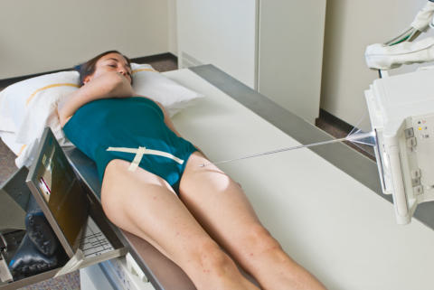
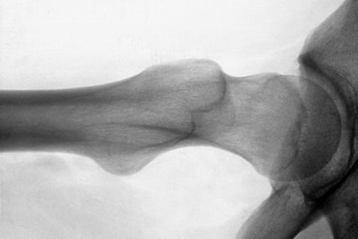

# Rx POSSIBLE traumatism acuttism / Regim Urgență MODIFIED AXIOLATERAL PROJECTION (- Șold AND PROXIMAL Femur)

  📷 Radiografie Convențională (Rx)
  <strong>Actualizat:</strong> 2026-09-15
  <strong>Autor:</strong> Departamentul de Radiologie / Referință Bontrager

---

-   __1. Rezumat Clinic & Indicații__

    ---

    === "Indicații Clinice"

        - Lateral oblique view is useful for assessment of possible Șold suspiciune de fractură or with arthroplasty (surgery for Șold prosthesis) when the patient has limited movement in both lower limbs and the inferosuperior projection cannot be obtained.

    === "Ghid Național IRIS"

        !!! info "Referință Primară: Ghidul Național IRIS (Ordinul MS 1342/2012)"
            - **Capitol Ghid IRIS:** *Ghidul Național IRIS*
            - **Grad de Recomandare:** **De verificat pe indicație; fără grad atribuit automat**
            - **Nivel de Iradiere Estimată:** `De verificat pentru examinarea și populația selectate`

            [:octicons-search-16: Deschide Ghidul IRIS](../../iris.md){ .md-button .md-button--primary } [:material-open-in-new: Aplicația Oficială PWA](https://radiologie-pediatrica.ro/iris/){ .md-button target="_blank" rel="noopener" }
-   __2. Poziționare & Centrare Fascicul__

    ---

    - **Poziție Pacient:** Pacient: With patient Decubit Dorsal, position affected side near edge of table with both legs fully extended. Provide pillow for head and place arms across superior Torace.; Regiune anatomică: Maintain leg in neutral (anatomic) position (15degree posterior
    - **Punct de Centrare Fascicul:** Angle CR mediolaterally as needed so that it is perpendicular to and centered to femoral neck. It should be angled posteriorly 15 to 20 degrees from horizontal.
    - **Distanță Focar-Film (DFF / SID):** 100 cm
    - **Comandă Respiratorie:** Suspend respiration during exposure.

-   __3. Parametri Tehnici Expunere__

    ---

    | Parametru Tehnic | Valoare Configurare Generator / Tub |
    |:-----------------|:-------------------------------------|
    | **Tensiune Tub (kV)** | 80-90 kV |
    | **Sarcină / Produs Curent-Timp (mAs)** | DE CONFIGURAT PE APARAT |
    | **Distanță Focar-Film (DFF / SID)** | 100 cm |
    | **Grilă Antidifuzoare (Bucky)** | Cu grilă antidifuzoare Bucky |
    | **Dimensiune Focar** | Focar Mare (1.0 - 1.2 mm) |
    | **Camere de Ionizare AEC** | Camerele laterale (sau camera centrală funcție de regiune) |
    | **Colimare Fascicul** | Collimate on four sides to anatomy of interest. |
    | **Filtrare Tub** | Totală ≥ 2.5 mm Al echivalent |

-   __4. Criterii de Calitate & Reușită Imagine__

    ---

    - Lateral oblique views of acetabulum, femoral head and neck, and trochanteric area are visible (Figs. 7.80 and 7.81). Position:
    - Femoral head and neck should be seen in profile, with only minimal superimposition by marele trohanter.
    - Lesser trochanter is seen projecting posterior to femoral shaft. (With leg in neutral or anatomic position, the amount of lesser trochanter seen is minimal, and with increased external rotation of leg, this amount decreases.) Femoral neck and trochanters should be centered to the image.
    - Collimation field size to area of interest. Exposure:
    - Optimal image receptor exposure and contrast of the femoral head and neck without overexposing proximal femoral shaft.
    - No excessive grid lines are visible on radiograph.
    - Bony margins and trabecular markings should be visible and sharp, indicating no motion. Șold and Proximal Femur SPECIAL—NONtraumatism acut
    - Modified Cleaves SPECIAL—traumatism acuttism / Regim Urgență
    - Modified axiolateral (clementsnakayama method) Fig. 7.79 Modified axiolateral—CR 15degree tilt from horizontal perpendicular to femoral neck. R Fig. 7.80 Modified axiolateral projection. Acetabulum marele trohanter R Lesser trochanter Ischial tuberosity Femoral neck Femoral head Fig. 7.81 Modified axiolateral projection.

-   __5. Protecție Radiologică (ALARA)__

    ---

    - Ecranare gonadică și a organelor radiosensibile conform procedurilor locale de radioprotecție ALARA.
    - Colimare strictă la aria de interes pentru limitarea radiației difuze.
    - Verificarea posibilității unei sarcini la pacientele de vârstă fertilă înainte de expunere.

### 🖼️ Imagini

<figure class="protocol-image-card" markdown>

<figcaption><strong>Fig. 7.79 Modified axiolateral—CR 15-</strong> — Poziționare pacient conform Ghidului Bontrager (Fig. 7.79 Modified axiolateral—CR 15-)</figcaption>

</figure>

<figure class="protocol-image-card" markdown>

<figcaption><strong>Fig. 7.80 Modified axiolateral projection.</strong> — Aspect radiografic de referință conform Ghidului Bontrager (Fig. 7.80 Modified axiolateral projection.)</figcaption>

</figure>

<figure class="protocol-image-card" markdown>

<figcaption><strong>Fig. 7.81 Modified axiolateral projection.</strong> — Aspect radiografic de referință conform Ghidului Bontrager (Fig. 7.81 Modified axiolateral projection.)</figcaption>

</figure>

<figure class="protocol-image-card" markdown>

<figcaption><strong>Figura 4</strong> — Aspect radiografic de referință conform Ghidului Bontrager (Figura 4)</figcaption>

</figure>

=== "Ghid Rapid de Execuție"

    1. **Identificarea și verificarea pacientului:** verificare identitate, zonă de examinat, consimțământ conform procedurii și evaluarea posibilității unei sarcini, când este relevantă.
    2. **Pregătire:** îndepărtarea oricăror obiecte radiopace (bijuterii, agrafe, fermoare, proteze, pansamente dense).
    3. **Poziționare precisă:** alinierea receptorului de imagine și a tubului la distanța prescrisă (100 cm).
    4. **Colimare strictă:** adaptarea fasciculului strict la regiunea de diagnostic pentru scăderea iradierii și reducerea radiației difuze.
    5. **Radioprotecție:** verificarea [politicii RX](../radioprotectie.md), cu măsuri distincte pentru pacient, personal și însoțitor.

## Surse de documentare

- [Bontrager's Textbook of Radiographic Positioning (Ed. 9/10), Pagina 309](https://www.elsevier.com/books/textbook-of-radiographic-positioning-and-related-anatomy/lampignano/978-0-323-65367-1)
