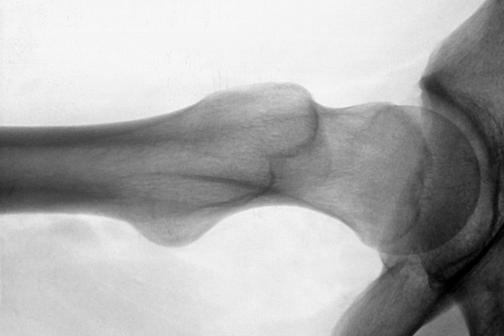

# Rx posibil traumatism acut / regim de urgență — incidență axiolaterală modificată (șold și femur proximal)

  📷 Radiografie Convențională (Rx)
  <strong>Actualizat:</strong> 2026-09-15
  <strong>Autor:</strong> Departamentul de Radiologie / Referință Bontrager

---

-   __1. Rezumat Clinic & Indicații__

    ---

    === "Indicații Clinice"

        - Incidența oblică laterală este utilă pentru evaluarea unei posibile suspiciuni de fractură de șold sau a unei artroplastii (intervenție chirurgicală pentru proteza de șold), atunci când pacientul are mișcare limitată la ambele membre inferioare și incidența inferosuperioară nu poate fi obținută.

    === "Ghid Național IRIS"

        !!! info "Referință Primară: Ghidul Național IRIS (Ordinul MS 1342/2012)"
            - **Capitol Ghid IRIS:** *Aparat locomotor & Bazin*
            - **Grad de Recomandare:** **Grad A**
            - **Nivel de Iradiere Estimată:** `Clasa 2 (Foarte mică ~ 0.8 - 1.0 mSv)`

            [:octicons-search-16: Deschide Ghidul IRIS](../../iris.md){ .md-button .md-button--primary } [:material-open-in-new: Aplicația Oficială PWA](https://radiologie-pediatrica.ro/iris/){ .md-button target="_blank" rel="noopener" }

-   __2. Poziționare & Centrare Fascicul__

    ---

    - **Poziție Pacient:** Pacient: pacientul în decubit dorsal, cu partea afectată aproape de marginea mesei, cu ambele membre inferioare complet extinse. Asigurați o pernă pentru cap și așezați brațele peste toracele superior.; Regiune anatomică: mențineți membrul inferior în poziție neutră (anatomică) (15 grade posterior
    - **Punct de Centrare Fascicul:** Înclinați raza centrală mediolateral, după cum este necesar, astfel încât să fie perpendiculară pe și centrată pe colul femural. Trebuie să fie înclinată posterior cu 15 până la 20 de grade față de orizontală.
    - **Distanță Focar-Film (DFF / SID):** 100 cm
    - **Comandă Respiratorie:** Apnee pe durata expunerii.

-   __3. Parametri Tehnici Expunere__

    ---

    | Parametru Tehnic | Valoare Configurare Generator / Tub |
    |:-----------------|:-------------------------------------|
    | **Tensiune Tub (kV)** | 80-90 kV |
    | **Sarcină / Produs Curent-Timp (mAs)** | DE CONFIGURAT PE APARAT |
    | **Distanță Focar-Film (DFF / SID)** | 100 cm |
    | **Grilă Antidifuzoare (Bucky)** | Cu grilă antidifuzoare Bucky |
    | **Dimensiune Focar** | Focar Mare (1.0 - 1.2 mm) |
    | **Camere de Ionizare AEC** | Camerele laterale (sau camera centrală, în funcție de regiune) |
    | **Colimare Fascicul** | Colimați pe cele patru laturi la anatomia de interes. |
    | **Filtrare Tub** | Totală ≥ 2.5 mm Al echivalent |

-   __4. Criterii de Calitate & Reușită Imagine__

    ---

    - Incidențele oblice laterale ale cotilului (acetabulului), capului și colului femural și regiunii trohanteriene sunt vizibile (Fig. 7.80 și 7.81). Poziție:
    - Capul și colul femural trebuie să fie vizibile din profil, cu doar o suprapunere minimă prin marele trohanter.
    - Micul trohanter este vizibil proiectându-se posterior față de diafiza femurală. (Cu membrul inferior în poziție neutră sau anatomică, cantitatea micului trohanter vizibilă este minimă, iar odată cu creșterea rotației externe a membrului inferior, această cantitate scade.) Colul femural și trohanterii trebuie să fie centrați pe imagine.
    - Dimensiunea câmpului de colimare până la aria de interes diagnostic. Expunere:
    - Expunerea și contrastul optime ale receptorului de imagine pentru capul și colul femural, fără supraexpunerea diafizei femurale proximale.
    - Fără linii excesive ale grilei vizibile pe radiografie.
    - Marginile osoase și desenul trabecular trebuie să fie vizibile și clare, indicând absența mișcării. Șold și femur proximal SPECIAL — fără traumatism acut
    - Cleaves modificat SPECIAL — traumatism acut / regim de urgență
    - Incidență axiolaterală modificată (metoda Clements-Nakayama) Fig. 7.79 Incidență axiolaterală modificată — raza centrală înclinată cu 15 grade față de orizontală, perpendiculară pe colul femural. R Fig. 7.80 Incidență axiolaterală modificată. Cotil (acetabul) Marele trohanter R Micul trohanter Tuberozitățile ischiatice Col femural Cap femural Fig. 7.81 Incidență axiolaterală modificată.

-   __5. Protecție Radiologică (ALARA)__

    ---

    - Ecranare gonadică și a organelor radiosensibile conform procedurilor locale de radioprotecție ALARA.
    - Colimare strictă la aria de interes pentru limitarea radiației difuze.
    - Verificarea posibilității unei sarcini la pacientele de vârstă fertilă înainte de expunere.

### 🖼️ Imagini

<figure class="protocol-image-card" markdown>

![Fig. 7.79 Incidență axiolaterală modificată — raza centrală înclinată cu 15-[fragment deteriorat în sursă]](../../assets/images/protocols/bontrager/rx-possible-traumatism-acuttism-regim-urgenta-modified-axiolateral-projection-sold-and-proximal-femur-bontrager/fig_1.jpeg)

<figcaption><strong>Fig. 7.79 Incidență axiolaterală modificată — raza centrală înclinată cu 15-[fragment deteriorat în sursă]</strong> — Poziționarea pacientului conform Ghidului Bontrager (Fig. 7.79 Incidență axiolaterală modificată — raza centrală înclinată cu 15-[fragment deteriorat în sursă])</figcaption>

</figure>

<figure class="protocol-image-card" markdown>

<figcaption><strong>Fig. 7.80 Incidență axiolaterală modificată.</strong> — Aspect radiografic de referință conform Ghidului Bontrager (Fig. 7.80 Incidență axiolaterală modificată.)</figcaption>

</figure>

<figure class="protocol-image-card" markdown>

<figcaption><strong>Fig. 7.81 Incidență axiolaterală modificată.</strong> — Aspect radiografic de referință conform Ghidului Bontrager (Fig. 7.81 Incidență axiolaterală modificată.)</figcaption>

</figure>

<figure class="protocol-image-card" markdown>

<figcaption><strong>Figura 4</strong> — Aspect radiografic de referință conform Ghidului Bontrager (Figura 4)</figcaption>

</figure>

=== "Ghid Rapid de Execuție"

    1. **Identificarea și verificarea pacientului:** verificare identitate, zonă de examinat, consimțământ conform procedurii și evaluarea posibilității unei sarcini, când este relevantă.
    2. **Pregătire:** îndepărtarea oricăror obiecte radiopace (bijuterii, agrafe, fermoare, proteze, pansamente dense).
    3. **Poziționare precisă:** alinierea receptorului de imagine și a tubului la distanța prescrisă (100 cm).
    4. **Colimare strictă:** adaptarea fasciculului strict la regiunea de diagnostic pentru scăderea iradierii și reducerea radiației difuze.
    5. **Radioprotecție:** verificarea [politicii RX](../radioprotectie.md), cu măsuri distincte pentru pacient, personal și însoțitor.

## Surse de documentare

- [Bontrager's Textbook of Radiographic Positioning (Ed. 9/10), Pagina 309](https://www.elsevier.com/books/textbook-of-radiographic-positioning-and-related-anatomy/lampignano/978-0-323-65367-1)
