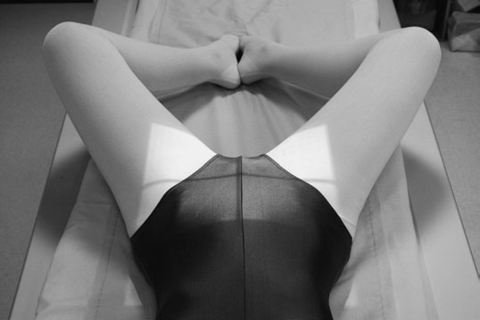
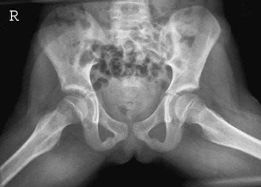

# Rx Profil (Lateral) - both hips (‘frog’s legs Poziționare’)

  📷 Radiografie Convențională (Rx)
  <strong>Actualizat:</strong> 2026-09-16
  <strong>Autor:</strong> Departamentul de Radiologie / Referință Clark (Ed. 12)

---

-   __1. Rezumat Clinic & Indicații__

    ---

    === "Indicații Clinice"

        - When there este freedom de movement, ambele hips poate fie exposed simultaneously pentru general Profil (lateral) incidență de femoral necks și heads. resultant Profil (lateral) Șold imagine este similar la that obtained through Oblică Profil (lateral) incidență (Lauenstein’s) described previously (p. 151). This incidență poate fie used în addition la basic anteroposterior de ambele hips when comparison de ambele hips este required. This poate apply în children, e.g. when diagnosing osteochondritis de capital epiphysis (Perthes’ disease). poziție de pacientul este often referred la ca ‘frog’ poziție. Gonad-protection devices trebuie să fie poziționat correctly și secured firmly. Depending pe age și size de pacientul, either a 43  35-cm sau a 30  40-cm casetă este plasat horizontally în tăvița Bucky.

    === "Ghid Național IRIS"

        !!! info "Referință Primară: Ghidul Național IRIS (Ordinul MS 1342/2012)"
            - **Capitol Ghid IRIS:** *Ghidul Național IRIS*
            - **Grad de Recomandare:** **De verificat pe indicație; fără grad atribuit automat**
            - **Nivel de Iradiere Estimată:** `De verificat pentru examinarea și populația selectate`

            [:octicons-search-16: Deschide Ghidul IRIS](../../iris.md){ .md-button .md-button--primary } [:material-open-in-new: Aplicația Oficială PWA](https://radiologie-pediatrica.ro/iris/){ .md-button target="_blank" rel="noopener" }
-   __2. Poziționare & Centrare Fascicul__

    ---

    - **Poziție Pacient:** • Pacientul este așezat în decubit dorsal pe masa radiologică, cu anterior superior iliac spines echidistant față de tabletop la avoid rotație de Bazin (bazin (pelvis)).
• planul mediosagital este perpendicular pe table și coincident cu centre de masa de examinare Bucky mechanism.
• șoldurile și genunchi sunt flectat și limbs rotit laterally through approximately 60 grade. This movement separates genunchii și brings plantar aspect de picioarele în contact cu fiecare other.
• limbs sunt sprijinit în this poziție prin pads și săculeți cu nisip.
• caseta este centred la nivelul femoral pulse la include ambele Șold articulații.
    - **Punct de Centrare Fascicul:** • Centre în linia mediană la nivelul femoral pulse, cu raza centrală centrală perpendicular pe casetă. Collimate la area under examination.
    - **Distanță Focar-Film (DFF / SID):** 100 cm
    - **Comandă Respiratorie:** Apnee pe durata expunerii (apnee în inspir pentru torace; expir pentru Abdomen/bazin).

-   __3. Parametri Tehnici Expunere__

    ---

    | Parametru Tehnic | Valoare Configurare Generator / Tub |
    |:-----------------|:-------------------------------------|
    | **Tensiune Tub (kV)** | DE CONFIGURAT PE APARAT |
    | **Sarcină / Produs Curent-Timp (mAs)** | Conform AEC / grosime anatomică |
    | **Distanță Focar-Film (DFF / SID)** | 100 cm |
    | **Grilă Antidifuzoare (Bucky)** | Cu grilă antidifuzoare Bucky |
    | **Dimensiune Focar** | Focar Mic (0.6 mm) |
    | **Camere de Ionizare AEC** | Camerele laterale (sau camera centrală funcție de regiune) |
    | **Colimare Fascicul** | Colimare strictă adaptată pe receptor 43 x 35 cm |
    | **Filtrare Tub** | Totală ≥ 2.5 mm Al echivalent (conform Clark: 3.0 mm Al eq.) |

-   __4. Criterii de Calitate & Reușită Imagine__

    ---

    - Vizualizarea clară întregii arii anatomice (Profil (lateral) - ambele hips (‘frog’s membre inferioare).
    - Absența artefactelor de mișcare; trabeculație osoasă și contururi nete.
    - Densitate optică și contrast adecvate pentru diferențierea țesuturilor moi de structurile osoase.

-   __5. Protecție Radiologică (ALARA)__

    ---

    - Gonad protection must be applied correctly and secured firmly in position. 5 Șold (Articulație Coxofemurală) and upper third of Femur 15° 60° Normal radiograph showing both hips in Profil (Lateral) projection (frog legs)
    - Ecranare gonadică cu șorț plumbat dacă gonadele sunt în apropierea fasciculului util (regula ALARA).
    - Colimare precisă la dimensiunea anatomică strict necesară pentru reducerea dozei și a radiației difuze.
    - Verificarea posibilității unei sarcini la pacientele de vârstă fertilă înainte de expunere.

!!! note "Observații Clinice & Tehnice"
    • Profil (lateral) rotație de 60 grade evidențiază Șold articulații.
• modified technique cu limbs rotit laterally through 15 grade și plantar aspect de picioarele în contact cu tabletop evidențiază Col Femural.
• If pacientul este unable la achieve 60-grade rotație, it este important la apply same grade de rotație la ambele limbs fără losing symmetry.
• în very young children, Bucky grilă este nu required. child poate fie plasat directly pe la X-ray casetă.
154

### 🖼️ Imagini

<figure class="protocol-image-card" markdown>

<figcaption><strong>radiografie de Șold în children este discussed în detail în</strong> — Poziționare pacient și centrare fascicul conform Clark (Ed. 12)</figcaption>

</figure>

<figure class="protocol-image-card" markdown>

<figcaption><strong>Normal radiografie evidențiind ambele hips în Profil (lateral) incidență (frog membre inferioare)</strong> — Aspect radiografic / ghid de poziționare conform tratatului Clark (Ed. 12)</figcaption>

</figure>

=== "Ghid Rapid de Execuție"

    1. **Identificarea și verificarea pacientului:** verificare identitate, zonă de examinat, consimțământ conform procedurii și evaluarea posibilității unei sarcini, când este relevantă.
    2. **Pregătire:** îndepărtarea oricăror obiecte radiopace (bijuterii, agrafe, fermoare, proteze, pansamente dense).
    3. **Poziționare precisă:** alinierea receptorului de imagine și a tubului la distanța prescrisă (100 cm).
    4. **Colimare strictă:** adaptarea fasciculului strict la regiunea de diagnostic pentru scăderea iradierii și reducerea radiației difuze.
    5. **Radioprotecție:** verificarea [politicii RX](../radioprotectie.md), cu măsuri distincte pentru pacient, personal și însoțitor.

## Surse de documentare

- [Clark's Positioning in Radiography (Ed. 12), Pagina 169](../../assets/protocols/sources/Clark___Positioning_in_Radiography__12th_edition.pdf#page=169)
