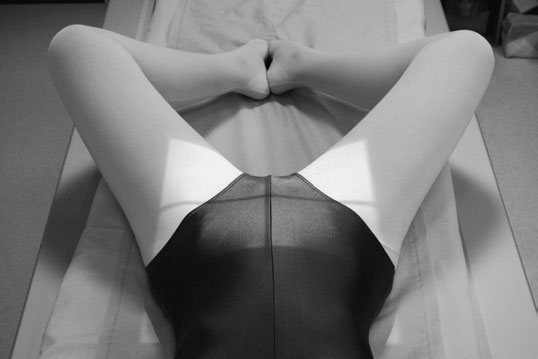
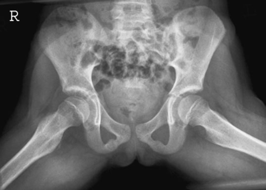

# Rx profil (lateral) — ambele șolduri (poziționarea membrelor inferioare în poziție de broască)

  📷 Radiografie Convențională (Rx)
  <strong>Actualizat:</strong> 2026-09-16
  <strong>Autor:</strong> Departamentul de Radiologie / Referință Clark (Ed. 12)

---

-   __1. Rezumat Clinic & Indicații__

    ---

    === "Indicații Clinice"

        - Când există libertate de mișcare, ambele șolduri pot fi expuse simultan pentru o incidență generală de profil a colurilor și capetelor femurale. Imaginea de profil a șoldurilor rezultată este similară cu cea obținută prin incidența oblică de profil (Lauenstein), descrisă anterior (p. 151). Această incidență poate fi utilizată în plus față de incidența de bază anteroposterioară a ambelor șolduri, atunci când este necesară compararea ambelor șolduri. Aceasta se poate aplica la copii, de exemplu la diagnosticarea osteocondritei epifizei capitale (boala Perthes). Poziția pacientului este adesea denumită poziția „broască”. Dispozitivele de protecție gonadică trebuie poziționate corect și fixate ferm. În funcție de vârsta și dimensiunea pacientului, fie o casetă de 43 × 35 cm, fie una de 30 × 40 cm este plasată orizontal în tava Bucky.

    === "Ghid Național IRIS"

        !!! info "Referință Primară: Ghidul Național IRIS (Ordinul MS 1342/2012)"
            - **Capitol Ghid IRIS:** *Aparat locomotor & Bazin*
            - **Grad de Recomandare:** **Grad A**
            - **Nivel de Iradiere Estimată:** `Clasa 2 (Foarte mică ~ 0.8 - 1.0 mSv)`

            [:octicons-search-16: Deschide Ghidul IRIS](../../iris.md){ .md-button .md-button--primary } [:material-open-in-new: Aplicația Oficială PWA](https://radiologie-pediatrica.ro/iris/){ .md-button target="_blank" rel="noopener" }

-   __2. Poziționare & Centrare Fascicul__

    ---

    - **Poziție Pacient:**
        - Pacientul este așezat în decubit dorsal pe masa radiologică, cu spinele iliace anterosuperioare echidistante față de masa radiologică, pentru a evita rotația bazinului (pelvisului).
        - Planul mediosagital este perpendicular pe masă și coincide cu centrul mecanismului Bucky al mesei de examinare.
        - Șoldurile și genunchii sunt flectați, iar membrele sunt rotite lateral cu aproximativ 60 de grade. Această mișcare separă genunchii și aduce suprafețele plantare ale picioarelor în contact una cu cealaltă.
        - Membrele sunt sprijinite în această poziție prin tampoane și săculeți cu nisip.
        - Caseta este centrată la nivelul pulsului femural pentru a include ambele articulații ale șoldurilor.
    - **Punct de Centrare Fascicul:** • Centrați pe linia mediană, la nivelul pulsului femural, cu raza centrală perpendiculară pe casetă. Colimați la aria examinată.
    - **Distanță Focar-Film (DFF / SID):** 100 cm
    - **Comandă Respiratorie:** Apnee pe durata expunerii (apnee în inspir pentru torace; expir pentru Abdomen/bazin).

-   __3. Parametri Tehnici Expunere__

    ---

    | Parametru Tehnic | Valoare Configurare Generator / Tub |
    |:-----------------|:-------------------------------------|
    | **Tensiune Tub (kV)** | DE CONFIGURAT PE APARAT |
    | **Sarcină / Produs Curent-Timp (mAs)** | Conform AEC / grosimii anatomice |
    | **Distanță Focar-Film (DFF / SID)** | 100 cm |
    | **Grilă Antidifuzoare (Bucky)** | Cu grilă antidifuzoare Bucky |
    | **Dimensiune Focar** | Focar Mic (0.6 mm) |
    | **Camere de Ionizare AEC** | Camerele laterale (sau camera centrală, în funcție de regiune) |
    | **Colimare Fascicul** | Colimare strictă adaptată pe receptorul de 43 × 35 cm |
    | **Filtrare Tub** | Totală ≥ 2.5 mm Al echivalent (conform Clark: 3.0 mm Al echivalent) |

-   __4. Criterii de Calitate & Reușită Imagine__

    ---

    - Vizualizarea clară a întregii arii anatomice (profil lateral — ambele șolduri, membre inferioare în poziție de broască).
    - Absența artefactelor de mișcare; trabeculație osoasă și contururi nete.
    - Densitate optică și contrast adecvate pentru diferențierea țesuturilor moi de structurile osoase.

-   __5. Protecție Radiologică (ALARA)__

    ---

    - Protecția gonadică trebuie aplicată corect și fixată ferm în poziție. 5 Șold (articulație coxofemurală) și treimea superioară a femurului 15° 60° Radiografie normală care evidențiază ambele șolduri în incidență de profil (membre inferioare în poziție de broască)
    - Ecranare gonadică cu șorț plumbat dacă gonadele sunt în apropierea fasciculului util (regula ALARA).
    - Colimare precisă la dimensiunea anatomică strict necesară pentru reducerea dozei și a radiației difuze.
    - Verificarea posibilității unei sarcini la pacientele de vârstă fertilă înainte de expunere.

!!! note "Observații Clinice & Tehnice"
    - Rotația de profil de 60 de grade evidențiază articulațiile șoldurilor.
    - Tehnica modificată, cu membrele rotite lateral cu 15 grade și suprafețele plantare ale picioarelor în contact cu masa radiologică, evidențiază colul femural.
    - Dacă pacientul nu poate realiza rotația de 60 de grade, este important să se aplice același grad de rotație ambelor membre, fără pierderea simetriei.
    - La copiii foarte mici, grila Bucky nu este necesară. Copilul poate fi așezat direct pe caseta radiologică. 154

### 🖼️ Imagini

<figure class="protocol-image-card" markdown>

<figcaption><strong>Radiografia șoldului la copii este discutată în detaliu în</strong> — Poziționarea pacientului și centrarea fasciculului conform Clark (Ed. 12)</figcaption>

</figure>

<figure class="protocol-image-card" markdown>

<figcaption><strong>Radiografie normală care evidențiază ambele șolduri în incidență de profil (membre inferioare în poziție de broască)</strong> — Aspect radiografic / ghid de poziționare conform tratatului Clark (Ed. 12)</figcaption>

</figure>

=== "Ghid Rapid de Execuție"

    1. **Identificarea și verificarea pacientului:** verificare identitate, zonă de examinat, consimțământ conform procedurii și evaluarea posibilității unei sarcini, când este relevantă.
    2. **Pregătire:** îndepărtarea oricăror obiecte radiopace (bijuterii, agrafe, fermoare, proteze, pansamente dense).
    3. **Poziționare precisă:** alinierea receptorului de imagine și a tubului la distanța prescrisă (100 cm).
    4. **Colimare strictă:** adaptarea fasciculului strict la regiunea de diagnostic pentru scăderea iradierii și reducerea radiației difuze.
    5. **Radioprotecție:** verificarea [politicii RX](../radioprotectie.md), cu măsuri distincte pentru pacient, personal și însoțitor.

## Surse de documentare

- [Clark's Positioning in Radiography (Ed. 12), Pagina 169](https://books.google.com/books/about/Clark_s_Positioning_in_Radiography.html?id=Xxu6MwEACAAJ)
