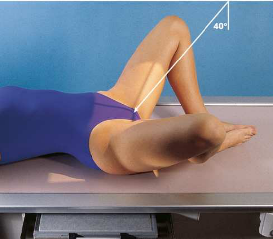

# Rx Proximal Femora and Femoral Necks — Axiolateral Incidență — Original Cleaves Method 5 (Merrill)

  📷 Radiografie Convențională (Rx)
  <strong>Actualizat:</strong> 2026-09-16
  <strong>Autor:</strong> Referință Merrill

---

-   __1. Rezumat Clinic & Indicații__

    ---

    === "Indicații Clinice"

        - Conform reperelor anatomice standard din tratat

    === "Ghid Național IRIS"

        !!! info "Referință Primară: Ghidul Național IRIS (Ordinul MS 1342/2012)"
            - **Capitol Ghid IRIS:** *Ghidul Național IRIS*
            - **Grad de Recomandare:** **De verificat pe indicație; fără grad atribuit automat**
            - **Nivel de Iradiere Estimată:** `De verificat pentru examinarea și populația selectate`

            [:octicons-search-16: Deschide Ghidul IRIS](../../iris.md){ .md-button .md-button--primary } [:material-open-in-new: Aplicația Oficială PWA](https://radiologie-pediatrica.ro/iris/){ .md-button target="_blank" rel="noopener" }
-   __2. Poziționare & Centrare Fascicul__

    ---

    - **Poziție Pacient:** se așază pacientul în Decubit dorsal poziție.; Conform reperelor anatomice standard din tratat
    - **Punct de Centrare Fascicul:** paralel cu femoral shafts. According la Cleaves, 5 angle poate vary între 25 și 45 grade, depending pe how vertically femora poate fie plasat.
    - **Distanță Focar-Film (DFF / SID):** Nespecificat în fragmentul extras; de verificat în sursă
    - **Comandă Respiratorie:** apnee (oprirea respirației).

-   __3. Parametri Tehnici Expunere__

    ---

    | Parametru Tehnic | Valoare Configurare Generator / Tub |
    |:-----------------|:-------------------------------------|
    | **Tensiune Tub (kV)** | DE CONFIGURAT PE APARAT |
    | **Sarcină / Produs Curent-Timp (mAs)** | DE CONFIGURAT PE APARAT |
    | **Distanță Focar-Film (DFF / SID)** | Nespecificat în fragmentul extras; de verificat în sursă |
    | **Grilă Antidifuzoare (Bucky)** | DE CONFIGURAT PE APARAT |
    | **Dimensiune Focar** | DE CONFIGURAT PE APARAT |
    | **Camere de Ionizare AEC** | DE CONFIGURAT PE APARAT |
    | **Colimare Fascicul** | Se ajustează câmpul de iradiere la formatul 35 × 43 cm pe colimator. pentru smaller pacienți, collimate 1 inch (2.5 cm) beyond skin shadow pe sides. Se plasează markerul de lateralitate în câmpul colimat. |
    | **Filtrare Tub** | DE CONFIGURAT PE APARAT |

-   __4. Criterii de Calitate & Reușită Imagine__

    ---

    - Criterii radiologice de calitate imaginii:
    - Colimare adecvată vizibilă și prezența markerului de lateralitate (D/S) plasat clear de anatomy de interest
    - Absența rotației anatomice (simetrie bilaterală perfectă) de Bazin (bazin (pelvis)), ca evidențiat prin simetric appearance
    - Axiolateral incidențe de femoral necks
    - Femoral necks fără overlap de la greater trochanters
    - Small parts de lesser trochanters pe posterior surfaces de femora
    - Small parts de greater trochanters pe posterior și anterior surfaces de femora
    - ambele părți (bilateral) echidistant față de edge de radiografie
    - Greater amount de proximal Femur pe unilateral examination
    - col femural angles approximately 15 la 20 grade superior la femoral corpuri
    - Bony detalii trabeculare osoase și surrounding soft tissues Congenital luxație articulară de Șold diagnosis de congenital luxație articulară de Șold în newborns has been discussed în numerous articles. Andren și von Rosén 6 described method that este based pe certain theoretic considerations. Their method requires precis și judicious application de positioning technique la make precis diagnosis. Andren–von Rosén approach involves taking bilateral Șold incidență cu ambele membre inferioare forcibly în abducție la least 45 grade cu appreciable inward rotație de femora. Knake și Kuhns 7 described construction de device that controlled grade de abduction și rotație de ambele limbs. They reported that device essentially eliminated și greatly simplified positioning dificulties, reducing number de repeat examinations.

-   __5. Protecție Radiologică (ALARA)__

    ---

    - Nespecificat în fragmentul extras; de verificat în sursă

!!! note "Observații Clinice & Tehnice"
    This examination este contraindicated pentru pacienți cu suspected suspiciune de fractură sau pathologic condition. This este same part poziție ca modified Cleaves method previously described. incidență poate fie performed unilaterally sau bilaterally. Before having pacientul abduct thighs (described în step 3 pe p. 398), direct x-ray tube paralel cu long axes de femoral shafts (Fig. 8.25). se ajustează receptorul de imagine astfel încât midpoint coincides cu raza centrală centrală.

### 🖼️ Imagini

<figure class="protocol-image-card" markdown>

<figcaption><strong>Merrill — pagina PDF 621, imaginea 1</strong> — Imagine din fragmentul sursă; asocierea necesită revizie.</figcaption>

</figure>

=== "Ghid Rapid de Execuție"

    1. **Identificarea și verificarea pacientului:** verificare identitate, zonă de examinat, consimțământ conform procedurii și evaluarea posibilității unei sarcini, când este relevantă.
    2. **Pregătire:** îndepărtarea oricăror obiecte radiopace (bijuterii, agrafe, fermoare, proteze, pansamente dense).
    3. **Poziționare precisă:** alinierea receptorului de imagine și a tubului la distanța prescrisă (Nespecificat în fragmentul extras; de verificat în sursă).
    4. **Colimare strictă:** adaptarea fasciculului strict la regiunea de diagnostic pentru scăderea iradierii și reducerea radiației difuze.
    5. **Radioprotecție:** verificarea [politicii RX](../radioprotectie.md), cu măsuri distincte pentru pacient, personal și însoțitor.

## Surse de documentare

- [Merrill’s Atlas, 8. Pelvis and Hip, pagini PDF 620–621](../../assets/protocols/sources/a56d45c16829_Merrills_Atlas_of_Radiographic_Positioning__Procedures_3Vol_Set.pdf#page=620)

## Fragmente sursă traduse (referință tehnică)

### anatomy

axiolateral incidență de femoral heads, necks, și trochanteric areas (Fig. 8.26).

### collimation

• Se ajustează câmpul de iradiere la formatul 35 × 43 cm pe colimator. pentru smaller pacienți, collimate 1 inch (2.5 cm) beyond skin
shadow pe sides. Se plasează markerul de lateralitate în câmpul colimat.

### cr

• paralel cu femoral shafts. According la Cleaves, 5 angle poate vary între 25 și 45 grade, depending pe how vertically femora poate fie plasat.

### criteria

Criterii radiologice de calitate imaginii:
• Colimare adecvată vizibilă și prezența markerului de lateralitate (D/S) plasat clear de anatomy de interest
• Absența rotației anatomice (simetrie bilaterală perfectă) de bazinul, ca evidențiat prin simetric appearance
• Axiolateral incidențe de femoral necks
• Femoral necks fără overlap de la greater trochanters
• Small parts de lesser trochanters pe posterior surfaces de femora
• Small parts de greater trochanters pe posterior și anterior surfaces de femora
• ambele părți (bilateral) echidistant față de edge de radiografie
• Greater amount de proximal femur pe unilateral examination
• col femural angles approximately 15 la 20 grade superior la femoral corpuri
• Bony detalii trabeculare osoase și surrounding soft tissues
Congenital luxație articulară de hip
diagnosis de congenital luxație articulară de hip în newborns has been discussed în numerous articles. Andren și von Rosén 6 described method that este based pe certain theoretic considerations. Their method requires precis și judicious application de positioning technique
la make precis diagnosis. Andren–von Rosén approach involves taking bilateral hip incidență cu ambele membre inferioare forcibly în abducție la
least 45 grade cu appreciable inward rotație de femora. Knake și Kuhns 7 described construction de device that controlled grade de abduction și rotație de ambele limbs. They reported that device essentially eliminated și greatly simplified positioning
dificulties, reducing number de repeat examinations.

### notes

This examination este contraindicated pentru pacienți cu suspected suspiciune de fractură sau pathologic condition.
This este same part poziție ca modified Cleaves method previously described. incidență poate fie performed unilaterally sau
bilaterally.
• Before having pacientul abduct thighs (described în step 3 pe p. 398), direct x-ray tube paralel cu long axes de femoral
shafts (Fig. 8.25).
• se ajustează receptorul de imagine astfel încât midpoint coincides cu raza centrală centrală.

### part_pos

### patient_pos

• se așază pacientul în decubit dorsal.

### respiration

apnee (oprirea respirației).

### tech

poziționat prin manufacturer sau department protocol pentru corect anatomy display orientation; raza centrală plate: 14 × 17 inches (35
× 43 cm) transversal.

