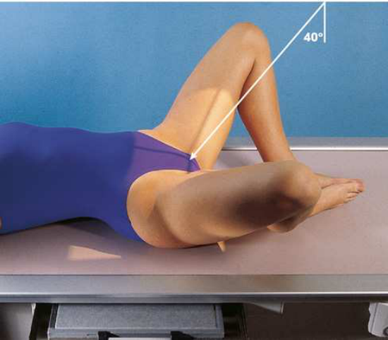

# Rx femururi proximale și coluri femurale — incidență axiolaterală — metoda originală Cleaves 5 (Merrill)

  📷 Radiografie Convențională (Rx)
  <strong>Actualizat:</strong> 2026-09-16
  <strong>Autor:</strong> Referință Merrill

---

-   __1. Rezumat Clinic & Indicații__

    ---

    === "Indicații Clinice"

        - Conform reperelor anatomice standard din tratat

    === "Ghid Național IRIS"

        !!! info "Referință Primară: Ghidul Național IRIS (Ordinul MS 1342/2012)"
            - **Capitol Ghid IRIS:** *Aparat locomotor & Membru inferior*
            - **Grad de Recomandare:** **Grad A**
            - **Nivel de Iradiere Estimată:** `Clasa 1 (Minimă < 0.05 mSv)`

            [:octicons-search-16: Deschide Ghidul IRIS](../../iris.md){ .md-button .md-button--primary } [:material-open-in-new: Aplicația Oficială PWA](https://radiologie-pediatrica.ro/iris/){ .md-button target="_blank" rel="noopener" }

-   __2. Poziționare & Centrare Fascicul__

    ---

    - **Poziție Pacient:** Pacientul este așezat în decubit dorsal.; Conform reperelor anatomice standard din tratat
    - **Punct de Centrare Fascicul:** Paralel cu diafizele femurale. Conform lui Cleaves, unghiul 5 poate varia între 25 și 45 de grade, în funcție de cât de vertical pot fi poziționate femurele.
    - **Distanță Focar-Film (DFF / SID):** Nespecificat în fragmentul extras; de verificat în sursă
    - **Comandă Respiratorie:** apnee (oprirea respirației).

-   __3. Parametri Tehnici Expunere__

    ---

    | Parametru Tehnic | Valoare Configurare Generator / Tub |
    |:-----------------|:-------------------------------------|
    | **Tensiune Tub (kV)** | DE CONFIGURAT PE APARAT |
    | **Sarcină / Produs Curent-Timp (mAs)** | DE CONFIGURAT PE APARAT |
    | **Distanță Focar-Film (DFF / SID)** | Nespecificat în fragmentul extras; de verificat în sursă |
    | **Grilă Antidifuzoare (Bucky)** | DE CONFIGURAT PE APARAT |
    | **Dimensiune Focar** | DE CONFIGURAT PE APARAT |
    | **Camere de Ionizare AEC** | DE CONFIGURAT PE APARAT |
    | **Colimare Fascicul** | Se ajustează câmpul de iradiere la formatul 35 × 43 cm pe colimator. Pentru pacienții mai mici, se colimează la 1 țol (2.5 cm) dincolo de umbra cutanată pe părți. Se plasează markerul de lateralitate în câmpul colimat. |
    | **Filtrare Tub** | DE CONFIGURAT PE APARAT |

-   __4. Criterii de Calitate & Reușită Imagine__

    ---

    - Criterii radiologice de calitate a imaginii:
    - Colimare adecvată vizibilă și prezența markerului de lateralitate (D/S) plasat în afara structurilor anatomice de interes
    - Absența rotației anatomice (simetrie bilaterală perfectă) a bazinului (pelvisului), evidențiată prin aspect simetric
    - Incidențe axiolaterale ale colurilor femurale
    - Colurile femurale fără suprapunere peste trohanterii mari
    - Porțiuni mici ale trohanterilor mici pe suprafețele posterioare ale femururilor
    - Porțiuni mici ale trohanterilor mari pe suprafețele posterioare și anterioare ale femururilor
    - Ambele părți (bilateral) echidistante față de marginea radiografiei
    - Cantitate mai mare de femur proximal în examinarea unilaterală
    - Unghiurile colului femural sunt de aproximativ 15 până la 20 de grade superior față de corpurile femurale
    - Detalii osoase trabeculare și țesuturile moi din jur. Diagnosticul luxației congenitale a șoldului la nou-născuți a fost discutat în numeroase articole. Andren și von Rosén 6 au descris o metodă bazată pe anumite considerații teoretice. Metoda lor necesită aplicarea precisă și judicioasă a tehnicii de poziționare pentru stabilirea unui diagnostic precis. Abordarea Andren–von Rosén presupune efectuarea unei incidențe bilaterale a șoldurilor, cu ambele membre inferioare forțat în abducție de cel puțin 45 de grade, cu rotație medială apreciabilă a femururilor. Knake și Kuhns 7 au descris construirea unui dispozitiv care controla gradul de abducție și rotație al ambelor membre. Ei au raportat că dispozitivul elimina practic și simplifica considerabil dificultățile de poziționare, reducând numărul examinărilor repetate.

-   __5. Protecție Radiologică (ALARA)__

    ---

    - Nespecificat în fragmentul extras; de verificat în sursă

!!! note "Observații Clinice & Tehnice"
    Această examinare este contraindicată la pacienții cu suspiciune de fractură sau afecțiune patologică. Aceasta este aceeași poziție ca în metoda Cleaves modificată descrisă anterior. Incidența poate fi efectuată unilateral sau bilateral. Înainte de abductarea coapselor pacientului (descrisă la pasul 3, la p. 398), orientați tubul radiologic paralel cu axele lungi ale diafizelor femurale (Fig. 8.25). Ajustați receptorul de imagine astfel încât punctul său median să coincidă cu raza centrală.

### 🖼️ Imagini

<figure class="protocol-image-card" markdown>

<figcaption><strong>Merrill — pagina 621, imaginea 1</strong> — Imagine din fragmentul sursă; asocierea necesită revizie.</figcaption>

</figure>

=== "Ghid Rapid de Execuție"

    1. **Identificarea și verificarea pacientului:** verificare identitate, zonă de examinat, consimțământ conform procedurii și evaluarea posibilității unei sarcini, când este relevantă.
    2. **Pregătire:** îndepărtarea oricăror obiecte radiopace (bijuterii, agrafe, fermoare, proteze, pansamente dense).
    3. **Poziționare precisă:** alinierea receptorului de imagine și a tubului la distanța prescrisă (Nespecificat în fragmentul extras; de verificat în sursă).
    4. **Colimare strictă:** adaptarea fasciculului strict la regiunea de diagnostic pentru scăderea iradierii și reducerea radiației difuze.
    5. **Radioprotecție:** verificarea [politicii RX](../radioprotectie.md), cu măsuri distincte pentru pacient, personal și însoțitor.

## Surse de documentare

- [Merrill’s Atlas, 8. Pelvis and Hip, pagini 620–621](https://books.google.com/books/about/Merrill_s_Atlas_of_Radiographic_Position.html?id=BM0lEQAAQBAJ)
