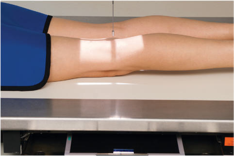
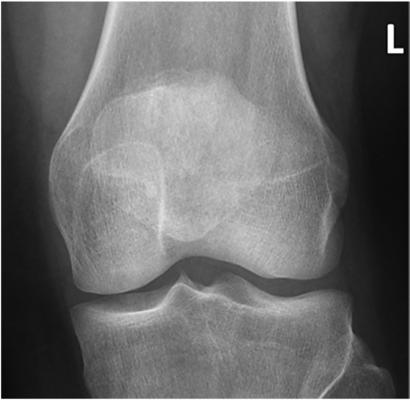

# Rx Rotulă (Patelă) AND PATELLOFEMORAL JOINT PA (Postero-Anterior)

  📷 Radiografie Convențională (Rx)
  <strong>Actualizat:</strong> 2026-09-15
  <strong>Autor:</strong> Departamentul de Radiologie / Referință Bontrager

---

-   __1. Rezumat Clinic & Indicații__

    ---

    === "Indicații Clinice"

        - Evaluation of patellar suspiciune de fractură before Genunchi joint is flexed for other projections

    === "Ghid Național IRIS"

        !!! info "Referință Primară: Ghidul Național IRIS (Ordinul MS 1342/2012)"
            - **Capitol Ghid IRIS:** *Ghidul Național IRIS*
            - **Grad de Recomandare:** **De verificat pe indicație; fără grad atribuit automat**
            - **Nivel de Iradiere Estimată:** `De verificat pentru examinarea și populația selectate`

            [:octicons-search-16: Deschide Ghidul IRIS](../../iris.md){ .md-button .md-button--primary } [:material-open-in-new: Aplicația Oficială PWA](https://radiologie-pediatrica.ro/iris/){ .md-button target="_blank" rel="noopener" }
-   __2. Poziționare & Centrare Fascicul__

    ---

    - **Poziție Pacient:** Pacient: Place patient in Decubit Ventral position, legs extended; provide a pillow for patient’s head; place support under Gleznă (Articulație Talocrurală) and Gambă, with smaller support under Femur above Genunchi to prevent direct pressure on Rotulă (Patelă).; Regiune anatomică: Align and center long axis of leg and Genunchi to midline of table or IR (Fig. 6.130). True PA: Align interepicondylar line parallel to plane of IR. (This usually requires about 5° internal rotation of anterior Genunchi.)
    - **Punct de Centrare Fascicul:** is perpendicular to IR. Direct CR to midpatella area (which is usually at approximately the midpopliteal crease).
    - **Distanță Focar-Film (DFF / SID):** 100 cm
    - **Comandă Respiratorie:** Apnee pe durata expunerii (sau conform cooperării pacientului)

-   __3. Parametri Tehnici Expunere__

    ---

    | Parametru Tehnic | Valoare Configurare Generator / Tub |
    |:-----------------|:-------------------------------------|
    | **Tensiune Tub (kV)** | 70-80 kV |
    | **Sarcină / Produs Curent-Timp (mAs)** | DE CONFIGURAT PE APARAT |
    | **Distanță Focar-Film (DFF / SID)** | 100 cm |
    | **Grilă Antidifuzoare (Bucky)** | Fără grilă (expunere directă) |
    | **Dimensiune Focar** | Focar Mic (0.6 mm) |
    | **Camere de Ionizare AEC** | DE CONFIGURAT PE APARAT |
    | **Colimare Fascicul** | Collimate closely on four sides to include just the area of the Rotulă (Patelă) and Genunchi joint. |
    | **Filtrare Tub** | Totală ≥ 2.5 mm Al echivalent |

-   __4. Criterii de Calitate & Reușită Imagine__

    ---

    - Genunchi joint and Rotulă (Patelă) are shown, with optimal recorded detail of Rotulă (Patelă) because of decreased OID if taken as Incidență Postero-Anterioară (PA) (Fig. 6.131). Position:
    - Absența rotației anatomice: clavicule echidistante față de linia apofizelor spinoase is present, as evidenced by symmetric appearance of condyles.
    - Rotulă (Patelă) is centered to Femur with correct slight internal rotation of anterior Genunchi.
    - Rotulă (Patelă) is in center of collimated field. Exposure:
    - Optimal image receptor exposure and contrast without motion visualizes soft tissue in joint area and clearly visualizes Contururi osoase și travee trabeculare nete, fără artefacte de mișcare and outline of Rotulă (Patelă) as seen through distal Femur.

-   __5. Protecție Radiologică (ALARA)__

    ---

    - Ecranare gonadică și a organelor radiosensibile conform procedurilor locale de radioprotecție ALARA.
    - Colimare strictă la aria de interes pentru limitarea radiației difuze.
    - Verificarea posibilității unei sarcini la pacientele de vârstă fertilă înainte de expunere.

!!! note "Observații Clinice & Tehnice"
    With potential suspiciune de fractură of the Rotulă (Patelă), extra care should be taken not to flex Genunchi and provide support under thigh (Femur) so as not to put direct pressure on patellar area. The projection also may be taken as an Incidență Antero-Posterioară (AP) positioned similar to an AP Genunchi if patient cannot assume a Decubit Ventral position. Rotulă (Patelă) PA Lateral Tangential Fig. 6.130 PA Rotulă (Patelă)—CR 0° to midpatella. Fig. 6.131 PA Rotulă (Patelă). (Courtesy Joss Wertz, DO.)

### 🖼️ Imagini

<figure class="protocol-image-card" markdown>

<figcaption><strong>Fig. 6.130 PA Rotulă (Patelă)—CR 0° to midpatella.</strong> — Poziționare pacient conform Ghidului Bontrager (Fig. 6.130 PA patella—CR 0° to midpatella.)</figcaption>

</figure>

<figure class="protocol-image-card" markdown>

<figcaption><strong>Fig. 6.131 PA Rotulă (Patelă). (Courtesy Joss Wertz, DO.)</strong> — Aspect radiografic de referință conform Ghidului Bontrager (Fig. 6.131 PA patella. (Courtesy Joss Wertz, DO.))</figcaption>

</figure>

=== "Ghid Rapid de Execuție"

    1. **Identificarea și verificarea pacientului:** verificare identitate, zonă de examinat, consimțământ conform procedurii și evaluarea posibilității unei sarcini, când este relevantă.
    2. **Pregătire:** îndepărtarea oricăror obiecte radiopace (bijuterii, agrafe, fermoare, proteze, pansamente dense).
    3. **Poziționare precisă:** alinierea receptorului de imagine și a tubului la distanța prescrisă (100 cm).
    4. **Colimare strictă:** adaptarea fasciculului strict la regiunea de diagnostic pentru scăderea iradierii și reducerea radiației difuze.
    5. **Radioprotecție:** verificarea [politicii RX](../radioprotectie.md), cu măsuri distincte pentru pacient, personal și însoțitor.

## Surse de documentare

- [Bontrager's Textbook of Radiographic Positioning (Ed. 9/10), Pagina 271](https://www.elsevier.com/books/textbook-of-radiographic-positioning-and-related-anatomy/lampignano/978-0-323-65367-1)
