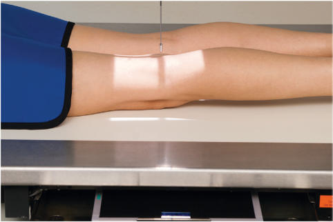
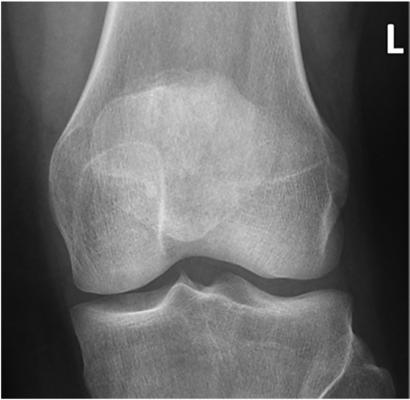

# Rx rotulă și articulația patelofemurală PA (posteroanterior)

  📷 Radiografie Convențională (Rx)
  <strong>Actualizat:</strong> 2026-09-15
  <strong>Autor:</strong> Departamentul de Radiologie / Referință Bontrager

---

-   __1. Rezumat Clinic & Indicații__

    ---

    === "Indicații Clinice"

        - Evaluarea unei suspiciuni de fractură a rotulei înainte ca articulația genunchiului să fie flectată pentru celelalte incidențe

    === "Ghid Național IRIS"

        !!! info "Referință Primară: Ghidul Național IRIS (Ordinul MS 1342/2012)"
            - **Capitol Ghid IRIS:** *Aparat locomotor & Membru inferior*
            - **Grad de Recomandare:** **Grad A**
            - **Nivel de Iradiere Estimată:** `Clasa 1 (Minimă < 0.05 mSv)`

            [:octicons-search-16: Deschide Ghidul IRIS](../../iris.md){ .md-button .md-button--primary } [:material-open-in-new: Aplicația Oficială PWA](https://radiologie-pediatrica.ro/iris/){ .md-button target="_blank" rel="noopener" }

-   __2. Poziționare & Centrare Fascicul__

    ---

    - **Poziție Pacient:** Pacient: Așezați pacientul în decubit ventral, cu membrele inferioare extinse; puneți o pernă sub capul pacientului; așezați un suport sub gleznă și gambă, cu un suport mai mic sub femur, deasupra genunchiului, pentru a preveni presiunea directă asupra rotulei.; Regiune anatomică: Aliniați și centrați axa longitudinală a membrului inferior și genunchiul pe linia mediană a mesei sau a receptorului de imagine (Fig. 6.130). PA adevărată: Aliniați linia interepicondiliană paralel cu planul receptorului de imagine. (De obicei, aceasta necesită aproximativ 5° de rotație medială a genunchiului anterior.)
    - **Punct de Centrare Fascicul:** este perpendiculară pe receptorul de imagine. Orientați raza centrală spre regiunea mediană a rotulei (care se află de obicei aproximativ la nivelul pliului popliteu median).
    - **Distanță Focar-Film (DFF / SID):** 100 cm
    - **Comandă Respiratorie:** Apnee pe durata expunerii (sau conform cooperării pacientului)

-   __3. Parametri Tehnici Expunere__

    ---

    | Parametru Tehnic | Valoare Configurare Generator / Tub |
    |:-----------------|:-------------------------------------|
    | **Tensiune Tub (kV)** | 70-80 kV |
    | **Sarcină / Produs Curent-Timp (mAs)** | DE CONFIGURAT PE APARAT |
    | **Distanță Focar-Film (DFF / SID)** | 100 cm |
    | **Grilă Antidifuzoare (Bucky)** | Fără grilă (expunere directă) |
    | **Dimensiune Focar** | Focar Mic (0.6 mm) |
    | **Camere de Ionizare AEC** | DE CONFIGURAT PE APARAT |
    | **Colimare Fascicul** | Colimați strâns pe toate cele patru laturi pentru a include numai regiunea rotulei și a articulației genunchiului. |
    | **Filtrare Tub** | Totală ≥ 2.5 mm Al echivalent |

-   __4. Criterii de Calitate & Reușită Imagine__

    ---

    - Articulația genunchiului și rotula sunt vizualizate, cu detalii înregistrate optim la nivelul rotulei datorită OID redus în cazul efectuării unei incidențe posteroanterioare (PA) (Fig. 6.131). Poziție:
    - Absența rotației anatomice: claviculele echidistante față de linia apofizelor spinoase este prezentă, evidențiată prin aspectul simetric al condililor.
    - Rotula este centrată pe femur, cu rotația medială ușoară corectă a genunchiului anterior.
    - Rotula este în centrul câmpului colimat. Expunere:
    - Expunerea optimă a receptorului de imagine și contrastul, fără estompare cinetică prin mișcare, vizualizează țesuturile moi din regiunea articulară și vizualizează clar contururile osoase și traveele trabeculare nete, fără artefacte de mișcare, precum și conturul rotulei văzut prin femurul distal.

-   __5. Protecție Radiologică (ALARA)__

    ---

    - Ecranare gonadică și a organelor radiosensibile conform procedurilor locale de radioprotecție ALARA.
    - Colimare strictă la aria de interes pentru limitarea radiației difuze.
    - Verificarea posibilității unei sarcini la pacientele de vârstă fertilă înainte de expunere.

!!! note "Observații Clinice & Tehnice"
    în cazul unei posibile fracturi a rotulei, trebuie acordată atenție suplimentară pentru a nu flecta genunchiul și pentru a asigura susținere sub coapsă (femur), astfel încât să nu se aplice presiune directă asupra regiunii rotulei. Incidența poate fi efectuată și ca incidență anteroposterioară (AP), poziționată similar incidenței AP a genunchiului, dacă pacientul nu poate adopta poziția de decubit ventral. Rotulă PA, lateral, tangențial. Fig. 6.130 PA rotulă—raza centrală 0° la nivelul mijlocului rotulei. Fig. 6.131 PA rotulă. (Cu amabilitatea lui Joss Wertz, DO.)

### 🖼️ Imagini

<figure class="protocol-image-card" markdown>

<figcaption><strong>Fig. 6.130 PA rotulă—raza centrală 0° la nivelul mijlocului rotulei.</strong> — Poziționarea pacientului conform Ghidului Bontrager (Fig. 6.130 PA rotulă—raza centrală 0° la nivelul mijlocului rotulei.)</figcaption>

</figure>

<figure class="protocol-image-card" markdown>

<figcaption><strong>Fig. 6.131 PA rotulă. (Cu amabilitatea lui Joss Wertz, DO.)</strong> — Aspect radiografic de referință conform Ghidului Bontrager (Fig. 6.131 PA rotulă. (Cu amabilitatea lui Joss Wertz, DO.))</figcaption>

</figure>

=== "Ghid Rapid de Execuție"

    1. **Identificarea și verificarea pacientului:** verificare identitate, zonă de examinat, consimțământ conform procedurii și evaluarea posibilității unei sarcini, când este relevantă.
    2. **Pregătire:** îndepărtarea oricăror obiecte radiopace (bijuterii, agrafe, fermoare, proteze, pansamente dense).
    3. **Poziționare precisă:** alinierea receptorului de imagine și a tubului la distanța prescrisă (100 cm).
    4. **Colimare strictă:** adaptarea fasciculului strict la regiunea de diagnostic pentru scăderea iradierii și reducerea radiației difuze.
    5. **Radioprotecție:** verificarea [politicii RX](../radioprotectie.md), cu măsuri distincte pentru pacient, personal și însoțitor.

## Surse de documentare

- [Bontrager's Textbook of Radiographic Positioning (Ed. 9/10), Pagina 271](https://www.elsevier.com/books/textbook-of-radiographic-positioning-and-related-anatomy/lampignano/978-0-323-65367-1)
