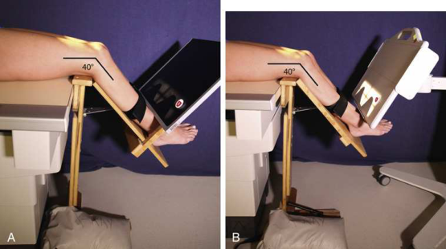
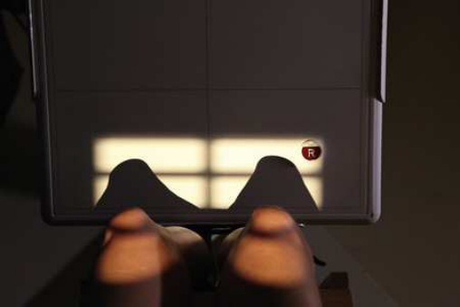
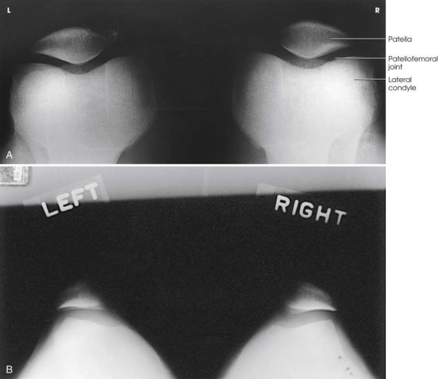
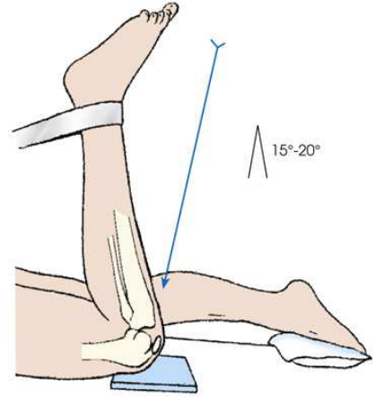

# Rx Rotulă (Patelă) and Patellofemoral Joint — Tangential Incidență — Metoda Merchant 29 (Merrill)

  📷 Radiografie Convențională (Rx)
  <strong>Actualizat:</strong> 2026-09-16
  <strong>Autor:</strong> Referință Merrill

---

-   __1. Rezumat Clinic & Indicații__

    ---

    === "Indicații Clinice"

        - Conform reperelor anatomice standard din tratat

    === "Ghid Național IRIS"

        !!! info "Referință Primară: Ghidul Național IRIS (Ordinul MS 1342/2012)"
            - **Capitol Ghid IRIS:** *Ghidul Național IRIS*
            - **Grad de Recomandare:** **De verificat pe indicație; fără grad atribuit automat**
            - **Nivel de Iradiere Estimată:** `De verificat pentru examinarea și populația selectate`

            [:octicons-search-16: Deschide Ghidul IRIS](../../iris.md){ .md-button .md-button--primary } [:material-open-in-new: Aplicația Oficială PWA](https://radiologie-pediatrica.ro/iris/){ .md-button target="_blank" rel="noopener" }
-   __2. Poziționare & Centrare Fascicul__

    ---

    - **Poziție Pacient:** se poziționează pacientul Decubit dorsal cu ambele genunchi la end de masa radiologică. Support genunchii și lower membre inferioare cu adjustable receptorul de imagine-menținerea device (axial Viewer). 30 la increase comfort și relaxation de quadriceps femoris, place pillows sau foam wedge under pacientul’s cap și back.; Using axial Viewer device, elevate pacientul’s genunchi approximately 2 inches la place femora paralel cu tabletop (Figs. 7.154 și 7.155). se ajustează angle de Genunchi flexion la 40 grade. (Merchant reported that grade de angulation poate fie varied între 30 grade și 90 grade la show various patellofemoral disorders.) Strap ambele membre inferioare together la calf level la control membru inferior rotație și allow pacient relaxation. Place receptorul de imagine perpendicular pe raza centrală și resting pe pacientul’s shins (thin foam pad aids comfort) approximately 1 Picior distal la patellae. Ensure that pacientul este able la relax. Relaxation de quadriceps femoris este crucial pentru precis diagnosis. If these muscles sunt nu relaxat, subluxated Rotulă (Patelă) poate fie pulled back into intercondylar sulcus, evidențiind false normal appearance. Record angle de Genunchi flexion pentru reproducibility during follow-up examinations because severity de Rotulă (Patelă) subluxation commonly changes inversely cu angle de Genunchi flexion. se efectuează ecranarea gonadelor cu șorț plumbat.
    - **Punct de Centrare Fascicul:** perpendicular pe receptorul de imagine (RI). cu 40-grade Genunchi flexion, angle raza centrală 30 grade caudal de la plan orizontal (60 grade de la vertical) la achieve a 30-grade raza centrală-la-Femur angle. raza centrală enters midway între patellae la nivelul patellofemoral articulație (superior aspect de Rotulă (Patelă)).
    - **Distanță Focar-Film (DFF / SID):** A 6-Picior (2-m) SID is recommended to reduce magnification.
    - **Comandă Respiratorie:** Conform reperelor anatomice standard din tratat

-   __3. Parametri Tehnici Expunere__

    ---

    | Parametru Tehnic | Valoare Configurare Generator / Tub |
    |:-----------------|:-------------------------------------|
    | **Tensiune Tub (kV)** | DE CONFIGURAT PE APARAT |
    | **Sarcină / Produs Curent-Timp (mAs)** | DE CONFIGURAT PE APARAT |
    | **Distanță Focar-Film (DFF / SID)** | A 6-Picior (2-m) SID is recommended to reduce magnification. |
    | **Grilă Antidifuzoare (Bucky)** | DE CONFIGURAT PE APARAT |
    | **Dimensiune Focar** | DE CONFIGURAT PE APARAT |
    | **Camere de Ionizare AEC** | DE CONFIGURAT PE APARAT |
    | **Colimare Fascicul** | se ajustează câmp de iradiere la 2 inches (5 cm) above patellar shadow și 1 inch pe sides. Place marker de lateralitate (D/S) în collimated expunere field. |
    | **Filtrare Tub** | DE CONFIGURAT PE APARAT |

-   __4. Criterii de Calitate & Reușită Imagine__

    ---

    - Criterii radiologice de calitate imaginii:
    - Evidence de corect collimation și presence de marker de lateralitate (D/S) plasat clear de anatomy de interest
    - Patellae în profile
    - Femoral condyles și intercondylar sulcus
    - Open patellofemoral articulation
    - Bony detalii trabeculare osoase și surrounding soft tissues

-   __5. Protecție Radiologică (ALARA)__

    ---

    - Nespecificat în fragmentul extras; de verificat în sursă

!!! note "Observații Clinice & Tehnice"
    Conform reperelor anatomice standard din tratat

### 🖼️ Imagini

<figure class="protocol-image-card" markdown>

<figcaption><strong>Merrill — pagina PDF 570, imaginea 1</strong> — Imagine din fragmentul sursă; asocierea necesită revizie.</figcaption>

</figure>

<figure class="protocol-image-card" markdown>

<figcaption><strong>Merrill — pagina PDF 571, imaginea 2</strong> — Imagine din fragmentul sursă; asocierea necesită revizie.</figcaption>

</figure>

<figure class="protocol-image-card" markdown>

<figcaption><strong>Merrill — pagina PDF 572, imaginea 3</strong> — Imagine din fragmentul sursă; asocierea necesită revizie.</figcaption>

</figure>

<figure class="protocol-image-card" markdown>

<figcaption><strong>Merrill — pagina PDF 573, imaginea 4</strong> — Imagine din fragmentul sursă; asocierea necesită revizie.</figcaption>

</figure>

=== "Ghid Rapid de Execuție"

    1. **Identificarea și verificarea pacientului:** verificare identitate, zonă de examinat, consimțământ conform procedurii și evaluarea posibilității unei sarcini, când este relevantă.
    2. **Pregătire:** îndepărtarea oricăror obiecte radiopace (bijuterii, agrafe, fermoare, proteze, pansamente dense).
    3. **Poziționare precisă:** alinierea receptorului de imagine și a tubului la distanța prescrisă (A 6-Picior (2-m) SID is recommended to reduce magnification.).
    4. **Colimare strictă:** adaptarea fasciculului strict la regiunea de diagnostic pentru scăderea iradierii și reducerea radiației difuze.
    5. **Radioprotecție:** verificarea [politicii RX](../radioprotectie.md), cu măsuri distincte pentru pacient, personal și însoțitor.

## Surse de documentare

- [Merrill’s Atlas, 7. Lower Extremity, pagini PDF 569–573](../../assets/protocols/sources/a56d45c16829_Merrills_Atlas_of_Radiographic_Positioning__Procedures_3Vol_Set.pdf#page=569)

## Fragmente sursă traduse (referință tehnică)

### anatomy

bilateral tangențial imagine shows axial incidență de patellae și patellofemoral articulații (Fig. 7.156). Because de drept-angle alignment
de receptorul de imagine și raza centrală, patellae sunt seen ca nondistorted, albeit slightly magnified, imagini.

### collimation

• se ajustează câmp de iradiere la 2 inches (5 cm) above patellar shadow și 1 inch pe sides. Place marker de lateralitate (D/S) în collimated
expunere field.

### cr

• perpendicular pe receptorul de imagine (RI).
• cu 40-grade genunchi flexion, angle raza centrală 30 grade caudal de la plan orizontal (60 grade de la vertical) la achieve a
30-grade raza centrală-la-femur angle. raza centrală enters midway între patellae la nivelul patellofemoral articulație
(superior aspect de rotulă (patelă)).

### criteria

Criterii radiologice de calitate imaginii:
• Evidence de corect collimation și presence de marker de lateralitate (D/S) plasat clear de anatomy de interest
• Patellae în profile
• Femoral condyles și intercondylar sulcus
• Open patellofemoral articulation
• Bony detalii trabeculare osoase și surrounding soft tissues

### part_pos

• Using axial Viewer device, elevate pacientul’s genunchi approximately 2 inches la place femora paralel cu tabletop (Figs.
7.154 și 7.155).
• se ajustează angle de genunchi flexion la 40 grade. (Merchant reported that grade de angulation poate fie varied între 30 grade și
90 grade la show various patellofemoral disorders.)
• Strap ambele membre inferioare together la calf level la control membru inferior rotație și allow pacient relaxation.
• Place receptorul de imagine perpendicular pe raza centrală și resting pe pacientul’s shins (thin foam pad aids comfort) approximately 1 picior
distal la patellae.
• Ensure that pacientul este able la relax. Relaxation de quadriceps femoris este crucial pentru precis diagnosis. If these muscles sunt nu
relaxat, subluxated rotulă (patelă) poate fie pulled back into intercondylar sulcus, evidențiind false normal appearance.
• Record angle de genunchi flexion pentru reproducibility during follow-up examinations because severity de rotulă (patelă) subluxation
commonly changes inversely cu angle de genunchi flexion.
• se efectuează ecranarea gonadelor cu șorț plumbat.

### patient_pos

• se poziționează pacientul în decubit dorsal cu ambele genunchi la end de masa radiologică.
• Support genunchii și lower membre inferioare cu adjustable receptorul de imagine-menținerea device (axial Viewer). 30
• la increase comfort și relaxation de quadriceps femoris, place pillows sau foam wedge under pacientul’s cap și back.

### sid

A 6-picior (2-m) SID este recommended la reduce magnification.

### tech

poziționat prin manufacturer sau department protocol pentru corect anatomy display orientation; raza centrală plate: 14 × 17 inches (35 × 43 cm) transversal.

