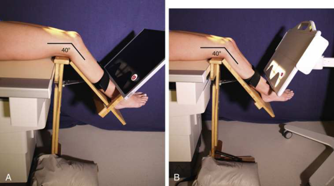
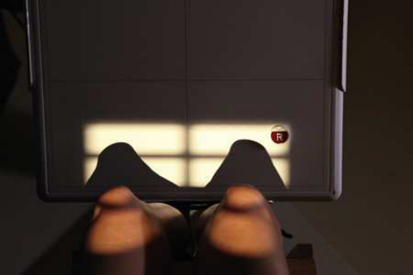
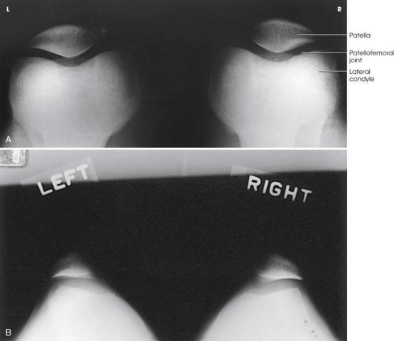
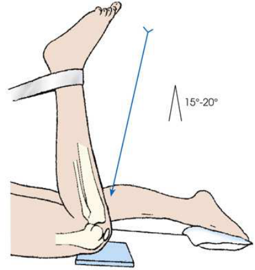

# Rx rotulă și articulație patelofemurală — incidență tangențială — metoda Merchant 29 (Merrill)

  📷 Radiografie Convențională (Rx)
  <strong>Actualizat:</strong> 2026-09-16
  <strong>Autor:</strong> Referință Merrill

---

-   __1. Rezumat Clinic & Indicații__

    ---

    === "Indicații Clinice"

        - Conform reperelor anatomice standard din tratat

    === "Ghid Național IRIS"

        !!! info "Referință Primară: Ghidul Național IRIS (Ordinul MS 1342/2012)"
            - **Capitol Ghid IRIS:** *Aparat locomotor & Membru inferior*
            - **Grad de Recomandare:** **Grad A**
            - **Nivel de Iradiere Estimată:** `Clasa 1 (Minimă < 0.05 mSv)`

            [:octicons-search-16: Deschide Ghidul IRIS](../../iris.md){ .md-button .md-button--primary } [:material-open-in-new: Aplicația Oficială PWA](https://radiologie-pediatrica.ro/iris/){ .md-button target="_blank" rel="noopener" }

-   __2. Poziționare & Centrare Fascicul__

    ---

    - **Poziție Pacient:** Poziționați pacientul în decubit dorsal, cu ambii genunchi la capătul mesei radiologice. Susțineți genunchii și membrele inferioare cu dispozitivul reglabil de menținere a receptorului de imagine (vizualizator axial). 30 Pentru a spori confortul și relaxarea cvadricepsului femural, așezați perne sau o pană de spumă sub capul și spatele pacientului.; Utilizând dispozitivul vizualizator axial, ridicați genunchii pacientului aproximativ 2 țoli pentru a poziționa femururile paralel cu blatul mesei (Fig. 7.154 și 7.155). Ajustați unghiul flexiei genunchiului la 40 de grade. (Merchant a raportat că gradul de angulație poate varia între 30 de grade și 90 de grade pentru evidențierea diferitelor afecțiuni patelofemurale.) Fixați împreună ambele membre inferioare la nivelul gambelor pentru a controla rotația membrelor inferioare și a permite relaxarea pacientului. Așezați receptorul de imagine perpendicular pe raza centrală și sprijinit pe gambele pacientului (o perniță subțire de spumă sporește confortul), la aproximativ 1 Picior distal față de rotule. Asigurați-vă că pacientul se poate relaxa. Relaxarea cvadricepsului femural este esențială pentru un diagnostic precis. Dacă acești mușchi nu sunt relaxați, rotula subluxată poate fi trasă înapoi în șanțul intercondilian, evidențiind un aspect fals normal. Înregistrați unghiul flexiei genunchiului pentru reproductibilitate în timpul examinărilor de monitorizare, deoarece severitatea subluxației rotulei se modifică frecvent invers proporțional cu unghiul flexiei genunchiului. Efectuați ecranarea gonadelor cu șorț plumbat.
    - **Punct de Centrare Fascicul:** perpendiculară pe receptorul de imagine (RI). Cu flexia genunchiului de 40 de grade, orientați raza centrală la 30 de grade caudal față de planul orizontal (60 de grade față de verticală) pentru a obține un unghi de 30 de grade între raza centrală și femur. Raza centrală pătrunde la jumătatea distanței dintre rotule, la nivelul articulației patelofemurale (aspectul superior al rotulei).
    - **Distanță Focar-Film (DFF / SID):** Se recomandă o SID de 6 picioare (2 m), pentru a reduce magnificarea.
    - **Comandă Respiratorie:** Conform reperelor anatomice standard din tratat

-   __3. Parametri Tehnici Expunere__

    ---

    | Parametru Tehnic | Valoare Configurare Generator / Tub |
    |:-----------------|:-------------------------------------|
    | **Tensiune Tub (kV)** | DE CONFIGURAT PE APARAT |
    | **Sarcină / Produs Curent-Timp (mAs)** | DE CONFIGURAT PE APARAT |
    | **Distanță Focar-Film (DFF / SID)** | Se recomandă o SID de 6 picioare (2 m), pentru a reduce magnificarea. |
    | **Grilă Antidifuzoare (Bucky)** | DE CONFIGURAT PE APARAT |
    | **Dimensiune Focar** | DE CONFIGURAT PE APARAT |
    | **Camere de Ionizare AEC** | DE CONFIGURAT PE APARAT |
    | **Colimare Fascicul** | Se ajustează câmpul de iradiere la 2 țoli (5 cm) deasupra umbrei rotulei și la 1 țol pe părțile laterale. Se plasează markerul de lateralitate (D/S) în câmpul de expunere colimat. |
    | **Filtrare Tub** | DE CONFIGURAT PE APARAT |

-   __4. Criterii de Calitate & Reușită Imagine__

    ---

    - Criterii radiologice de calitate a imaginii:
    - Evidențierea colimării corecte și prezența markerului de lateralitate (D/S), plasat fără a se suprapune peste anatomia de interes
    - Rotulele în profil
    - Condilii femurali și șanțul intercondilian
    - Articulație patelofemurală deschisă
    - Detalii trabeculare osoase și țesuturile moi înconjurătoare

-   __5. Protecție Radiologică (ALARA)__

    ---

    - Nespecificat în fragmentul extras; de verificat în sursă

!!! note "Observații Clinice & Tehnice"
    Conform reperelor anatomice standard din tratat

### 🖼️ Imagini

<figure class="protocol-image-card" markdown>

<figcaption><strong>Merrill — pagina 570, imaginea 1</strong> — Imagine din fragmentul sursă; asocierea necesită revizie.</figcaption>

</figure>

<figure class="protocol-image-card" markdown>

<figcaption><strong>Merrill — pagina 571, imaginea 2</strong> — Imagine din fragmentul sursă; asocierea necesită revizie.</figcaption>

</figure>

<figure class="protocol-image-card" markdown>

<figcaption><strong>Merrill — pagina 572, imaginea 3</strong> — Imagine din fragmentul sursă; asocierea necesită revizie.</figcaption>

</figure>

<figure class="protocol-image-card" markdown>

<figcaption><strong>Merrill — pagina 573, imaginea 4</strong> — Imagine din fragmentul sursă; asocierea necesită revizie.</figcaption>

</figure>

=== "Ghid Rapid de Execuție"

    1. **Identificarea și verificarea pacientului:** verificare identitate, zonă de examinat, consimțământ conform procedurii și evaluarea posibilității unei sarcini, când este relevantă.
    2. **Pregătire:** îndepărtarea oricăror obiecte radiopace (bijuterii, agrafe, fermoare, proteze, pansamente dense).
    3. **Poziționare precisă:** alinierea receptorului de imagine și a tubului la distanța prescrisă (Se recomandă o SID de 6 picioare (2 m), pentru a reduce magnificarea.).
    4. **Colimare strictă:** adaptarea fasciculului strict la regiunea de diagnostic pentru scăderea iradierii și reducerea radiației difuze.
    5. **Radioprotecție:** verificarea [politicii RX](../radioprotectie.md), cu măsuri distincte pentru pacient, personal și însoțitor.

## Surse de documentare

- [Merrill’s Atlas, 7. Lower Extremity, pagini 569–573](https://books.google.com/books/about/Merrill_s_Atlas_of_Radiographic_Position.html?id=BM0lEQAAQBAJ)
