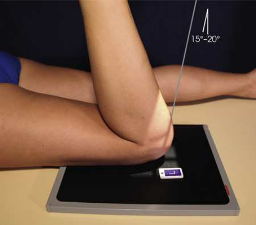
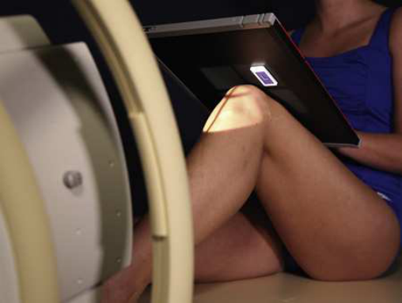
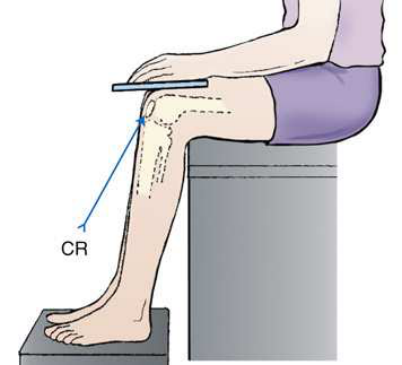
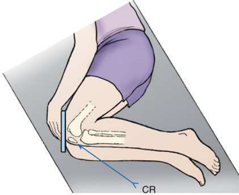

# Rx Rotulă (Patelă) and Patellofemoral Joint — Tangential Incidență — Metoda Settegast (Merrill)

  📷 Radiografie Convențională (Rx)
  <strong>Actualizat:</strong> 2026-09-16
  <strong>Autor:</strong> Referință Merrill

---

-   __1. Rezumat Clinic & Indicații__

    ---

    === "Indicații Clinice"

        - Conform reperelor anatomice standard din tratat

    === "Ghid Național IRIS"

        !!! info "Referință Primară: Ghidul Național IRIS (Ordinul MS 1342/2012)"
            - **Capitol Ghid IRIS:** *Ghidul Național IRIS*
            - **Grad de Recomandare:** **De verificat pe indicație; fără grad atribuit automat**
            - **Nivel de Iradiere Estimată:** `De verificat pentru examinarea și populația selectate`

            [:octicons-search-16: Deschide Ghidul IRIS](../../iris.md){ .md-button .md-button--primary } [:material-open-in-new: Aplicația Oficială PWA](https://radiologie-pediatrica.ro/iris/){ .md-button target="_blank" rel="noopener" }
-   __2. Poziționare & Centrare Fascicul__

    ---

    - **Poziție Pacient:** se așază pacientul în Decubit dorsal sau Decubit ventral poziție. latter este preferable because Genunchi poate usually fie flectat la greater grade, și imobilizare este easier (Figs. 7.157 și 7.158). If pacientul este Poziție Șezândă pe masa radiologică, hold receptorul de imagine securely în place (Fig. 7.159). Alternative poziții sunt vizualizat în Figs. 7.160 și 7.161.; se flectează pacient’s Genunchi slowly ca much ca possible sau until Rotulă (Patelă) este perpendicular pe receptorul de imagine (RI) if pacientul’s condition permits. cu slow, even flexion, pacientul trebuie să fie able la tolerate poziție, whereas quick, uneven flexion poate cause too much pain. If desired, loop long strip de bandage around pacientul’s Gleznă (Articulație Talocrurală) sau Picior. Se instruiește pacientul să grasp ends over Umăr la hold membru inferior în poziție. Gently se ajustează membru inferior so that its axa longitudinală este vertical. Place receptorul de imagine transversely under Genunchi, și center it la spații articulare între Rotulă (Patelă) și femoral condyles. se efectuează ecranarea gonadelor cu șorț plumbat. prin maintaining same OID și SID relationships, this poziție poate fie obtained cu pacientul în lateral sau Poziție Șezândă poziție (Figs. 7.160 și 7.161).
    - **Punct de Centrare Fascicul:** perpendicular pe spații articulare între Rotulă (Patelă) și femoral condyles when articulație este perpendicular. When articulație este nu perpendicular, grade de raza centrală angulation depends pe grade de flexion de Genunchi. angulation typically este 15 la 20
    - **Distanță Focar-Film (DFF / SID):** Nespecificat în fragmentul extras; de verificat în sursă
    - **Comandă Respiratorie:** Conform reperelor anatomice standard din tratat

-   __3. Parametri Tehnici Expunere__

    ---

    | Parametru Tehnic | Valoare Configurare Generator / Tub |
    |:-----------------|:-------------------------------------|
    | **Tensiune Tub (kV)** | DE CONFIGURAT PE APARAT |
    | **Sarcină / Produs Curent-Timp (mAs)** | DE CONFIGURAT PE APARAT |
    | **Distanță Focar-Film (DFF / SID)** | Nespecificat în fragmentul extras; de verificat în sursă |
    | **Grilă Antidifuzoare (Bucky)** | DE CONFIGURAT PE APARAT |
    | **Dimensiune Focar** | DE CONFIGURAT PE APARAT |
    | **Camere de Ionizare AEC** | DE CONFIGURAT PE APARAT |
    | **Colimare Fascicul** | Conform reperelor anatomice standard din tratat |
    | **Filtrare Tub** | DE CONFIGURAT PE APARAT |

-   __4. Criterii de Calitate & Reușită Imagine__

    ---

    - Conform reperelor anatomice standard din tratat

-   __5. Protecție Radiologică (ALARA)__

    ---

    - Nespecificat în fragmentul extras; de verificat în sursă

!!! note "Observații Clinice & Tehnice"
    When raza centrală este orientat spre pacientul’s upper corp (Figs. 7.159 și 7.160), thorax și thyroid trebuie să fie ecranat.

### 🖼️ Imagini

<figure class="protocol-image-card" markdown>

<figcaption><strong>Merrill — pagina PDF 574, imaginea 1</strong> — Imagine din fragmentul sursă; asocierea necesită revizie.</figcaption>

</figure>

<figure class="protocol-image-card" markdown>

<figcaption><strong>Merrill — pagina PDF 574, imaginea 2</strong> — Imagine din fragmentul sursă; asocierea necesită revizie.</figcaption>

</figure>

<figure class="protocol-image-card" markdown>

<figcaption><strong>Merrill — pagina PDF 575, imaginea 3</strong> — Imagine din fragmentul sursă; asocierea necesită revizie.</figcaption>

</figure>

<figure class="protocol-image-card" markdown>

<figcaption><strong>Merrill — pagina PDF 575, imaginea 4</strong> — Imagine din fragmentul sursă; asocierea necesită revizie.</figcaption>

</figure>

=== "Ghid Rapid de Execuție"

    1. **Identificarea și verificarea pacientului:** verificare identitate, zonă de examinat, consimțământ conform procedurii și evaluarea posibilității unei sarcini, când este relevantă.
    2. **Pregătire:** îndepărtarea oricăror obiecte radiopace (bijuterii, agrafe, fermoare, proteze, pansamente dense).
    3. **Poziționare precisă:** alinierea receptorului de imagine și a tubului la distanța prescrisă (Nespecificat în fragmentul extras; de verificat în sursă).
    4. **Colimare strictă:** adaptarea fasciculului strict la regiunea de diagnostic pentru scăderea iradierii și reducerea radiației difuze.
    5. **Radioprotecție:** verificarea [politicii RX](../radioprotectie.md), cu măsuri distincte pentru pacient, personal și însoțitor.

## Surse de documentare

- [Merrill’s Atlas, 7. Lower Extremity, pagini PDF 573–575](../../assets/protocols/sources/a56d45c16829_Merrills_Atlas_of_Radiographic_Positioning__Procedures_3Vol_Set.pdf#page=573)

## Fragmente sursă traduse (referință tehnică)

### cr

• perpendicular pe spații articulare între rotulă (patelă) și femoral condyles when articulație este perpendicular. When articulație este nu
perpendicular, grade de raza centrală angulation depends pe grade de flexion de genunchi. angulation typically este 15 la 20

### notes

When raza centrală este orientat spre pacientul’s upper corp (Figs. 7.159 și 7.160), thorax și thyroid trebuie să fie ecranat.

### part_pos

• se flectează pacient’s genunchi slowly ca much ca possible sau until rotulă (patelă) este perpendicular pe receptorul de imagine (RI) if pacientul’s condition permits. cu
slow, even flexion, pacientul trebuie să fie able la tolerate poziție, whereas quick, uneven flexion poate cause too much pain.
• If desired, loop long strip de bandage around pacientul’s ankle sau picior. Se instruiește pacientul să grasp ends over umăr la hold membru inferior în poziție. Gently se ajustează membru inferior so that its axa longitudinală este vertical.
• Place receptorul de imagine transversely under genunchi, și center it la spații articulare între rotulă (patelă) și femoral condyles.
• se efectuează ecranarea gonadelor cu șorț plumbat.
• prin maintaining same OID și SID relationships, this poziție poate fie obtained cu pacientul în lateral sau așezat pe scaun poziție (Figs.
7.160 și 7.161).

### patient_pos

• se așază pacientul în decubit dorsal sau decubit ventral. latter este preferable because genunchi poate usually fie flectat la greater grade, și
imobilizare este easier (Figs. 7.157 și 7.158).
• If pacientul este așezat pe scaun pe masa radiologică, hold receptorul de imagine securely în place (Fig. 7.159). Alternative poziții sunt vizualizat în Figs. 7.160
și 7.161.

### tech

poziționat prin manufacturer sau department protocol pentru corect anatomy display orientation; raza centrală plate: 10 × 12 inches (24 × 30 cm) longitudinal.

