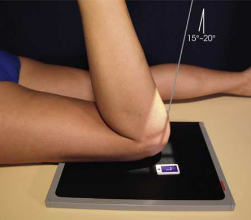
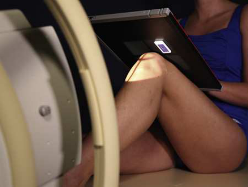
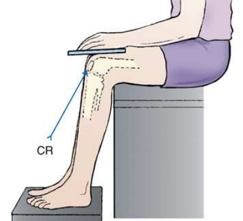
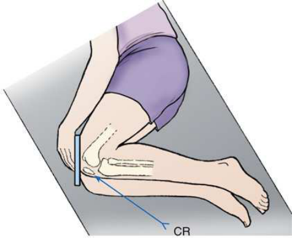

# Rx rotulă și articulație patelofemurală — incidență tangențială — metoda Settegast (Merrill)

  📷 Radiografie Convențională (Rx)
  <strong>Actualizat:</strong> 2026-09-16
  <strong>Autor:</strong> Referință Merrill

---

-   __1. Rezumat Clinic & Indicații__

    ---

    === "Indicații Clinice"

        - Conform reperelor anatomice standard din tratat

    === "Ghid Național IRIS"

        !!! info "Referință Primară: Ghidul Național IRIS (Ordinul MS 1342/2012)"
            - **Capitol Ghid IRIS:** *Aparat locomotor & Membru inferior*
            - **Grad de Recomandare:** **Grad A**
            - **Nivel de Iradiere Estimată:** `Clasa 1 (Minimă < 0.05 mSv)`

            [:octicons-search-16: Deschide Ghidul IRIS](../../iris.md){ .md-button .md-button--primary } [:material-open-in-new: Aplicația Oficială PWA](https://radiologie-pediatrica.ro/iris/){ .md-button target="_blank" rel="noopener" }

-   __2. Poziționare & Centrare Fascicul__

    ---

    - **Poziție Pacient:** Se așază pacientul în decubit dorsal sau în decubit ventral. Aceasta din urmă este preferabilă deoarece genunchiul poate fi de obicei flectat într-un grad mai mare, iar imobilizarea este mai ușoară (Fig. 7.157 și 7.158). Dacă pacientul este așezat pe masa radiologică, se ține receptorul de imagine fix în poziție (Fig. 7.159). Pozițiile alternative sunt prezentate în Fig. 7.160 și 7.161.; se flectează lent genunchiul pacientului cât mai mult posibil sau până când rotula este perpendiculară pe receptorul de imagine (RI), dacă starea pacientului permite. Cu o flexie lentă și uniformă, pacientul trebuie să poată tolera poziția, în timp ce flexia rapidă și neuniformă poate provoca durere prea mare. Dacă se dorește, se înfășoară o fâșie lungă de bandaj în jurul gleznei sau piciorului pacientului. Se instruiește pacientul să prindă capetele peste umăr pentru a menține membrul inferior în poziție. Se ajustează ușor membrul inferior astfel încât axa sa longitudinală să fie verticală. Se plasează receptorul de imagine transversal sub genunchi și se centrează la nivelul spațiilor articulare dintre rotulă și condilii femurali. Se efectuează ecranarea gonadelor cu șorț plumbat. Prin menținerea acelorași relații OID și SID, această poziție poate fi obținută cu pacientul în decubit lateral sau în poziție șezândă (Fig. 7.160 și 7.161).
    - **Punct de Centrare Fascicul:** Perpendicular pe spațiile articulare dintre rotulă și condilii femurali când articulația este perpendiculară. Când articulația nu este perpendiculară, gradul de angulație a razei centrale depinde de gradul de flexie a genunchiului. Angulația este de obicei între 15 și 20 [fragment deteriorat în sursă]
    - **Distanță Focar-Film (DFF / SID):** Nespecificat în fragmentul extras; de verificat în sursă
    - **Comandă Respiratorie:** Conform reperelor anatomice standard din tratat

-   __3. Parametri Tehnici Expunere__

    ---

    | Parametru Tehnic | Valoare Configurare Generator / Tub |
    |:-----------------|:-------------------------------------|
    | **Tensiune Tub (kV)** | DE CONFIGURAT PE APARAT |
    | **Sarcină / Produs Curent-Timp (mAs)** | DE CONFIGURAT PE APARAT |
    | **Distanță Focar-Film (DFF / SID)** | Nespecificat în fragmentul extras; de verificat în sursă |
    | **Grilă Antidifuzoare (Bucky)** | DE CONFIGURAT PE APARAT |
    | **Dimensiune Focar** | DE CONFIGURAT PE APARAT |
    | **Camere de Ionizare AEC** | DE CONFIGURAT PE APARAT |
    | **Colimare Fascicul** | Conform reperelor anatomice standard din tratat |
    | **Filtrare Tub** | DE CONFIGURAT PE APARAT |

-   __4. Criterii de Calitate & Reușită Imagine__

    ---

    - Conform reperelor anatomice standard din tratat

-   __5. Protecție Radiologică (ALARA)__

    ---

    - Nespecificat în fragmentul extras; de verificat în sursă

!!! note "Observații Clinice & Tehnice"
    Când raza centrală este orientată spre partea superioară a corpului pacientului (Fig. 7.159 și 7.160), toracele și tiroida trebuie ecranate.

### 🖼️ Imagini

<figure class="protocol-image-card" markdown>

<figcaption><strong>Merrill — pagina 574, imaginea 1</strong> — Imagine din fragmentul sursă; asocierea necesită revizie.</figcaption>

</figure>

<figure class="protocol-image-card" markdown>

<figcaption><strong>Merrill — pagina 574, imaginea 2</strong> — Imagine din fragmentul sursă; asocierea necesită revizie.</figcaption>

</figure>

<figure class="protocol-image-card" markdown>

<figcaption><strong>Merrill — pagina 575, imaginea 3</strong> — Imagine din fragmentul sursă; asocierea necesită revizie.</figcaption>

</figure>

<figure class="protocol-image-card" markdown>

<figcaption><strong>Merrill — pagina 575, imaginea 4</strong> — Imagine din fragmentul sursă; asocierea necesită revizie.</figcaption>

</figure>

=== "Ghid Rapid de Execuție"

    1. **Identificarea și verificarea pacientului:** verificare identitate, zonă de examinat, consimțământ conform procedurii și evaluarea posibilității unei sarcini, când este relevantă.
    2. **Pregătire:** îndepărtarea oricăror obiecte radiopace (bijuterii, agrafe, fermoare, proteze, pansamente dense).
    3. **Poziționare precisă:** alinierea receptorului de imagine și a tubului la distanța prescrisă (Nespecificat în fragmentul extras; de verificat în sursă).
    4. **Colimare strictă:** adaptarea fasciculului strict la regiunea de diagnostic pentru scăderea iradierii și reducerea radiației difuze.
    5. **Radioprotecție:** verificarea [politicii RX](../radioprotectie.md), cu măsuri distincte pentru pacient, personal și însoțitor.

## Surse de documentare

- [Merrill’s Atlas, 7. Lower Extremity, pagini 573–575](https://books.google.com/books/about/Merrill_s_Atlas_of_Radiographic_Position.html?id=BM0lEQAAQBAJ)
