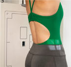
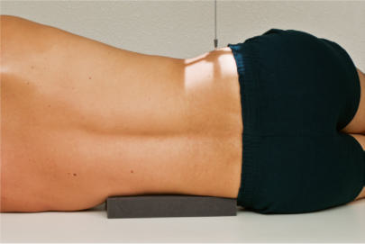
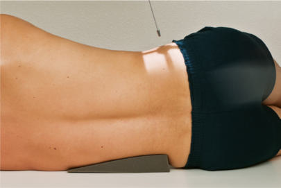
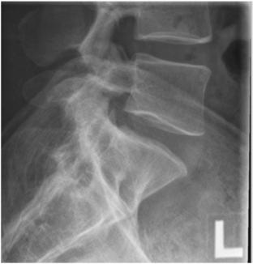
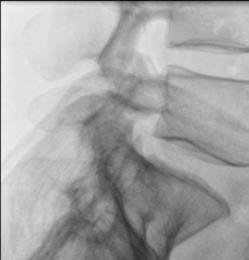

# Rx S1 POSITION LATERAL L5 (Coloană Lombară)

  📷 Radiografie Convențională (Rx)
  <strong>Actualizat:</strong> 2026-09-15
  <strong>Autor:</strong> Departamentul de Radiologie / Referință Bontrager

---

-   __1. Rezumat Clinic & Indicații__

    ---

    === "Indicații Clinice"

        - Spondylolisthesis involving L4–L5 or L5S1 and other L5–S1 pathologies

    === "Ghid Național IRIS"

        !!! info "Referință Primară: Ghidul Național IRIS (Ordinul MS 1342/2012)"
            - **Capitol Ghid IRIS:** *Ghidul Național IRIS*
            - **Grad de Recomandare:** **De verificat pe indicație; fără grad atribuit automat**
            - **Nivel de Iradiere Estimată:** `De verificat pentru examinarea și populația selectate`

            [:octicons-search-16: Deschide Ghidul IRIS](../../iris.md){ .md-button .md-button--primary } [:material-open-in-new: Aplicația Oficială PWA](https://radiologie-pediatrica.ro/iris/){ .md-button target="_blank" rel="noopener" }
-   __2. Poziționare & Centrare Fascicul__

    ---

    - **Poziție Pacient:** Pacient: Incidență de Profil (Lateral) Place patient in the lateral Decubit position, with head on pillow, knees flexed, with support between knees and ankles to better maintain a true Incidență de Profil (Lateral) better and ensure patient comfort.; Regiune anatomică: Align midcoronal plane to CR and midline of table and/or IR (Fig. 9.38). Place radiolucent support under waist as needed to place the long axis of the spine near parallel to the table (palpating spinous processes to determine; see NOTES later). Ensure that Absența rotației anatomice: clavicule echidistante față de linia apofizelor spinoase of thorax or Bazin (Pelvis) exists.
    - **Punct de Centrare Fascicul:** perpendicular to IR with sufficient waist support, or angle 5° to 8° caudad with less support (see NOTES). Direct CR 1.5 inches (4 cm) inferior to creasta iliacă (corespunzător L4-L5) and 2 inches (5 cm) posterior to ASiS. Center IR to CR.
    - **Distanță Focar-Film (DFF / SID):** 100 cm
    - **Comandă Respiratorie:** Suspend respiration to limit patient motion.

-   __3. Parametri Tehnici Expunere__

    ---

    | Parametru Tehnic | Valoare Configurare Generator / Tub |
    |:-----------------|:-------------------------------------|
    | **Tensiune Tub (kV)** | 85-95 kV |
    | **Sarcină / Produs Curent-Timp (mAs)** | DE CONFIGURAT PE APARAT |
    | **Distanță Focar-Film (DFF / SID)** | 100 cm |
    | **Grilă Antidifuzoare (Bucky)** | Cu grilă antidifuzoare Bucky |
    | **Dimensiune Focar** | Focar Mare (1.0 - 1.2 mm) |
    | **Camere de Ionizare AEC** | Camerele laterale (sau camera centrală funcție de regiune) |
    | **Colimare Fascicul** | Field Size Collimate on four sides to anatomy of interest. |
    | **Filtrare Tub** | Totală ≥ 2.5 mm Al echivalent |

-   __4. Criterii de Calitate & Reușită Imagine__

    ---

    - L5 vertebral body, first and second sacral segments and L5–S1 joint space (Figs. 9.40 and 9.41). Position
    - Absența rotației anatomice: clavicule echidistante față de linia apofizelor spinoase of patient evidenced by superimposition of greater sciatic notches and posterior borders of the vertebral bodies.
    - Correct alignment of the vertebral column and CR indicated by open L5–S1 joint space.
    - Collimation field size to area of interest. Exposure
    - Optimal image receptor exposure and contrast. Clear demonstration of bony margins and trabecular markings of L5–S1 region.
    - no motion.

-   __5. Protecție Radiologică (ALARA)__

    ---

    - Ecranare gonadică și a organelor radiosensibile conform procedurilor locale de radioprotecție ALARA.
    - Colimare strictă la aria de interes pentru limitarea radiației difuze.
    - Verificarea posibilității unei sarcini la pacientele de vârstă fertilă înainte de expunere.

!!! note "Observații Clinice & Tehnice"
    S: If waist is not supported sufficiently, resulting in sagging of the vertebral column, the CR must be angled 5° to 8° caudad to be parallel to the interiliac line3 (imaginary line between creasta iliacă (corespunzător L4-L5)s [Fig. 9.39]). High amounts of secondary or scatter radiation are generated as the result of the part thickness. Close collimation is essential, along with placement of lead masking on tabletop behind patient. This is especially important with digital imaging. Coloană Lombară ROUTINE AP (or PA) Oblique—posterior or anterior Lateral Lateral L5–S1 Fig. 9.38 Left lateral L5–S1 with sufficient support; 0° CR angle. Fig. 9.40 Lateral L5–S1. Interiliac line Fig. 9.39 Left lateral L5–S1 with less support; CR 5° to 8° caudad (CR parallel to interiliac line). Lumbosacral (L5-S1) intervertebral joint Body (L5) Promontory of Sacru Fig. 9.41 Lateral L5–S1.

### 🖼️ Imagini

<figure class="protocol-image-card" markdown>

<figcaption><strong>Fig. 9.38 Left lateral L5–S1 with sufficient support; 0° CR angle.</strong> — Poziționare pacient conform Ghidului Bontrager (Fig. 9.38 Left lateral L5–S1 with sufficient support; 0° CR angle.)</figcaption>

</figure>

<figure class="protocol-image-card" markdown>

<figcaption><strong>Fig. 9.40 Lateral L5–S1.</strong> — Aspect radiografic de referință conform Ghidului Bontrager (Fig. 9.40 Lateral L5–S1.)</figcaption>

</figure>

<figure class="protocol-image-card" markdown>

<figcaption><strong>Fig. 9.39 Left lateral L5–S1 with less support; CR 5° to 8° caudad</strong> — Aspect radiografic de referință conform Ghidului Bontrager (Fig. 9.39 Left lateral L5–S1 with less support; CR 5° to 8° caudad)</figcaption>

</figure>

<figure class="protocol-image-card" markdown>

<figcaption><strong>Fig. 9.41 Lateral L5–S1.</strong> — Aspect radiografic de referință conform Ghidului Bontrager (Fig. 9.41 Lateral L5–S1.)</figcaption>

</figure>

<figure class="protocol-image-card" markdown>

<figcaption><strong>Figura 5</strong> — Aspect radiografic de referință conform Ghidului Bontrager (Figura 5)</figcaption>

</figure>

=== "Ghid Rapid de Execuție"

    1. **Identificarea și verificarea pacientului:** verificare identitate, zonă de examinat, consimțământ conform procedurii și evaluarea posibilității unei sarcini, când este relevantă.
    2. **Pregătire:** îndepărtarea oricăror obiecte radiopace (bijuterii, agrafe, fermoare, proteze, pansamente dense).
    3. **Poziționare precisă:** alinierea receptorului de imagine și a tubului la distanța prescrisă (100 cm).
    4. **Colimare strictă:** adaptarea fasciculului strict la regiunea de diagnostic pentru scăderea iradierii și reducerea radiației difuze.
    5. **Radioprotecție:** verificarea [politicii RX](../radioprotectie.md), cu măsuri distincte pentru pacient, personal și însoțitor.

## Surse de documentare

- [Bontrager's Textbook of Radiographic Positioning (Ed. 9/10), Pagina 363](https://www.elsevier.com/books/textbook-of-radiographic-positioning-and-related-anatomy/lampignano/978-0-323-65367-1)
