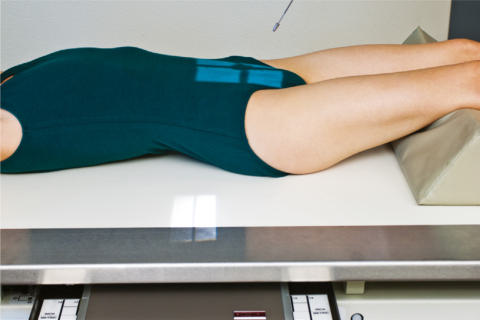
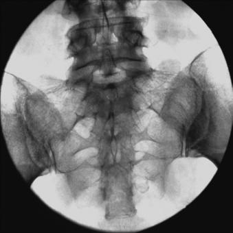

# Rx SACROILIAC JOINTS AP Axială

  📷 Radiografie Convențională (Rx)
  <strong>Actualizat:</strong> 2026-09-15
  <strong>Autor:</strong> Departamentul de Radiologie / Referință Bontrager

---

-   __1. Rezumat Clinic & Indicații__

    ---

    === "Indicații Clinice"

        - pathology de SI articulație, including suspiciune de fractură și articulație luxație / subluxație articulară sau subluxation

    === "Ghid Național IRIS"

        !!! info "Referință Primară: Ghidul Național IRIS (Ordinul MS 1342/2012)"
            - **Capitol Ghid IRIS:** *Ghidul Național IRIS*
            - **Grad de Recomandare:** **De verificat pe indicație; fără grad atribuit automat**
            - **Nivel de Iradiere Estimată:** `De verificat pentru examinarea și populația selectate`

            [:octicons-search-16: Deschide Ghidul IRIS](../../iris.md){ .md-button .md-button--primary } [:material-open-in-new: Aplicația Oficială PWA](https://radiologie-pediatrica.ro/iris/){ .md-button target="_blank" rel="noopener" }
-   __2. Poziționare & Centrare Fascicul__

    ---

    - **Poziție Pacient:** Pacient: Decubit dorsal poziție pacient Decubit dorsal cu brațe la side, cap pe pillow, și membre inferioare extins cu support under genunchi pentru comfort.; Regiune anatomică: Align plan mediosagital la raza centrală și linia mediană mesei și/sau receptorul de imagine (Fig. 9.72). Se verifică absența rotației: claviculele sunt riguros echidistante față de linia proceselor spinoase Bazin (bazin (pelvis)) exists.
    - **Punct de Centrare Fascicul:** Raza centrală se înclină 30°–35° cranial (spre cap) (generally, males require about 30° și females 35°, cu increase în lumbosacral curve). Raza centrală se orientează spre midline about 2 inches (5 cm) below level de spină iliacă antero-superioară (SIAS). Se centrează receptorul de imagine pe raza centrală.
    - **Distanță Focar-Film (DFF / SID):** 100 cm
    - **Comandă Respiratorie:** Apnee pe durata expunerii pentru prevenirea artefactelor de mișcare ale pacientului. Alternative Incidență PA Axială If pacient cannot assume Decubit dorsal poziție, this imagine poate fie obtained ca Incidență Postero-Anterioară (PA) cu pacient Decubit ventral, using a 30° la 35° caudal angle. raza centrală would fie centrat pe level de L4 sau slightly above creasta iliacă (corespunzător L4-L5). SACROILIAC articulații ROUTINE AP axial posterior oblic incidențe

-   __3. Parametri Tehnici Expunere__

    ---

    | Parametru Tehnic | Valoare Configurare Generator / Tub |
    |:-----------------|:-------------------------------------|
    | **Tensiune Tub (kV)** | 80-95 kV |
    | **Sarcină / Produs Curent-Timp (mAs)** | DE CONFIGURAT PE APARAT |
    | **Distanță Focar-Film (DFF / SID)** | 100 cm |
    | **Grilă Antidifuzoare (Bucky)** | Cu grilă antidifuzoare Bucky |
    | **Dimensiune Focar** | Focar Mare (1.0 - 1.2 mm) |
    | **Camere de Ionizare AEC** | Camerele laterale (sau camera centrală funcție de regiune) |
    | **Colimare Fascicul** | Field Size Collimate pe four sides la anatomy de interest. |
    | **Filtrare Tub** | Totală ≥ 2.5 mm Al echivalent |

-   __4. Criterii de Calitate & Reușită Imagine__

    ---

    - Sacroiliac articulații și L5–S1 intervertebral spații articulare (Figs. 9.73 și 9.74). poziție
    - Absența rotației anatomice: clavicule echidistante față de linia apofizelor spinoase ca evidenced prin spinous process de L5 în center de vertebral corp și simetric appearance de bilateral alae/wings de Sacru (cu SI articulații equally distant de la midline de vertebre).
    - Collimation field size la aria de interes diagnostic. expunere
    - optim receptorul de imagine expunere și contrast. Clear demonstration de bony margins și trabecular markings de Sacru.
    - fără mișcare. 24 30 R Fig. 9.72 AP axial de SI articulații—raza centrală 30° la 35° cranial. L Fig. 9.73 AP axial de SI articulații. Lumbosacral (L5-S1) articulație Sacral wing (ala) L Ilium Sacru stâng sacroiliac articulație Apex de Sacru superior articular process de Sacru Sacral foramina corp de L5 Fig. 9.74 AP axial de SI articulații.

-   __5. Protecție Radiologică (ALARA)__

    ---

    - Ecranare gonadică și a organelor radiosensibile conform procedurilor locale de radioprotecție ALARA.
    - Colimare strictă la aria de interes pentru limitarea radiației difuze.
    - Verificarea posibilității unei sarcini la pacientele de vârstă fertilă înainte de expunere.

### 🖼️ Imagini

<figure class="protocol-image-card" markdown>

<figcaption><strong>Fig. 9.72 AP axial de SI articulații—raza centrală 30° la 35° cranial.</strong> — Poziționare pacient conform Ghidului Bontrager (Fig. 9.72 AP axial de SI articulații—raza centrală 30° la 35° cranial.)</figcaption>

</figure>

<figure class="protocol-image-card" markdown>

<figcaption><strong>Fig. 9.73 AP axial de SI articulații.</strong> — Aspect radiografic de referință conform Ghidului Bontrager (Fig. 9.73 AP axial de SI articulații.)</figcaption>

</figure>

<figure class="protocol-image-card" markdown>

<figcaption><strong>Fig. 9.74 AP axial de SI articulații.</strong> — Aspect radiografic de referință conform Ghidului Bontrager (Fig. 9.74 AP axial de SI articulații.)</figcaption>

</figure>

=== "Ghid Rapid de Execuție"

    1. **Identificarea și verificarea pacientului:** verificare identitate, zonă de examinat, consimțământ conform procedurii și evaluarea posibilității unei sarcini, când este relevantă.
    2. **Pregătire:** îndepărtarea oricăror obiecte radiopace (bijuterii, agrafe, fermoare, proteze, pansamente dense).
    3. **Poziționare precisă:** alinierea receptorului de imagine și a tubului la distanța prescrisă (100 cm).
    4. **Colimare strictă:** adaptarea fasciculului strict la regiunea de diagnostic pentru scăderea iradierii și reducerea radiației difuze.
    5. **Radioprotecție:** verificarea [politicii RX](../radioprotectie.md), cu măsuri distincte pentru pacient, personal și însoțitor.

## Surse de documentare

- [Bontrager's Textbook of Radiographic Positioning (Ed. 9/10), Pagina 375](https://www.elsevier.com/books/textbook-of-radiographic-positioning-and-related-anatomy/lampignano/978-0-323-65367-1)
