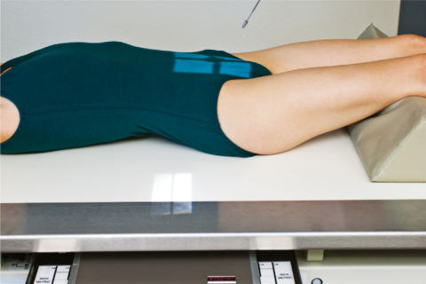
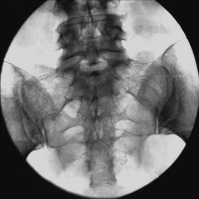

# Rx ARTICULAȚII SACROILIACE AP axială

  📷 Radiografie Convențională (Rx)
  <strong>Actualizat:</strong> 2026-09-15
  <strong>Autor:</strong> Departamentul de Radiologie / Referință Bontrager

---

-   __1. Rezumat Clinic & Indicații__

    ---

    === "Indicații Clinice"

        - patologia articulației SI, inclusiv suspiciunea de fractură și luxația/subluxația articulară

    === "Ghid Național IRIS"

        !!! info "Referință Primară: Ghidul Național IRIS (Ordinul MS 1342/2012)"
            - **Capitol Ghid IRIS:** *Aparat locomotor & Bazin*
            - **Grad de Recomandare:** **Grad A**
            - **Nivel de Iradiere Estimată:** `Clasa 2 (Foarte mică ~ 0.8 - 1.0 mSv)`

            [:octicons-search-16: Deschide Ghidul IRIS](../../iris.md){ .md-button .md-button--primary } [:material-open-in-new: Aplicația Oficială PWA](https://radiologie-pediatrica.ro/iris/){ .md-button target="_blank" rel="noopener" }

-   __2. Poziționare & Centrare Fascicul__

    ---

    - **Poziție Pacient:** Pacient: pacientul în decubit dorsal, cu brațele pe lângă corp, capul pe o pernă și membrele inferioare extinse, cu suport sub genunchi pentru confort.; Regiune anatomică: se aliniază planul mediosagital cu raza centrală și cu linia mediană a mesei și/sau a receptorului de imagine (Fig. 9.72). Se verifică absența rotației: claviculele sunt riguros echidistante față de linia proceselor spinoase. Bazinul (pelvisul) este prezent.
    - **Punct de Centrare Fascicul:** Raza centrală se înclină cu 30°–35° cranial (spre cap) (în general, bărbații necesită aproximativ 30°, iar femeile 35°, cu creșterea curburii lombosacrale). Raza centrală se orientează spre linia mediană, la aproximativ 2 țoli (5 cm) sub nivelul spinei iliace anterosuperioare (SIAS). Receptorul de imagine se centrează pe raza centrală.
    - **Distanță Focar-Film (DFF / SID):** 100 cm
    - **Comandă Respiratorie:** Apnee pe durata expunerii pentru prevenirea artefactelor de mișcare ale pacientului. Incidență PA axială alternativă Dacă pacientul nu poate adopta poziția de decubit dorsal, această imagine poate fi obținută ca incidență posteroanterioară (PA), cu pacientul în decubit ventral, folosind un unghi caudal de 30° la 35°. Raza centrală ar fi centrată la nivelul L4 sau ușor deasupra crestei iliace (corespunzător L4-L5). ARTICULAȚII SACROILIACE incidențe DE RUTINĂ AP axială posterioară oblică

-   __3. Parametri Tehnici Expunere__

    ---

    | Parametru Tehnic | Valoare Configurare Generator / Tub |
    |:-----------------|:-------------------------------------|
    | **Tensiune Tub (kV)** | 80-95 kV |
    | **Sarcină / Produs Curent-Timp (mAs)** | DE CONFIGURAT PE APARAT |
    | **Distanță Focar-Film (DFF / SID)** | 100 cm |
    | **Grilă Antidifuzoare (Bucky)** | Cu grilă antidifuzoare Bucky |
    | **Dimensiune Focar** | Focar Mare (1.0 - 1.2 mm) |
    | **Camere de Ionizare AEC** | Camerele laterale (sau camera centrală, în funcție de regiune) |
    | **Colimare Fascicul** | Dimensiunea câmpului Colimați pe cele patru laturi la regiunea anatomică de interes. |
    | **Filtrare Tub** | Totală ≥ 2.5 mm Al echivalent |

-   __4. Criterii de Calitate & Reușită Imagine__

    ---

    - Articulațiile sacroiliace și spațiile articulare intervertebrale L5–S1 (Figs. 9.73 și 9.74). Poziție
    - Absența rotației anatomice: claviculele sunt echidistante față de linia apofizelor spinoase, evidențiată prin procesul spinos al L5 în centrul corpului vertebral și prin aspectul simetric al aripilor sacrului bilateral (cu articulațiile SI la distanțe egale față de linia mediană a vertebrelor).
    - Colimarea câmpului la dimensiunea ariei de interes diagnostic. Expunere
    - expunerea optimă a receptorului de imagine și contrast. Evidențiere clară a marginilor osoase și a desenului trabecular al sacrului.
    - fără mișcare. 24 30 R Fig. 9.72 AP axială a articulațiilor SI — raza centrală 30° la 35° cranial. L Fig. 9.73 AP axială a articulațiilor SI. Articulația lombosacrală (L5-S1) Aripa sacrală (ala) L Ilium Sacru stâng Articulație sacroiliacă Apexul sacrului Procesul articular superior al sacrului Foramenele sacrale Corpul L5 Fig. 9.74 AP axială a articulațiilor SI.

-   __5. Protecție Radiologică (ALARA)__

    ---

    - Ecranare gonadică și a organelor radiosensibile conform procedurilor locale de radioprotecție ALARA.
    - Colimare strictă la aria de interes pentru limitarea radiației difuze.
    - Verificarea posibilității unei sarcini la pacientele de vârstă fertilă înainte de expunere.

### 🖼️ Imagini

<figure class="protocol-image-card" markdown>

<figcaption><strong>Fig. 9.72 AP axială a articulațiilor SI — raza centrală 30° la 35° cranial.</strong> — Poziționarea pacientului conform Ghidului Bontrager (Fig. 9.72 AP axială a articulațiilor SI — raza centrală 30° la 35° cranial.)</figcaption>

</figure>

<figure class="protocol-image-card" markdown>

<figcaption><strong>Fig. 9.73 AP axială a articulațiilor SI.</strong> — Aspect radiografic de referință conform Ghidului Bontrager (Fig. 9.73 AP axială a articulațiilor SI.)</figcaption>

</figure>

<figure class="protocol-image-card" markdown>

<figcaption><strong>Fig. 9.74 AP axială a articulațiilor SI.</strong> — Aspect radiografic de referință conform Ghidului Bontrager (Fig. 9.74 AP axială a articulațiilor SI.)</figcaption>

</figure>

=== "Ghid Rapid de Execuție"

    1. **Identificarea și verificarea pacientului:** verificare identitate, zonă de examinat, consimțământ conform procedurii și evaluarea posibilității unei sarcini, când este relevantă.
    2. **Pregătire:** îndepărtarea oricăror obiecte radiopace (bijuterii, agrafe, fermoare, proteze, pansamente dense).
    3. **Poziționare precisă:** alinierea receptorului de imagine și a tubului la distanța prescrisă (100 cm).
    4. **Colimare strictă:** adaptarea fasciculului strict la regiunea de diagnostic pentru scăderea iradierii și reducerea radiației difuze.
    5. **Radioprotecție:** verificarea [politicii RX](../radioprotectie.md), cu măsuri distincte pentru pacient, personal și însoțitor.

## Surse de documentare

- [Bontrager's Textbook of Radiographic Positioning (Ed. 9/10), Pagina 375](https://www.elsevier.com/books/textbook-of-radiographic-positioning-and-related-anatomy/lampignano/978-0-323-65367-1)
