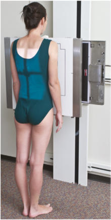
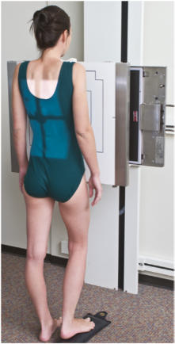
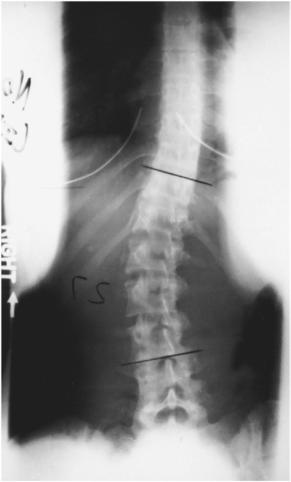
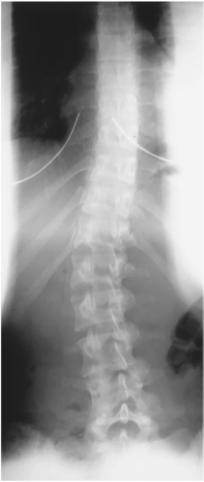

# Rx scolioză / vicii de postură ale coloanei SERIES PA (Postero-Anterior) (Incidență Scolioză / Joncțiune L5-S1 (Metoda Ferguson))

  📷 Radiografie Convențională (Rx)
  <strong>Actualizat:</strong> 2026-09-15
  <strong>Autor:</strong> Departamentul de Radiologie / Referință Bontrager

---

-   __1. Rezumat Clinic & Indicații__

    ---

    === "Indicații Clinice"

        - This method assists în differentiating deforming (primary) curve de la compensatory curve. Two imagini sunt obtained—one standard Ortostatism PA și one cu Picior sau Șold pe convex side de curve ridicat.

    === "Ghid Național IRIS"

        !!! info "Referință Primară: Ghidul Național IRIS (Ordinul MS 1342/2012)"
            - **Capitol Ghid IRIS:** *Ghidul Național IRIS*
            - **Grad de Recomandare:** **De verificat pe indicație; fără grad atribuit automat**
            - **Nivel de Iradiere Estimată:** `De verificat pentru examinarea și populația selectate`

            [:octicons-search-16: Deschide Ghidul IRIS](../../iris.md){ .md-button .md-button--primary } [:material-open-in-new: Aplicația Oficială PWA](https://radiologie-pediatrica.ro/iris/){ .md-button target="_blank" rel="noopener" }
-   __2. Poziționare & Centrare Fascicul__

    ---

    - **Poziție Pacient:** Pacient: Ortostatism Place pacient în Ortostatism (Poziție Șezândă sau în ortostatism) poziție facing masa de examinare, cu brațe la side (Fig. 9.52). pentru second imagine, place block under Picior (sau Șold if Poziție Șezândă) pe convex side de curve astfel încât pacient poate barely maintain poziție fără assistance. A 3 la 4inch (8 la 10cm) block de some type poate fie used under buttocks if așezat sau under Picior if în ortostatism (Fig. 9.53).; Regiune anatomică: Align plan mediosagital la raza centrală și linia mediană mesei și/sau receptorul de imagine. Se verifică absența rotației: claviculele sunt riguros echidistante față de linia proceselor spinoase thorax sau Bazin (bazin (pelvis)) exists, if possible. Place receptorul de imagine la include minimum 1 la 2 inches (2.5 la 5 cm) below creasta iliacă (corespunzător L4-L5).
    - **Punct de Centrare Fascicul:** Direct Raza centrală (RC) perpendiculară pe receptorul de imagine. Se centrează receptorul de imagine pe raza centrală.
    - **Distanță Focar-Film (DFF / SID):** 150 cm
    - **Comandă Respiratorie:** Apnee pe durata expunerii pe expiration.

-   __3. Parametri Tehnici Expunere__

    ---

    | Parametru Tehnic | Valoare Configurare Generator / Tub |
    |:-----------------|:-------------------------------------|
    | **Tensiune Tub (kV)** | DE CONFIGURAT PE APARAT |
    | **Sarcină / Produs Curent-Timp (mAs)** | DE CONFIGURAT PE APARAT |
    | **Distanță Focar-Film (DFF / SID)** | 150 cm |
    | **Grilă Antidifuzoare (Bucky)** | Conform grosimii anatomice (> 10 cm cu grilă) |
    | **Dimensiune Focar** | Focar Mare (1.0 - 1.2 mm) |
    | **Camere de Ionizare AEC** | DE CONFIGURAT PE APARAT |
    | **Colimare Fascicul** | Field Size Collimate pe two sides la anatomy de interest (four sides este possible). |
    | **Filtrare Tub** | Totală ≥ 2.5 mm Al echivalent |

-   __4. Criterii de Calitate & Reușită Imagine__

    ---

    - Thoracic și coloană lombară including 1 la 2 inches (2.5 la 5 cm) de creasta iliacă (corespunzător L4-L5)s (Figs. 9.54 și 9.55). poziție
    - fără pacient rotație indicated prin thoracic și coloană lombară cu procese spinoase aliniat cu vertebral midline și symmetry de iliac alae/wings și upper Sacru.
    - Collimation field size la aria de interes diagnostic. expunere
    - Clear demonstration de bony margins și trabecular markings de thoracic și coloană lombară.
    - fără mișcare. Fig. 9.52 PA Ortostatism. Fig. 9.53 PA cu block under Picior pe convex side de curve. Fig. 9.55 Ortostatism, cu lift pe drept.

-   __5. Protecție Radiologică (ALARA)__

    ---

    - Ecranare gonadică și a organelor radiosensibile conform procedurilor locale de radioprotecție ALARA.
    - Colimare strictă la aria de interes pentru limitarea radiației difuze.
    - Verificarea posibilității unei sarcini la pacientele de vârstă fertilă înainte de expunere.

!!! note "Observații Clinice & Tehnice"
    S: fără form de support (e.g., compression band) este la fie used în this examination. pentru second imagine, pacient trebuie să stand sau sit cu block under one side, unassisted. Perform PA incidențe la reduce dosage la radiationsensitive areas de thyroid și Mamografie (Sân). Fig. 9.54 Ortostatism, cu fără lift. scolioză / vicii de postură ale coloanei SERIES SPECIAL PA—Incidență Scolioză / Joncțiune L5-S1 (Metoda Ferguson) AP—R și L bending

### 🖼️ Imagini

<figure class="protocol-image-card" markdown>

<figcaption><strong>Fig. 9.54 Ortostatism, cu fără lift.</strong> — Poziționare pacient conform Ghidului Bontrager (Fig. 9.54 în ortostatism, cu fără lift.)</figcaption>

</figure>

<figure class="protocol-image-card" markdown>

<figcaption><strong>Fig. 9.52 PA Ortostatism.</strong> — Aspect radiografic de referință conform Ghidului Bontrager (Fig. 9.52 PA în ortostatism.)</figcaption>

</figure>

<figure class="protocol-image-card" markdown>

<figcaption><strong>Fig. 9.53 PA cu block under Picior pe convex side de curve.</strong> — Aspect radiografic de referință conform Ghidului Bontrager (Fig. 9.53 PA cu block under picior pe convex side de curve.)</figcaption>

</figure>

<figure class="protocol-image-card" markdown>

<figcaption><strong>Fig. 9.55 Ortostatism, cu lift</strong> — Aspect radiografic de referință conform Ghidului Bontrager (Fig. 9.55 în ortostatism, cu lift)</figcaption>

</figure>

=== "Ghid Rapid de Execuție"

    1. **Identificarea și verificarea pacientului:** verificare identitate, zonă de examinat, consimțământ conform procedurii și evaluarea posibilității unei sarcini, când este relevantă.
    2. **Pregătire:** îndepărtarea oricăror obiecte radiopace (bijuterii, agrafe, fermoare, proteze, pansamente dense).
    3. **Poziționare precisă:** alinierea receptorului de imagine și a tubului la distanța prescrisă (150 cm).
    4. **Colimare strictă:** adaptarea fasciculului strict la regiunea de diagnostic pentru scăderea iradierii și reducerea radiației difuze.
    5. **Radioprotecție:** verificarea [politicii RX](../radioprotectie.md), cu măsuri distincte pentru pacient, personal și însoțitor.

## Surse de documentare

- [Bontrager's Textbook of Radiographic Positioning (Ed. 9/10), Pagina 368](https://www.elsevier.com/books/textbook-of-radiographic-positioning-and-related-anatomy/lampignano/978-0-323-65367-1)
