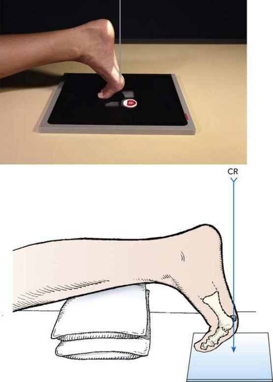
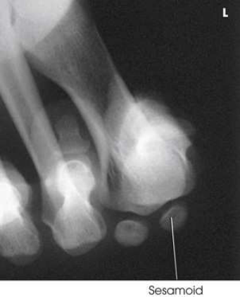
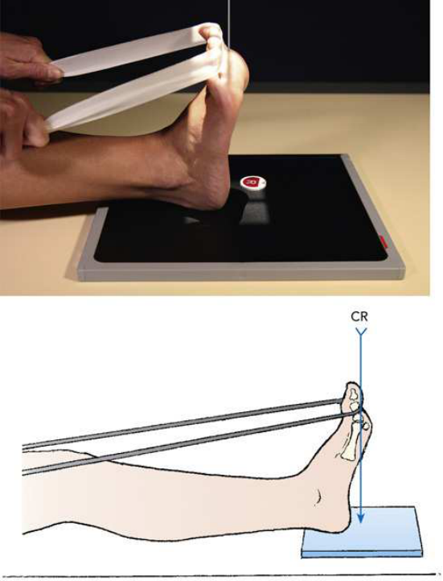

# Rx Sesamoids — Tangential Incidență — Lewis 1 and Holly 2 Methods (Merrill)

  📷 Radiografie Convențională (Rx)
  <strong>Actualizat:</strong> 2026-09-16
  <strong>Autor:</strong> Referință Merrill

---

-   __1. Rezumat Clinic & Indicații__

    ---

    === "Indicații Clinice"

        - Conform reperelor anatomice standard din tratat

    === "Ghid Național IRIS"

        !!! info "Referință Primară: Ghidul Național IRIS (Ordinul MS 1342/2012)"
            - **Capitol Ghid IRIS:** *Ghidul Național IRIS*
            - **Grad de Recomandare:** **De verificat pe indicație; fără grad atribuit automat**
            - **Nivel de Iradiere Estimată:** `De verificat pentru examinarea și populația selectate`

            [:octicons-search-16: Deschide Ghidul IRIS](../../iris.md){ .md-button .md-button--primary } [:material-open-in-new: Aplicația Oficială PWA](https://radiologie-pediatrica.ro/iris/){ .md-button target="_blank" rel="noopener" }
-   __2. Poziționare & Centrare Fascicul__

    ---

    - **Poziție Pacient:** se așază pacientul în Decubit ventral poziție pentru Lewis method și în așezat poziție pentru Holly method. Elevate Gleznă (Articulație Talocrurală) de afected side pe săculeți cu nisip pentru stability, if needed. folded towel poate fie plasat under Genunchi pentru comfort.; Rest great toe pe masa de examinare în poziție de dorsiflexion și adjust it la place ball de Picior perpendicular pe plan orizontal. se centrează receptorul de imagine la second metatarsal (Fig. 7.34). se efectuează ecranarea gonadelor cu șorț plumbat.
    - **Punct de Centrare Fascicul:** perpendicular și tangențial pe first articulații metatarsofalangiene (MTF).
    - **Distanță Focar-Film (DFF / SID):** Nespecificat în fragmentul extras; de verificat în sursă
    - **Comandă Respiratorie:** Conform reperelor anatomice standard din tratat

-   __3. Parametri Tehnici Expunere__

    ---

    | Parametru Tehnic | Valoare Configurare Generator / Tub |
    |:-----------------|:-------------------------------------|
    | **Tensiune Tub (kV)** | DE CONFIGURAT PE APARAT |
    | **Sarcină / Produs Curent-Timp (mAs)** | DE CONFIGURAT PE APARAT |
    | **Distanță Focar-Film (DFF / SID)** | Nespecificat în fragmentul extras; de verificat în sursă |
    | **Grilă Antidifuzoare (Bucky)** | DE CONFIGURAT PE APARAT |
    | **Dimensiune Focar** | DE CONFIGURAT PE APARAT |
    | **Camere de Ionizare AEC** | DE CONFIGURAT PE APARAT |
    | **Colimare Fascicul** | se ajustează câmp de iradiere la 3 × 3 inches (7.6 × 7.6 cm). Se plasează markerul de lateralitate în câmpul colimat. |
    | **Filtrare Tub** | DE CONFIGURAT PE APARAT |

-   __4. Criterii de Calitate & Reușită Imagine__

    ---

    - Criterii radiologice de calitate imaginii:
    - Evidence de corect collimation și presence de marker de lateralitate (D/S) plasat clear de anatomy de interest
    - Sesamoids liber de orice portion de first metatarsal
    - Metatarsal heads
    - Bony detalii trabeculare osoase și surrounding soft tissues

-   __5. Protecție Radiologică (ALARA)__

    ---

    - Nespecificat în fragmentul extras; de verificat în sursă

!!! note "Observații Clinice & Tehnice"
    Holly 2 described poziție that he believed was more comfortable pentru pacientul. cu pacientul Poziție Șezândă pe masa de examinare, Picior este ajustat astfel încât medial margine este vertical, și plantar surface este la un unghi de 75 grade cu plane de receptorul de imagine. pacientul holds Degete Picior în flectat poziție cu strip de gauze bandage. raza centrală este orientat perpendicular pe cap de first oase metatarsiene (Figs. 7.36 through 7.38).

### 🖼️ Imagini

<figure class="protocol-image-card" markdown>

<figcaption><strong>Merrill — pagina PDF 475, imaginea 1</strong> — Imagine din fragmentul sursă; asocierea necesită revizie.</figcaption>

</figure>

<figure class="protocol-image-card" markdown>

<figcaption><strong>Merrill — pagina PDF 476, imaginea 2</strong> — Imagine din fragmentul sursă; asocierea necesită revizie.</figcaption>

</figure>

<figure class="protocol-image-card" markdown>

<figcaption><strong>Merrill — pagina PDF 477, imaginea 3</strong> — Imagine din fragmentul sursă; asocierea necesită revizie.</figcaption>

</figure>

=== "Ghid Rapid de Execuție"

    1. **Identificarea și verificarea pacientului:** verificare identitate, zonă de examinat, consimțământ conform procedurii și evaluarea posibilității unei sarcini, când este relevantă.
    2. **Pregătire:** îndepărtarea oricăror obiecte radiopace (bijuterii, agrafe, fermoare, proteze, pansamente dense).
    3. **Poziționare precisă:** alinierea receptorului de imagine și a tubului la distanța prescrisă (Nespecificat în fragmentul extras; de verificat în sursă).
    4. **Colimare strictă:** adaptarea fasciculului strict la regiunea de diagnostic pentru scăderea iradierii și reducerea radiației difuze.
    5. **Radioprotecție:** verificarea [politicii RX](../radioprotectie.md), cu măsuri distincte pentru pacient, personal și însoțitor.

## Surse de documentare

- [Merrill’s Atlas, 7. Lower Extremity, pagini PDF 474–477](../../assets/protocols/sources/a56d45c16829_Merrills_Atlas_of_Radiographic_Positioning__Procedures_3Vol_Set.pdf#page=474)

## Fragmente sursă traduse (referință tehnică)

### anatomy

tangențial incidență de metatarsal cap în profile și sesamoids (Fig. 7.35).

### collimation

• se ajustează câmp de iradiere la 3 × 3 inches (7.6 × 7.6 cm). Se plasează markerul de lateralitate în câmpul colimat.

### cr

• perpendicular și tangențial pe first articulații metatarsofalangiene (MTF).

### criteria

Criterii radiologice de calitate imaginii:
• Evidence de corect collimation și presence de marker de lateralitate (D/S) plasat clear de anatomy de interest
• Sesamoids liber de orice portion de first metatarsal
• Metatarsal heads
• Bony detalii trabeculare osoase și surrounding soft tissues

### notes

Holly 2 described poziție that he believed was more comfortable pentru pacientul. cu pacientul așezat pe scaun pe masa de examinare, picior este
ajustat astfel încât medial margine este vertical, și plantar surface este la un unghi de 75 grade cu plane de receptorul de imagine. pacientul holds
toes în flectat poziție cu strip de gauze bandage. raza centrală este orientat perpendicular pe cap de first oase metatarsiene
(Figs. 7.36 through 7.38).

### part_pos

• Rest great toe pe masa de examinare în poziție de dorsiflexion și adjust it la place ball de picior perpendicular pe orizontal
plane.
• se centrează receptorul de imagine la second metatarsal (Fig. 7.34).
• se efectuează ecranarea gonadelor cu șorț plumbat.

### patient_pos

• se așază pacientul în decubit ventral pentru Lewis method și în așezat poziție pentru Holly method.
• Elevate ankle de afected side pe săculeți cu nisip pentru stability, if needed. folded towel poate fie plasat under genunchi pentru comfort.

### tech

poziționat prin manufacturer sau department protocol pentru corect anatomy display orientation; raza centrală plate: 10 × 12 inches (24 × 30 cm) longitudinal.

