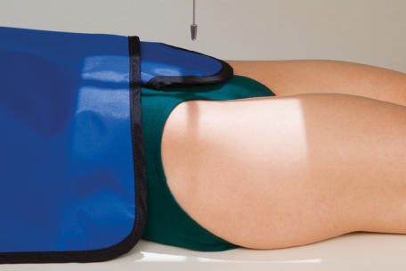
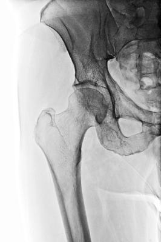
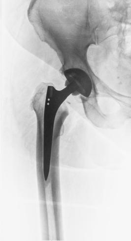

# Rx Șold AND PROXIMAL Femur AP UNILATERAL PROJECTION (Șold)

  📷 Radiografie Convențională (Rx)
  <strong>Actualizat:</strong> 2026-09-15
  <strong>Autor:</strong> Departamentul de Radiologie / Referință Bontrager

---

-   __1. Rezumat Clinic & Indicații__

    ---

    === "Indicații Clinice"

        - Postoperative or followup examination to demonstrate the acetabulum, femoral head, neck, and marele trohanter
        - Evaluation of condition and placement of any existing orthopedic appliance

    === "Ghid Național IRIS"

        !!! info "Referință Primară: Ghidul Național IRIS (Ordinul MS 1342/2012)"
            - **Capitol Ghid IRIS:** *Ghidul Național IRIS*
            - **Grad de Recomandare:** **De verificat pe indicație; fără grad atribuit automat**
            - **Nivel de Iradiere Estimată:** `De verificat pentru examinarea și populația selectate`

            [:octicons-search-16: Deschide Ghidul IRIS](../../iris.md){ .md-button .md-button--primary } [:material-open-in-new: Aplicația Oficială PWA](https://radiologie-pediatrica.ro/iris/){ .md-button target="_blank" rel="noopener" }
-   __2. Poziționare & Centrare Fascicul__

    ---

    - **Poziție Pacient:** Pacient: With patient Decubit Dorsal, place arms at sides or across superior Torace.; Regiune anatomică: Locate femoral neck and align to CR and to midline of table and/or IR. Ensure Absența rotației anatomice: clavicule echidistante față de linia apofizelor spinoase of Bazin (Pelvis) (equal distance from ASIS to table). Rotate affected leg internally 15 to 20 degrees (see WARNING).
    - **Punct de Centrare Fascicul:** is perpendicular to the femoral neck (see p. 275 for femoral head and neck localization methods). Femoral neck can also be located about 1 to 2 inches (2.5 to 5 cm) medial and 3 to 4 inches (8 to 10 cm) distal to ASIS (Fig. 7.68).
    - **Distanță Focar-Film (DFF / SID):** 100 cm
    - **Comandă Respiratorie:** Suspend respiration during exposure.

-   __3. Parametri Tehnici Expunere__

    ---

    | Parametru Tehnic | Valoare Configurare Generator / Tub |
    |:-----------------|:-------------------------------------|
    | **Tensiune Tub (kV)** | 80-85 kV |
    | **Sarcină / Produs Curent-Timp (mAs)** | DE CONFIGURAT PE APARAT |
    | **Distanță Focar-Film (DFF / SID)** | 100 cm |
    | **Grilă Antidifuzoare (Bucky)** | Cu grilă antidifuzoare Bucky |
    | **Dimensiune Focar** | Focar Mic (0.6 mm) |
    | **Camere de Ionizare AEC** | Camerele laterale (sau camera centrală funcție de regiune) |
    | **Colimare Fascicul** | Collimate on four sides to anatomy of interest. |
    | **Filtrare Tub** | Totală ≥ 2.5 mm Al echivalent |

-   __4. Criterii de Calitate & Reușită Imagine__

    ---

    - The proximal onethird of the Femur should be visualized, along with the acetabulum and adjacent parts of the pubis, ischium, and ilium (Fig. 7.69).
    - Any existing orthopedic appliance should be visible in its entirety (Fig. 7.70). Position:
    - The marele trohanter and femoral head and neck should be in full profile without foreshortening.
    - The lesser trochanter should not project beyond the medial border of the Femur; with some patients, only the medial edge of it is seen with sufficient internal rotation of leg. Collimated field should demonstrate the entire Șold joint and any orthopedic appliance in its entirety.
    - Collimation field size to area of interest. Exposure:
    - Optimal image receptor exposure and contrast of the margins of the femoral head and the acetabulum through overlying pelvic structures without overexposing other parts of the proximal Femur or pelvic structures.
    - Trabecular markings of the marele trohanter and neck area appear sharp, indicating no motion. R Fig. 7.69 AP Șold. R Fig. 7.70 AP Șold. (Copyright Getty Images/DieterMeyrl.) WARninG: Do not attempt to rotate legs if suspiciune de fractură is suspected. An AP Bazin (Pelvis) projection to include both hips for comparison should be completed before an AP unilateral Șold is performed for possible Șold or Bazin (Pelvis) traumatism acuttism / Regim Urgență.

-   __5. Protecție Radiologică (ALARA)__

    ---

    - Ecranare gonadică și a organelor radiosensibile conform procedurilor locale de radioprotecție ALARA.
    - Colimare strictă la aria de interes pentru limitarea radiației difuze.
    - Verificarea posibilității unei sarcini la pacientele de vârstă fertilă înainte de expunere.

### 🖼️ Imagini

<figure class="protocol-image-card" markdown>

<figcaption><strong>Fig. 7.68 AP right Șold.</strong> — Poziționare pacient conform Ghidului Bontrager (Fig. 7.68 AP right hip.)</figcaption>

</figure>

<figure class="protocol-image-card" markdown>

<figcaption><strong>Fig. 7.69 AP Șold.</strong> — Aspect radiografic de referință conform Ghidului Bontrager (Fig. 7.69 AP hip.)</figcaption>

</figure>

<figure class="protocol-image-card" markdown>

<figcaption><strong>Fig. 7.70 AP Șold. (Copyright Getty Images/DieterMeyrl.)</strong> — Aspect radiografic de referință conform Ghidului Bontrager (Fig. 7.70 AP hip. (Copyright Getty Images/DieterMeyrl.))</figcaption>

</figure>

=== "Ghid Rapid de Execuție"

    1. **Identificarea și verificarea pacientului:** verificare identitate, zonă de examinat, consimțământ conform procedurii și evaluarea posibilității unei sarcini, când este relevantă.
    2. **Pregătire:** îndepărtarea oricăror obiecte radiopace (bijuterii, agrafe, fermoare, proteze, pansamente dense).
    3. **Poziționare precisă:** alinierea receptorului de imagine și a tubului la distanța prescrisă (100 cm).
    4. **Colimare strictă:** adaptarea fasciculului strict la regiunea de diagnostic pentru scăderea iradierii și reducerea radiației difuze.
    5. **Radioprotecție:** verificarea [politicii RX](../radioprotectie.md), cu măsuri distincte pentru pacient, personal și însoțitor.

## Surse de documentare

- [Bontrager's Textbook of Radiographic Positioning (Ed. 9/10), Pagina 305](https://www.elsevier.com/books/textbook-of-radiographic-positioning-and-related-anatomy/lampignano/978-0-323-65367-1)
