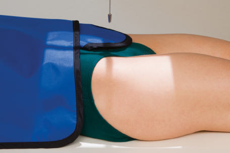
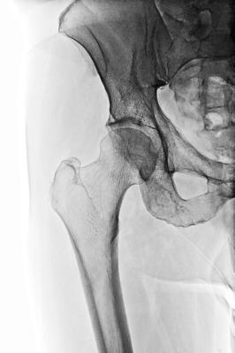
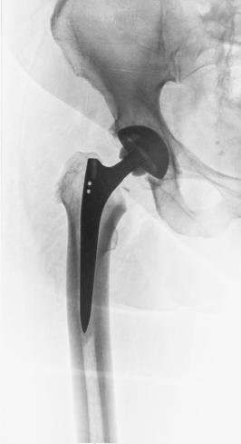

# Rx Șold și femur proximal — incidență AP unilaterală (șold)

  📷 Radiografie Convențională (Rx)
  <strong>Actualizat:</strong> 2026-09-15
  <strong>Autor:</strong> Departamentul de Radiologie / Referință Bontrager

---

-   __1. Rezumat Clinic & Indicații__

    ---

    === "Indicații Clinice"

        - Examinare postoperatorie sau de urmărire pentru evidențierea cotilului (acetabulului), capului femural, colului și trohanterului mare
        - Evaluarea stării și poziționării oricărui dispozitiv ortopedic existent

    === "Ghid Național IRIS"

        !!! info "Referință Primară: Ghidul Național IRIS (Ordinul MS 1342/2012)"
            - **Capitol Ghid IRIS:** *Aparat locomotor & Bazin*
            - **Grad de Recomandare:** **Grad A**
            - **Nivel de Iradiere Estimată:** `Clasa 2 (Foarte mică ~ 0.8 - 1.0 mSv)`

            [:octicons-search-16: Deschide Ghidul IRIS](../../iris.md){ .md-button .md-button--primary } [:material-open-in-new: Aplicația Oficială PWA](https://radiologie-pediatrica.ro/iris/){ .md-button target="_blank" rel="noopener" }

-   __2. Poziționare & Centrare Fascicul__

    ---

    - **Poziție Pacient:** Pacient: pacientul în decubit dorsal, cu brațele pe lângă corp sau peste partea superioară a toracelui.; Regiune anatomică: se localizează colul femural și se aliniază cu raza centrală și cu linia mediană a mesei și/sau a receptorului de imagine. Se asigură absența rotației anatomice: claviculele sunt echidistante față de linia apofizelor spinoase ale bazinului (pelvisului) (distanță egală de la spina iliacă anterosuperioară (SIAS) la masă). Se rotește intern membrul inferior afectat cu 15 la 20 grade (vezi AVERTISMENT).
    - **Punct de Centrare Fascicul:** este perpendicular pe colul femural (vezi p. 275 pentru metodele de localizare a capului și colului femural). Colul femural poate fi localizat și la aproximativ 1 la 2 țoli (2.5 la 5 cm) medial și 3 la 4 țoli (8 la 10 cm) distal față de spina iliacă anterosuperioară (SIAS) (Fig. 7.68).
    - **Distanță Focar-Film (DFF / SID):** 100 cm
    - **Comandă Respiratorie:** Apnee pe durata expunerii.

-   __3. Parametri Tehnici Expunere__

    ---

    | Parametru Tehnic | Valoare Configurare Generator / Tub |
    |:-----------------|:-------------------------------------|
    | **Tensiune Tub (kV)** | 80-85 kV |
    | **Sarcină / Produs Curent-Timp (mAs)** | DE CONFIGURAT PE APARAT |
    | **Distanță Focar-Film (DFF / SID)** | 100 cm |
    | **Grilă Antidifuzoare (Bucky)** | Cu grilă antidifuzoare Bucky |
    | **Dimensiune Focar** | Focar Mic (0.6 mm) |
    | **Camere de Ionizare AEC** | Camerele laterale (sau camera centrală, în funcție de regiune) |
    | **Colimare Fascicul** | Colimați pe cele patru laturi la anatomia de interes. |
    | **Filtrare Tub** | Totală ≥ 2.5 mm Al echivalent |

-   __4. Criterii de Calitate & Reușită Imagine__

    ---

    - treimea proximală a femurului trebuie să fie vizualizată, împreună cu cotilul (acetabulul) și porțiunile adiacente ale pubisului, ischionului și iliumului (Fig. 7.69).
    - orice dispozitiv ortopedic existent trebuie să fie vizibil în întregime (Fig. 7.70). Poziție:
    - trohanterul mare, capul femural și colul femural trebuie să fie în profil complet, fără scurtare proiectivă.
    - trohanterul mic nu trebuie să se proiecteze dincolo de marginea medială a femurului; la unii pacienți, numai marginea medială a acestuia este vizibilă cu o rotație internă suficientă a membrului inferior. Câmpul colimat trebuie să evidențieze întreaga articulație a șoldului și orice dispozitiv ortopedic în întregime.
    - Dimensiunea câmpului de colimare până la aria de interes diagnostic. Expunere:
    - expunerea și contrastul optime ale receptorului de imagine pentru marginile capului femural și cotilului (acetabulului), prin structurile pelvine suprapuse, fără supraexpunerea altor porțiuni ale femurului proximal sau ale structurilor pelvine.
    - Marcajele trabeculare ale trohanterului mare și ale regiunii colului apar clare, indicând absența mișcării. R Fig. 7.69 AP șold. R Fig. 7.70 AP șold. (Copyright Getty Images/DieterMeyrl.) AVERTISMENT: Nu încercați să rotiți membrele inferioare dacă există suspiciune de fractură. Incidența AP a bazinului (pelvisului), incluzând ambele șolduri pentru comparație, trebuie efectuată înainte de efectuarea incidenței AP unilaterale a șoldului pentru un posibil traumatism acut al șoldului sau bazinului (pelvisului) / regim de urgență.

-   __5. Protecție Radiologică (ALARA)__

    ---

    - Ecranare gonadică și a organelor radiosensibile conform procedurilor locale de radioprotecție ALARA.
    - Colimare strictă la aria de interes pentru limitarea radiației difuze.
    - Verificarea posibilității unei sarcini la pacientele de vârstă fertilă înainte de expunere.

### 🖼️ Imagini

<figure class="protocol-image-card" markdown>

<figcaption><strong>Fig. 7.68 AP șold drept.</strong> — Poziționarea pacientului conform Ghidului Bontrager (Fig. 7.68 AP șold drept.)</figcaption>

</figure>

<figure class="protocol-image-card" markdown>

<figcaption><strong>Fig. 7.69 AP șold.</strong> — Aspect radiografic de referință conform Ghidului Bontrager (Fig. 7.69 AP șold.)</figcaption>

</figure>

<figure class="protocol-image-card" markdown>

<figcaption><strong>Fig. 7.70 AP șold. (Copyright Getty Images/DieterMeyrl.)</strong> — Aspect radiografic de referință conform Ghidului Bontrager (Fig. 7.70 AP șold. (Copyright Getty Images/DieterMeyrl.))</figcaption>

</figure>

=== "Ghid Rapid de Execuție"

    1. **Identificarea și verificarea pacientului:** verificare identitate, zonă de examinat, consimțământ conform procedurii și evaluarea posibilității unei sarcini, când este relevantă.
    2. **Pregătire:** îndepărtarea oricăror obiecte radiopace (bijuterii, agrafe, fermoare, proteze, pansamente dense).
    3. **Poziționare precisă:** alinierea receptorului de imagine și a tubului la distanța prescrisă (100 cm).
    4. **Colimare strictă:** adaptarea fasciculului strict la regiunea de diagnostic pentru scăderea iradierii și reducerea radiației difuze.
    5. **Radioprotecție:** verificarea [politicii RX](../radioprotectie.md), cu măsuri distincte pentru pacient, personal și însoțitor.

## Surse de documentare

- [Bontrager's Textbook of Radiographic Positioning (Ed. 9/10), Pagina 305](https://www.elsevier.com/books/textbook-of-radiographic-positioning-and-related-anatomy/lampignano/978-0-323-65367-1)
